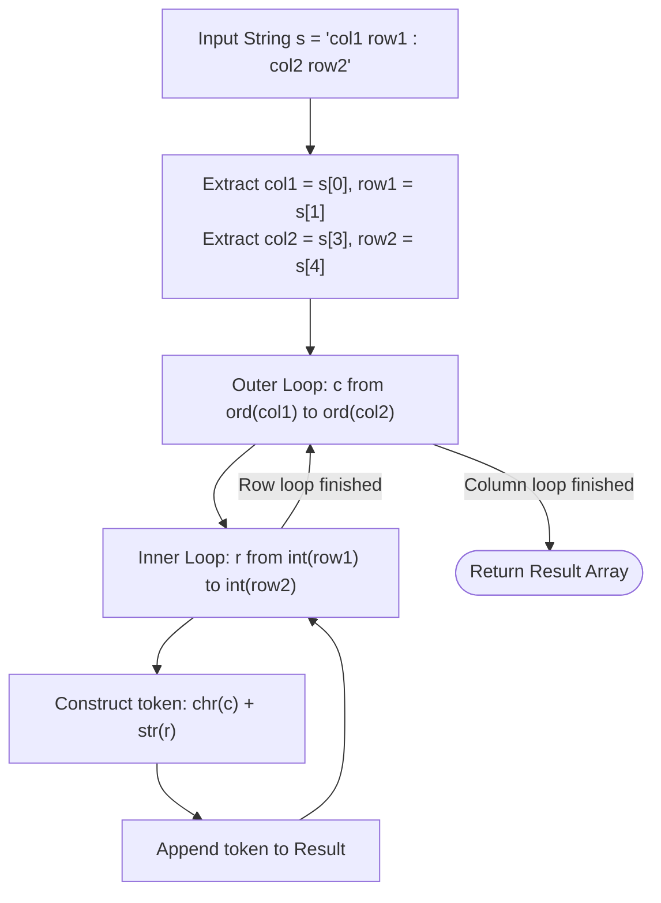

# Guided Example: Cells in a Range on an Excel Sheet

We analyze and trace the Cartesian product column-major coordinate enumeration algorithm for generating spreadsheet cell references over a rectangular bounding box, establishing $O((C_2 - C_1 + 1) \cdot (R_2 - R_1 + 1))$ time complexity and $O(1)$ auxiliary working space.

- **Input:** `s = "B2:D4"`
- **Output:** `["B2", "B3", "B4", "C2", "C3", "C4", "D2", "D3", "D4"]`

This representative instance highlights string slicing for cell boundary extraction, ASCII character code range iteration, decimal digit interval stepping, and column-major ordering invariants.

---

## 1. Problem Overview & Representative Instance

In a spreadsheet, cell coordinates are designated in alphanumeric format `<col><row>`, where:
- `<col>` is an uppercase English letter representing the column index ($'A'$ through $'Z'$).
- `<row>` is a decimal digit representing the row index ($'1'$ through $'9'$).

We are given a 5-character string $s$ formatted as `"<col1><row1>:<col2><row2>"`, where:
- $\text{col1} \le \text{col2}$ lexicographically.
- $\text{row1} \le \text{row2}$ numerically.

Our task is to enumerate all valid cell coordinates enclosed within the rectangular boundary $[\text{col1}, \text{col2}] \times [\text{row1}, \text{row2}]$.
The result must be ordered in **column-major** sequence:
1. Columns are traversed from left to right in alphabetical order ($\text{col1} \to \text{col2}$).
2. For each column, rows are traversed from top to bottom in numerical order ($\text{row1} \to \text{row2}$).

### Representative Instance Breakdown

Given:
$$s = \text{"B2:D4"}$$

Boundary parsing:
- Top-left anchor: $\text{col1} = 'B', \text{row1} = 2$.
- Bottom-right anchor: $\text{col2} = 'D', \text{row2} = 4$.

Coordinate ranges:
- Column range: $'B' \to 'D'$, which corresponds to ASCII values $66 \to 68$, encompassing columns $'B', 'C', 'D'$ (width $= 3$).
- Row range: $2 \to 4$, encompassing rows $2, 3, 4$ (height $= 3$).

Total expected cells: $3 \times 3 = 9$.

Traversing column-by-column:
- Column $'B'$: `"B2"`, `"B3"`, `"B4"`
- Column $'C'$: `"C2"`, `"C3"`, `"C4"`
- Column $'D'$: `"D2"`, `"D3"`, `"D4"`

Final concatenated list: `["B2", "B3", "B4", "C2", "C3", "C4", "D2", "D3", "D4"]`.

---

## 2. Mathematical & Algorithmic Principles

### Cartesian Product of Discrete Intervals

Let the column interval be the set of uppercase characters:
$$\mathcal{C} = \{c \in \Sigma_{\text{upper}} \mid \text{ord}(\text{col1}) \le \text{ord}(c) \le \text{ord}(\text{col2})\}$$
and the row interval be the set of integer digits:
$$\mathcal{R} = \{r \in \mathbb{N} \mid \text{row1} \le r \le \text{row2}\}$$

The set of all cells in the rectangular region is the Cartesian product:
$$\Omega = \mathcal{C} \times \mathcal{R}$$

### Column-Major Lexicographical Total Order

The required ordering $\prec$ on cell coordinates $(c_1, r_1)$ and $(c_2, r_2)$ is defined by lexicographical priority on the column first, then the row:
$$(c_1, r_1) \prec (c_2, r_2) \iff (\text{ord}(c_1) < \text{ord}(c_2)) \lor (\text{ord}(c_1) = \text{ord}(c_2) \land r_1 < r_2)$$

This corresponds directly to nested iteration where the column loop forms the outer loop and the row loop forms the inner loop:
$$\text{For } c \in [\text{col1}, \text{col2}] \text{ (outer loop)}$$
$$\quad \text{For } r \in [\text{row1}, \text{row2}] \text{ (inner loop)}$$
$$\quad \quad \text{Emit } \text{string}(c) + \text{string}(r)$$

---

## 3. Step-by-Step Walkthrough with Intermediate State

We trace the representative instance $s = \text{"B2:D4"}$.

### Step 1: Boundary Extraction
- Input string length is 5: `s[0] = 'B'`, `s[1] = '2'`, `s[2] = ':'`, `s[3] = 'D'`, `s[4] = '4'`.
- Outer loop boundaries: $\text{ord}('B') = 66$, $\text{ord}('D') = 68$.
- Inner loop boundaries: $2$ through $4$.
- Initial result list: `[]`.

---

### Step 2: Outer Iteration $c = 66$ (Column $'B'$)
- Set character $c = \text{chr}(66) = 'B'$.
- Inner row loop $r \in [2, 3, 4]$:
  - $r = 2$: generate `"B2"`, append to result. Result: `["B2"]`.
  - $r = 3$: generate `"B3"`, append to result. Result: `["B2", "B3"]`.
  - $r = 4$: generate `"B4"`, append to result. Result: `["B2", "B3", "B4"]`.

---

### Step 3: Outer Iteration $c = 67$ (Column $'C'$)
- Set character $c = \text{chr}(67) = 'C'$.
- Inner row loop $r \in [2, 3, 4]$:
  - $r = 2$: generate `"C2"`, append to result. Result: `[..., "C2"]`.
  - $r = 3$: generate `"C3"`, append to result. Result: `[..., "C3"]`.
  - $r = 4$: generate `"C4"`, append to result. Result: `[..., "C4"]`.

---

### Step 4: Outer Iteration $c = 68$ (Column $'D'$)
- Set character $c = \text{chr}(68) = 'D'$.
- Inner row loop $r \in [2, 3, 4]$:
  - $r = 2$: generate `"D2"`, append to result. Result: `[..., "D2"]`.
  - $r = 3$: generate `"D3"`, append to result. Result: `[..., "D3"]`.
  - $r = 4$: generate `"D4"`, append to result. Result: `[..., "D4"]`.

---

## 4. Comprehensive State Trace

The table below traces the chronological state of the generator across all 9 coordinate iterations.

| Sequence Index | Outer Column $c$ | Inner Row $r$ | Constructed Token | Result List Size | Current Tail Element |
|---|---|---|---|---|---|
| $1$ | $'B'$ ($66$) | $2$ | `"B2"` | $1$ | `"B2"` |
| $2$ | $'B'$ ($66$) | $3$ | `"B3"` | $2$ | `"B3"` |
| $3$ | $'B'$ ($66$) | $4$ | `"B4"` | $3$ | `"B4"` |
| $4$ | $'C'$ ($67$) | $2$ | `"C2"` | $4$ | `"C2"` |
| $5$ | $'C'$ ($67$) | $3$ | `"C3"` | $5$ | `"C3"` |
| $6$ | $'C'$ ($67$) | $4$ | `"C4"` | $6$ | `"C4"` |
| $7$ | $'D'$ ($68$) | $2$ | `"D2"` | $7$ | `"D2"` |
| $8$ | $'D'$ ($68$) | $3$ | `"D3"` | $8$ | `"D3"` |
| $9$ | $'D'$ ($68$) | $4$ | `"D4"` | $9$ | `"D4"` |

### 2D Matrix Spatial Projection

| Column Label | Row 2 | Row 3 | Row 4 | Column Output Sequence |
|---|---|---|---|---|
| Col $'B'$ | `B2` (Rank 1) | `B3` (Rank 2) | `B4` (Rank 3) | `["B2", "B3", "B4"]` |
| Col $'C'$ | `C2` (Rank 4) | `C3` (Rank 5) | `C4` (Rank 6) | `["C2", "C3", "C4"]` |
| Col $'D'$ | `D2` (Rank 7) | `D3` (Rank 8) | `D4` (Rank 9) | `["D2", "D3", "D4"]` |

---

## 5. Algorithmic Correctness & Soundness

### Completeness
Every cell coordinate in the rectangular bounding box is defined by a pair $(c, r)$ where $\text{ord}(\text{col1}) \le \text{ord}(c) \le \text{ord}(\text{col2})$ and $\text{row1} \le r \le \text{row2}$.
The outer loop visits every integer in $[\text{ord}(\text{col1}), \text{ord}(\text{col2})]$ exactly once, and for each such value, the inner loop visits every integer in $[\text{row1}, \text{row2}]$ exactly once.
By the properties of Cartesian products, every coordinate pair in the region is generated exactly once without omission or duplication.

### Order Invariant
Because the outer loop increments $c$ monotonically and the inner loop increments $r$ monotonically, any two produced tokens $(c_a, r_a)$ and $(c_b, r_b)$ with emission times $t_a < t_b$ satisfy:
- Either $c_a < c_b$ (emitted during an earlier outer loop iteration), or
- $c_a = c_b$ and $r_a < r_b$ (emitted during earlier inner loop iteration of the same column).
Thus, the emitted sequence strictly adheres to column-major order.

---

## 6. Edge Cases & Anti-Patterns

### Edge Cases
- **Single Cell Range (`s = "A1:A1"`):** Width is $1$, height is $1$. The loops execute once, producing `["A1"]`.
- **Single Row Range (`s = "A1:F1"`):** Rows are constant ($1$), columns vary from $'A'$ to $'F'$. Output is `["A1", "B1", "C1", "D1", "E1", "F1"]`.
- **Single Column Range (`s = "Z1:Z9"`):** Columns are constant ($'Z'$), rows vary from $1$ to $9$. Output is `["Z1", "Z2", ..., "Z9"]`.
- **Full Maximal Grid (`s = "A1:Z9"`):** Dimensions $26 \times 9 = 234$ cells, well within buffer constraints.

### Anti-Patterns to Avoid
- **Row-Major Inversion:** Nesting the row loop on the outside and column on the inside produces row-major order (`["B2", "C2", "D2", "B3", ...]`), which violates the problem specification.
- **Off-By-One Upper Bound Omission:** Python's standard `range(start, stop)` is exclusive of `stop`. Failing to write `stop + 1` omits the rightmost column $\text{col2}$ or bottom row $\text{row2}$.
- **String Parsing Regex Overhead:** Using heavy regular expressions to parse a fixed-width 5-character string `s[0], s[1], s[3], s[4]` adds unnecessary runtime overhead.

---

## 7. Complexity Analysis

### Time Complexity
- Parsing the string coordinates requires $O(1)$ operations (indexing at positions $0, 1, 3, 4$).
- Let $W = \text{ord}(\text{col2}) - \text{ord}(\text{col1}) + 1$ be the width ($1 \le W \le 26$).
- Let $H = \text{row2} - \text{row1} + 1$ be the height ($1 \le H \le 9$).
- The nested loops execute exactly $W \cdot H$ times.
- Each iteration performs $O(1)$ string concatenation and list appending.
- Since $W \le 26$ and $H \le 9$, the maximum total cell count is $26 \times 9 = 234$.
- **Total Time Complexity:** $\mathcal{O}(W \cdot H) \le \mathcal{O}(1)$.

### Space Complexity
- The output array stores $W \cdot H$ two-character strings.
- Only a constant number of loop index and ASCII variables are held in memory.
- **Auxiliary Space Complexity:** $\mathcal{O}(1)$ (excluding output storage).
