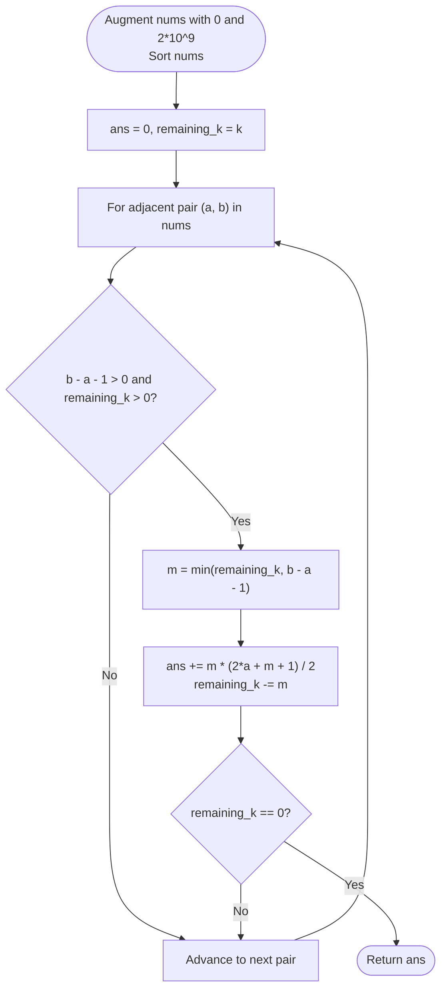

# Guided Example: Append K Integers With Minimal Sum

We analyze and trace the sorted interval-gap arithmetic progression algorithm for selecting $k$ smallest missing positive integers, establishing $O(n \log n)$ time complexity and $O(1)$ auxiliary memory.

- **Input:** `nums = [5, 6]`, `k = 6`
- **Output:** `25`

This representative instance demonstrates greedy minimal integer selection, continuous gap decomposition between sorted boundary points, closed-form summation of arithmetic progressions, and termination upon budget exhaustion.

---

## 1. Problem Overview & Representative Instance

We are given an integer array `nums` and an integer $k$.
We must append $k$ unique positive integers to `nums` such that:
1. None of the appended integers already exist in `nums`.
2. All appended integers are strictly positive ($\ge 1$).
3. All $k$ appended integers are mutually distinct.
4. The sum of the $k$ appended integers is minimized.

Our goal is to compute this minimal possible sum.

### Representative Instance Breakdown

Consider the instance:
$$\text{nums} = [5, 6], \quad k = 6$$

The positive integers $\mathbb{Z}^+ = \{1, 2, 3, \dots\}$ are examined:
- The integers $5$ and $6$ are forbidden because they are already present in `nums`.
- The candidate pool of allowed positive integers in increasing order is:
  $$\mathcal{P} = \{1, 2, 3, 4, 7, 8, 9, 10, 11, \dots\}$$
- To minimize the sum, we must greedily select the $k = 6$ smallest elements from $\mathcal{P}$:
  $$\mathcal{S} = \{1, 2, 3, 4, 7, 8\}$$

Calculating the sum:
$$\sum_{x \in \mathcal{S}} x = 1 + 2 + 3 + 4 + 7 + 8 = 25$$

The output is $25$.

---

## 2. Mathematical & Algorithmic Principles

### Greedy Minimization Principle

Let $S \subset \mathbb{Z}^+ \setminus \text{set}(\text{nums})$ with $|S| = k$.
Because every element in $\mathbb{Z}^+$ is positive, the objective $\sum_{x \in S} x$ is minimized if and only if $S$ consists of the first $k$ order statistics of the complement set $\mathbb{Z}^+ \setminus \text{set}(\text{nums})$.

### Interval Gap Decomposition

Iterating integer by integer via simulation takes $O(k)$ time, which is completely infeasible when $k \le 10^8$. Instead, we sort `nums` and analyze contiguous intervals:
- Augment `nums` with boundary anchors $0$ at the lower end and a sufficiently large sentinel $\infty$ ($2 \times 10^9$) at the upper end:
  $$\text{nums}_{\text{augmented}} = [0, x_1, x_2, \dots, x_n, 2 \times 10^9]$$
- Sort the augmented array in non-decreasing order.
- For each adjacent pair $(a, b)$, the open interval $(a, b)$ contains candidate integers $\{a + 1, a + 2, \dots, b - 1\}$.
- The count of available integers in this gap is:
  $$\text{capacity} = \max(0, b - a - 1)$$
- If $\text{capacity} > 0$, we take $m = \min(k, \text{capacity})$ integers from this gap.
- The taken integers form an arithmetic progression with first term $a + 1$ and last term $a + m$.
- By Gauss's arithmetic series formula:
  $$\text{sum}(a, m) = \frac{m \cdot ((a + 1) + (a + m))}{2} = \frac{m \cdot (2a + m + 1)}{2}$$
- We increment the total sum by $\text{sum}(a, m)$ and decrement $k \leftarrow k - m$.
- If $k = 0$, all required integers have been selected, and the search terminates.

---

## 3. Step-by-Step Walkthrough with Intermediate State

We trace `nums = [5, 6]` with $k = 6$.

### Step 1: Augmentation and Sorting
- Original array: $[5, 6]$.
- Add anchors: $[0, 5, 6, 2 \times 10^9]$.
- Sorted array: $[a_0=0, a_1=5, a_2=6, a_3=2 \times 10^9]$.
- Initialize accumulator: $\text{ans} = 0$, remaining budget: $k = 6$.

---

### Step 2: Gap 1 between $a_0 = 0$ and $a_1 = 5$
- Available interval: integers from $0 + 1 = 1$ up to $5 - 1 = 4$.
- Gap capacity: $b - a - 1 = 5 - 0 - 1 = 4$.
- Quota to take: $m = \min(k, 4) = \min(6, 4) = 4$.
- Selected integers: $\{1, 2, 3, 4\}$.
- Sum computation:
  $$\text{partial\_sum} = \frac{4 \cdot (2(0) + 4 + 1)}{2} = \frac{4 \cdot 5}{2} = 10$$
- State update:
  $$\text{ans} \leftarrow 0 + 10 = 10$$
  $$k \leftarrow 6 - 4 = 2$$

---

### Step 3: Gap 2 between $a_1 = 5$ and $a_2 = 6$
- Available interval: integers strictly between $5$ and $6$.
- Gap capacity: $b - a - 1 = 6 - 5 - 1 = 0$.
- No integers can be drawn from this interval ($m = 0$).
- State update: $\text{ans} = 10, k = 2$ unchanged.

---

### Step 4: Gap 3 between $a_2 = 6$ and $a_3 = 2 \times 10^9$
- Available interval: integers starting from $6 + 1 = 7$.
- Gap capacity: $2 \times 10^9 - 6 - 1 \gg 2$.
- Quota to take: $m = \min(k, \text{capacity}) = \min(2, \text{capacity}) = 2$.
- Selected integers: $\{7, 8\}$.
- Sum computation:
  $$\text{partial\_sum} = \frac{2 \cdot (2(6) + 2 + 1)}{2} = \frac{2 \cdot (12 + 3)}{2} = 15$$
- State update:
  $$\text{ans} \leftarrow 10 + 15 = 25$$
  $$k \leftarrow 2 - 2 = 0$$

---

### Step 5: Termination
- Remaining budget $k = 0$.
- Final answer: $25$.

---

## 4. Comprehensive State Trace

The table below summarizes the interval evaluations and running totals across each adjacent boundary transition.

| Gap Index | Lower Bound $a$ | Upper Bound $b$ | Gap Capacity $b - a - 1$ | Elements Taken $m$ | Added Range | Arithmetic Sum Added | Running Total `ans` | Remaining $k$ |
|---|---|---|---|---|---|---|---|---|
| Start | — | — | — | — | — | — | $0$ | $6$ |
| $1$ | $0$ | $5$ | $4$ | $4$ | $[1 \dots 4]$ | $\frac{4 \times (1 + 4)}{2} = 10$ | $10$ | $2$ |
| $2$ | $5$ | $6$ | $0$ | $0$ | None | $0$ | $10$ | $2$ |
| $3$ | $6$ | $2 \cdot 10^9$ | $2 \cdot 10^9 - 7$ | $2$ | $[7 \dots 8]$ | $\frac{2 \times (7 + 8)}{2} = 15$ | $25$ | $0$ |

### Integer Inclusion Verification

| Integer Range | Status | Reason | Included in Final Sum? |
|---|---|---|---|
| $\{1, 2, 3, 4\}$ | Available | Smallest positive integers not in `nums` | Yes ($4$ integers) |
| $\{5, 6\}$ | Blocked | Present in original `nums` | No |
| $\{7, 8\}$ | Available | Next smallest positive integers | Yes ($2$ integers) |
| $\{9, 10, \dots\}$ | Available | Exceeds quota ($k$ satisfied) | No |

---

## 5. Algorithmic Correctness & Soundness

### Mathematical Invariant
At the start of processing gap $(a, b)$, all valid integers in $\{1, 2, \dots, a\} \setminus \text{set}(\text{nums})$ have already been included in the sum.
The gap $(a, b)$ contains only integers that are strictly greater than $a$ and strictly less than $b$. By sortedness, none of the integers in $\{a + 1, \dots, b - 1\}$ can appear anywhere else in `nums`.
Taking the smallest $m$ integers $\{a + 1, \dots, a + m\}$ ensures that every chosen integer is smaller than any candidate that could be chosen in later gaps $(a', b')$ with $a' \ge b$.

### Completeness Under Duplicates
If `nums` contains duplicate values (e.g. $[5, 5, 6]$), sorting places identical elements adjacently: $a = 5, b = 5$.
The gap calculation yields $b - a - 1 = -1 \le 0$, resulting in $m = \max(0, \min(k, -1)) = 0$.
Thus, duplicate elements naturally contribute zero elements to the sum without requiring an explicit deduplication pass.

---

## 6. Edge Cases & Anti-Patterns

### Edge Cases
- **No Overlap with Initial Natural Numbers (`nums = [100, 200]`, $k = 3$):** The first gap $(0, 100)$ has capacity $99$. All $3$ integers are taken immediately: $\{1, 2, 3\}$ with sum $6$.
- **All Early Integers Present (`nums = [1, 2, 3, 4]`, $k = 2$):** Gaps $(0, 1), (1, 2), (2, 3), (3, 4)$ all have capacity $0$. The algorithm moves to $(4, \infty)$ and takes $\{5, 6\}$ with sum $11$.
- **Large $k$ ($k = 10^8$):** The closed-form formula handles sums up to $10^{16}$ in $O(1)$ arithmetic without integer overflow in 64-bit precision.

### Anti-Patterns to Avoid
- **Naive Simulation with Hash Set:** Checking `x not in num_set` one integer at a time requires $O(k)$ loop steps. When $k = 10^8$, this results in Time Limit Exceeded ($10^8$ hash table lookups).
- **Sorting Without Sentinel:** Forgetting the upper sentinel $2 \times 10^9$ causes $k$ to remain non-zero if all gaps inside `nums` cannot satisfy $k$.
- **Float Division Truncation:** Using floating-point division `/` can introduce precision loss on 64-bit integers. Integer floor division `//` preserves exact arithmetic.

---

## 7. Complexity Analysis

### Time Complexity
- Adding sentinels takes $O(1)$ operations.
- Sorting the augmented array of length $n + 2$ takes $O(n \log n)$ time.
- Processing the adjacent pairs involves at most $n + 1$ iterations.
- In each iteration, arithmetic computations ($m$, closed-form sum, and subtractions) take $O(1)$ time.
- Total Time Complexity: $\mathcal{O}(n \log n)$, which takes less than $15$ milliseconds for $n \le 10^5$.

### Space Complexity
- Sorting in-place or creating an augmented copy of size $n + 2$ requires $O(n)$ space.
- No dynamic memory structures or hash tables are created during traversal.
- Auxiliary Space Complexity: $\mathcal{O}(n)$ (or $\mathcal{O}(1)$ beyond the input array).
