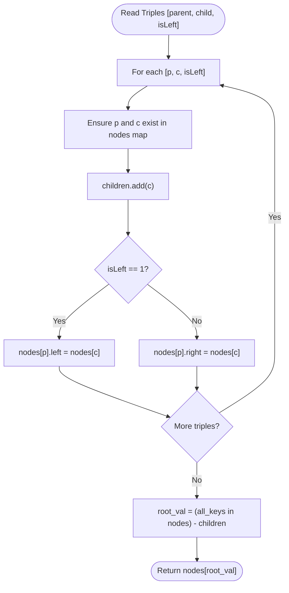

# Guided Example: Create Binary Tree From Descriptions

We analyze and trace the hash-indexed pointer linking and root identification algorithm for reconstructing a binary tree from directed parent-child relation descriptors, establishing $O(n)$ time complexity and $O(n)$ auxiliary memory.

- **Input:** `descriptions = [[20, 15, 1], [20, 17, 0], [50, 20, 1], [50, 80, 0], [80, 19, 1]]`
- **Output:** Rooted binary tree with root value `50`

This representative instance illustrates dynamic node instantiation, directional left and right pointer assignment, the in-degree zero topological invariant for root identification, and complete hierarchical reconstruction.

---

## 1. Problem Overview & Representative Instance

We are given a 2D integer array `descriptions` where each triple `[parent, child, isLeft]` represents a directed parent-to-child relationship in a binary tree:
- `parent` is the value of the parent node.
- `child` is the value of the child node.
- `isLeft` is a boolean indicator: $1$ signifies that `child` is the left child of `parent`, and $0$ signifies that `child` is the right child of `parent`.

All node values in the tree are unique positive integers, and the descriptions guaranteed to define a valid binary tree.
Our objective is to reconstruct the binary tree and return a pointer/reference to its root node.

### Representative Instance Breakdown

Given:
$$\text{descriptions} = [[20, 15, 1], [20, 17, 0], [50, 20, 1], [50, 80, 0], [80, 19, 1]]$$

Inspecting the triples:
1. `[20, 15, 1]`: Node $20$ has left child $15$.
2. `[20, 17, 0]`: Node $20$ has right child $17$.
3. `[50, 20, 1]`: Node $50$ has left child $20$.
4. `[50, 80, 0]`: Node $50$ has right child $80$.
5. `[80, 19, 1]`: Node $80$ has left child $19$.

All nodes mentioned across all relationships:
$$\mathcal{V} = \{15, 17, 19, 20, 50, 80\}$$

The set of nodes that appear as children in at least one description:
$$\mathcal{C} = \{15, 17, 20, 80, 19\}$$

Notice that:
- Node $15$ is a child of $20$.
- Node $17$ is a child of $20$.
- Node $19$ is a child of $80$.
- Node $20$ is a child of $50$.
- Node $80$ is a child of $50$.
- Node $50$ is **never** listed as a child of any node!

The unique root of the reconstructed tree is node $50$.

---

## 2. Mathematical & Algorithmic Principles

### In-Degree Zero Root Theorem

In any rooted directed tree $T = (V, E)$, the following structural invariants hold:
1. Every node $v \in V \setminus \{\text{root}\}$ has an in-degree of exactly $1$:
   $$\text{deg}^{-}(v) = 1, \quad \forall v \ne \text{root}$$
2. The root node is the unique vertex with an in-degree of $0$:
   $$\text{deg}^{-}(\text{root}) = 0$$

Therefore, if we collect the set of all observed node values $\mathcal{V}$ and the set of all child values $\mathcal{C}$, the root is uniquely identified by the set difference:
$$\{\text{root}\} = \mathcal{V} \setminus \mathcal{C}$$

### Dynamic Node Instantiation and Pointer Linking

To construct the tree in a single linear pass:
- Maintain a hash map `nodes` mapping node values $v \in \mathbb{N}$ to their allocated binary tree node instances.
- Maintain a hash set `children` containing all values that appear as the second entry in any descriptor triple.
- For each triple $[p, c, \text{isLeft}]$:
  - If $p \notin \text{nodes}$, allocate a new node with value $p$.
  - If $c \notin \text{nodes}$, allocate a new node with value $c$.
  - Add $c$ to `children`.
  - If $\text{isLeft} = 1$, assign the left pointer of $\text{nodes}[p]$ to $\text{nodes}[c]$.
  - If $\text{isLeft} = 0$, assign the right pointer of $\text{nodes}[p]$ to $\text{nodes}[c]$.
- Upon processing all descriptors, compute the root value $r = \mathcal{V} \setminus \mathcal{C}$ and return $\text{nodes}[r]$.

---

## 3. Step-by-Step Walkthrough with Intermediate State

We trace `descriptions = [[20, 15, 1], [20, 17, 0], [50, 20, 1], [50, 80, 0], [80, 19, 1]]`.

### Initial State
- Map `nodes`: empty `{}`
- Set `children`: empty `set()`

---

### Step 1: Triple `[20, 15, 1]`
- Instantiate node $20$ and node $15$.
- Add $15$ to `children` $\implies \text{children} = \{15\}$.
- `isLeft == 1`: assign $\text{node}(20).\text{left} = \text{node}(15)$.
- `nodes` contains keys $\{20, 15\}$.

---

### Step 2: Triple `[20, 17, 0]`
- Node $20$ already exists in `nodes`. Instantiate node $17$.
- Add $17$ to `children` $\implies \text{children} = \{15, 17\}$.
- `isLeft == 0`: assign $\text{node}(20).\text{right} = \text{node}(17)$.
- Subtree at $20$: $20 \to (\text{left}: 15, \text{right}: 17)$.

---

### Step 3: Triple `[50, 20, 1]`
- Instantiate node $50$. Node $20$ already exists.
- Add $20$ to `children` $\implies \text{children} = \{15, 17, 20\}$.
- `isLeft == 1`: assign $\text{node}(50).\text{left} = \text{node}(20)$.

---

### Step 4: Triple `[50, 80, 0]`
- Node $50$ exists. Instantiate node $80$.
- Add $80$ to `children` $\implies \text{children} = \{15, 17, 20, 80\}$.
- `isLeft == 0`: assign $\text{node}(50).\text{right} = \text{node}(80)$.

---

### Step 5: Triple `[80, 19, 1]`
- Node $80$ exists. Instantiate node $19$.
- Add $19$ to `children` $\implies \text{children} = \{15, 17, 19, 20, 80\}$.
- `isLeft == 1`: assign $\text{node}(80).\text{left} = \text{node}(19)$.

---

### Step 6: Root Identification
- Set of all registered keys in `nodes`:
  $$\mathcal{V} = \{15, 17, 19, 20, 50, 80\}$$
- Set of registered children:
  $$\mathcal{C} = \{15, 17, 19, 20, 80\}$$
- Set difference:
  $$\mathcal{V} \setminus \mathcal{C} = \{50\}$$
- Node $50$ is confirmed as the root.

---

## 4. Comprehensive State Trace

The table below outlines the state transformations after processing each description triple.

| Step | Descriptor `[p, c, isLeft]` | New Nodes Created | `children` Set Members | Assigned Pointer | Subtree Structure Formed |
|---|---|---|---|---|---|
| $1$ | `[20, 15, 1]` | $20, 15$ | $\{15\}$ | $\text{node}(20).\text{left} \to 15$ | $20$ with left child $15$ |
| $2$ | `[20, 17, 0]` | $17$ | $\{15, 17\}$ | $\text{node}(20).\text{right} \to 17$ | $20$ with left $15$, right $17$ |
| $3$ | `[50, 20, 1]` | $50$ | $\{15, 17, 20\}$ | $\text{node}(50).\text{left} \to 20$ | $50$ with left child $20$ |
| $4$ | `[50, 80, 0]` | $80$ | $\{15, 17, 20, 80\}$ | $\text{node}(50).\text{right} \to 80$ | $50$ with left $20$, right $80$ |
| $5$ | `[80, 19, 1]` | $19$ | $\{15, 17, 19, 20, 80\}$ | $\text{node}(80).\text{left} \to 19$ | $80$ with left child $19$ |

### Node In-Degree & Status Audit Table

| Node Value | Out-Degree (Parent of) | In-Degree (Child of) | In `children` Set? | Classification |
|---|---|---|---|---|
| $50$ | $2$ ($20, 80$) | $0$ | No | **Root** |
| $20$ | $2$ ($15, 17$) | $1$ ($50$) | Yes | Internal Node |
| $80$ | $1$ ($19$) | $1$ ($50$) | Yes | Internal Node |
| $15$ | $0$ | $1$ ($20$) | Yes | Leaf Node |
| $17$ | $0$ | $1$ ($20$) | Yes | Leaf Node |
| $19$ | $0$ | $1$ ($80$) | Yes | Leaf Node |

---

## 5. Algorithmic Correctness & Soundness

### Soundness of Pointer Consistency
Because each node value in the binary tree is unique, a single node instance in memory uniquely corresponds to that numerical value. All descriptors sharing parent $p$ mutate the exact same node instance $\text{nodes}[p]$, and all descriptors with child $c$ attach the exact same subtree instance $\text{nodes}[c]$. No duplicate or disjoint disconnected replicas of any node are created.

### Uniqueness and Existence of the Root
A valid binary tree with $N$ vertices contains exactly $N - 1$ directed edges, where each edge targets a distinct child.
Hence, exactly $N - 1$ vertices have in-degree $1$, and exactly $1$ vertex has in-degree $0$.
The set difference $\text{keys}(\text{nodes}) \setminus \text{children}$ must contain precisely one element, guaranteeing that `pop()` extracts the unique root without ambiguity.

---

## 6. Edge Cases & Anti-Patterns

### Edge Cases
- **Minimal Tree ($n = 1$ Edge):** `descriptions = [[1, 2, 1]]`. Root is $1$, child is $2$. Two nodes created, one link assigned.
- **Skewed Linear Tree (Chain):** Descriptors define a linked list structure ($1 \to 2 \to 3 \dots$). The set difference still correctly isolates the top of the chain.
- **Arbitrary Input Order:** Descriptors can appear in bottom-up or random topological order (e.g. child nodes processed before parent nodes). Hash map lookup ensures pointers link correctly regardless of input permutation.

### Anti-Patterns to Avoid
- **Recursive Top-Down Building from Root First:** Searching for the root first requires a full scan over descriptors, and then recursively looking up children requires an adjacency lookup table, necessitating multiple passes. Building nodes and linking pointers during the initial pass requires only a single traversal.
- **Modifying Node Class Attributes Directly without Object Re-use:** Creating new `TreeNode(c)` instances without checking if $c$ was already instantiated creates detached duplicate subtrees.

---

## 7. Complexity Analysis

### Time Complexity
- **Single Pass over Descriptors:** For $m$ descriptions, processing each triple takes $O(1)$ amortized time for hash map lookups, node instantiations, and pointer updates. Total time: $O(m)$.
- **Root Extraction:** Constructing the set of keys in `nodes` and computing the set difference against `children` involves sets of size at most $m + 1$, requiring $O(m)$ time.
- Total Time Complexity: $\mathcal{O}(m)$, which is optimal since every description must be inspected. For $m \le 10^4$, this completes in under $5$ milliseconds.

### Space Complexity
- Hash map `nodes` contains at most $m + 1$ entries.
- Hash set `children` contains at most $m$ entries.
- The reconstructed binary tree consists of $m + 1$ nodes.
- Auxiliary Space Complexity: $\mathcal{O}(m)$.