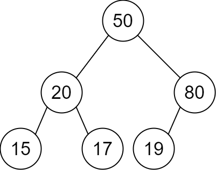
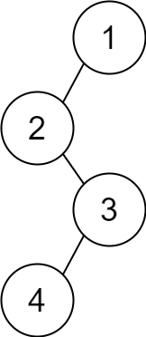

### 1. Description

You are given a 2D integer array `descriptions` where $\text{descriptions}[i] = [\text{parent}_{i}, \text{child}_{i}, \text{isLeft}_{i}]$ indicates that $\text{parent}_{i}$ is the **parent** of $\text{child}_{i}$ in a **binary** tree of **unique** values. Furthermore,

- If $\text{isLeft}_{i} = 1$, then $\text{child}_{i}$ is the left child of $\text{parent}_{i}$.

- If $\text{isLeft}_{i} = 0$, then $\text{child}_{i}$ is the right child of $\text{parent}_{i}$.

Construct the binary tree described by `descriptions` and return *its **root***.

The test cases will be generated such that the binary tree is **valid**.

### 2. Function Contract

- `n`: Input parameter.
- Returns expected result.

### 3. Examples

#### Example 1

- **Input:** $descriptions = [[20,15,1],[20,17,0],[50,20,1],[50,80,0],[80,19,1]]$
- **Output:** `[50,20,80,15,17,19]`
- **Explanation:** The root node is the node with value 50 since it has no parent.
The resulting binary tree is shown in the diagram.
#### Example 2

- **Input:** $descriptions = [[1,2,1],[2,3,0],[3,4,1]]$
- **Output:** `[1,2,null,null,3,4]`
- **Explanation:** The root node is the node with value 1 since it has no parent.
The resulting binary tree is shown in the diagram.

### 4. Constraints

- $1 \le \text{descriptions.length} \le 10^{4}$

- $\text{descriptions}[i].length = 3$

- $1 \le \text{parent}_{i}, \text{child}_{i} \le 10^{5}$

- $0 \le \text{isLeft}_{i} \le 1$

- The binary tree described by `descriptions` is valid.