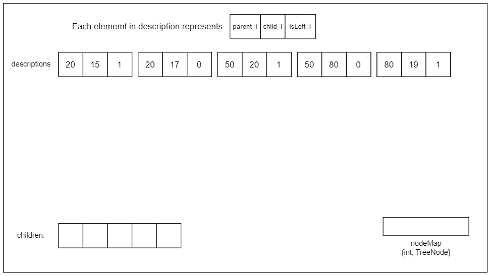
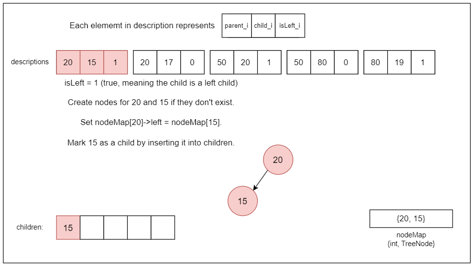
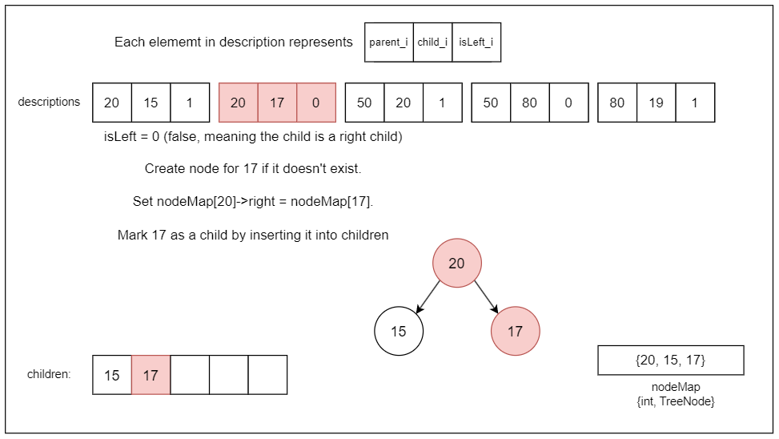
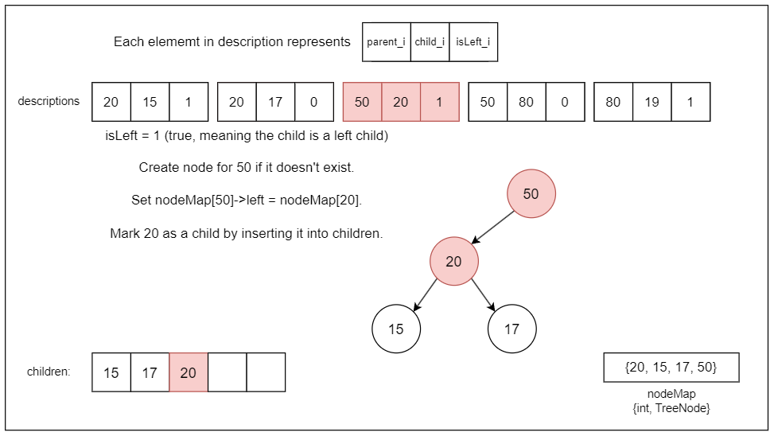
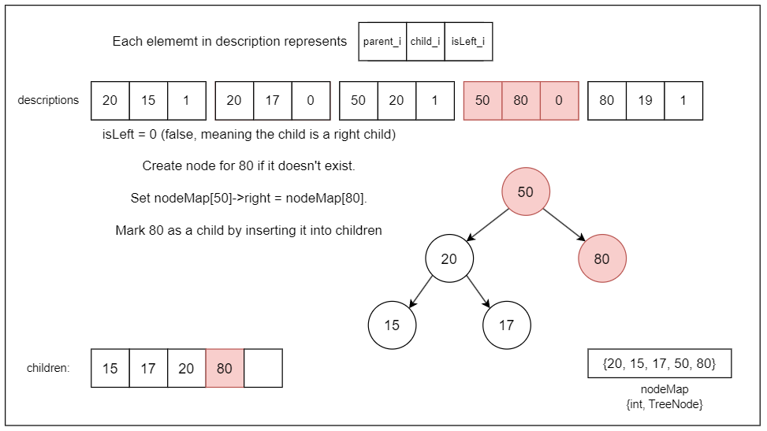
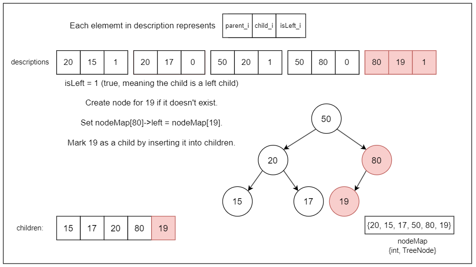
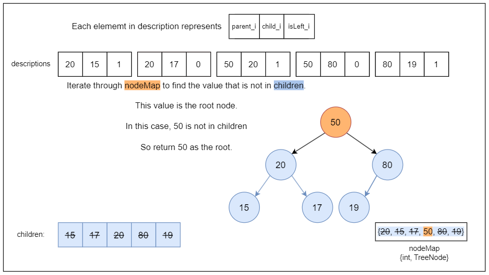

## Solution

---

### Overview

We are given a 2D integer array `descriptions`, where each element is a triplet $[\text{parent}_{i}, \text{child}_{i}, \text{isLeft}_{i}]$.
Each triplet $[\text{parent}_{i}, \text{child}_{i}, \text{isLeft}_{i}]$ provides specific information:
- $\text{parent}_{i}$ is the value of a parent node in the binary tree.
- $\text{child}_{i}$ is the value of the child node associated with $\text{parent}_{i}$.
- $\text{isLeft}_{i}$ indicates the position of $\text{child}_{i}$ relative to $\text{parent}_{i}$. A value of `1` means $\text{child}_{i}$ is the left child, and a value of `0` means $\text{child}_{i}$ is the right child.

Our task is to construct the binary tree based on the given descriptions and return the root node of this tree. It is important to note that the input `descriptions` are guaranteed to describe a valid binary tree, where each node's value is unique. This uniqueness ensures that we can confidently build the tree without conflicts in node values.

In a binary tree, each node can have at most two children: a left child and a right child. For any given node, we need to determine and assign its left and right children based on the provided descriptions. The `descriptions` array provides explicit instructions on how to connect parent nodes to their respective children. Knowing whether a child is a left or right child (indicated by $\text{isLeft}_{i}$) is crucial for placing the child in the correct position.

To build the tree, we can iterate through each triplet $[\text{parent}_{i}, \text{child}_{i}, \text{isLeft}_{i}]$ from the `descriptions` array. For each triplet, we establish the parent-child relationship by creating or identifying the nodes and linking the child to the parent in the specified position (left or right).

---

### Approach 1: Convert to Graph with Breadth First Search

#### Intuition

We need a way to organize the information we're given. The `descriptions` provide parent-child relationships, but they are unordered. To address this, we begin by constructing a graph representation. Using a map to link each parent to its children, we establish a structure that facilitates quick lookup of all children associated with any node.

But a graph isn't enough; we must identify our starting point. In a binary tree, this starting point is the root node—the only node that is a parent but never a child. To find the root node, we track all parents and children separately. By removing all children from the set of parents, we isolate the root. This approach saves time by avoiding multiple scans through the entire list of descriptions to find the root.

So to construct the binary tree, we initially set up data structures to manage parent-child relationships efficiently. We utilize two sets: `children`, which stores all child nodes, and `parents`, which stores all parent nodes. Additionally, we use a map named `parentToChildren` to map each parent node to a list of its children along with their positional information ($\text{isLeft}_{i}$).

As we iterate through each description $[\text{parent}_{i}, \text{child}_{i}, \text{isLeft}_{i}]$ in the `descriptions` array, we add each $\text{parent}_{i}$ to the `parents` set and each $\text{child}_{i}$ to the `children` set. We also update the `parentToChildren` map to associate each $\text{parent}_{i}$ with its child and positional information. This mapping allows us to systematically establish the binary tree structure later.

Next, to determine the root of the binary tree, we identify the node in the `parents` set that does not appear in the `children` set. The node remaining in `parents` after removing all elements present in `children` represents the root of our binary tree.

With the root identified, we construct the binary tree using a breadth-first search (BFS). We initialize a queue with the root node. For each parent node dequeued, we create `TreeNode` objects for its children from the `parentToChildren` map, enqueue them, and link them as left or right children based on $\text{isLeft}_{i}$.

Upon completing the BFS traversal, the binary tree is fully constructed and linked according to the relationships defined in the `descriptions` array. Finally, we return the root node of the constructed binary tree.

#### Algorithm

- Initialize `children` and `parents` as sets to track unique child and parent nodes, respectively.
- Initialize `parentToChildren` as a map to store parent to children relationships using array of pairs.

- Build the graph:
  - Iterate through each `d` in `descriptions`:
- Extract `parent`, `child`, and `isLeft` from `d`.
- Add `parent` and `child` to `parents` to track all nodes.
- Add `child` to `children`.
- Push back the pair `(child, isLeft)` into $\text{parentToChildren}[parent]$ to store child nodes and their left/right flags.

- Iterate through `parents` to find the node that is in `parents` but not in `children`, and assign it to `root`.

- Create the root node `TreeNode*` using the first element of `parents`.

- Construct the binary tree using BFS:
  - Initialize a queue and push `root` into it.
  - While `queue` is not empty:
- Dequeue the front `parent` node from `queue`.
- Iterate over each `childInfo` in `parentToChildren[parent.val]`:
      - Extract `childValue` and `isLeft`.
      - Create a new `TreeNode* child` with `childValue`.
      - Push `child` into `queue`.
      - Attach `child` to `parent.left` or `parent.right` based on the `isLeft` flag.

- Return the constructed `root` node of the binary tree.

#### Implementation

```python
class Solution:
    def createBinaryTree(
        self, descriptions: List[List[int]]
    ) -> Optional[TreeNode]:
        # Sets to track unique children and parents
        children = set()
        parents = set()
        # Dictionary to store parent to children relationships
        parentToChildren = {}

        # Build graph from parent to child, and add nodes to sets
        for d in descriptions:
            parent, child, isLeft = d
            parents.add(parent)
            parents.add(child)
            children.add(child)
            if parent not in parentToChildren:
                parentToChildren[parent] = []
            parentToChildren[parent].append((child, isLeft))

        # Find the root node by checking which node is
        # in parents but not in children
        for parent in parents.copy():
            if parent in children:
                parents.remove(parent)

        root = TreeNode(next(iter(parents)))

        # Starting from root, use BFS to construct binary tree
        queue = deque([root])

        while queue:
            parent = queue.popleft()
            # Iterate over children of current parent
            for childValue, isLeft in parentToChildren.get(parent.val, []):
                child = TreeNode(childValue)
                queue.append(child)
                # Attach child node to its parent based on isLeft flag
                if isLeft == 1:
                    parent.left = child
                else:
                    parent.right = child

        return root
```

#### Complexity Analysis

Let $n$ be the number of entries in `descriptions`.

* Time complexity: $O(n)$

    Building the `parentToChildren` map and the `children` and `parents` sets takes $O(n)$ time.

    Finding the root node involves iterating through the `parents` set, which is $O(n)$ in the worst case.

    Constructing the binary tree using BFS also takes $O(n)$ time since each node is processed once. Therefore, the overall time complexity is $O(n)$.

* Space complexity: $O(n)$

    The `parentToChildren` map can store up to $n$ entries. The `children` and `parents` sets can each store up to $n$ elements. The BFS queue can store up to $n$ nodes in the worst case. Therefore, the overall space complexity is $O(n)$.

---

### Approach 2: Convert to Graph with Depth First Search

#### Intuition

The main logic frame remains the same as the BFS approach; the difference lies in how we construct it using the DFS algorithm.

To construct the binary tree, we initially set up data structures to manage parent-child relationships efficiently. We utilize two sets: `children`, which stores all child nodes, and `allNodes`, which stores all nodes (both parents and children). Additionally, we use a dictionary named `parentToChildren` to map each parent node to a list of its children along with their positional information (`isLeft`).

As we iterate through each `[parent, child, isLeft]` in `descriptions`, we populate `allNodes` with all nodes and `children` with child nodes. Using `parentToChildren`, each parent maps to a list including its child and positional info (`isLeft`), facilitating binary tree creation.

To determine the root of the binary tree, we identify the node in the `allNodes` set that does not appear in the `children` set. This node remains in the `allNodes` set after removing all elements also present in `children` and represents the root of our binary tree.

With the root identified, we construct the binary tree using a depth-first search (DFS). The `dfs` function recursively creates `TreeNode` instances for each node value. If a node has children in `parentToChildren`, `dfs` iterates through them, attaching each subtree based on `isLeft`. Finally, `dfs` returns the fully constructed subtree rooted at the current node.

We start the whole process by calling a depth-first search on the root value we identified. This initiates the recursive construction of the entire tree.

The DFS approach naturally follows the structure of the tree, building each branch completely before moving to the next. This method is particularly efficient for deep trees, as it doesn't need to store information about all nodes at one level before proceeding to the next (unlike BFS).

Upon completing the DFS traversal, the binary tree is fully constructed and linked according to the relationships defined in the `descriptions` array. Finally, we return the root node of the constructed binary tree.

#### Algorithm

- Initialize `parentToChildren` as a map to store parent-child relationships using lists of integer arrays.
- Initialize `allNodes` as a set to track all node values and `children` as another `HashSet` to track child nodes.

- Iterate through each `desc` in `descriptions`:
  - Extract `parent`, `child`, and `isLeft` from `desc`.
  - If `parent` is not already in `parentToChildren`, initialize it with an empty list.
  - Add the pair `(child, isLeft)` to $\text{parentToChildren}[parent]$.
  - Add both `parent` and `child` to the `allNodes` set.
  - Add `child` to the `children` set.

- Find the root node value (`rootVal`):
  - Iterate through `allNodes`:
- If a node is not in the `children` set, assign it to `rootVal` and break out of the loop.

- Call `dfs(parentToChildren, rootVal)` to recursively construct the binary tree.

Helper method `dfs` with parameters: `parentToChildren`, `val`:
- Create a new `TreeNode` for `val`.
- If `val` has children:
  - Iterate through each `childInfo` in `parentToChildren.get(val)`:
- Extract `child` and `isLeft`.
- If `isLeft` is `1`, recursively call `dfs` to attach `child` as the left child of `node`.
- Otherwise, attach `child` as the right child of `node`.

- Return the root node of the constructed binary tree.

#### Implementation

```python
class Solution:
    def createBinaryTree(
        self, descriptions: List[List[int]]
    ) -> Optional[TreeNode]:
        # Step 1: Organize data
        parent_to_children = {}
        all_nodes = set()
        children = set()

        for parent, child, is_left in descriptions:
            # Store child information under parent node
            if parent not in parent_to_children:
                parent_to_children[parent] = []
            parent_to_children[parent].append((child, is_left))
            all_nodes.add(parent)
            all_nodes.add(child)
            children.add(child)

        # Step 2: Find the root
        root_val = (all_nodes - children).pop()

        # Step 3 & 4: Build the tree using DFS
        def _dfs(val):
            # Create new TreeNode for current value
            node = TreeNode(val)

            # If current node has children, recursively build them
            if val in parent_to_children:
                for child, is_left in parent_to_children[val]:
                    # Attach child node based on is_left flag
                    if is_left:
                        node.left = _dfs(child)
                    else:
                        node.right = _dfs(child)
            return node

        return _dfs(root_val)
```

#### Complexity Analysis

Let $n$ be the number of entries in `descriptions`.

* Time complexity: $O(n)$

    Building the `parentToChildren` map and the `allNodes` and `children` sets takes $O(n)$ time. Finding the root node involves iterating through the `allNodes` set, which is $O(n)$ in the worst case.

    Constructing the binary tree using DFS also takes $O(n)$ time since each node is processed once. Therefore, the overall time complexity is $O(n)$.

* Space complexity: $O(n)$

    The `parentToChildren` map can store up to $n$ entries. The `allNodes` and `children` sets can each store up to $n$ elements. The recursive DFS stack can store up to $n$ nodes in the worst case. Therefore, the overall space complexity is $O(n)$.

---

### Approach 3: Constructing Tree From Directly Map and TreeNode Object

#### Intuition

While the DFS solution effectively built the tree through recursive traversal, it required multiple data structures and a separate step to identify the root. To build the binary tree efficiently, we need a way to quickly access any node by its value. Trees are not inherently sequential structures, making navigation and referencing more complex. Using a map to associate each node value with its corresponding `TreeNode` object solves this problem, providing instant access to any node.

This map serves a dual purpose: it not only provides $O(1)$ access to any node but also eliminates the need for separate parent and child tracking sets used in our previous approach, thus significantly reducing the algorithm's time and space complexity.

The first step involves creating this map to link each node's value to its `TreeNode` object. As we iterate through each description $[\text{parent}_{i}, \text{child}_{i}, \text{isLeft}_{i}]$, we need to check if the parent and child nodes already exist in the map. If they do not, we create them and store them in the map.

Next, based on the $\text{isLeft}_{i}$ value, we link the parent node to the child node by setting either the left or right pointer of the parent's `TreeNode` object to the child's `TreeNode` object. This way we can establish the left and right child relationships as described by the input.

While setting up these relationships, we also maintain a set (say `children`) to keep track of all nodes that have been assigned as a child to some parent node. This set is crucial for identifying the root node later because the root will not be a child of any node.

Finally, once all descriptions are processed, we iterate through the nodes in the map. For each node, we check if it is not present in the `children` set. The node not present in the `children` set is the one which has never been assigned as a child, indicating that it is the root of the tree. We return this root node.

The algorithm is visualized below:















#### Algorithm

- Initialize `nodeMap` to map node values to `TreeNode` pointers.
- Initialize `children` set to track child nodes from descriptions.

- Iterate through each `description` in `descriptions`:
  - Extract `parentValue`, `childValue`, and `isLeft` (boolean indicating if it's a left child).
  - Create `TreeNode` objects for `parentValue` and `childValue` if not already in `nodeMap`.
  - Attach `childValue` as left or right child to `parentValue` based on `isLeft`.
  - Add `childValue` to `children` set.

- Iterate through `nodeMap` to find the root node:
  - Check each node:
- If node's value is not in `children`, return it as the root node.

- Return the identified root node of the binary tree.

- If no root node is found (should not occur per problem statement), return `nullptr`.

#### Implementation

```python
class Solution:
    def createBinaryTree(
        self, descriptions: List[List[int]]
    ) -> Optional[TreeNode]:
        # Maps values to TreeNode pointers
        node_map = {}

        # Stores values which are children in the descriptions
        children = set()

        # Iterate through description to create nodes and set up tree structure
        for description in descriptions:
            # Extract parent value, child value, and whether
            # it is a left child (1) or right child (0)
            parent_value = description[0]
            child_value = description[1]
            is_left = bool(description[2])

            # Create parent and child nodes if not already created
            if parent_value not in node_map:
                node_map[parent_value] = TreeNode(parent_value)
            if child_value not in node_map:
                node_map[child_value] = TreeNode(child_value)

            # Attach child node to parent's left or right branch
            if is_left:
                node_map[parent_value].left = node_map[child_value]
            else:
                node_map[parent_value].right = node_map[child_value]

            # Mark child as a child in the set
            children.add(child_value)

        # Find and return the root node
        for node in node_map.values():
            if node.val not in children:
                return node  # Root node found

        return None  # Should not occur according to problem statement
```

#### Complexity Analysis

Let $n$ be the number of nodes created in the binary tree.

- Time complexity: $O(n)$

    The algorithm iterates through each description exactly once, and for each description, it performs constant-time operations:
- Checking and adding nodes to `nodeMap`.
- Updating node connections (`left` or `right` child assignments).
- Adding child values to the `children` set.

    The final loop iterates through the `nodeMap`, which contains all created nodes, to find the root node. The loop's runtime is linear in relation to the number of nodes created, resulting in a time complexity of $O(n)$.

- Space complexity: $O(n)$

    The algorithm uses `nodeMap` to store references to all created nodes. In the worst case, this map contains all nodes, so it takes up $O(n)$ space. The `children` set also takes $O(n)$ space to store child values.

    Additional space is used for the `TreeNode` objects themselves, but that's accounted for within the $O(n)$ space complexity due to the nodes being stored in `nodeMap`.

---