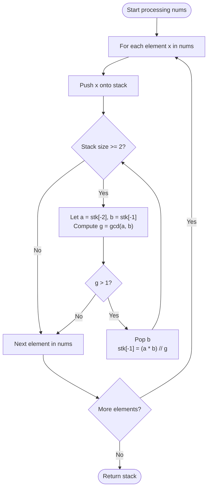

# Guided Example: Replace Non-Coprime Numbers in Array

We analyze and trace the stack-based confluence reduction algorithm for iteratively consolidating adjacent non-coprime integers into their least common multiples, establishing $O(n \log M)$ amortized time complexity and $O(n)$ auxiliary space, where $M$ is the maximum value in `nums`.

- **Input:** `nums = [6, 4, 3, 2, 7, 6, 2]`
- **Output:** `[12, 7, 6]`

This representative instance highlights greedy pairwise GCD testing, backward cascading stack reduction, LCM fusion, and termination at coprime boundaries.

---

## 1. Problem Overview & Representative Instance

We are given an array of integers `nums`.
Two integers $x$ and $y$ are defined as non-coprime if their greatest common divisor is strictly greater than $1$: $\gcd(x, y) > 1$.

We are allowed to repeatedly perform the following contraction:
1. Select any two adjacent elements in the array that are non-coprime.
2. Replace these two adjacent elements with their least common multiple:
   $$\text{lcm}(x, y) = \frac{x \cdot y}{\gcd(x, y)}$$
3. Repeat this process until no two adjacent elements in the array are non-coprime.

We must return the resulting array. By the algebraic confluence property of the reduction system, regardless of which adjacent non-coprime pair is collapsed first, all valid reduction sequences terminate at the exact same unique normal form.

### Representative Instance Breakdown

Consider the sequence:
$$\text{nums} = [6, 4, 3, 2, 7, 6, 2]$$

1. Pair $(6, 4)$ has $\gcd(6, 4) = 2 > 1$. They merge into $\text{lcm}(6, 4) = 12$.
   - Array becomes: $[12, 3, 2, 7, 6, 2]$.
2. Pair $(12, 3)$ has $\gcd(12, 3) = 3 > 1$. They merge into $\text{lcm}(12, 3) = 12$.
   - Array becomes: $[12, 2, 7, 6, 2]$.
3. Pair $(12, 2)$ has $\gcd(12, 2) = 2 > 1$. They merge into $\text{lcm}(12, 2) = 12$.
   - Array becomes: $[12, 7, 6, 2]$.
4. Pair $(12, 7)$ has $\gcd(12, 7) = 1$. They are coprime and cannot merge.
5. Moving rightward, pair $(7, 6)$ has $\gcd(7, 6) = 1$. They are coprime.
6. Pair $(6, 2)$ has $\gcd(6, 2) = 2 > 1$. They merge into $\text{lcm}(6, 2) = 6$.
   - Array becomes: $[12, 7, 6]$.
7. Pair $(7, 6)$ has $\gcd(7, 6) = 1$.
   No adjacent non-coprime pairs remain.

Final stabilized result: $[12, 7, 6]$.

---

## 2. Mathematical & Algorithmic Principles

### Confluence of Non-Coprime LCM Reduction

The operation of replacing adjacent non-coprime elements $(x, y)$ by $\text{lcm}(x, y)$ defines an abstract rewrite system.
Because $\text{lcm}$ is commutative and associative, and prime factors are preserved under division by common divisors:
$$\text{lcm}(x, \text{lcm}(y, z)) = \text{lcm}(\text{lcm}(x, y), z)$$
Whenever three numbers $x, y, z$ have $\gcd(x, y) > 1$ and $\gcd(y, z) > 1$, collapsing $(x, y)$ first and then merging with $z$ yields $\text{lcm}(x, y, z)$, which is identical to collapsing $(y, z)$ first and then merging with $x$.
Thus, the system is locally confluent and strongly normalizing (every reduction strictly reduces the array length by $1$), ensuring a unique irreducible normal form.

### Stack-Based Greedy Cascading

Because the final outcome is independent of reduction order, we can process elements from left to right using an active reduction stack:
- Push incoming element $x$ onto the stack.
- While the stack has at least two elements:
  - Let $a = \text{stk}[-2]$ and $b = \text{stk}[-1]$.
  - Compute $g = \gcd(a, b)$ via the Euclidean algorithm.
  - If $g = 1$, stop reducing: $a$ and $b$ are coprime.
  - If $g > 1$, non-coprime collision occurs:
    - Pop $b$.
    - Update the top element to $\text{lcm}(a, b) = \frac{a \cdot b}{g}$.
    - Repeat the check between the new top and its preceding neighbor (cascading leftward).

---

## 3. Step-by-Step Walkthrough with Intermediate State

We trace the algorithm execution on `nums = [6, 4, 3, 2, 7, 6, 2]`.

### Push 1: $x = 6$
- Stack: `[6]`. Size is $1$, no reduction.

---

### Push 2: $x = 4$
- Stack: `[6, 4]`.
- Top pair: $a = 6, b = 4$.
- $\gcd(6, 4) = 2 > 1$.
- Non-coprime merge: $\text{lcm}(6, 4) = (6 \times 4) // 2 = 12$.
- Pop $4$, replace $6$ with $12$.
- Stack: `[12]`. Size is $1$, reduction finishes.

---

### Push 3: $x = 3$
- Stack: `[12, 3]`.
- Top pair: $a = 12, b = 3$.
- $\gcd(12, 3) = 3 > 1$.
- Non-coprime merge: $\text{lcm}(12, 3) = (12 \times 3) // 3 = 12$.
- Pop $3$, replace $12$ with $12$.
- Stack: `[12]`. Size is $1$, reduction finishes.

---

### Push 4: $x = 2$
- Stack: `[12, 2]`.
- Top pair: $a = 12, b = 2$.
- $\gcd(12, 2) = 2 > 1$.
- Non-coprime merge: $\text{lcm}(12, 2) = (12 \times 2) // 2 = 12$.
- Pop $2$, replace $12$ with $12$.
- Stack: `[12]`. Size is $1$, reduction finishes.

---

### Push 5: $x = 7$
- Stack: `[12, 7]`.
- Top pair: $a = 12, b = 7$.
- $\gcd(12, 7) = 1$.
- Elements are coprime. Break reduction loop.
- Stack remains: `[12, 7]`.

---

### Push 6: $x = 6$
- Stack: `[12, 7, 6]`.
- Top pair: $a = 7, b = 6$.
- $\gcd(7, 6) = 1$.
- Elements are coprime. Break reduction loop.
- Stack remains: `[12, 7, 6]`.

---

### Push 7: $x = 2$
- Stack: `[12, 7, 6, 2]`.
- Top pair: $a = 6, b = 2$.
- $\gcd(6, 2) = 2 > 1$.
- Non-coprime merge: $\text{lcm}(6, 2) = (6 \times 2) // 2 = 6$.
- Pop $2$, replace $6$ with $6$.
- Stack: `[12, 7, 6]`.
- Check new top pair: $a = 7, b = 6$.
- $\gcd(7, 6) = 1$.
- Elements are coprime. Break reduction loop.
- Stack remains: `[12, 7, 6]`.

---

## 4. Comprehensive State Trace

The table below illustrates the stack configuration and merge decisions for each incoming number.

| Push Step | Input $x$ | Stack Before Reduction | Top Pair $(a, b)$ | $\gcd(a, b)$ | Merge Action Taken | Stack After Step |
|---|---|---|---|---|---|---|
| $1$ | $6$ | `[6]` | — | — | None (Size 1) | `[6]` |
| $2$ | $4$ | `[6, 4]` | $(6, 4)$ | $2$ | Merge $\to \text{lcm} = 12$ | `[12]` |
| $3$ | $3$ | `[12, 3]` | $(12, 3)$ | $3$ | Merge $\to \text{lcm} = 12$ | `[12]` |
| $4$ | $2$ | `[12, 2]` | $(12, 2)$ | $2$ | Merge $\to \text{lcm} = 12$ | `[12]` |
| $5$ | $7$ | `[12, 7]` | $(12, 7)$ | $1$ | Coprime (Break) | `[12, 7]` |
| $6$ | $6$ | `[12, 7, 6]` | $(7, 6)$ | $1$ | Coprime (Break) | `[12, 7, 6]` |
| $7$ | $2$ | `[12, 7, 6, 2]` | $(6, 2)$ | $2$ | Merge $\to \text{lcm} = 6$ | `[12, 7, 6]` |

### Pairwise Divisibility and Prime Factor Decomposition

| Element Value | Prime Factorization | Interacting Partner | Shared Prime Factor | Resulting LCM |
|---|---|---|---|---|
| $6$ | $2 \times 3$ | $4 = 2^2$ | $2$ | $2^2 \times 3 = 12$ |
| $12$ | $2^2 \times 3$ | $3 = 3^1$ | $3$ | $2^2 \times 3 = 12$ |
| $12$ | $2^2 \times 3$ | $2 = 2^1$ | $2$ | $2^2 \times 3 = 12$ |
| $12$ | $2^2 \times 3$ | $7 = 7^1$ | None ($\gcd = 1$) | Retained |
| $6$ | $2 \times 3$ | $2 = 2^1$ | $2$ | $2 \times 3 = 6$ |

---

## 5. Algorithmic Correctness & Soundness

### Invariant Maintenance
At the end of processing prefix $\text{nums}[0 \dots i]$, the stack contains a condensed sequence $[s_0, s_1, \dots, s_k]$ such that:
1. No two adjacent elements in the stack are non-coprime: $\gcd(s_j, s_{j+1}) = 1$ for all $0 \le j < k$.
2. The sequence is algebraically equivalent to $\text{nums}[0 \dots i]$ under valid non-coprime LCM collapses.

When element $\text{nums}[i + 1]$ is appended, any possible non-coprime relationship can only occur at the boundary between $s_k$ and $\text{nums}[i + 1]$.
If they merge into $s'_k$, a new adjacent pair $(s_{k-1}, s'_k)$ is created, which may now share prime factors. The `while` loop checks and resolves this recursively until either $\gcd(s_{j-1}, s'_j) = 1$ or the stack reduces to a single element.

---

## 6. Edge Cases & Anti-Patterns

### Edge Cases
- **All Mutually Coprime Array (`nums = [2, 3, 5, 7, 11]`):** Every adjacent pair has GCD $1$. No merges occur; the stack simply receives all elements, returning the original array.
- **Cascading Collapse to Single Element (`nums = [2, 4, 8, 16]`):** Each element merges with the running LCM, yielding $[16]$.
- **Right-to-Left Ripple Triggered by Small Tail Element:** For example, `[12, 14, 21]` where $\gcd(12, 14)=2 \implies 84$, and $\gcd(84, 21)=21 \implies 84$. The stack correctly ripples back.

### Anti-Patterns to Avoid
- **Linear Array Deletion with Rescanning:** Finding a pair in an array and using `del nums[i]` shifts subsequent elements in $O(n)$ time. Repeating this up to $n$ times causes quadratic $O(n^2)$ time degradation.
- **Floating-Point Division in LCM:** Computing `(a * b) / g` uses floating-point representation which loses precision for numbers approaching $10^9$. Always perform integer division `(a * b) // g`.

---

## 7. Complexity Analysis

### Time Complexity
- Each element of `nums` is pushed onto the stack exactly once ($n$ pushes).
- Each merge operation reduces the stack size by $1$. Since the stack size can never be negative, there can be at most $n - 1$ total successful merge operations across the entire algorithm.
- Each merge and each coprime test evaluates Euclidean GCD on two integers $\le M$, which requires $O(\log M)$ arithmetic operations.
- The total number of GCD evaluations is bounded by $n + (n - 1) = 2n - 1$.
- Total Time Complexity: $\mathcal{O}(n \log M)$, which requires only a few milliseconds for $n \le 10^5, M \le 10^5$.

### Space Complexity
- The stack stores at most $n$ integers.
- Auxiliary Space Complexity: $\mathcal{O}(n)$ to hold the reduced sequence.
