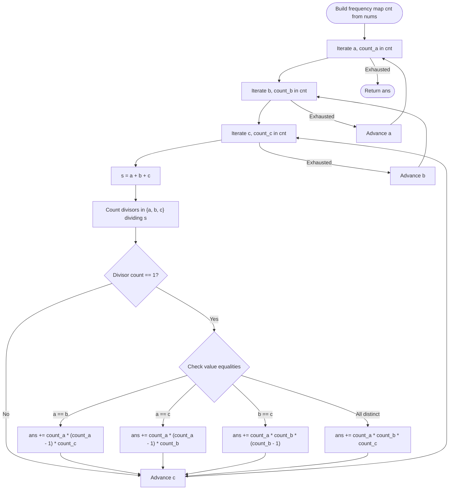

# Guided Example: Number of Single Divisor Triplets

We analyze and trace the value-frequency aggregation and combinatorial counting algorithm for enumerating ordered index triplets whose sum is divisible by exactly one of its constituent values, establishing $O(U^3)$ time complexity where $U \le 100$ represents the domain bound of distinct values.

- **Input:** `nums = [1, 2, 2]`
- **Output:** `6`

This representative instance highlights frequency histogram compression, the single-divisor modular arithmetic predicate, permutations of identical values with distinct indices, and combinatorial weighting.

---

## 1. Problem Overview & Representative Instance

Given a 0-indexed array of positive integers `nums`, an ordered triplet of distinct indices $(i, j, k)$ (with $i \ne j$, $j \ne k$, and $i \ne k$) is called a **single-divisor triplet** if:
$$s = \text{nums}[i] + \text{nums}[j] + \text{nums}[k]$$
is divisible by **exactly one** of the values in $\{\text{nums}[i], \text{nums}[j], \text{nums}[k]\}$.

We must return the total number of single-divisor index triplets $(i, j, k)$. Note that ordering matters: index permutations $(i, j, k)$ and $(j, i, k)$ are counted as distinct triplets.

### Representative Instance Breakdown

Consider the array:
$$\text{nums} = [1, 2, 2], \quad n = 3$$

Indexed elements:
- Index $0$: $\text{nums}[0] = 1$
- Index $1$: $\text{nums}[1] = 2$
- Index $2$: $\text{nums}[2] = 2$

Every triplet of distinct indices must select the element at index $0$ and both elements at indices $1$ and $2$.
The sum of values is:
$$s = 1 + 2 + 2 = 5$$

Testing divisibility against each value in the multiset $\{1, 2, 2\}$:
1. First value $1$: $5 \bmod 1 = 0$ (divisible).
2. Second value $2$: $5 \bmod 2 = 1 \ne 0$ (not divisible).
3. Third value $2$: $5 \bmod 2 = 1 \ne 0$ (not divisible).

Exactly one element ($1$) divides the sum $5$. Thus, every permutation of these three indices forms a valid single-divisor triplet.

Permuting indices $\{0, 1, 2\}$:
1. $(0, 1, 2) \implies (1, 2, 2)$, sum $5$, valid.
2. $(0, 2, 1) \implies (1, 2, 2)$, sum $5$, valid.
3. $(1, 0, 2) \implies (2, 1, 2)$, sum $5$, valid.
4. $(1, 2, 0) \implies (2, 2, 1)$, sum $5$, valid.
5. $(2, 0, 1) \implies (2, 1, 2)$, sum $5$, valid.
6. $(2, 1, 0) \implies (2, 2, 1)$, sum $5$, valid.

Total valid triplets: $6$.

---

## 2. Mathematical & Algorithmic Principles

### Bounded Value Domain Compression

The raw array length $n$ can be up to $10^5$. An $O(n^3)$ brute-force enumeration of index triplets would perform $(10^5)^3 = 10^{15}$ operations, causing an immediate Time Limit Exceeded.
However, problem constraints specify:
$$1 \le \text{nums}[i] \le 100$$
The number of distinct values $U$ satisfies $U \le 100$.

By constructing a frequency histogram:
$$\text{cnt}[v] = \sum_{m=0}^{n-1} \mathbf{1}_{(\text{nums}[m] = v)}$$
we reduce the problem from iterating over $n^3$ index triples to iterating over $U^3 \le 100^3 = 10^6$ distinct value triples $(a, b, c)$.

### The Single-Divisor Predicate

For any value triple $(a, b, c)$, let $s = a + b + c$.
We evaluate the indicator sum:
$$D(a, b, c) = \mathbf{1}_{(s \bmod a = 0)} + \mathbf{1}_{(s \bmod b = 0)} + \mathbf{1}_{(s \bmod c = 0)}$$
A triple is valid if and only if $D(a, b, c) = 1$.

Key arithmetic deductions:
1. **Three Identical Values ($a = b = c$):** Here $s = 3a$. Clearly $s \bmod a = 0$, which implies all three terms divide $s$ ($D = 3 \ne 1$). Hence, three identical values can never form a single-divisor triplet.
2. **Two Identical Values ($a = b \ne c$):** If $s \bmod a = 0$, then both $a$ and $b$ divide $s$, giving $D \ge 2$. Thus, for two identical values to be valid, the single divisor must be $c$ ($s \bmod c = 0$ and $s \bmod a \ne 0$).

### Combinatorial Multipliers

When a value triple $(a, b, c)$ satisfies $D(a, b, c) = 1$, the number of distinct ordered index triplets $(i, j, k)$ achieving these values is:
- **Case 1: All distinct ($a \ne b, b \ne c, a \ne c$):**
  $$\text{Ways} = \text{cnt}[a] \times \text{cnt}[b] \times \text{cnt}[c]$$
- **Case 2: First two equal ($a = b \ne c$):**
  $$\text{Ways} = \text{cnt}[a] \times (\text{cnt}[a] - 1) \times \text{cnt}[c]$$
- **Case 3: Outer two equal ($a = c \ne b$):**
  $$\text{Ways} = \text{cnt}[a] \times (\text{cnt}[a] - 1) \times \text{cnt}[b]$$
- **Case 4: Last two equal ($b = c \ne a$):**
  $$\text{Ways} = \text{cnt}[a] \times \text{cnt}[b] \times (\text{cnt}[b] - 1)$$

---

## 3. Step-by-Step Walkthrough with Intermediate State

We trace `nums = [1, 2, 2]`.

### Step 1: Frequency Histogram Construction
- $\text{cnt}[1] = 1$
- $\text{cnt}[2] = 2$
- Distinct value domain: $\{1, 2\}$.

---

### Step 2: Evaluation of Value Triples $(a, b, c) \in \{1, 2\}^3$

There are $2^3 = 8$ total combinations of $(a, b, c)$:

#### 1. Triple $(1, 1, 1)$
- $s = 3$. $3 \bmod 1 = 0 \implies D = 3 \ne 1$. Discarded.

#### 2. Triple $(1, 1, 2)$
- $s = 4$. $4 \bmod 1 = 0$ (both ones divide $4$), so $D \ge 2$. Discarded.

#### 3. Triple $(1, 2, 1)$
- $s = 4$. Both ones divide $4 \implies D \ge 2$. Discarded.

#### 4. Triple $(2, 1, 1)$
- $s = 4$. Both ones divide $4 \implies D \ge 2$. Discarded.

#### 5. Triple $(1, 2, 2)$
- $s = 1 + 2 + 2 = 5$.
- Divisibility checks:
  - $5 \bmod 1 = 0$ (divisible).
  - $5 \bmod 2 = 1 \ne 0$ (not divisible).
  - $5 \bmod 2 = 1 \ne 0$ (not divisible).
- Divisor count $D = 1$. Valid!
- Here $b = c = 2$.
- Formula applied: $\text{cnt}[1] \times \text{cnt}[2] \times (\text{cnt}[2] - 1) = 1 \times 2 \times 1 = 2$.
- Accumulator: $\text{ans} \leftarrow 0 + 2 = 2$.

#### 6. Triple $(2, 1, 2)$
- $s = 2 + 1 + 2 = 5$.
- Divisor count $D = 1$ (only $1$ divides $5$). Valid!
- Here $a = c = 2$.
- Formula applied: $\text{cnt}[2] \times (\text{cnt}[2] - 1) \times \text{cnt}[1] = 2 \times 1 \times 1 = 2$.
- Accumulator: $\text{ans} \leftarrow 2 + 2 = 4$.

#### 7. Triple $(2, 2, 1)$
- $s = 2 + 2 + 1 = 5$.
- Divisor count $D = 1$ (only $1$ divides $5$). Valid!
- Here $a = b = 2$.
- Formula applied: $\text{cnt}[2] \times (\text{cnt}[2] - 1) \times \text{cnt}[1] = 2 \times 1 \times 1 = 2$.
- Accumulator: $\text{ans} \leftarrow 4 + 2 = 6$.

#### 8. Triple $(2, 2, 2)$
- $s = 6$. $6 \bmod 2 = 0 \implies D = 3 \ne 1$. Discarded.

---

### Step 3: Result
- Total accumulated ordered index triplets: $6$.

---

## 4. Comprehensive State Trace

The table below outlines all combinations over the domain $\{1, 2\}^3$, verifying the single-divisor predicate and index counting.

| Value Triple $(a, b, c)$ | Sum $s$ | Divisible by $a$? | Divisible by $b$? | Divisible by $c$? | Divisor Count $D$ | Combinatorial Calculation | Valid Triplets Added | Running Total |
|---|---|---|---|---|---|---|---|---|
| $(1, 1, 1)$ | $3$ | Yes | Yes | Yes | $3$ | Discarded | $0$ | $0$ |
| $(1, 1, 2)$ | $4$ | Yes | Yes | Yes | $3$ | Discarded | $0$ | $0$ |
| $(1, 2, 1)$ | $4$ | Yes | Yes | Yes | $3$ | Discarded | $0$ | $0$ |
| $(2, 1, 1)$ | $4$ | Yes | Yes | Yes | $3$ | Discarded | $0$ | $0$ |
| $(1, 2, 2)$ | $5$ | Yes | No | No | $1$ | $1 \times 2 \times 1$ | $2$ | $2$ |
| $(2, 1, 2)$ | $5$ | No | Yes | No | $1$ | $2 \times 1 \times 1$ | $2$ | $4$ |
| $(2, 2, 1)$ | $5$ | No | No | Yes | $1$ | $2 \times 1 \times 1$ | $2$ | $6$ |
| $(2, 2, 2)$ | $6$ | Yes | Yes | Yes | $3$ | Discarded | $0$ | $6$ |

### Explicit Ordered Index Triplet Mapping

| Permutation Rank | Index Triple $(i, j, k)$ | Values $(\text{nums}[i], \text{nums}[j], \text{nums}[k])$ | Sum $s$ | Single Divisor Element |
|---|---|---|---|---|
| $1$ | $(0, 1, 2)$ | $(1, 2, 2)$ | $5$ | $\text{nums}[0] = 1$ |
| $2$ | $(0, 2, 1)$ | $(1, 2, 2)$ | $5$ | $\text{nums}[0] = 1$ |
| $3$ | $(1, 0, 2)$ | $(2, 1, 2)$ | $5$ | $\text{nums}[1] = 1$ |
| $4$ | $(2, 0, 1)$ | $(2, 1, 2)$ | $5$ | $\text{nums}[1] = 1$ |
| $5$ | $(1, 2, 0)$ | $(2, 2, 1)$ | $5$ | $\text{nums}[2] = 1$ |
| $6$ | $(2, 1, 0)$ | $(2, 2, 1)$ | $5$ | $\text{nums}[2] = 1$ |

---

## 5. Algorithmic Correctness & Soundness

### Soundness of Frequency Aggregation
Every index triplet $(i, j, k)$ maps to a unique value triple $(\text{nums}[i], \text{nums}[j], \text{nums}[k])$.
When $a, b, c$ are distinct, choosing an index for $a$ is completely independent of choosing an index for $b$ and $c$, giving exactly $\text{cnt}[a] \times \text{cnt}[b] \times \text{cnt}[c]$ choices.
When two values coincide (e.g. $a = b$), the indices $i$ and $j$ must still be distinct ($i \ne j$). The number of ordered pairs of distinct indices with value $a$ is the permutation count $P(\text{cnt}[a], 2) = \text{cnt}[a] \times (\text{cnt}[a] - 1)$.
Thus, every valid index triplet is counted exactly once.

---

## 6. Edge Cases & Anti-Patterns

### Edge Cases
- **Insufficient Array Length ($n < 3$):** Constraints guarantee $n \ge 3$.
- **All Elements Equal (`nums = [3, 3, 3, 3]`):** For all triples, $a = b = c = 3$, $s = 9$, $9 \bmod 3 = 0$ for all three. Divisor count is $3 \ne 1$. Result is correctly $0$.
- **Values with Frequency $1$:** When $\text{cnt}[a] = 1$, terms like $\text{cnt}[a] \times (\text{cnt}[a] - 1)$ evaluate to $1 \times 0 = 0$, preventing impossible double selections of the same index.

### Anti-Patterns to Avoid
- **$O(n^3)$ Triple Index Loop:** Looping through indices $i < j < k$ times out on $n = 10^5$. Compressing into the bounded value domain of size $\le 100$ is essential.
- **Counting Undirected Triples and Multiplying by 6:** If two values in the triplet are identical, there are only $3$ distinct orderings, not $6$. Using separate cases based on value equality ensures exact counting for ordered triplets.

---

## 7. Complexity Analysis

### Time Complexity
- **Histogram Building:** Scanning `nums` of length $n$ takes $O(n)$ time.
- **Value Domain Triple Loop:** Let $U \le 100$ be the number of unique elements in `nums`.
- The nested triple loops iterate $U \times U \times U = U^3$ times.
- With $U \le 100$, $U^3 \le 10^6$ operations.
- In each iteration, evaluating divisibility and basic arithmetic takes $O(1)$ time.
- Total Time Complexity: $\mathcal{O}(n + U^3) \le \mathcal{O}(n + 10^6)$, completing in under $0.1$ seconds.

### Space Complexity
- Storing the frequency map takes $O(U)$ space where $U \le 100$.
- Auxiliary Space Complexity: $\mathcal{O}(U) \le \mathcal{O}(1)$.
