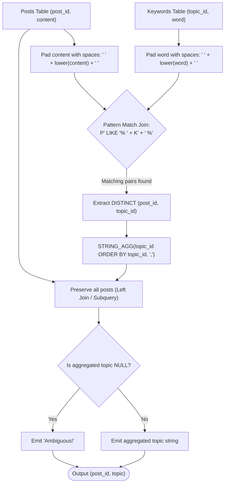

# Guided Example: Finding the Topic of Each Post

We analyze and trace the relational word-boundary matching and aggregation algorithm for categorizing textual posts into sorted, deduplicated topic identifier lists, establishing $O(|P| \cdot |K| \cdot L)$ relational evaluation complexity and handling unmatched records via fallback null-coalescing.

- **Input:** Relational tables `Keywords` and `Posts`
- **Output:** Categorized projection mapping each `post_id` to its sorted topic string or `'Ambiguous!'`

This representative instance highlights space-padded whole-word boundary matching, case-insensitive normalization, multi-keyword topic deduplication, ordered group concatenation, and fallback labeling.

---

## 1. Problem Overview & Representative Instance

We are given two database tables:
1. `Keywords(topic_id, word)`: Associates a topic identifier with a specific keyword string. A topic may have multiple keywords, and a keyword may map to multiple topics.
2. `Posts(post_id, content)`: Contains individual post identifiers and text bodies comprising English letters and spaces.

A post is classified under a topic if at least one keyword associated with that topic appears as an **exact complete word** within the post's content, compared case-insensitively. A partial substring match (such as keyword `"war"` occurring inside the word `"warning"`) is explicitly invalid.

For each post in `Posts`, we must produce:
- A sorted, comma-separated list of all distinct matching `topic_id`s in ascending order (e.g. `"1,3"`).
- If a post matches no keywords, its topic label must be the literal string `"Ambiguous!"`.

### Representative Instance Breakdown

Consider the keyword table:

| `topic_id` | `word` |
|---|---|
| $1$ | `"handball"` |
| $1$ | `"football"` |
| $2$ | `"Vaccine"` |
| $3$ | `"WAR"` |

And the posts table:

| `post_id` | `content` |
|---|---|
| $1$ | `"We love football and handball"` |
| $2$ | `"He issued a warning"` |
| $3$ | `"War has broken out"` |
| $4$ | `"Vaccine distribution during war time"` |

Evaluation:
- **Post 1:** Contains words `"football"` (topic $1$) and `"handball"` (topic $1$). Both belong to topic $1$. Deduplicated topic set: $\{1\}$. Result: `"1"`.
- **Post 2:** Content contains the word `"warning"`. Although `"war"` is a prefix of `"warning"`, `"war"` does not appear as an isolated complete word. No keywords match. Result: `"Ambiguous!"`.
- **Post 3:** Content contains word `"War"`, matching keyword `"WAR"` case-insensitively. Topic set: $\{3\}$. Result: `"3"`.
- **Post 4:** Contains word `"Vaccine"` (topic $2$) and word `"war"` (topic $3$). Topic set: $\{2, 3\}$. Ascending order: `"2,3"`.

---

## 2. Mathematical & Algorithmic Principles

### Whole-Word Boundary Framing via Space Padding

In relational queries without regular expression engine dependencies, checking whether a word $w$ occurs as an isolated word in text $T$ requires verifying that $w$ is flanked by word delimiters (spaces or string boundaries).
Padding both the text $T$ and the keyword $w$ with single leading and trailing spaces:
$$T' = \text{" "} + \text{lower}(T) + \text{" "}, \quad w' = \text{" "} + \text{lower}(w) + \text{" "}$$
guarantees that $w$ matches if and only if $w'$ appears as a contiguous substring of $T'$:
$$T' \text{ matches pattern } \text{"\%"} + w' + \text{"\%"}$$

This padding technique eliminates all boundary edge cases:
- If $w$ is the very first word in $T$, it is preceded by the prepended space in $T'$.
- If $w$ is the very last word in $T$, it is succeeded by the appended space in $T'$.
- Substrings like `"war"` inside `"warning"` fail because `" war "` does not match inside `" warning "`.

### Relational Join, Grouping, and Fallback Coalescence

1. **Equi/Pattern Join:** Join `Posts` with `Keywords` on the space-padded pattern predicate.
2. **Topic Deduplication:** For each post, multiple keywords might map to the same `topic_id` (e.g. both `"football"` and `"handball"` map to topic $1$). A `DISTINCT` clause extracts unique `(post_id, topic_id)` pairs.
3. **Ordered String Aggregation:** Group matching pairs by `post_id` and concatenate `topic_id`s in ascending order, delimited by commas.
4. **Preserving Unmatched Posts:** Posts with zero matching keywords are preserved via a left outer join or correlated subquery, with missing values replaced by `'Ambiguous!'` via null-coalescing.

---

## 3. Step-by-Step Walkthrough with Intermediate State

We trace the relational transformations on our representative dataset.

### Step 1: Content Normalization and Space Padding

| `post_id` | Normalized Padded Content $T'$ |
|---|---|
| $1$ | `" we love football and handball "` |
| $2$ | `" he issued a warning "` |
| $3$ | `" war has broken out "` |
| $4$ | `" vaccine distribution during war time "` |

Normalized padded keywords:
- Keyword 1: `" handball "` (topic $1$)
- Keyword 2: `" football "` (topic $1$)
- Keyword 3: `" vaccine "` (topic $2$)
- Keyword 4: `" war "` (topic $3$)

---

### Step 2: Cross Pattern Evaluation (Join Filtering)

#### Post 1:
- Contains `" football "` $\implies$ matches topic $1$.
- Contains `" handball "` $\implies$ matches topic $1$.
- Matched topic pairs: `(1, 1), (1, 1)`.

#### Post 2:
- Does not contain `" handball "`.
- Does not contain `" football "`.
- Does not contain `" vaccine "`.
- Substring `" war "` is tested against `" he issued a warning "`:
  The word is `"warning"`, so surrounding spaces are absent. Test fails!
- Matched topic pairs: none ($\emptyset$).

#### Post 3:
- Contains `" war "` at prefix position `" war has broken out "`.
- Matched topic pairs: `(3, 3)`.

#### Post 4:
- Contains `" vaccine "` and `" war "`.
- Matched topic pairs: `(4, 2), (4, 3)`.

---

### Step 3: Deduplication and Ordered String Aggregation

- Post 1: Unique topics $\{1\} \implies$ aggregated string `"1"`.
- Post 2: No topics $\implies$ aggregated string `NULL`.
- Post 3: Unique topics $\{3\} \implies$ aggregated string `"3"`.
- Post 4: Unique topics $\{2, 3\} \implies$ sorted ascending order `"2,3"`.

---

### Step 4: Fallback Coalescing

Applying fallback mapping `COALESCE(aggregated_topics, 'Ambiguous!')`:
- Post 1: `"1"`
- Post 2: `NULL` replaced by `"Ambiguous!"`
- Post 3: `"3"`
- Post 4: `"2,3"`

---

## 4. Comprehensive State Trace

The table below summarizes the join matching, deduplicated topic sets, and final projection for all posts.

| `post_id` | Matched Keyword Tokens | Raw Matched Topic IDs | Deduplicated Set | Aggregated Topic String | Final Coalesced Topic |
|---|---|---|---|---|---|
| $1$ | `"football"`, `"handball"` | $1, 1$ | $\{1\}$ | `"1"` | `"1"` |
| $2$ | None | $\emptyset$ | $\emptyset$ | `NULL` | `"Ambiguous!"` |
| $3$ | `"war"` | $3$ | $\{3\}$ | `"3"` | `"3"` |
| $4$ | `"vaccine"`, `"war"` | $2, 3$ | $\{2, 3\}$ | `"2,3"` | `"2,3"` |

### Word Boundary Verification Matrix

| Post Content Snippet | Candidate Keyword | Padded Search Target | Padded Substring Found? | Match Classification |
|---|---|---|---|---|
| `"football and"` | `"football"` | `" football "` | Yes | Valid Whole Word |
| `"a warning"` | `"war"` | `" war "` | No (enclosed in `"warning"`) | Rejected Partial Match |
| `"War has"` | `"war"` | `" war "` | Yes (case-insensitive) | Valid Whole Word |
| `"during war time"` | `"war"` | `" war "` | Yes | Valid Whole Word |

---

## 5. Algorithmic Correctness & Soundness

### Word-Boundary Soundness
Let $w$ be a sequence of alphanumeric characters without whitespace. In any string where tokens are separated by spaces, $w$ occurs as an autonomous token if and only if its occurrence is immediately preceded by either string start or space, and immediately followed by either string end or space.
Pre-pending and appending a space to both the haystack and the needle guarantees that every autonomous token is universally preceded and succeeded by a space. This eliminates false positive matches on prefixes, suffixes, and infixes.

### Deterministic Multi-Topic Ordering
The `ORDER BY m.topic_id` clause within the string aggregation function guarantees that for any post mapped to multiple topic IDs $\{t_1, t_2, \dots, t_r\}$, the resulting string lists IDs in strictly increasing numerical order ($t_1 < t_2 < \dots < t_r$), satisfying the uniqueness and formatting specification.

---

## 6. Edge Cases & Anti-Patterns

### Edge Cases
- **Duplicate Topic via Multiple Keywords:** A post mentioning multiple keywords belonging to the same topic (e.g. `"football"` and `"handball"`) must not duplicate the topic ID in the output (producing `"1"`, not `"1,1"`). The `DISTINCT` projection prevents duplicate insertion.
- **Multiple Spaces Between Words:** If the post text contains multiple consecutive spaces, the padding pattern still matches because the keyword is surrounded by single spaces, which match any adjacent space delimiter.
- **Keywords with Varying Letter Casing:** Applying `LOWER()` to both haystack and needle ensures case invariance (e.g. `"WAR"` matches `"war"`).

### Anti-Patterns to Avoid
- **Unpadded Substring Matching:** Using `content LIKE '%word%'` causes incorrect matches on words containing the keyword as a substring (e.g. matching `"war"` inside `"software"`, `"hardware"`, or `"warning"`).
- **Inner Join Loss:** Using an `INNER JOIN` without left outer join or correlated subquery drops posts that have no matching keywords, omitting them from the final table instead of labeling them `"Ambiguous!"`.

---

## 7. Complexity Analysis

### Time Complexity
- Let $P$ be the number of rows in `Posts` and $K$ be the number of rows in `Keywords`.
- Let $L$ be the maximum character length of a post's content.
- Evaluating the pattern match condition across the Cartesian candidate space takes $O(P \cdot K \cdot L)$ string comparison operations in the worst case.
- Grouping and sorting the matched topic IDs per post takes $O(T \log T)$ where $T \le K$ is the number of distinct topics matched.
- Total Relational Execution Complexity: $\mathcal{O}(P \cdot K \cdot L + P \log K)$.

### Space Complexity
- Intermediate storage for the matched pairs relation requires $O(P \cdot K)$ memory in the worst case.
- Auxiliary Space Complexity: $\mathcal{O}(P \cdot K)$ intermediate memory.
