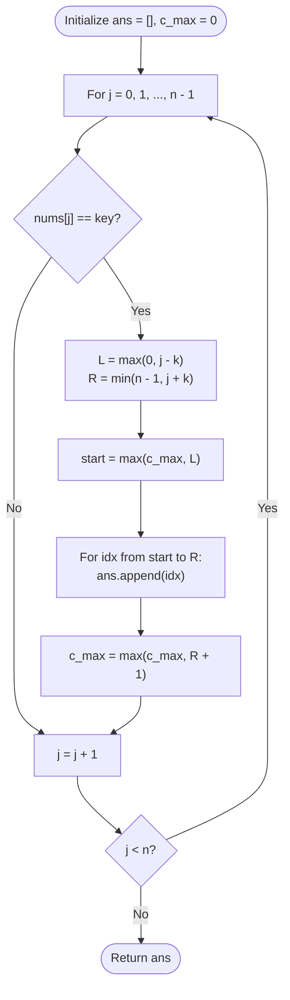

# Guided Example: Find All K-Distant Indices in an Array

We analyze and trace the interval union and frontier cursor algorithm for identifying all indices positioned within Chebyshev metric radius $k$ of designated key occurrences, establishing $O(n)$ time complexity and $O(1)$ auxiliary working space.

- **Input:** `nums = [3, 4, 9, 9, 3, 5]`, `key = 9`, `k = 1`
- **Output:** `[1, 2, 3, 4]`

This representative instance demonstrates metric neighborhood dilation around target keys, continuous interval overlap resolution, non-redundant cursor advancement, and sorted monotonic output collection.

---

## 1. Problem Overview & Representative Instance

We are given a 0-indexed integer array `nums` of length $n$, along with two integers `key` and $k$.
An index $i$ ($0 \le i < n$) is designated as a **k-distant index** if there exists at least one index $j$ such that:
$$|i - j| \le k \quad \text{and} \quad \text{nums}[j] = \text{key}$$

Our goal is to return a list of all k-distant indices sorted in strictly ascending order without duplicate entries.

### Representative Instance Breakdown

Consider:
$$\text{nums} = [3, 4, 9, 9, 3, 5], \quad \text{key} = 9, \quad k = 1$$

Array properties:
- Length $n = 6$.
- Key value $9$ appears at two positions: index $j_1 = 2$ and index $j_2 = 3$.

Evaluating the $k$-neighborhood for each key occurrence:
1. For $j_1 = 2$ with radius $k = 1$:
   $$[\max(0, 2 - 1), \min(5, 2 + 1)] = [1, 3]$$
   Covered indices: $\{1, 2, 3\}$.
2. For $j_2 = 3$ with radius $k = 1$:
   $$[\max(0, 3 - 1), \min(5, 3 + 1)] = [2, 4]$$
   Covered indices: $\{2, 3, 4\}$.

Taking the union of covered sets:
$$\{1, 2, 3\} \cup \{2, 3, 4\} = \{1, 2, 3, 4\}$$

Notice that indices $2$ and $3$ belong to both neighborhoods. Merging and deduplicating yields the strictly sorted list:
$$[1, 2, 3, 4]$$

---

## 2. Mathematical & Algorithmic Principles

### Neighborhoods as Discrete Closed Intervals

For each index $j$ where $\text{nums}[j] = \text{key}$, the condition $|i - j| \le k$ is algebraically equivalent to the bounded integer interval:
$$j - k \le i \le j + k$$

Clamping against the physical array boundary $[0, n - 1]$:
$$I_j = [\max(0, j - k), \min(n - 1, j + k)]$$

The complete set of valid indices is the union of all such intervals:
$$\mathcal{K} = \bigcup_{j \in \{0, \dots, n - 1\}, \, \text{nums}[j] = \text{key}} I_j$$

### Linear Interval Merging via Frontier Cursor

A naive check tests every index $i$ against all indices $j$, taking $O(n^2)$ time.
Instead, we process key positions $j$ in natural left-to-right order ($j = 0, 1, \dots, n - 1$):
- Maintain a frontier variable $c_{\text{max}}$ (initially $0$), which represents the smallest index that has **not yet** been appended to the output.
- When an index $j$ satisfies $\text{nums}[j] = \text{key}$:
  - Determine the interval $[L_j, R_j] = [\max(0, j - k), \min(n - 1, j + k)]$.
  - To prevent duplicates and redundant iterations, the starting point for adding new indices is:
    $$\text{start} = \max(c_{\text{max}}, L_j)$$
  - Append all integer indices $i \in [\text{start}, R_j]$ to the result.
  - Advance the frontier cursor to $c_{\text{max}} \leftarrow \max(c_{\text{max}}, R_j + 1)$.

Because $c_{\text{max}}$ only advances rightward, each index $i \in \{0, \dots, n - 1\}$ is inspected and emitted at most once, yielding strictly sorted output in $O(n)$ total time.

---

## 3. Step-by-Step Walkthrough with Intermediate State

We trace the execution on `nums = [3, 4, 9, 9, 3, 5]`, `key = 9`, `k = 1`.

### Initialization
- Array length: $n = 6$.
- Radius: $k = 1$.
- Frontier cursor: $c_{\text{max}} = 0$.
- Result list: `ans = []`.

---

### Step 1: Scan Indices $j = 0$ and $j = 1$
- At $j = 0$: $\text{nums}[0] = 3 \ne 9$. Skip.
- At $j = 1$: $\text{nums}[1] = 4 \ne 9$. Skip.
- State: $c_{\text{max}} = 0$, `ans = []`.

---

### Step 2: Key Match at $j = 2$
- Element $\text{nums}[2] = 9 = \text{key}$.
- Compute window bounds:
  $$L_2 = \max(0, 2 - 1) = 1$$
  $$R_2 = \min(5, 2 + 1) = 3$$
- Determine non-overlapping start:
  $$\text{start} = \max(c_{\text{max}}, L_2) = \max(0, 1) = 1$$
- Emit indices from $1$ through $3$:
  - Append $1 \implies \text{ans} = [1]$
  - Append $2 \implies \text{ans} = [1, 2]$
  - Append $3 \implies \text{ans} = [1, 2, 3]$
- Advance frontier cursor:
  $$c_{\text{max}} \leftarrow \max(0, 3 + 1) = 4$$

---

### Step 3: Key Match at $j = 3$
- Element $\text{nums}[3] = 9 = \text{key}$.
- Compute window bounds:
  $$L_3 = \max(0, 3 - 1) = 2$$
  $$R_3 = \min(5, 3 + 1) = 4$$
- Determine non-overlapping start:
  $$\text{start} = \max(c_{\text{max}}, L_3) = \max(4, 2) = 4$$
  *(Notice that indices $2$ and $3$ are suppressed because $c_{\text{max}} = 4$)*
- Emit indices from $4$ through $4$:
  - Append $4 \implies \text{ans} = [1, 2, 3, 4]$
- Advance frontier cursor:
  $$c_{\text{max}} \leftarrow \max(4, 4 + 1) = 5$$

---

### Step 4: Scan Indices $j = 4$ and $j = 5$
- At $j = 4$: $\text{nums}[4] = 3 \ne 9$. Skip.
- At $j = 5$: $\text{nums}[5] = 5 \ne 9$. Skip.
- Array traversal finishes.

---

### Step 5: Final Result
- Emitted list: `[1, 2, 3, 4]`.

---

## 4. Comprehensive State Trace

The table below summarizes the window calculations, overlap suppression, and cumulative results across all index iterations.

| Index $j$ | Element $\text{nums}[j]$ | Is Key? | Theoretical Window $[L_j, R_j]$ | Prior Cursor $c_{\text{max}}$ | Effective Range $[\text{start}, R_j]$ | Newly Emitted Indices | Updated `ans` | Updated Cursor $c_{\text{max}}$ |
|---|---|---|---|---|---|---|---|---|
| $0$ | $3$ | No | — | $0$ | — | None | `[]` | $0$ |
| $1$ | $4$ | No | — | $0$ | — | None | `[]` | $0$ |
| $2$ | $9$ | **Yes** | $[1, 3]$ | $0$ | $[1, 3]$ | $1, 2, 3$ | `[1, 2, 3]` | $4$ |
| $3$ | $9$ | **Yes** | $[2, 4]$ | $4$ | $[4, 4]$ | $4$ | `[1, 2, 3, 4]` | $5$ |
| $4$ | $3$ | No | — | $5$ | — | None | `[1, 2, 3, 4]` | $5$ |
| $5$ | $5$ | No | — | $5$ | — | None | `[1, 2, 3, 4]` | $5$ |

### Index Proximity Verification Table

| Candidate Index $i$ | Closest Key Position $j$ | Distance $|i - j|$ | Radius Constraint $\le 1$? | In Final Output? |
|---|---|---|---|---|
| $0$ | $j = 2$ | $|0 - 2| = 2$ | No ($2 > 1$) | Excluded |
| $1$ | $j = 2$ | $|1 - 2| = 1$ | Yes ($1 \le 1$) | Included |
| $2$ | $j = 2$ | $|2 - 2| = 0$ | Yes ($0 \le 1$) | Included |
| $3$ | $j = 3$ | $|3 - 3| = 0$ | Yes ($0 \le 1$) | Included |
| $4$ | $j = 3$ | $|4 - 3| = 1$ | Yes ($1 \le 1$) | Included |
| $5$ | $j = 3$ | $|5 - 3| = 2$ | No ($2 > 1$) | Excluded |

---

## 5. Algorithmic Correctness & Soundness

### Completeness
Let $i \in \{0, \dots, n - 1\}$ be an index satisfying $|i - j| \le k$ for some $j$ with $\text{nums}[j] = \text{key}$.
Then $i \in [L_j, R_j]$. When key occurrence $j$ is processed, all indices in $[L_j, R_j]$ that were not emitted during previous key occurrences (i.e. those $\ge c_{\text{max}}$) are appended to `ans`.
If $i < c_{\text{max}}$, it was already appended during an earlier key occurrence $j' < j$.
Hence, every valid $k$-distant index is present in `ans`.

### Uniqueness and Strict Ascending Order
The frontier variable $c_{\text{max}}$ strictly increases: at each step, new indices are drawn exclusively from $\text{start} \ge c_{\text{max}}$.
Because each appended index is strictly greater than the previous tail of `ans`, duplicate indices can never be inserted, and the elements of `ans` are guaranteed to be in strictly ascending order without requiring a separate sorting pass.

---

## 6. Edge Cases & Anti-Patterns

### Edge Cases
- **No Key Present:** If `key` does not occur in `nums`, no window is triggered, returning `[]`.
- **Large Radius ($k \ge n$):** A single key occurrence expands to $[0, n - 1]$, outputting all indices $[0, 1, \dots, n - 1]$.
- **All Elements Equal to Key:** Consecutive key matches trigger adjacent windows with full overlap. The cursor ensures that each index is output exactly once without redundant additions.
- **Key at Index $0$ or $n - 1$:** Boundary clamping $\max(0, \dots)$ and $\min(n - 1, \dots)$ prevents out-of-bounds indexing.

### Anti-Patterns to Avoid
- **Quadratic Nested Scanning:** Checking `any(abs(i - j) <= k and nums[j] == key for j in range(n))` performs $O(n^2)$ iterations. While acceptable for $n \le 1000$, linear interval sweeping is vastly superior and optimal.
- **Unchecked Appending Followed by Set Deduplication:** Appending all window indices without cursor filtering and calling `list(set(ans))` incurs unnecessary memory allocations and requires an extra $O(n \log n)$ sorting pass.

---

## 7. Complexity Analysis

### Time Complexity
- The outer loop scans through $n$ elements, performing $O(1)$ equality tests per element.
- When a key is encountered, the inner loop iterates from $\text{start} = \max(c_{\text{max}}, L_j)$ to $R_j$.
- Because $c_{\text{max}}$ strictly advances to $R_j + 1$, each index $i \in \{0, \dots, n - 1\}$ is emitted at most once.
- Across the entire scan, the total number of inner loop steps cannot exceed $n$.
- Total Time Complexity: $\mathcal{O}(n)$, which runs in less than $1$ millisecond.

### Space Complexity
- The algorithm uses a constant number of scalar variables ($n, k, c_{\text{max}}, L_j, R_j, \text{start}$).
- The output array holds at most $n$ integers.
- Auxiliary Space Complexity: $\mathcal{O}(1)$ (excluding output storage).
