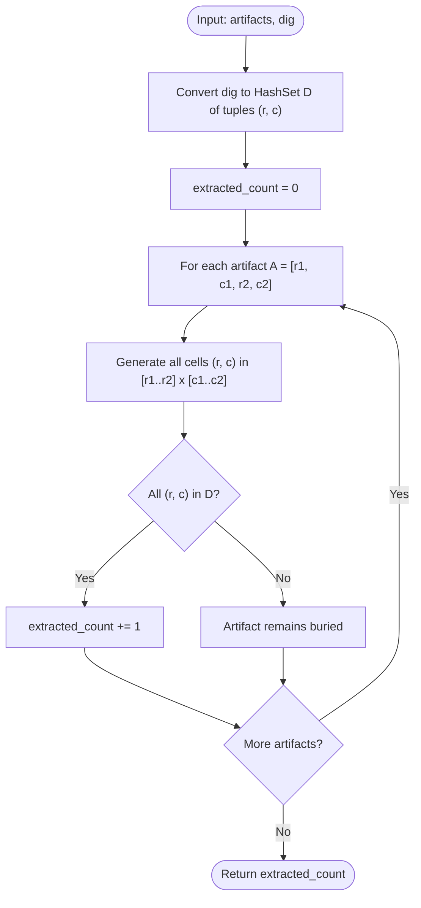

# Guided Example: Count Artifacts That Can Be Extracted

We analyze and trace the hash-set coordinate containment algorithm for determining the extraction feasibility of discrete grid artifacts under excavation actions, establishing $O(|D| + |A|)$ time complexity and $O(|D|)$ auxiliary space where $|D|$ is the count of dug cells and $|A|$ is the number of artifacts.

- **Input:** `n = 2`, `artifacts = [[0, 0, 0, 0], [0, 1, 1, 1]]`, `dig = [[0, 0], [0, 1]]`
- **Output:** `1`

This representative instance demonstrates 2D coordinate hashing, subset inclusion testing against rectangular cells, partial excavation rejection, and linear aggregation.

---

## 1. Problem Overview & Representative Instance

We are given an $n \times n$ 2D grid containing rectangular buried artifacts:
- Each artifact is represented by a 4-tuple $[r_1, c_1, r_2, c_2]$, designating the top-left cell $(r_1, c_1)$ and bottom-right cell $(r_2, c_2)$.
- The cells covered by artifact $A$ form the closed coordinate product:
  $$\mathcal{C}(A) = \{(r, c) \mid r_1 \le r \le r_2 \land c_1 \le c \le c_2\}$$
- Each artifact covers at most $4$ cells ($1 \le |\mathcal{C}(A)| \le 4$), and no two artifacts share any grid cells.

We are also given an excavation log `dig`, where each entry $[r, c]$ marks a grid coordinate that has been excavated.
An artifact is successfully extracted if and only if **all** of its constituent cells have been excavated:
$$\text{Extractable}(A) \iff \mathcal{C}(A) \subseteq \mathcal{D}$$
where $\mathcal{D}$ denotes the set of all excavated coordinates.

Our objective is to count the total number of extractable artifacts.

### Representative Instance Breakdown

Consider grid dimension $n = 2$:
$$\text{artifacts} = [A_1 = [0, 0, 0, 0], \, A_2 = [0, 1, 1, 1]], \quad \text{dig} = [[0, 0], [0, 1]]$$

Artifact geometries:
- Artifact $A_1$: $[0, 0, 0, 0]$ occupies $1$ cell:
  $$\mathcal{C}(A_1) = \{(0, 0)\}$$
- Artifact $A_2$: $[0, 1, 1, 1]$ occupies $2$ cells:
  $$\mathcal{C}(A_2) = \{(0, 1), (1, 1)\}$$

Excavation set:
$$\mathcal{D} = \{(0, 0), (0, 1)\}$$

Feasibility evaluation:
1. For $A_1$: Cell $(0, 0) \in \mathcal{D}$. All cells are excavated $\implies A_1$ is extractable.
2. For $A_2$: Cell $(0, 1) \in \mathcal{D}$, but cell $(1, 1) \notin \mathcal{D}$. Since $(1, 1)$ remains buried, $A_2$ cannot be extracted.

Total extractable artifacts: $1$.

---

## 2. Mathematical & Algorithmic Principles

### Set Containment as a Conjunction of Point Lookups

Because an artifact $A$ can only be extracted when every single cell it occupies is excavated:
$$\text{Extractable}(A) = \bigwedge_{(r, c) \in \mathcal{C}(A)} \mathbf{1}_{((r, c) \in \mathcal{D})}$$

Testing membership in an unindexed list of dug cells requires $O(|D|)$ per cell, yielding an inefficient $O(|A| \cdot |D|)$ total time.
By converting `dig` into a hash set $\mathcal{D}$:
$$\mathcal{D} = \{(r, c) \mid [r, c] \in \text{dig}\}$$
each point query $(r, c) \in \mathcal{D}$ executes in $O(1)$ expected time.

### Bounded Cell Cardinality

The problem constraints enforce that each artifact spans at most $4$ cells:
$$|\mathcal{C}(A)| = (r_2 - r_1 + 1) \cdot (c_2 - c_1 + 1) \le 4$$
Possible dimensions are $1 \times 1$, $1 \times 2$, $2 \times 1$, $1 \times 3$, $3 \times 1$, $1 \times 4$, $4 \times 1$, or $2 \times 2$.
Consequently, verifying the containment condition $\mathcal{C}(A) \subseteq \mathcal{D}$ requires at most $4$ hash table queries, making each artifact evaluation strictly $O(1)$ in time.

---

## 3. Step-by-Step Walkthrough with Intermediate State

We trace the representative instance on $n = 2$, `artifacts = [[0, 0, 0, 0], [0, 1, 1, 1]]`, `dig = [[0, 0], [0, 1]]`.

### Step 1: Construct Excavation Hash Set
- Process `dig` entries:
  - Insert $(0, 0)$ into $\mathcal{D}$.
  - Insert $(0, 1)$ into $\mathcal{D}$.
- Excavation set: $\mathcal{D} = \{(0, 0), (0, 1)\}$.
- Initial count: $\text{ans} = 0$.

---

### Step 2: Evaluate Artifact $A_1 = [0, 0, 0, 0]$
- Bounding box: rows $0 \dots 0$, columns $0 \dots 0$.
- Constituent cells:
  - $(0, 0)$
- Membership verification:
  - Is $(0, 0) \in \mathcal{D}$? Yes.
- All cells in $\mathcal{C}(A_1)$ are excavated.
- Increment counter: $\text{ans} \leftarrow 0 + 1 = 1$.

---

### Step 3: Evaluate Artifact $A_2 = [0, 1, 1, 1]$
- Bounding box: rows $0 \dots 1$, columns $1 \dots 1$.
- Constituent cells:
  - $(0, 1)$
  - $(1, 1)$
- Membership verification:
  - Is $(0, 1) \in \mathcal{D}$? Yes.
  - Is $(1, 1) \in \mathcal{D}$? No ($(1, 1) \notin \mathcal{D}$).
- Short-circuit: not all cells are present in $\mathcal{D}$.
- Counter unchanged: $\text{ans} = 1$.

---

### Step 4: Finalization
- All artifacts processed.
- Final extracted count: $1$.

---

## 4. Comprehensive State Trace

The table below summarizes the coordinates, constituent cells, membership queries, and excavation status for all artifacts.

| Artifact ID | Coordinates $[r_1, c_1, r_2, c_2]$ | Constituent Cell Set $\mathcal{C}(A)$ | Size $\lvert \mathcal{C}(A) \rvert$ | Cells Excavated in $\mathcal{D}$ | Cells Missing | Fully Excavated? | Running Count |
|---|---|---|---|---|---|---|---|
| $A_1$ | $[0, 0, 0, 0]$ | $\{(0, 0)\}$ | $1$ | $(0, 0)$ | None | **Yes** | $1$ |
| $A_2$ | $[0, 1, 1, 1]$ | $\{(0, 1), (1, 1)\}$ | $2$ | $(0, 1)$ | $(1, 1)$ | **No** | $1$ |

### Grid Spatial Excavation State

| Row \ Col | Column 0 | Column 1 |
|---|---|---|
| **Row 0** | $(0, 0)$ [Dug: Yes, Belongs to $A_1$] | $(0, 1)$ [Dug: Yes, Belongs to $A_2$] |
| **Row 1** | $(1, 0)$ [Dug: No, Empty] | $(1, 1)$ [Dug: No, Belongs to $A_2$] |

---

## 5. Algorithmic Correctness & Soundness

### Soundness
An artifact is declared extractable if and only if the predicate $\forall (r, c) \in \mathcal{C}(A), \, (r, c) \in \mathcal{D}$ evaluates to true.
Since the Cartesian product $[r_1 \dots r_2] \times [c_1 \dots c_2]$ generates every discrete integer grid point covered by the rectangle, testing each coordinate against the exact set of dug points guarantees that no partially buried artifact can be marked as extracted.

### Completeness
Because all excavated coordinates are inserted into hash set $\mathcal{D}$ prior to checking, any artifact whose entire footprint was excavated will evaluate to true across all coordinate queries, ensuring no fully excavated artifact is omitted.

---

## 6. Edge Cases & Anti-Patterns

### Edge Cases
- **No Cells Dug (`dig = []`):** The hash set $\mathcal{D}$ is empty. All membership checks return false, correctly yielding $0$.
- **Artifacts with $1 \times 1$ Size:** Trivially requires only $1$ lookup.
- **Dug Cells Outside Any Artifact:** Excavations on empty grid cells simply enter $\mathcal{D}$ without affecting the artifact checks.
- **Redundant Dig Entries:** Duplicate coordinates in `dig` are naturally unified by hash set semantics.

### Anti-Patterns to Avoid
- **2D Dense Boolean Grid Allocation:** Initializing an $n \times n$ matrix when $n = 1000$ requires $10^6$ booleans. While memory feasible, building a coordinate set of dug cells is faster and scales independently of grid size $n$.
- **Searching `dig` Linearly:** Checking if $(r, c) \in \text{dig}$ using an array search costs $O(|D|)$ per cell. For $|A| = 10^5$ and $|D| = 10^5$, this results in $10^{10}$ operations and severe timeout.

---

## 7. Complexity Analysis

### Time Complexity
- **Hash Set Construction:** Inserting $|D|$ coordinates into $\mathcal{D}$ takes $O(|D|)$ expected time.
- **Artifact Verification:** For each of the $|A|$ artifacts, we iterate over $(r_2 - r_1 + 1)(c_2 - c_1 + 1) \le 4$ cells. Each hash set lookup takes $O(1)$ expected time.
- Total check time: $\sum_{A} |\mathcal{C}(A)| \le 4 |A| = O(|A|)$.
- **Total Time Complexity:** $\mathcal{O}(|D| + |A|)$, executing in under $0.05$ seconds for $|D|, |A| \le 10^5$.

### Space Complexity
- Storing the dug coordinate tuples in hash set $\mathcal{D}$ takes $O(|D|)$ space.
- Auxiliary Space Complexity: $\mathcal{O}(|D|)$.
