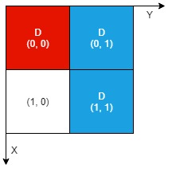

### 1. Description

There is an `n x n` **0-indexed** grid with some artifacts buried in it. You are given the integer `n` and a **0-indexed **2D integer array `artifacts` describing the positions of the rectangular artifacts where $\text{artifacts}[i] = [\text{r1}_{i}, \text{c1}_{i}, \text{r2}_{i}, \text{c2}_{i}]$ denotes that the $$i^{\text{th}}$$ artifact is buried in the subgrid where:

- $(\text{r1}_{i}, \text{c1}_{i})$ is the coordinate of the **top-left** cell of the $$i^{\text{th}}$$ artifact and

- $(\text{r2}_{i}, \text{c2}_{i})$ is the coordinate of the **bottom-right** cell of the $$i^{\text{th}}$$ artifact.

You will excavate some cells of the grid and remove all the mud from them. If the cell has a part of an artifact buried underneath, it will be uncovered. If all the parts of an artifact are uncovered, you can extract it.

Given a **0-indexed** 2D integer array `dig` where $\text{dig}[i] = [r_{i}, c_{i}]$ indicates that you will excavate the cell $(r_{i}, c_{i})$, return *the number of artifacts that you can extract*.

The test cases are generated such that:

- No two artifacts overlap.

- Each artifact only covers at most `4` cells.

- The entries of `dig` are unique.

### 2. Function Contract

- `n`: Input parameter.
- Returns expected result.

### 3. Examples

#### Example 1

- **Input:** $n = 2, artifacts = [[0,0,0,0],[0,1,1,1]], dig = [[0,0],[0,1]]$
- **Output:** `1`
- **Explanation:**
The different colors represent different artifacts. Excavated cells are labeled with a 'D' in the grid.
There is 1 artifact that can be extracted, namely the red artifact.
The blue artifact has one part in cell (1,1) which remains uncovered, so we cannot extract it.
Thus, we return 1.
#### Example 2

- **Input:** $n = 2, artifacts = [[0,0,0,0],[0,1,1,1]], dig = [[0,0],[0,1],[1,1]]$
- **Output:** `2`
- **Explanation:** Both the red and blue artifacts have all parts uncovered (labeled with a 'D') and can be extracted, so we return 2.

### 4. Constraints

- $1 \le n \le 1000$

- $1 \le \text{artifacts.length}, \text{dig.length} \le min(n^{2}, 10^{5})$

- $\text{artifacts}[i].length = 4$

- $\text{dig}[i].length = 2$

- $0 \le \text{r1}_{i}, \text{c1}_{i}, \text{r2}_{i}, \text{c2}_{i}, r_{i}, c_{i} \le n - 1$

- $\text{r1}_{i} \le \text{r2}_{i}$

- $\text{c1}_{i} \le \text{c2}_{i}$

- No two artifacts will overlap.

- The number of cells covered by an artifact is **at most** `4`.

- The entries of `dig` are unique.