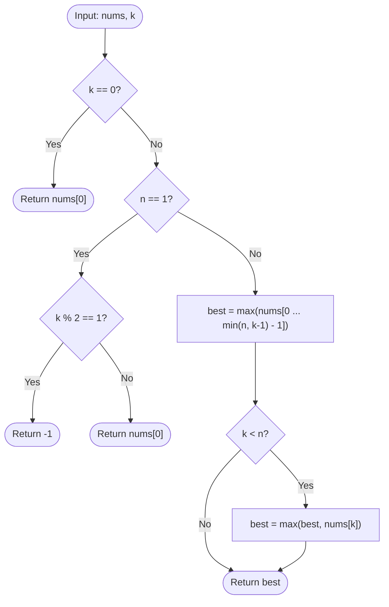

# Guided Example: Maximize the Topmost Element After K Moves

We analyze and trace the greedy prefix-extremum and reachability analysis algorithm for maximizing the exposed topmost element of a stack under exactly $k$ push-pop operations, establishing $O(\min(n, k))$ time complexity and $O(1)$ auxiliary space.

- **Input:** `nums = [5, 2, 2, 4, 0, 6]`, `k = 4`
- **Output:** `5`

This representative instance highlights the dichotomy between prefix-removal with push-back versus pure removals, the fundamental inaccessibility of index $k - 1$, and parity traps on singleton stacks.

---

## 1. Problem Overview & Representative Instance

We are given a 0-indexed integer array `nums` representing a pile of numbers, where `nums[0]` is the topmost element.
In a single move, we are permitted to execute exactly one of two operations:
1. **Pop:** Remove the topmost element from the pile (valid only when the pile is non-empty).
2. **Push:** Select any element that was removed during any prior move and add it back to the top of the pile.

We are given an integer $k$. We must determine the maximum possible value of the topmost element of the pile after performing **exactly** $k$ moves. If the pile is guaranteed to be empty after $k$ moves, we return $-1$.

### Representative Instance Breakdown

Consider:
$$\text{nums} = [5, 2, 2, 4, 0, 6], \quad k = 4$$

Here $n = 6$. We examine the candidate elements that can legitimately occupy the top of the pile after exactly $4$ operations:
- **Strategy 1 (Pop $k - 1 = 3$ elements, then push the best one back):**
  - Move 1: Pop $\text{nums}[0] = 5$. Pile top becomes $2$. Removed: $\{5\}$.
  - Move 2: Pop $\text{nums}[1] = 2$. Pile top becomes $2$. Removed: $\{5, 2\}$.
  - Move 3: Pop $\text{nums}[2] = 2$. Pile top becomes $4$. Removed: $\{5, 2, 2\}$.
  - Move 4: Push the maximum removed element ($5$) back onto the pile.
  - Resulting pile top: $5$.
- **Strategy 2 (Pop $k = 4$ elements continuously):**
  - Move 1: Pop $5$.
  - Move 2: Pop $2$.
  - Move 3: Pop $2$.
  - Move 4: Pop $4$.
  - The element that becomes the new topmost element is $\text{nums}[4] = 0$.
  - Resulting pile top: $0$.
- **Can $\text{nums}[3] = 4$ ever be on top after $4$ moves?**
  - Exposing $\text{nums}[3]$ requires exactly $3$ pops.
  - At move $4$, we must perform an action: either pop $\text{nums}[3]$ (leaving $0$ on top) or push an element over it (covering $4$).
  - Hence, $\text{nums}[k - 1]$ can **never** be on top after exactly $k$ moves!

Comparing feasible candidates: $\max(5, 0) = 5$. Output is $5$.

---

## 2. Mathematical & Algorithmic Principles

### Reachability and the Inaccessibility Theorem

Let $S_k$ denote the set of array indices whose elements can appear at the top of the pile after exactly $k$ operations.
1. **Prefix Candidates via Push-Back:**
   If we perform $k - 1$ pop operations, we remove elements at indices $\{0, 1, \dots, k - 2\}$.
   At move $k$, we can push any of these $k - 1$ removed elements back to the top.
   Candidate set: $\{\text{nums}[0], \dots, \text{nums}[k - 2]\}$.
2. **Successor Candidate via Pure Pop:**
   If we perform $k$ pop operations, we remove elements at indices $\{0, 1, \dots, k - 1\}$.
   Assuming $k < n$, the element that is uncovered at the top of the pile is $\text{nums}[k]$.
   Candidate: $\text{nums}[k]$.
3. **The Gap at Index $k - 1$:**
   Index $k - 1$ requires $k - 1$ pops to uncover.
   At the $k$-th move, we cannot leave it undisturbed; we must either pop it or cover it. Since it was never popped, it cannot be pushed back. Thus:
   $$\text{nums}[k - 1] \notin S_k$$

### Boundary and Parity Invariants

- **Zero Moves ($k = 0$):** Top element is trivially $\text{nums}[0]$.
- **Singleton Array ($n = 1$):**
  - When $k$ is odd, the only possible sequence of moves alternates between popping the single element and pushing it back. Any odd number of moves finishes with an empty pile, so the answer is $-1$.
  - When $k$ is even, the sequence pops and pushes alternately, ending with the element back on top: $\text{nums}[0]$.

---

## 3. Step-by-Step Walkthrough with Intermediate State

We trace the representative instance `nums = [5, 2, 2, 4, 0, 6]`, $k = 4$.

### Step 1: Guard Clauses
- $k = 4 \ne 0$.
- $n = 6 \ne 1$.
- Proceed to general stack analysis.

---

### Step 2: Evaluate Prefix Candidates ($\text{nums}[:k - 1]$)
- $k - 1 = 3$.
- Prefix slice: $\text{nums}[0 \dots 2] = [5, 2, 2]$.
- Candidates removed in first $3$ moves:
  - $\text{nums}[0] = 5$
  - $\text{nums}[1] = 2$
  - $\text{nums}[2] = 2$
- Maximum available among removed elements:
  $$\text{best} = \max([5, 2, 2]) = 5$$

---

### Step 3: Evaluate Natural Successor ($\text{nums}[k]$)
- $k = 4 < n = 6$.
- Uncovered element at index $4$:
  $$\text{nums}[4] = 0$$
- Incorporate into running maximum:
  $$\text{best} \leftarrow \max(\text{best}, \text{nums}[4]) = \max(5, 0) = 5$$

---

### Step 4: Final Selection
- Candidate pool: $\{5, 2, 0\}$.
- Maximum achievable top value: $5$.

---

## 4. Comprehensive State Trace

The table below details the feasibility and move sequence for each index candidate in `nums`.

| Array Index $i$ | Element Value | Move Sequence Required to Place on Top | Valid for $k = 4$? | Feasible Top Value |
|---|---|---|---|---|
| $0$ | $5$ | Pop $5$, pop $2$, pop $2$, push $5$ back | **Yes** | $5$ |
| $1$ | $2$ | Pop $5$, pop $2$, pop $2$, push $2$ back | **Yes** | $2$ |
| $2$ | $2$ | Pop $5$, pop $2$, pop $2$, push $2$ back | **Yes** | $2$ |
| $3$ | $4$ | Pop $5$, pop $2$, pop $2$ (uncovered at move 3; move 4 must pop or cover) | **No** (Inaccessible) | Excluded |
| $4$ | $0$ | Pop $5$, pop $2$, pop $2$, pop $4$ (uncovered at move 4) | **Yes** | $0$ |
| $5$ | $6$ | Requires $5$ pops, exceeding $k = 4$ budget | **No** | Excluded |

### Parity and Edge Case Verification Matrix

| Array Input | Move Count $k$ | Branch Taken | Reasoning | Result |
|---|---|---|---|---|
| `[10]` | $1$ | $n = 1, k \text{ odd}$ | Single pop leaves empty stack | $-1$ |
| `[10]` | $2$ | $n = 1, k \text{ even}$ | Pop then push returns element | $10$ |
| `[1, 2]` | $1$ | General $k = 1$ | $k - 1 = 0 \implies \text{nums}[1]$ uncovered | $2$ |
| `[1, 2, 3]` | $5$ | $k > n$ | All elements popped; push max ($3$) | $3$ |

---

## 5. Algorithmic Correctness & Soundness

### Soundness
Every value in the candidate set $\{\text{nums}[0], \dots, \text{nums}[k - 2]\} \cup \{\text{nums}[k]\}$ is demonstrably achievable via a concrete sequence of $k$ valid moves:
1. For any $i \le k - 2$, execute $k - 1$ pops (removing $\text{nums}[i]$ along the way) and on the $k$-th move push $\text{nums}[i]$ back.
2. For $i = k$, execute $k$ consecutive pops, exposing $\text{nums}[k]$ directly on top.

### Invariance of Suboptimal Moves
Any extra moves can be absorbed by repeatedly pushing and popping the same item if $k > n$, allowing any element in `nums` to be placed on top.
When $k < n$, no valid move sequence can leave $\text{nums}[k - 1]$ on top because uncovering it requires $k - 1$ moves, forcing the final move to either displace or cover it.
Thus, the candidate set is necessary and sufficient.

---

## 6. Edge Cases & Anti-Patterns

### Edge Cases
- **$k = 1$:** Prefix $\text{nums}[:0]$ is empty. If $n > 1$, the only choice is to pop once, uncovering $\text{nums}[1]$. If $n = 1$, pile becomes empty, returning $-1$.
- **$k > n$:** All $n$ elements can be popped and the maximum element in the entire array pushed back on top.
- **$k = n$:** The entire pile is popped, leaving no uncovered element ($\text{nums}[n]$ does not exist). The answer is strictly $\max(\text{nums}[:n - 1])$.

### Anti-Patterns to Avoid
- **Including $\text{nums}[k - 1]$:** Assuming that $k - 1$ pops exposes $\text{nums}[k - 1]$ and failing to account for the mandatory $k$-th operation.
- **Ignoring Parity on $n = 1$:** Missing the fact that a single-element pile cannot absorb moves without alternating between empty and size $1$.

---

## 7. Complexity Analysis

### Time Complexity
- Evaluating the prefix slice $\text{nums}[:k - 1]$ inspects at most $\min(n, k)$ elements.
- Finding the maximum of this slice requires $O(\min(n, k))$ comparisons.
- Checking $\text{nums}[k]$ takes $O(1)$ time.
- Total Time Complexity: $\mathcal{O}(\min(n, k))$, which is bounded by $O(n)$ and takes less than $1$ millisecond for $n \le 10^5$.

### Space Complexity
- Slicing or tracking the prefix maximum iteratively requires $O(1)$ auxiliary variables.
- Auxiliary Space Complexity: $\mathcal{O}(1)$.
