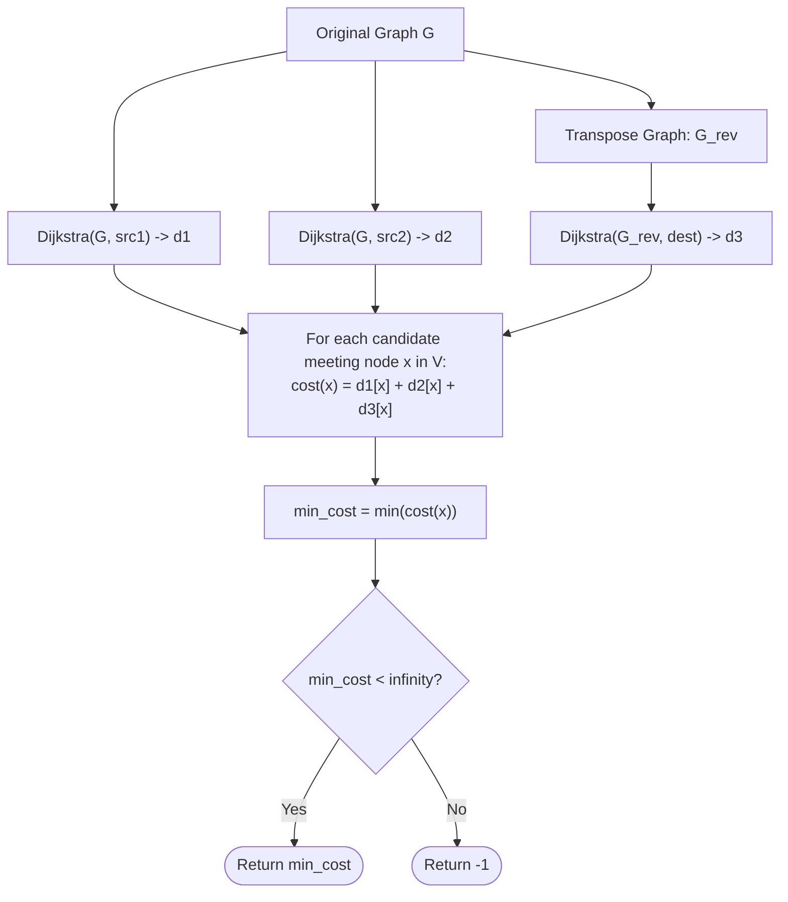

# Guided Example: Minimum Weighted Subgraph With the Required Paths

We analyze and trace the three-way Dijkstra convergence algorithm on primal and transposed directed graphs for finding the minimum total weight subgraph connecting two source vertices to a common destination, establishing $O((n + m) \log n)$ time complexity and $O(n + m)$ auxiliary space.

- **Input:** `n = 5`, `edges = [[0, 2, 3], [1, 2, 4], [2, 3, 2], [3, 4, 1], [0, 4, 15], [1, 4, 12]]`, `src1 = 0`, `src2 = 1`, `dest = 4`
- **Output:** `10`

This representative instance highlights intermediate convergence vertex discovery, graph transposition for backward shortest paths, avoidance of redundant edge re-weighting, and global three-distance minimization.

---

## 1. Problem Overview & Representative Instance

We are given a directed weighted graph with $n$ vertices labeled from $0$ to $n - 1$, described by an array of directed weighted edges where each triple $[u, v, w]$ indicates a directed edge from $u$ to $v$ with non-negative weight $w$.
We are also provided three distinct vertices: `src1`, `src2`, and `dest`.

Our goal is to find a subgraph of minimum total weight such that:
1. There exists a directed path from `src1` to `dest` within the subgraph.
2. There exists a directed path from `src2` to `dest` within the subgraph.

If no such subgraph exists, we return $-1$.

### Representative Instance Breakdown

Consider $n = 5$ vertices with:
$$\text{edges} = [[0, 2, 3], [1, 2, 4], [2, 3, 2], [3, 4, 1], [0, 4, 15], [1, 4, 12]]$$
$$\text{src1} = 0, \quad \text{src2} = 1, \quad \text{dest} = 4$$

Graph topology:
- Node $0$ reaches node $2$ with cost $3$, or directly reaches node $4$ with cost $15$.
- Node $1$ reaches node $2$ with cost $4$, or directly reaches node $4$ with cost $12$.
- Node $2$ connects to node $3$ with cost $2$.
- Node $3$ connects to destination node $4$ with cost $1$.

Analyzing possible subgraphs:
- **Disjoint Convergence at Destination ($x = 4$):**
  - Path from $0$: $0 \to 2 \to 3 \to 4$ (cost $3 + 2 + 1 = 6$).
  - Path from $1$: $1 \to 2 \to 3 \to 4$ (cost $4 + 2 + 1 = 7$).
  - If considered as separate paths, edges $(2, 3)$ and $(3, 4)$ are shared in the union.
  - Total weight of the union subgraph:
    $$\text{edges} = \{(0, 2), (1, 2), (2, 3), (3, 4)\} \implies 3 + 4 + 2 + 1 = 10$$
- Notice that in this optimal union subgraph, path $0 \rightsquigarrow 4$ and path $1 \rightsquigarrow 4$ merge at intermediate node $x = 2$, and traverse the remaining segment $2 \to 3 \to 4$ together.
- Total minimum subgraph weight: $10$.

---

## 2. Mathematical & Algorithmic Principles

### Subgraph Convergence Topology (Y-Shape Principle)

Any minimal-weight directed subgraph containing directed paths from $\text{src1} \to \text{dest}$ and $\text{src2} \to \text{dest}$ exhibits a tree-like convergence (often visualized as a "Y" structure):
- A simple directed path from $\text{src1}$ to some meeting vertex $x$.
- A simple directed path from $\text{src2}$ to the same meeting vertex $x$.
- A shared simple directed path from $x$ to $\text{dest}$.

If the two paths share no vertices other than $\text{dest}$, then $x = \text{dest}$.
Because edge weights are strictly non-negative, the total weight of this subgraph for a fixed meeting vertex $x \in V$ is:
$$\text{cost}(x) = \text{dist}_G(\text{src1}, x) + \text{dist}_G(\text{src2}, x) + \text{dist}_G(x, \text{dest})$$

The global minimum subgraph weight is obtained by minimizing over all possible candidate meeting vertices:
$$\text{OPT} = \min_{x \in V} \Big( \text{dist}_G(\text{src1}, x) + \text{dist}_G(\text{src2}, x) + \text{dist}_G(x, \text{dest}) \Big)$$

### Backward Shortest Paths via Graph Transposition

Evaluating $\text{dist}_G(x, \text{dest})$ for every vertex $x$ using individual Dijkstra runs would require $|V|$ search executions ($O(|V|(|V| + |E|) \log |V|)$), which times out.
Instead, we construct the **transposed (reversed) graph** $G^{\text{rev}} = (V, E^{\text{rev}})$:
$$(v, u, w) \in E^{\text{rev}} \iff (u, v, w) \in E$$

By duality of directed shortest paths:
$$\text{dist}_G(x, \text{dest}) = \text{dist}_{G^{\text{rev}}}(\text{dest}, x)$$
Thus, running a single Dijkstra traversal starting at $\text{dest}$ on $G^{\text{rev}}$ computes $\text{dist}_G(x, \text{dest})$ for all $x \in V$ simultaneously!

---

## 3. Step-by-Step Walkthrough with Intermediate State

We trace the algorithm execution on our representative instance.

### Step 1: Forward Dijkstra from $\text{src1} = 0$ on $G$
- Initial distances: $d_1 = [0, \infty, \infty, \infty, \infty]$.
- Process node $0$ (dist $0$):
  - Neighbor $2$: weight $3 \implies d_1[2] = 3$.
  - Neighbor $4$: weight $15 \implies d_1[4] = 15$.
- Process node $2$ (dist $3$):
  - Neighbor $3$: weight $2 \implies d_1[3] = 3 + 2 = 5$.
- Process node $3$ (dist $5$):
  - Neighbor $4$: weight $1 \implies d_1[4] = \min(15, 5 + 1) = 6$.
- Final distance vector from $\text{src1}$:
  $$d_1 = [0, \infty, 3, 5, 6]$$

---

### Step 2: Forward Dijkstra from $\text{src2} = 1$ on $G$
- Initial distances: $d_2 = [\infty, 0, \infty, \infty, \infty]$.
- Process node $1$ (dist $0$):
  - Neighbor $2$: weight $4 \implies d_2[2] = 4$.
  - Neighbor $4$: weight $12 \implies d_2[4] = 12$.
- Process node $2$ (dist $4$):
  - Neighbor $3$: weight $2 \implies d_2[3] = 4 + 2 = 6$.
- Process node $3$ (dist $6$):
  - Neighbor $4$: weight $1 \implies d_2[4] = \min(12, 6 + 1) = 7$.
- Final distance vector from $\text{src2}$:
  $$d_2 = [\infty, 0, 4, 6, 7]$$

---

### Step 3: Backward Dijkstra from $\text{dest} = 4$ on $G^{\text{rev}}$
- Transposed edges entering $4$: from $3$ (wt $1$), from $0$ (wt $15$), from $1$ (wt $12$).
- Initial distances: $d_3 = [\infty, \infty, \infty, \infty, 0]$.
- Process node $4$ (dist $0$):
  - Predecessor $3$: weight $1 \implies d_3[3] = 1$.
  - Predecessor $0$: weight $15 \implies d_3[0] = 15$.
  - Predecessor $1$: weight $12 \implies d_3[1] = 12$.
- Process node $3$ (dist $1$):
  - Predecessor $2$: weight $2 \implies d_3[2] = 1 + 2 = 3$.
- Process node $2$ (dist $3$):
  - Predecessor $0$: weight $3 \implies d_3[0] = \min(15, 3 + 3) = 6$.
  - Predecessor $1$: weight $4 \implies d_3[1] = \min(12, 3 + 4) = 7$.
- Final distance vector to $\text{dest}$:
  $$d_3 = [6, 7, 3, 1, 0]$$

---

### Step 4: Evaluate Candidate Meeting Vertices $x \in \{0, 1, 2, 3, 4\}$
For each $x$, compute $\text{cost}(x) = d_1[x] + d_2[x] + d_3[x]$:
- $x = 0$: $d_1[0] + d_2[0] + d_3[0] = 0 + \infty + 6 = \infty$.
- $x = 1$: $d_1[1] + d_2[1] + d_3[1] = \infty + 0 + 7 = \infty$.
- $x = 2$: $d_1[2] + d_2[2] + d_3[2] = 3 + 4 + 3 = 10$.
- $x = 3$: $d_1[3] + d_2[3] + d_3[3] = 5 + 6 + 1 = 12$.
- $x = 4$: $d_1[4] + d_2[4] + d_3[4] = 6 + 7 + 0 = 13$.

Minimum cost: $\min(\infty, \infty, 10, 12, 13) = 10$, attained at meeting vertex $x = 2$.

---

## 4. Comprehensive State Trace

The table below summarizes the three shortest distance vectors and the total cost for every candidate meeting node in the graph.

| Meeting Vertex $x$ | $d_1[x] = \text{dist}(0 \rightsquigarrow x)$ | $d_2[x] = \text{dist}(1 \rightsquigarrow x)$ | $d_3[x] = \text{dist}(x \rightsquigarrow 4)$ | Total Subgraph Cost | Feasible? |
|---|---|---|---|---|---|
| $0$ | $0$ | $\infty$ | $6$ | $\infty$ | No ($1$ cannot reach $0$) |
| $1$ | $\infty$ | $0$ | $7$ | $\infty$ | No ($0$ cannot reach $1$) |
| $2$ | $3$ | $4$ | $3$ | **$10$** | **Optimal** ($x = 2$) |
| $3$ | $5$ | $6$ | $1$ | $12$ | Suboptimal |
| $4$ | $6$ | $7$ | $0$ | $13$ | Suboptimal |

### Distance Heap Transition Log for $G^{\text{rev}}$

| Iteration | Extracted Vertex | Key Distance | Relaxed Edge $(u \leftarrow v)$ | New Tentative Distance | Heap Contents |
|---|---|---|---|---|---|
| Start | — | — | — | — | `[(0, 4)]` |
| $1$ | $4$ | $0$ | $4 \leftarrow 3$ (wt 1) | $d_3[3] = 1$ | `[(1, 3), (12, 1), (15, 0)]` |
| $2$ | $3$ | $1$ | $3 \leftarrow 2$ (wt 2) | $d_3[2] = 3$ | `[(3, 2), (12, 1), (15, 0)]` |
| $3$ | $2$ | $3$ | $2 \leftarrow 0$ (wt 3) | $d_3[0] = 6$ | `[(6, 0), (7, 1), (12, 1), (15, 0)]` |
| $4$ | $0$ | $6$ | None | — | `[(7, 1), ...]` |
| $5$ | $1$ | $7$ | None | — | Empty |

---

## 5. Algorithmic Correctness & Soundness

### Soundness of the Meeting Node Characterization
Let $H \subseteq G$ be any minimal-weight valid subgraph. Because edge weights are non-negative, $H$ is a directed acyclic graph consisting of the union of two directed paths $P_1: \text{src1} \rightsquigarrow \text{dest}$ and $P_2: \text{src2} \rightsquigarrow \text{dest}$.
Let $x$ be the first vertex where $P_1$ and $P_2$ intersect.
- The subpaths $\text{src1} \rightsquigarrow x$ and $\text{src2} \rightsquigarrow x$ can be chosen to be edge-disjoint and minimal in weight.
- The subpath $x \rightsquigarrow \text{dest}$ is shared by both paths, contributing its weight exactly once to $H$.
- Thus, the weight of $H$ is precisely the sum of the shortest paths $\text{dist}_G(\text{src1}, x) + \text{dist}_G(\text{src2}, x) + \text{dist}_G(x, \text{dest})$.
- Iterating over all $x \in V$ guarantees that the optimal meeting vertex is evaluated.

### Unreachable Component Handling
If for a candidate vertex $x$, any of $d_1[x]$, $d_2[x]$, or $d_3[x]$ is $\infty$, node $x$ cannot serve as a valid meeting point. If all vertices yield $\infty$, no valid subgraph exists, and returning $-1$ is correct.

---

## 6. Edge Cases & Anti-Patterns

### Edge Cases
- **Sources Already at Destination (`src1 == dest` or `src2 == dest`):** Handled naturally because $\text{dist}(\text{dest}, \text{dest}) = 0$.
- **Disjoint Paths:** When paths never merge until $\text{dest}$, the minimum occurs at $x = \text{dest}$ with $d_3[\text{dest}] = 0$.
- **One Source is an Ancestor of Another:** If `src1` lies on the shortest path from `src2` to `dest`, $x = \text{src1}$ can be chosen.
- **Completely Disconnected Graph:** If no paths connect `src1` or `src2` to `dest`, all sum combinations exceed $\infty$, returning $-1$.

### Anti-Patterns to Avoid
- **Summing Independent Shortest Paths:** Computing $\text{dist}(\text{src1}, \text{dest}) + \text{dist}(\text{src2}, \text{dest})$ ignores the fact that shared edges in the union subgraph should only be paid for once.
- **Running Dijkstra from Every Node to Destination:** Executing $|V|$ Dijkstra searches causes $O(|V|(|V| + |E|) \log |V|)$ runtime, resulting in Time Limit Exceeded. Graph reversal accomplishes this in a single pass.

---

## 7. Complexity Analysis

### Time Complexity
- **Graph Construction:** Building $G$ and $G^{\text{rev}}$ takes $O(n + m)$ operations.
- **Shortest Path Computations:** Running Dijkstra using a binary min-heap takes $O((n + m) \log n)$ time.
- Exactly three Dijkstra traversals are executed ($d_1, d_2, d_3$), requiring $3 \cdot O((n + m) \log n) = O((n + m) \log n)$.
- **Global Minimum Scan:** A single pass over all $n$ candidate vertices takes $O(n)$ time.
- **Total Time Complexity:** $\mathcal{O}((n + m) \log n)$, which completes in less than $0.2$ seconds for $n, m \le 10^5$.

### Space Complexity
- Adjacency lists for $G$ and $G^{\text{rev}}$ require $O(n + m)$ space.
- Three distance arrays of size $n$ require $O(n)$ space.
- Priority queues require at most $O(m)$ space.
- **Auxiliary Space Complexity:** $\mathcal{O}(n + m)$.
