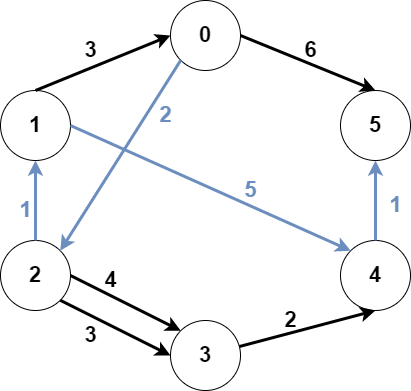
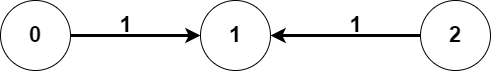

### 1. Description

You are given an integer `n` denoting the number of nodes of a **weighted directed** graph. The nodes are numbered from `0` to $n - 1$.

You are also given a 2D integer array `edges` where $\text{edges}[i] = [\text{from}_{i}, \text{to}_{i}, \text{weight}_{i}]$ denotes that there exists a **directed** edge from $\text{from}_{i}$ to $\text{to}_{i}$ with weight $\text{weight}_{i}$.

Lastly, you are given three **distinct** integers `src1`, `src2`, and `dest` denoting three distinct nodes of the graph.

Return *the **minimum weight** of a subgraph of the graph such that it is **possible** to reach* `dest` *from both* `src1` *and* `src2` *via a set of edges of this subgraph*. In case such a subgraph does not exist, return `-1`.

A **subgraph** is a graph whose vertices and edges are subsets of the original graph. The **weight** of a subgraph is the sum of weights of its constituent edges.

### 2. Function Contract

**Inputs**

- `n`: Input parameter (`int`).
- `edges`: Input parameter (`List[List[int]]`).
- `src1`: Input parameter (`int`).
- `src2`: Input parameter (`int`).
- `dest`: Input parameter (`int`).

**Return value**

- Returns `int`.

### 3. Examples

#### Example 1

- **Input:** $n = 6, edges = [[0,2,2],[0,5,6],[1,0,3],[1,4,5],[2,1,1],[2,3,3],[2,3,4],[3,4,2],[4,5,1]], src1 = 0, src2 = 1, dest = 5$
- **Output:** `9`
- **Explanation:** The above figure represents the input graph.
The blue edges represent one of the subgraphs that yield the optimal answer.
Note that the subgraph [[1,0,3],[0,5,6]] also yields the optimal answer. It is not possible to get a subgraph with less weight satisfying all the constraints.

#### Example 2

- **Input:** $n = 3, edges = [[0,1,1],[2,1,1]], src1 = 0, src2 = 1, dest = 2$
- **Output:** `-1`
- **Explanation:** The above figure represents the input graph.
It can be seen that there does not exist any path from node 1 to node 2, hence there are no subgraphs satisfying all the constraints.

### 4. Constraints

- $3 \le n \le 10^{5}$

- $0 \le \text{edges.length} \le 10^{5}$

- $\text{edges}[i].length = 3$

- $0 \le \text{from}_{i}, \text{to}_{i}, src1, src2, dest \le n - 1$

- $\text{from}_{i} \neq \text{to}_{i}$

- `src1`, `src2`, and `dest` are pairwise distinct.

- $1 \le \text{weight}[i] \le 10^{5}$
