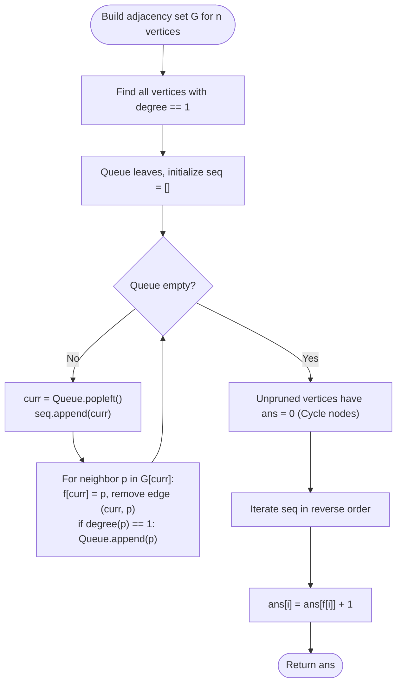

# Guided Example: Distance to a Cycle in Undirected Graph

We analyze and trace the degree-based topological leaf-pruning and reverse tree-propagation algorithm for determining the shortest distance from every vertex to the unique simple cycle in a connected unicyclic undirected graph, establishing $O(n)$ time complexity and $O(n)$ auxiliary space.

- **Input:** `n = 7`, `edges = [[1, 2], [2, 3], [3, 4], [4, 1], [0, 1], [5, 2], [6, 5]]`
- **Output:** `[1, 0, 0, 0, 0, 1, 2]`

This representative instance illustrates unicyclic pseudotree topology, iterative leaf pruning (Kahn-style degree reduction), cycle boundary isolation, and outward distance dynamic propagation.

---

## 1. Problem Overview & Representative Instance

We are given a connected undirected graph with $n$ vertices labeled from $0$ to $n - 1$ and $n$ edges.
A fundamental graph-theoretic theorem states that any connected undirected graph with $|V| = n$ vertices and $|E| = n$ edges possesses Euler characteristic $|V| - |E| = 0$, meaning it contains **exactly one simple cycle** (a unicyclic graph or pseudotree).

Our objective is to compute an array `ans` of length $n$, where `ans[i]` is the shortest path distance (minimum number of edges) from vertex $i$ to any vertex belonging to the simple cycle. If vertex $i$ is itself a part of the cycle, its distance is $0$.

### Representative Instance Breakdown

Consider $n = 7$ with edges:
$$\text{edges} = [[1, 2], [2, 3], [3, 4], [4, 1], [0, 1], [5, 2], [6, 5]]$$

Topological structure:
1. **The Unique Cycle:**
   The vertices $\{1, 2, 3, 4\}$ form a simple 4-cycle: $1 - 2 - 3 - 4 - 1$.
   Their distance to the cycle is $0$.
2. **Attached Tree Branch A (at root $1$):**
   - Node $0$ connects directly to cycle node $1$.
   - Shortest path: $0 - 1 \implies \text{distance } 1$.
3. **Attached Tree Branch B (at root $2$):**
   - Node $5$ connects to cycle node $2$.
   - Shortest path: $5 - 2 \implies \text{distance } 1$.
   - Node $6$ connects to node $5$.
   - Shortest path: $6 - 5 - 2 \implies \text{distance } 2$.

Resulting distance array:
$$[1, 0, 0, 0, 0, 1, 2]$$

---

## 2. Mathematical & Algorithmic Principles

### Pseudotree Decomposition and Cycle Invariant

Every unicyclic connected graph $G$ can be partitioned uniquely into:
1. A 2-regular core subgraph $C = (V_C, E_C)$, which is the simple cycle where every vertex has degree $2$ relative to the cycle.
2. A collection of rooted trees $\{T_r\}_{r \in V_C}$, where each tree $T_r$ is rooted at a cycle vertex $r$ and all other vertices in $T_r$ are strictly non-cycle vertices.

### Leaf Peeling (Topological Pruning)

Vertices belonging to the trees $T_r$ can be pruned progressively:
- Any vertex $i$ with $\text{degree}(i) = 1$ is a leaf of some tree branch; it cannot belong to a simple cycle (since every vertex in a simple cycle has cycle-degree at least $2$).
- We maintain a queue of all vertices with degree $1$.
- When vertex $i$ is popped:
  - Its single remaining neighbor $j$ is its parent pointing toward the cycle: $f[i] = j$.
  - We remove edge $(i, j)$, decreasing $\text{degree}(j)$ by $1$.
  - If $\text{degree}(j)$ drops to $1$, $j$ was an internal tree node whose children have all been pruned; we enqueue $j$.
  - We append $i$ to a pruning sequence list `seq`.
- When the queue empties, all tree branches have been completely trimmed. The unpruned vertices remaining in $G$ are precisely the vertices of the cycle $V_C$.

### Reverse Order Distance Propagation

After leaf pruning:
- For every cycle node $v \in V_C$, set $\text{ans}[v] = 0$.
- Reversing the pruning sequence (`seq[::-1]`) visits tree nodes in top-down order from cycle outward:
  $$\text{ans}[i] = \text{ans}[f[i]] + 1$$
This dynamic programming transition guarantees that each node receives its exact shortest distance to the cycle.

---

## 3. Step-by-Step Walkthrough with Intermediate State

We trace $n = 7$ with edges $[[1, 2], [2, 3], [3, 4], [4, 1], [0, 1], [5, 2], [6, 5]]$.

### Step 1: Degree Accounting and Leaf Enqueueing
- Initial degrees:
  - $\text{deg}(0) = 1$ (neighbor $1$)
  - $\text{deg}(1) = 3$ (neighbors $0, 2, 4$)
  - $\text{deg}(2) = 3$ (neighbors $1, 3, 5$)
  - $\text{deg}(3) = 2$ (neighbors $2, 4$)
  - $\text{deg}(4) = 2$ (neighbors $1, 3$)
  - $\text{deg}(5) = 2$ (neighbors $2, 6$)
  - $\text{deg}(6) = 1$ (neighbor $5$)
- Initial leaf queue: $[0, 6]$.
- Sequence `seq`: `[]`.

---

### Step 2: Pruning Leaf $0$
- Pop $0$. Append $0$ to `seq` $\implies \text{seq} = [0]$.
- Sole neighbor is $1$. Record parent $f[0] = 1$.
- Remove edge $(0, 1)$: $\text{deg}(1) \leftarrow 3 - 1 = 2$.
- $\text{deg}(1) = 2 \ne 1$, so $1$ is not enqueued.
- Queue: $[6]$.

---

### Step 3: Pruning Leaf $6$
- Pop $6$. Append $6$ to `seq` $\implies \text{seq} = [0, 6]$.
- Sole neighbor is $5$. Record parent $f[6] = 5$.
- Remove edge $(6, 5)$: $\text{deg}(5) \leftarrow 2 - 1 = 1$.
- $\text{deg}(5) = 1$, so enqueue $5$.
- Queue: $[5]$.

---

### Step 4: Pruning Leaf $5$
- Pop $5$. Append $5$ to `seq` $\implies \text{seq} = [0, 6, 5]$.
- Sole neighbor is $2$. Record parent $f[5] = 2$.
- Remove edge $(5, 2)$: $\text{deg}(2) \leftarrow 3 - 1 = 2$.
- $\text{deg}(2) = 2 \ne 1$, so $2$ is not enqueued.
- Queue: `[]` (empty).

---

### Step 5: Cycle Identification
- Queue is empty.
- Vertices with non-zero degree: $\{1, 2, 3, 4\}$.
- Each has degree $2$, forming the cycle $1 - 2 - 3 - 4 - 1$.
- Set cycle distances:
  $$\text{ans}[1] = 0, \quad \text{ans}[2] = 0, \quad \text{ans}[3] = 0, \quad \text{ans}[4] = 0$$

---

### Step 6: Reverse Propagation over `seq[::-1] = [5, 6, 0]`
1. Node $5$: parent $f[5] = 2$.
   $$\text{ans}[5] = \text{ans}[2] + 1 = 0 + 1 = 1$$
2. Node $6$: parent $f[6] = 5$.
   $$\text{ans}[6] = \text{ans}[5] + 1 = 1 + 1 = 2$$
3. Node $0$: parent $f[0] = 1$.
   $$\text{ans}[0] = \text{ans}[1] + 1 = 0 + 1 = 1$$

Final result: `ans = [1, 0, 0, 0, 0, 1, 2]`.

---

## 4. Comprehensive State Trace

The table below summarizes the degree reduction, parent assignments, and resulting distances for all vertices.

| Node ID | Initial Degree | Step Pruned | Recorded Parent $f[i]$ | In Simple Cycle? | Final Distance to Cycle |
|---|---|---|---|---|---|
| $0$ | $1$ | Step 2 | $1$ | No | $1$ |
| $1$ | $3$ | Not Pruned | — | **Yes** | $0$ |
| $2$ | $3$ | Not Pruned | — | **Yes** | $0$ |
| $3$ | $2$ | Not Pruned | — | **Yes** | $0$ |
| $4$ | $2$ | Not Pruned | — | **Yes** | $0$ |
| $5$ | $2$ | Step 4 | $2$ | No | $1$ |
| $6$ | $1$ | Step 3 | $5$ | No | $2$ |

### Topological Pruning Chronology

| Queue Pop Event | Removed Vertex | Target Parent $f[i]$ | Parent Degree Before | Parent Degree After | Enqueued? |
|---|---|---|---|---|---|
| Event 1 | $0$ | $1$ | $3$ | $2$ | No |
| Event 2 | $6$ | $5$ | $2$ | $1$ | **Yes** (Enqueued 5) |
| Event 3 | $5$ | $2$ | $3$ | $2$ | No |

---

## 5. Algorithmic Correctness & Soundness

### Correctness of Cycle Isolation
In an undirected graph, a vertex belongs to a simple cycle if and only if it cannot be removed by iteratively deleting degree-1 vertices.
Since the graph has $n$ vertices and $n$ edges, exactly one cycle exists. The process of deleting degree-1 vertices strictly preserves all cycles because every vertex in a cycle has at least two cycle-incident edges, preventing its degree from dropping below $2$ until all external attachments are removed.
Thus, when the queue is exhausted, the set of surviving vertices is precisely the simple cycle.

### Correctness of Distance Propagation
By processing `seq` in reverse order, a vertex $i$ is evaluated only after its parent $f[i]$ has already received its final distance value.
Because each attached component is a tree rooted at the cycle, the unique path from $i$ to the cycle passes through $f[i]$.
By induction, $\text{ans}[i] = \text{ans}[f[i]] + 1$ yields the exact shortest distance to the cycle.

---

## 6. Edge Cases & Anti-Patterns

### Edge Cases
- **The Graph is Itself a Pure Cycle ($C_n$):** All vertices have degree $2$. The initial queue is empty, no vertices are pruned, and all distances are initialized to $0$. Output: $[0, 0, \dots, 0]$.
- **Long Tree Branch Attached to Cycle:** A branch of length $n - 3$ attached to a 3-cycle. The reverse sequence correctly cascades distances up to $n - 3$.
- **Multiple Tree Branches at Same Cycle Node:** Pruning handles independent branches attaching to the same cycle vertex without interference.

### Anti-Patterns to Avoid
- **Running Multi-Source BFS from Scratch without Peeling:** Finding the cycle using DFS requires tracing back-edges and cycle reconstruction. Leaf peeling isolates the cycle and builds the tree parent links simultaneously in a single clean pass.
- **Running Dijkstra from Every Node:** Calculating all-pairs shortest paths using BFS from every node takes $O(n(V + E)) = O(n^2)$ time. Linear $O(n)$ leaf pruning is asymptotically optimal.

---

## 7. Complexity Analysis

### Time Complexity
- **Graph Construction:** $O(n)$ to build adjacency set with $n$ edges.
- **Queue Initialization:** Scanning degrees of $n$ vertices takes $O(n)$ time.
- **Leaf Pruning:** Each pruned vertex is popped once, and each edge is removed at most once: $O(n)$.
- **Distance Propagation:** Visiting the sequence of length at most $n$ in reverse takes $O(n)$ operations.
- Total Time Complexity: $\mathcal{O}(n)$, which easily runs within $0.05$ seconds for $n \le 10^5$.

### Space Complexity
- Adjacency list storage: $O(n)$ for $n$ vertices and $n$ edges.
- Arrays $f$, `seq`, and `ans` of length $n$: $O(n)$.
- Queue of size at most $n$: $O(n)$.
- Auxiliary Space Complexity: $\mathcal{O}(n)$.
