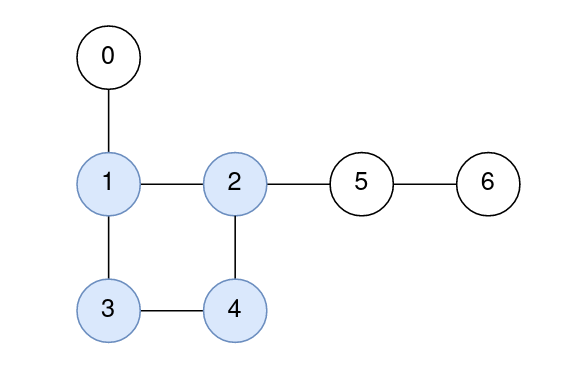
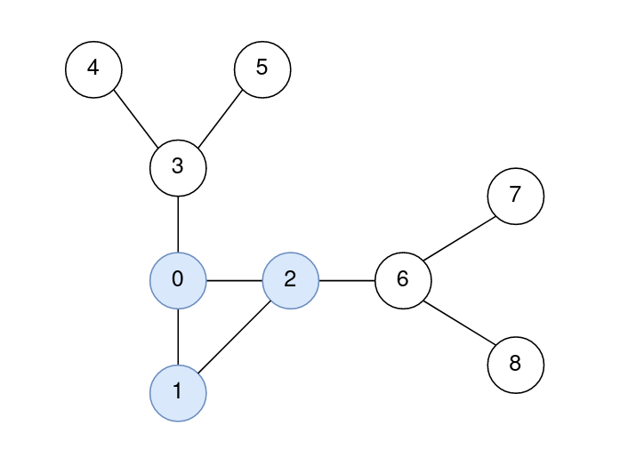

### 1. Description

You are given a positive integer `n` representing the number of nodes in a **connected undirected graph** containing **exactly one** cycle. The nodes are numbered from `0` to $n - 1$ (**inclusive**).

You are also given a 2D integer array `edges`, where $\text{edges}[i] = [\text{node1}_{i}, \text{node2}_{i}]$ denotes that there is a **bidirectional** edge connecting $\text{node1}_{i}$ and $\text{node2}_{i}$ in the graph.

The distance between two nodes `a` and `b` is defined to be the **minimum** number of edges that are needed to go from `a` to `b`.

Return *an integer array `answer`** of size *`n`*, where *$\text{answer}[i]$* is the **minimum** distance between the *$$i^{\text{th}}$$* node and **any** node in the cycle.*

### 2. Function Contract

- Refer to method signature.

### 3. Examples

#### Example 1

- **Input:** $n = 7, edges = [[1,2],[2,4],[4,3],[3,1],[0,1],[5,2],[6,5]]$
- **Output:** `[1,0,0,0,0,1,2]`
- **Explanation:**
The nodes 1, 2, 3, and 4 form the cycle.
The distance from 0 to 1 is 1.
The distance from 1 to 1 is 0.
The distance from 2 to 2 is 0.
The distance from 3 to 3 is 0.
The distance from 4 to 4 is 0.
The distance from 5 to 2 is 1.
The distance from 6 to 2 is 2.
#### Example 2

- **Input:** $n = 9, edges = [[0,1],[1,2],[0,2],[2,6],[6,7],[6,8],[0,3],[3,4],[3,5]]$
- **Output:** `[0,0,0,1,2,2,1,2,2]`
- **Explanation:**
The nodes 0, 1, and 2 form the cycle.
The distance from 0 to 0 is 0.
The distance from 1 to 1 is 0.
The distance from 2 to 2 is 0.
The distance from 3 to 1 is 1.
The distance from 4 to 1 is 2.
The distance from 5 to 1 is 2.
The distance from 6 to 2 is 1.
The distance from 7 to 2 is 2.
The distance from 8 to 2 is 2.

### 4. Constraints

- $3 \le n \le 10^{5}$

- $\text{edges.length} = n$

- $\text{edges}[i].length = 2$

- $0 \le \text{node1}_{i}, \text{node2}_{i} \le n - 1$

- $\text{node1}_{i} \neq \text{node2}_{i}$

- The graph is connected.

- The graph has exactly one cycle.

- There is at most one edge between any pair of vertices.