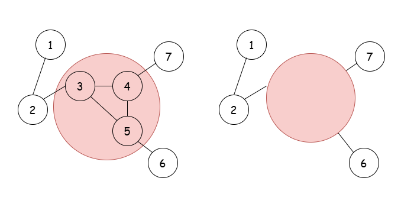

[TOC]

## Solution

---

### Overview

We are given a connected, undirected graph that contains exactly one cycle. Our task is to calculate the shortest distance between each node in the graph and any node in the cycle.

To solve this problem, we can break it down into two main independent steps:

1. Identify the cycle nodes
2. Compute distances to the cycle

For each task, we’ll introduce two distinct algorithms. These algorithms can be used interchangeably, providing multiple paths to solving the problem.

To get started, consider taking a look at this related problem: [2608. Shortest Cycle in a Graph](https://leetcode.com/problems/shortest-cycle-in-a-graph/description/).

---

### Approach 1: Depth-First Search (DFS)

#### Intuition

We’ll use Depth-First Search (DFS), to identify all nodes that form the cycle. The key idea is that a cycle is detected when DFS revisits a node that has already been visited (and is not the direct parent of the current node).

While performing DFS, we’ll keep track of each node’s parent. Once we detect a cycle, we can use backtracking to trace and collect all nodes that form the cycle.

Next, we can conceptually treat all cycle nodes as a single "super-node" (as illustrated below). With this transformation, the graph becomes a tree: there are no remaining cycles, and there’s exactly one path between any two nodes. Now, we can treat this "cycle" node as the root of the tree and perform another DFS to calculate the shortest distance from the cycle to each other node in the graph.



#### Algorithm

-   Define a function `detectCycleNodes` that takes as parameters the `currentNode`, the graph's `adjacencyList`, and the arrays `isInCycle`, `visited`, and `parent` and returns a boolean value, indicating whether a cycle has been detected.

-   Mark `currentNode` as visited.
-   For each `neighbor` of `currentNode`:
-   If `neighbor` is not visited:
-   Mark `currentNode` as the parent of `neighbor`.
-   Call `detectCycleNodes` for the `neighbor` node and return `true` if it also returns `true`.
-   Else, if `neighbor` is not the direct parent of `curretNode`, a cycle is detected:
-   Set $\text{isInCycle}[neighbor] = true$.
-   Initialize `tempNode` to `currentNode` and while `tempNode` is not equal to `neighbor`:
-   Set $\text{isInCycle}[tempNode]$ to `true`.
-   Update `tempNode` to $\text{parent}[tempNode]$.
-   Return `true`.
-   If all neighbors are processed and no cycle is found, return `false`.

-   Define a function `calculateDistances` that takes as parameters the `currentNode`, the graph's `adjacencyList`, the `currentDistance`, and the arrays `distances`, `visited`, and `isInCycle`.

-   Set $\text{distances}[currentNode]$ to `currentDistance`.
-   Mark `currentNode` as visited.
-   For each `neighbor` of `currentNode`:
-   If `neighbor` is visited, continue.
-   Otherwise:
-   If `neighbor` is a cycle node, it is part of the root "super-node"; Set `newDistance` to `0`. Else, set `newDistance` to $currentDistance + 1$.
-   Call `calculateDistances` for `neighbor` with `newDistance`.

-   In the main `distanceToCycle` function:
-   Initialize the boolean arrays `isInCycle` and `visited` and set each element to `false`.
-   Initialize the integer arrays `parent` and `distances`.
-   Create the graph's `adjacencyList`:
-   For each `edge` in the `edges` array:
-   Push $\text{edge}[0]$ to $adjacencyList[\text{edge}[1]]$ and vice versa.
-   Call `detectCycleNodes` for a random node (e.g. `0`).
-   Reset the `visited` array.
-   Call `calculateDistances` for a cycle node.
-   Return `distances`.

#### Implementation

```python
class Solution:
    # DFS to detect cycle nodes and mark them in `is_in_cycle`
    def detect_cycle_nodes(
        self, current_node, adjacency_list, is_in_cycle, visited, parent
    ):
        visited[current_node] = True  # Mark current node as visited
        for neighbor in adjacency_list[current_node]:
            if not visited[neighbor]:
                parent[neighbor] = current_node  # Set parent for backtracking
                if self.detect_cycle_nodes(
                    neighbor, adjacency_list, is_in_cycle, visited, parent
                ):
                    return True  # Return True if cycle detected
            elif parent[current_node] != neighbor:  # Cycle detected
                is_in_cycle[neighbor] = True  # Mark the start of the cycle
                temp_node = current_node
                # Backtrack to mark all nodes in the cycle
                while temp_node != neighbor:
                    is_in_cycle[temp_node] = True
                    temp_node = parent[temp_node]
                return True
        return False  # No cycle found in this path

    # DFS to calculate distances from cycle nodes
    def calculate_distances(
        self,
        current_node,
        current_distance,
        adjacency_list,
        distances,
        visited,
        is_in_cycle,
    ):
        distances[current_node] = (
            current_distance  # Set distance for current node
        )
        visited[current_node] = True  # Mark node as visited
        for neighbor in adjacency_list[current_node]:
            if visited[neighbor]:
                continue  # Skip if already visited
            new_distance = (
                0 if is_in_cycle[neighbor] else current_distance + 1
            )  # Reset if on cycle
            self.calculate_distances(
                neighbor,
                new_distance,
                adjacency_list,
                distances,
                visited,
                is_in_cycle,
            )

    def distanceToCycle(self, n, edges):
        is_in_cycle = [False] * n
        visited = [False] * n
        parent = [0] * n
        distances = [0] * n
        adjacency_list = [[] for _ in range(n)]

        # Build adjacency list for the graph
        for edge in edges:
            adjacency_list[edge[0]].append(edge[1])
            adjacency_list[edge[1]].append(edge[0])

        # Detect and mark cycle nodes
        self.detect_cycle_nodes(0, adjacency_list, is_in_cycle, visited, parent)

        # Reset visited array before distance calculation
        visited = [False] * n

        # Calculate distances starting from any cycle node
        for i in range(n):
            if is_in_cycle[i]:
                self.calculate_distances(
                    i, 0, adjacency_list, distances, visited, is_in_cycle
                )
                break  # Only need to start from one cycle node
        return distances
```

#### Complexity Analysis

Let $n$ be the number of nodes and $e$ the number of edges in the graph.

-   Time Complexity: $O(n + e)$.

    The `detectCycleNodes` function processes each node and each edge once, giving a time complexity of $O(n + e)$, with an additional $O(n)$ for backtracking. Similarly, the `calculateDistances` function also processes each node and edge once, contributing $O(n + e)$ to the time complexity. Thus, the overall time complexity is $O(n + e)$.

-   Space Complexity: $O(n + e)$.

    The arrays `isInCycle`, `visited`, `parent`, and `distances` all have a size of $O(n)$. The graph's `adjacencyList` has $2e = O(e)$ elements and the recursion depth is $O(n)$. Therefore, the total space complexity is $O(n + e)$.

---

### Approach 2: Layer By Layer + Multisource BFS

#### Intuition

In this approach, we're using two variations of Breadth-First Search (BFS) to solve the problem by gradually "peeling away" the outer layers of the graph. We start by focusing on nodes with a degree of 1, which are essentially the outermost nodes connected to the graph. As we remove each of these nodes, we also decrease the degree of their neighboring nodes. If any neighbor’s degree drops to 1 as a result, we add it to the queue to process next.

The key insight here is that nodes that are part of a cycle will never end up in our queue. That’s because, to be part of a cycle, a node must always have a degree of at least 2, ensuring it stays connected within the cycle. To formally prove the correctness of this approach, we need to prove two statements:

1. If $u$ is a cycle node, it will not be added to the queue.
2. If $u$ is not a cycle node, it will be added to the queue.

###### Proof:

1. Assume for contradiction that $u$ is the first cycle node to be added to the queue. Before being added, $u$ had a degree of 2, meaning it was connected to exactly two other nodes. Since $u$ is the first cycle node in the queue, both of its neighbors must also be cycle nodes. However, this leads to a contradiction: if $u$ is added to the queue, at least one of its neighbors must be processed before $u$, but this would mean that $u$ would not be the first cycle node to enter the queue. Therefore, cycle nodes cannot be added to the queue.

2. Now, we can think of all the cycle nodes as forming a "super-node," which acts as the root of a tree. We then start processing from the leaves of this tree, removing them layer by layer. By continuing this process, we will eventually reach the root (the cycle nodes) after processing all the non-cycle nodes.

!?!../Documents/2204/2204_Approach2.json:960,540!?!

After detecting the cycle nodes, we perform BFS starting from the cycle nodes as the source nodes. Expanding layer by layer guarantees that we find the shortest path to all nodes.

#### Algorithm

-   Initialize the boolean arrays `isInCycle`, setting each element to `true` and `visited` with all elements set to `false`.
-   Initialize the integer arrays `degree` and `distances`, setting each element of `degree` to `0`.
-   Create the graph's `adjacencyList` and count the degree of each node:
-   For each `edge` in the `edges` array:
-   Push $\text{edge}[0]$ to $adjacencyList[\text{edge}[1]]$ and vice versa.
-   Increase $degree[\text{edge}[0]]$ and $degree[\text{edge}[1]]$ by 1.
-   Initialize a queue, named `nodeQueue` and push all nodes with a degree equal to 1 into it.
-   While `nodeQueue` is not empty:
-   Pop the `currentNode` from the queue.
-   Set $\text{isInCycle}[currentNode]$ to `false`.
-   For each `neighbor` of `currentNode`:
-   Decrease $\text{degree}[neighbor]$ by 1.
-   If $\text{degree}[neighbor]$ equals 1, push `neighbor` to the queue.
-   After the loop ends, `nodeQueue` is empty. Iterate over all nodes with `currentNode` from `0` to $n - 1$:
-   If `currentNode` is in the cycle:
-   Mark `currentNode` as visited.
-   Push `currentNode` into the queue.
-   Initialize `currentDistance` to `0`.
-   While `nodeQueue` is not empty:
-   Get the current size of the queue, denoted as `queueSize`.
-   Perform the following `queueSize` times:
-   Pop `currentNode` from the queue.
-   Set $\text{distances}[currentNode]$ to `currentDistance`.
-   For each `neighbor` of `currentNode`:
-   If `neighbor` is visited, continue.
-   Otherwise,
-   Push `neighbor` into the queue.
-   Mark `neighbor` as visited.
-   Increase `currentDistance` by `1`.
-   Return `distances`.

#### Implementation

```python
class Solution:
    def distanceToCycle(self, n, edges):
        # 'is_in_cycle' is initially True for all nodes
        is_in_cycle = [True] * n
        visited = [False] * n
        degree = [0] * n
        distances = [0] * n
        adjacency_list = [[] for _ in range(n)]

        # Build the adjacency list and calculate node degrees
        for edge in edges:
            adjacency_list[edge[0]].append(edge[1])
            adjacency_list[edge[1]].append(edge[0])
            degree[edge[0]] += 1
            degree[edge[1]] += 1

        node_queue = deque()

        # Start by adding all leaf nodes (degree 1) to the queue
        for i in range(n):
            if degree[i] == 1:
                node_queue.append(i)

        # Perform BFS to remove nodes with degree 1, progressively reducing the graph
        while node_queue:
            current_node = node_queue.popleft()
            # Mark the node as not in the cycle
            is_in_cycle[current_node] = False

            # Update the degree of neighbors and add them to the queue if their degree becomes 1
            for neighbor in adjacency_list[current_node]:
                degree[neighbor] -= 1
                if degree[neighbor] == 1:
                    node_queue.append(neighbor)

        # Add all cycle nodes to the queue and mark them as visited
        for current_node in range(n):
            if is_in_cycle[current_node]:
                node_queue.append(current_node)
                visited[current_node] = True

        # BFS to calculate distances from cycle nodes
        current_distance = 0
        while node_queue:
            # Track number of nodes to process at this distance level
            queue_size = len(node_queue)
            for _ in range(queue_size):
                current_node = node_queue.popleft()
                # Set the distance for the current node
                distances[current_node] = current_distance

                # Add unvisited neighbors to the queue
                for neighbor in adjacency_list[current_node]:
                    if visited[neighbor]:
                        continue
                    node_queue.append(neighbor)
                    visited[neighbor] = True
            # Increment distance after processing all nodes at the current level
            current_distance += 1

        return distances
```

#### Complexity Analysis

Let $n$ be the number of nodes and $e$ the number of edges in the graph.

-   Time Complexity: $O(n + e)$.

    During the first BFS traversal, each non-cycle node is added to and removed from the queue exactly once. Additionally, each edge of the graph is processed exactly once (by the inner for loop), so the time taken to detect all cycle nodes in $O(n + e)$.

    In order to calculate the minimum distance of each node to the cycle, we perform a second BFS traversal which contributes another $O(n + e)$ to the total time complexity.

-   Space Complexity: $O(n + e)$.

    The arrays `isInCycle`, `visited`, `parent`, and `distances` all have a size of $O(n)$. The graph's `adjacencyList` has $2e = O(e)$ elements and the queue can contain at most $O(n)$. Therefore, the total space complexity is $O(n + e)$

---