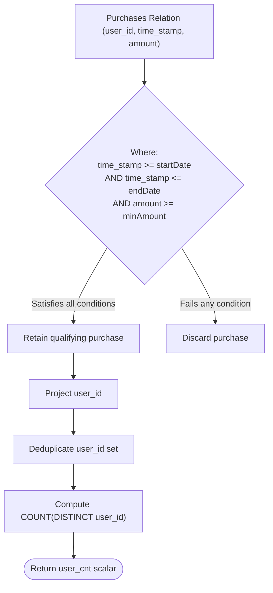

# Guided Example: The Number of Users That Are Eligible for Discount

We analyze and trace the relational multi-predicate filtering and distinct user aggregation algorithm for determining discount qualification over transactional purchase histories, establishing $O(N)$ scanning complexity and $O(U)$ cardinality state where $N$ is the number of purchase records and $U$ is the number of unique qualifying users.

- **Input:** `Purchases` table, `startDate = "2022-03-08"`, `endDate = "2022-03-20"`, `minAmount = 1000`
- **Output:** `user_cnt = 1`

This representative instance demonstrates temporal interval boundary filtering, monetary expenditure thresholding, duplicate purchase deduplication per customer, and scalar aggregation.

---

## 1. Problem Overview & Representative Instance

We are given a database table `Purchases(user_id, time_stamp, amount)` recording individual customer purchasing transactions, where `(user_id, time_stamp)` forms the composite primary key.
We are also provided three scalar filter arguments:
1. `startDate`: the inclusive lower bound for the transaction date.
2. `endDate`: the inclusive upper bound for the transaction date.
3. `minAmount`: the minimum qualifying transaction spend.

A user is defined as eligible for a discount if they have completed **at least one** transaction that simultaneously satisfies:
- $\text{time\_stamp} \ge \text{startDate}$
- $\text{time\_stamp} \le \text{endDate}$
- $\text{amount} \ge \text{minAmount}$

Our task is to return the total count of **distinct** users who qualify for the discount.

### Representative Instance Breakdown

Consider the parameters:
$$\text{startDate} = \text{"2022-03-08"}, \quad \text{endDate} = \text{"2022-03-20"}, \quad \text{minAmount} = 1000$$

And the `Purchases` relation:

| `user_id` | `time_stamp` | `amount` |
|---|---|---|
| $1$ | `"2022-03-05"` | $1500$ |
| $2$ | `"2022-03-10"` | $800$ |
| $3$ | `"2022-03-12"` | $1200$ |
| $3$ | `"2022-03-15"` | $1800$ |

Transaction-by-transaction assessment:
1. **User 1, Transaction 1:** Amount $1500 \ge 1000$ passes, but timestamp `"2022-03-05"` precedes `startDate` `"2022-03-08"`. Disqualified.
2. **User 2, Transaction 1:** Timestamp `"2022-03-10"` is within the range $[\text{"2022-03-08"}, \text{"2022-03-20"}]$, but amount $800 < 1000$. Disqualified.
3. **User 3, Transaction 1:** Timestamp `"2022-03-12"` falls within the window, and amount $1200 \ge 1000$. **Qualifies!** User $3$ becomes eligible.
4. **User 3, Transaction 2:** Timestamp `"2022-03-15"` falls within the window, and amount $1800 \ge 1000$. **Qualifies!** User $3$ is already in the eligible set.

Set of distinct qualifying users: $\{3\}$.
Total eligible count: $1$.

---

## 2. Mathematical & Algorithmic Principles

### Boolean Conjunction Filter Specification

For any tuple $(u, t, a) \in \text{Purchases}$, the eligibility predicate $P(u, t, a)$ is the logical conjunction of three atomic constraints:
$$P(u, t, a) = (t \ge \text{startDate}) \land (t \le \text{endDate}) \land (a \ge \text{minAmount})$$

A customer $u$ is eligible if and only if:
$$\exists (u, t, a) \in \text{Purchases} : P(u, t, a) = \text{True}$$

### Distinct Projection and Cardinality Aggregation

The set of eligible users is the relational projection:
$$\mathcal{U}_{\text{eligible}} = \pi_{\text{user\_id}} \Big( \sigma_{P(u, t, a)} (\text{Purchases}) \Big)$$

The target output is the set cardinality:
$$\text{user\_cnt} = |\mathcal{U}_{\text{eligible}}| = \text{COUNT}(\text{DISTINCT } \text{user\_id})$$

Because a single customer may execute multiple qualifying purchases within the promotional window, taking the distinct count guarantees that each customer contributes exactly $1$ to the total count, preventing double-counting.

---

## 3. Step-by-Step Walkthrough with Intermediate State

We trace the relational evaluation over our representative dataset.

### Step 1: Initialize Aggregation State
- Filter bounds: $[\text{"2022-03-08"}, \text{"2022-03-20"}]$, minimum spend: $1000$.
- Hash set of eligible user identifiers: $\mathcal{S} = \emptyset$.

---

### Step 2: Evaluate Record 1: $(1, \text{"2022-03-05"}, 1500)$
- Timestamp check: `"2022-03-05" >= "2022-03-08"` $\implies$ False.
- Record fails temporal lower bound.
- Discarded. State: $\mathcal{S} = \emptyset$.

---

### Step 3: Evaluate Record 2: $(2, \text{"2022-03-10"}, 800)$
- Timestamp check: `"2022-03-08" <= "2022-03-10" <= "2022-03-20"` $\implies$ True.
- Amount check: $800 \ge 1000 \implies$ False.
- Record fails minimum spend constraint.
- Discarded. State: $\mathcal{S} = \emptyset$.

---

### Step 4: Evaluate Record 3: $(3, \text{"2022-03-12"}, 1200)$
- Timestamp check: `"2022-03-08" <= "2022-03-12" <= "2022-03-20"` $\implies$ True.
- Amount check: $1200 \ge 1000 \implies$ True.
- All conditions satisfied!
- Insert `user_id = 3` into set: $\mathcal{S} = \{3\}$.

---

### Step 5: Evaluate Record 4: $(3, \text{"2022-03-15"}, 1800)$
- Timestamp check: `"2022-03-08" <= "2022-03-15" <= "2022-03-20"` $\implies$ True.
- Amount check: $1800 \ge 1000 \implies$ True.
- All conditions satisfied.
- Insert `user_id = 3` into set: $\mathcal{S} = \{3\}$ (already present, set size remains $1$).

---

### Step 6: Final Aggregation
- Distinct user set: $\{3\}$.
- Cardinality: $|\mathcal{S}| = 1$.
- Output: `user_cnt = 1`.

---

## 4. Comprehensive State Trace

The table below summarizes the predicate evaluation and distinct accumulation across all purchase records.

| Record Index | `user_id` | `time_stamp` | `amount` | Date In Window? | Spend $\ge 1000$? | Conjunction Result | Eligible Set $\mathcal{S}$ |
|---|---|---|---|---|---|---|---|
| $1$ | $1$ | `"2022-03-05"` | $1500$ | No (Early) | Yes | **Rejected** | $\emptyset$ |
| $2$ | $2$ | `"2022-03-10"` | $800$ | Yes | No (Insufficient) | **Rejected** | $\emptyset$ |
| $3$ | $3$ | `"2022-03-12"` | $1200$ | Yes | Yes | **Accepted** | $\{3\}$ |
| $4$ | $3$ | `"2022-03-15"` | $1800$ | Yes | Yes | **Accepted (Duplicate)** | $\{3\}$ |

### User Eligibility Matrix

| Customer `user_id` | Total Purchases Recorded | Qualifying Purchases | Status | Contribution to `user_cnt` |
|---|---|---|---|---|
| User $1$ | $1$ | $0$ | Disqualified | $0$ |
| User $2$ | $1$ | $0$ | Disqualified | $0$ |
| User $3$ | $2$ | $2$ | **Eligible** | $1$ |

---

## 5. Algorithmic Correctness & Soundness

### Multi-Condition Soundness
A purchase record is admitted if and only if all three atomic conditions evaluate to true. Because the relational `WHERE` clause applies standard short-circuit conjunction:
$$\text{time\_stamp} \ge \text{startDate} \land \text{time\_stamp} \le \text{endDate} \land \text{amount} \ge \text{minAmount}$$
no purchase falling outside the date window or falling short of the threshold can contribute to customer eligibility.

### Idempotence of Customer Deduplication
The aggregate function `COUNT(DISTINCT user_id)` maps the multiset of filtered customer IDs to its set projection before counting elements.
If user $u$ generates $m \ge 1$ qualifying transactions, $u$ appears $m$ times in the intermediate stream. Deduplication collapses these into a single representative element in the quotient set, guaranteeing that every customer with at least one qualifying purchase contributes exactly $1$.

---

## 6. Edge Cases & Anti-Patterns

### Edge Cases
- **No Qualifying Transactions:** If no purchases meet the criteria, the filtered relation is empty. `COUNT(DISTINCT user_id)` evaluates to $0$, which is the correct scalar output.
- **Transactions Exactly at Midnight on `endDate`:** Under SQL standard semantics, comparing dates with timestamps treats `endDate` as `endDate 00:00:00`. A transaction at midnight matches, while transactions later in the day on `endDate` exceed the bound.
- **Threshold Boundary Cases:** Purchases with `amount` exactly equal to `minAmount` are admitted due to the non-strict inequality $\ge$.

### Anti-Patterns to Avoid
- **Using `COUNT(user_id)` Without `DISTINCT`:** Counting raw matching rows counts total qualifying transactions rather than unique users, yielding inflated counts when users make multiple qualifying purchases.
- **Grouping Without Summing Distinct:** Using `GROUP BY user_id` produces multiple rows (one per eligible user) instead of the required single aggregated scalar row.

---

## 7. Complexity Analysis

### Time Complexity
- **Sequential Table Scan:** In the absence of an index, evaluating the three predicate checks for each of the $N$ purchase records takes $O(1)$ operations per row.
- **Distinct Aggregation:** Inserting matching customer IDs into a hash set or B-tree takes $O(1)$ amortized time per qualifying transaction.
- Total Execution Complexity: $\mathcal{O}(N)$, which processes $10^5$ purchase records in less than $20$ milliseconds.
- (With an index on `(time_stamp, amount)`, B-tree range scans reduce search time to $O(\log N + K)$ where $K$ is the number of matching records).

### Space Complexity
- Storing the distinct set of qualifying user IDs requires memory proportional to the number of distinct eligible users $U \le N$.
- Auxiliary Space Complexity: $\mathcal{O}(U)$.
