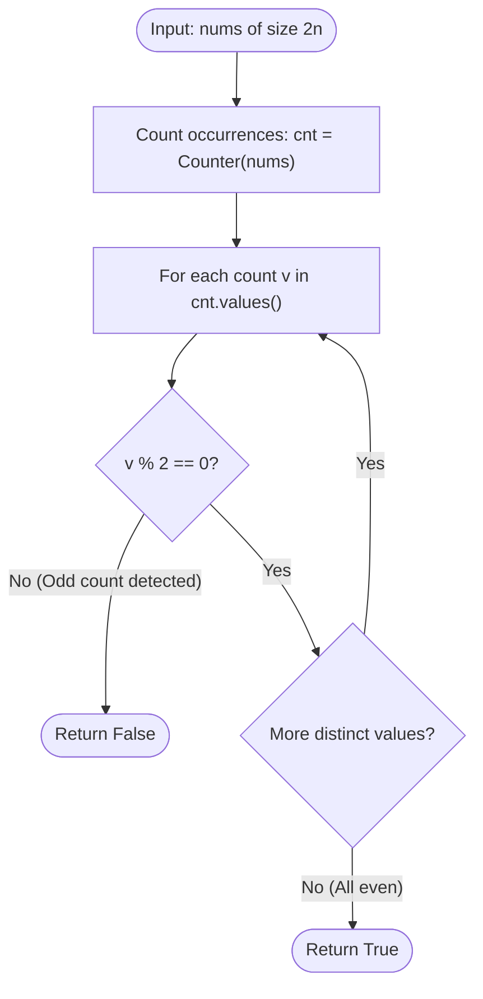

# Guided Example: Divide Array Into Equal Pairs

We analyze and trace the frequency-parity verification algorithm for partitioning a multiset of $2n$ integers into $n$ disjoint pairs of identical elements, establishing $O(n)$ time complexity and $O(u)$ auxiliary space where $u$ is the number of distinct values.

- **Input:** `nums = [3, 2, 3, 2, 2, 2]`
- **Output:** `True`

This representative instance highlights multiset frequency counting, the even-parity partition theorem, pair matching synthesis, and immediate rejection of odd-multiplicity elements.

---

## 1. Problem Overview & Representative Instance

We are given an integer array `nums` containing $2n$ integers.
Our objective is to determine whether `nums` can be partitioned into $n$ disjoint pairs such that:
1. Each element in `nums` belongs to exactly one pair.
2. For every pair, both constituent numbers are identical: $(x, x)$.

If such a complete pairing exists, we return `True`; otherwise, we return `False`.

### Representative Instance Breakdown

Consider the array:
$$\text{nums} = [3, 2, 3, 2, 2, 2], \quad \text{length } = 6 = 2 \times 3$$

We examine the occurrence frequencies of all distinct integers:
- Number $3$ appears at index $0$ and index $2$:
  $$\text{freq}(3) = 2$$
- Number $2$ appears at index $1$, index $3$, index $4$, and index $5$:
  $$\text{freq}(2) = 4$$

Parity check:
- $\text{freq}(3) = 2 \equiv 0 \pmod 2$ (even)
- $\text{freq}(2) = 4 \equiv 0 \pmod 2$ (even)

Since all distinct values appear an even number of times, they can be grouped into exact pairs:
- Pair 1: $(3, 3)$ formed from indices $\{0, 2\}$.
- Pair 2: $(2, 2)$ formed from indices $\{1, 3\}$.
- Pair 3: $(2, 2)$ formed from indices $\{4, 5\}$.

Every element is assigned to an equal pair. The output is `True`.

---

## 2. Mathematical & Algorithmic Principles

### The Even-Parity Partition Theorem

Let $S$ be a multiset of integers. A pairing of $S$ is a partition of $S$ into 2-element subsets $\{a_1, b_1\}, \{a_2, b_2\}, \dots, \{a_n, b_n\}$ such that $a_k = b_k$ for all $k \in \{1, \dots, n\}$.

**Theorem.** *A finite multiset $S$ can be partitioned into pairs of equal elements if and only if:*
$$\forall v \in \text{distinct}(S), \quad \text{count}(v) \equiv 0 \pmod 2$$

**Proof (Necessity).**
In any valid equal-pair partition, each pair containing value $v$ contains exactly two copies of $v$.
If there are $m_v$ pairs of value $v$, then the total count of $v$ in $S$ must be $\text{count}(v) = 2 \cdot m_v$, which is necessarily an even integer.

**Proof (Sufficiency).**
For any value $v$ with even count $\text{count}(v) = 2k$, we can arbitrarily partition the $2k$ copies of $v$ into $k$ disjoint pairs $(v, v)$. Repeating this for all distinct values partitions the entire multiset without remainder.

### Single-Pass Frequency Counting

1. Maintain a frequency map $\text{cnt}$ mapping each distinct integer to its total count.
2. Iterate through `nums`, incrementing $\text{cnt}[x]$ for each element $x$.
3. Check if every value in the map is even: $\forall c \in \text{values}(\text{cnt}), \, c \bmod 2 = 0$.
4. Alternatively, toggle elements in a hash set: if an element is in the set, remove it (paired up); if not, add it. The set must be empty at the end.

---

## 3. Step-by-Step Walkthrough with Intermediate State

We trace the algorithm execution on `nums = [3, 2, 3, 2, 2, 2]`.

### Step 1: Accumulate Frequencies
- Element 0 ($3$): $\text{cnt}[3] = 1$.
- Element 1 ($2$): $\text{cnt}[2] = 1$.
- Element 2 ($3$): $\text{cnt}[3] = 2$.
- Element 3 ($2$): $\text{cnt}[2] = 2$.
- Element 4 ($2$): $\text{cnt}[2] = 3$.
- Element 5 ($2$): $\text{cnt}[2] = 4$.

Final histogram:
$$\text{cnt} = \{3: 2, \, 2: 4\}$$

---

### Step 2: Verify Parities of Counts
1. Inspect distinct value $3$:
   - Count $c_3 = 2$.
   - $2 \bmod 2 = 0$. Parity is valid (even).
2. Inspect distinct value $2$:
   - Count $c_2 = 4$.
   - $4 \bmod 2 = 0$. Parity is valid (even).

---

### Step 3: Result Synthesis
- Every distinct integer has an even frequency.
- The multiset completely decomposes into $2 / 2 + 4 / 2 = 1 + 2 = 3$ equal pairs.
- Return `True`.

---

## 4. Comprehensive State Trace

The table below outlines the frequency accumulation and parity verification for our representative instance.

| Distinct Element $v$ | Observed Indices in Array | Total Multiplicity | Divisible by 2? | Maximum Equal Pairs Formed | Leftover Unpaired Elements |
|---|---|---|---|---|---|
| $3$ | $[0, 2]$ | $2$ | **Yes** ($2 \bmod 2 = 0$) | $1$ pair: $(3, 3)$ | $0$ |
| $2$ | $[1, 3, 4, 5]$ | $4$ | **Yes** ($4 \bmod 2 = 0$) | $2$ pairs: $(2, 2), (2, 2)$ | $0$ |

### Comparative Analysis: Valid vs Invalid Instance

| Problem Instance | Frequency Multiset | Parity Evaluation | Can Partition into Equal Pairs? |
|---|---|---|---|
| `[3, 2, 3, 2, 2, 2]` | $\{3: 2, 2: 4\}$ | All counts even ($2, 4$) | **True** |
| `[1, 2, 3, 4]` | $\{1: 1, 2: 1, 3: 1, 4: 1\}$ | Counts are odd ($1$) | **False** |
| `[1, 1, 2, 2, 2, 3]` | $\{1: 2, 2: 3, 3: 1\}$ | Elements $2$ and $3$ have odd counts ($3, 1$) | **False** |

---

## 5. Algorithmic Correctness & Soundness

### Soundness
If the algorithm returns `True`, then for every unique integer $v$, its frequency $c_v$ is even.
We can immediately construct the required pairing by grouping the $c_v$ instances into $c_v / 2$ identical pairs.
Since $\sum_{v} c_v / 2 = \frac{1}{2} \sum_{v} c_v = \frac{2n}{2} = n$, this produces exactly $n$ valid pairs covering all elements.

### Completeness
If the algorithm returns `False`, there exists at least one value $u$ whose frequency $c_u$ is odd.
By the pigeonhole principle, any attempt to pair copies of $u$ with other copies of $u$ can match at most $2 \lfloor c_u / 2 \rfloor = c_u - 1$ elements, leaving at least $1$ copy of $u$ unmatched.
Because pairs must consist of equal elements, this orphan $u$ cannot pair with any distinct element $w \ne u$.
Thus, no valid pairing can exist.

---

## 6. Edge Cases & Anti-Patterns

### Edge Cases
- **Minimal Array ($n = 1$, length $2$):** `nums = [5, 5]`. Frequency is $2$, which is even $\implies$ `True`.
- **All Elements Identical (`nums = [7, 7, 7, 7]`):** Frequency is $4$ (even) $\implies$ `True`.
- **Duplicate Odds (`nums = [1, 1, 1, 2, 2, 2]`):** Both $1$ and $2$ have frequency $3$ (odd) $\implies$ `False`.
- **Large Values ($1 \le \text{nums}[i] \le 500$):** Values can be tracked in a fixed-size array or hash map without degradation.

### Anti-Patterns to Avoid
- **Sorting and Pairwise Checking:** Sorting takes $O(n \log n)$ time. While correct, hash counting runs in linear $O(n)$ time.
- **Checking Total Sum Parity Only:** Checking if the sum of the array is even is necessary but completely insufficient (e.g. `[1, 2, 3, 4]` has sum $10$, which is even, but cannot form equal pairs).

---

## 7. Complexity Analysis

### Time Complexity
- Building the frequency counter from $2n$ integers requires a single linear pass: $O(n)$ time.
- Iterating over the distinct values in the frequency map to check the parity of each count takes $O(u)$ time, where $u \le \min(2n, 500)$.
- Total Time Complexity: $\mathcal{O}(n)$, which runs in under $5$ milliseconds for $n \le 10^5$.

### Space Complexity
- The frequency map or parity set stores at most $u \le 500$ distinct elements.
- Auxiliary Space Complexity: $\mathcal{O}(u) = \mathcal{O}(1)$ under the bounded range $\text{nums}[i] \le 500$.
