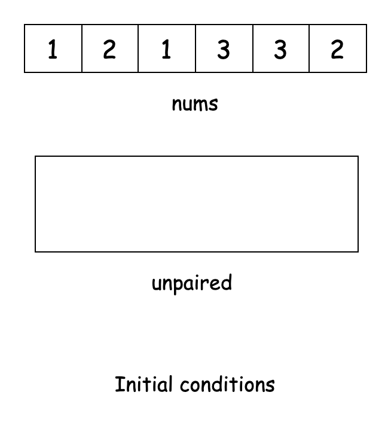
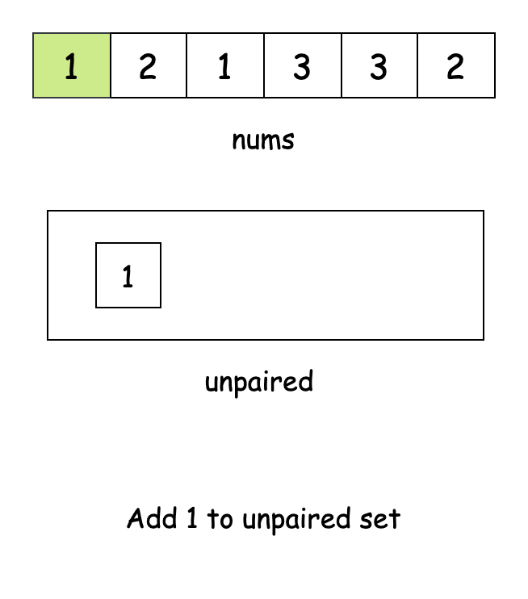
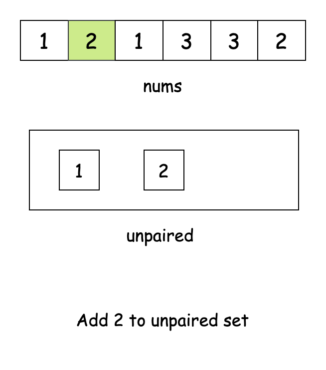
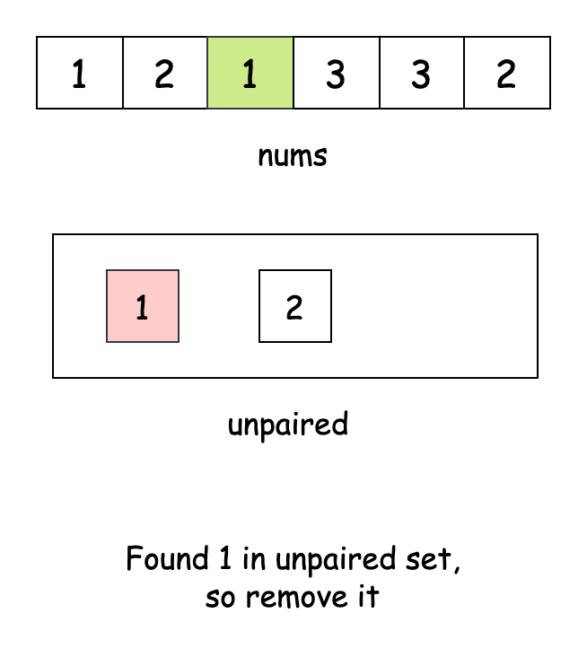
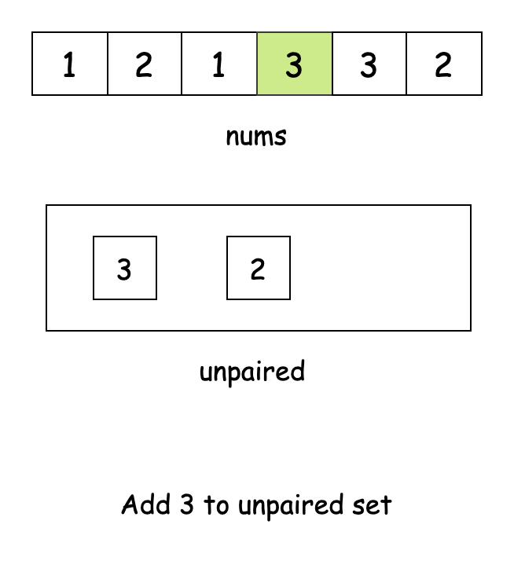
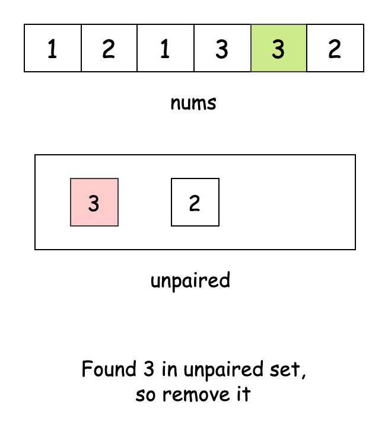
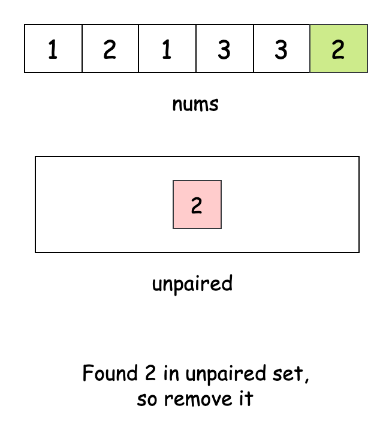
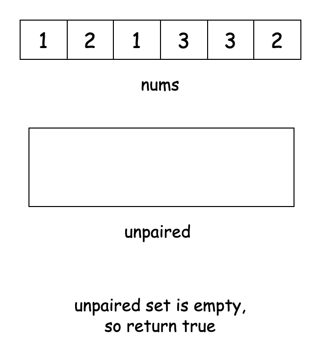

[TOC]

## Solution

---

### Approach 1: Sorting

#### Intuition

To begin with, let's think how we would solve the problem manually with a small example, such as `[3, 2, 3, 2, 2, 2]`. To find matching pairs, we naturally look for equal numbers: "Here's a `3`, where's another `3`? Here's a `2`, where's another `2`?" This process works intuitively, but implementing it directly would require multiple passes over the array - an approach that quickly becomes inefficient as the array grows larger.

But what if we could somehow arrange the elements of the array so that equal numbers appear next to each other? In that case, checking for matching pairs would become much simpler - we would only need to examine consecutive elements. This insight suggests sorting the array as a solution.

Let's see what happens when we sort our example: `[2, 2, 2, 2, 3, 3]`. Now the equal numbers are automatically grouped together! This arrangement makes our task much simpler. Instead of searching the entire array for matching pairs, we can just look at adjacent elements.

After sorting, we can iterate through the array two elements at a time, pairing each number with its neighbor. For each pair, we check if both elements are equal. If we ever encounter a pair of consecutive elements that don't match, we know that pairing all elements equally is impossible and can return `false` immediately.

If we reach the end of the array, without finding any mismatched pairs, all elements were paired with an equal. In that case, we return `true`.

#### Algorithm

- Sort the array `nums` in non-decreasing order to group identical elements next to each other.
- Iterate through the array `nums` with a position counter `pos`.
  - Check if the element $\text{nums}[pos]$ matches the element $nums[pos + 1]$.
  - If these elements do not match, return `false` since we cannot form valid pairs.
  - Move `pos` forward by `2` positions to check the next potential pair.
- If we successfully checked all pairs without finding any mismatches, return `true`.

#### Implementation

```python
class Solution:
    def divideArray(self, nums: List[int]) -> bool:
        # Sort array to group equal elements together
        nums.sort()
        # Check consecutive pairs in sorted array
        return all(nums[i] == nums[i + 1] for i in range(0, len(nums), 2))
```

#### Complexity Analysis

Let $2 \cdot n$ be the number of elements in the array `nums`.

- Time complexity: $O(n \log n)$

    The primary operation in this approach is sorting the array, which takes $O(2n \log (2n))$ time. After sorting, we perform a single pass through the array in increments of $2$, which requires $O(n)$ operations. Since $O(2n \log (2n))$ dominates $O(n)$, the overall time complexity remains $O(2n \log (2n))$, which simplifies to $O(n \log n)$.

- Space complexity: $O(S)$

    The space taken by the sorting algorithm ($S$) depends on the language of implementation:
- In Java, `Arrays.sort()` is implemented using a variant of the Quick Sort algorithm, which has a space complexity of $O(\log (2n)) = O(\log n)$.
- In C++, the `sort()` function is implemented as a hybrid of Quick Sort, Heap Sort, and Insertion Sort, with a worst-case space complexity of $O(\log (2n)) = O(\log n)$.
- In Python, the `sort()` method sorts a list using the Timsort algorithm, which is a combination of Merge Sort and Insertion Sort and has a space complexity of $O(2n) = O(n)$.

    Apart from this, we don't use any extra space that grows with the input size. So, the space complexity is $O(S)$.

---

### Approach 2: Map

#### Intuition

Let's approach this problem from a different angle. Instead of arranging numbers to find pairs, what if we count how many times each number appears in our array?

For a number to be successfully paired, it needs to appear an even number of times. For example, if we have the number `5` appearing three times, we can never pair all instances of `5` because one will always be left over.

Let's look at an example array `[1, 2, 2, 1, 3, 3]`. When we count, we find two `1`s, two `2`s, and two `3`s. Since each number appears an even number of times, we can pair them all up perfectly. But if we had `[1, 2, 2, 2, 1, 3, 3, 3]`, we'd run into a problem. While the `1`s can still be paired, both the `2`s and the `3`s appear an odd number of times, leaving one leftover element in each case.

This idea leads us to a frequency-based solution. A popular data structure to count and store the frequency of elements is the hash map. We'll create a hash map called `frequency`, where the key is the number and the value is how many times it shows up. We'll go through the array once, updating the map each time we see a number.

After we've counted everything, our job becomes simple: we need to check if each number appears an even number of times. If we find any number that shows up an odd number of times, we know right away that perfect pairing is impossible, so we return `false`. If every number appears an even number of times, we can return `true`.

> For a more comprehensive understanding of hash tables, check out the [Hash Table Explore Card](https://leetcode.com/explore/learn/card/hash-table/). This resource provides an in-depth look at hash tables, explaining their key concepts and applications with a variety of problems to solidify understanding of the pattern.

#### Algorithm

- Create a frequency map `frequency` to store the count of each number in `nums`.
- For each number `num` in the array `nums`:
  - If `num` already exists in `frequency`, increment its count by `1`.
  - Else, add it with a count of `1`.
- For each unique number `num` in the `frequency` map:
  - Get the count of this number from `frequency`.
  - If the count is not divisible by `2`, return `false` since we cannot pair all occurrences.
- If we checked all numbers without finding any odd frequencies, return `true`.

#### Implementation

```python
class Solution:
    def divideArray(self, nums: List[int]) -> bool:
        # Count frequency of each number using Counter
        frequency = Counter(nums)

        # Check if each number appears even number of times
        return all(count % 2 == 0 for count in frequency.values())
```

#### Complexity Analysis

Let $2 \cdot n$ be the number of elements in the array `nums`.

- Time complexity: $O(n)$

    The approach involves two main steps: first, we iterate through `nums` to build the frequency map, which takes $O(2n) = O(n)$, as all hashmap operations - including accessing and updating - take constant time on average. Then, we iterate through the keys of the map to check if each count is even, which takes $O(n)$ time in the worst case (when all elements are distinct). Since both steps run sequentially and independently in $O(n)$, the overall time complexity remains $O(n)$.

- Space complexity: $O(n)$

    The frequency map stores at most $O(2n)$ unique keys in the worst case (when all elements are distinct). Since this additional space grows linearly with input size, the space complexity is $O(n)$.

---

### Approach 3: Boolean Array

#### Intuition

Our core task is simple: when we encounter a number for the first time, we need to find a partner for it. When we see it again, we've completed a pair.

Think of it like using a light switch for each number. The first time we see a number, we flip the switch on, indicating that the current element needs to be paired with a matching one. The second time we encounter a number, we flip the switch off, as a pair is successfully formed. If all numbers can be paired, every switch should end up in the off position. Since each light switch can be implemented using a boolean value (`true` or `false`), we'll represent the "state" of each number (waiting for a partner or not) using a boolean array.

The boolean array `needsPair` acts as our set of switches. The index represents the number, and the boolean value represents whether we're currently looking for a partner for that number. When we toggle $\text{needsPair}[num]$, we're essentially saying "I either need a partner for `num`" (`true`) or "I've found a complete pair" (`false`).

Before we start, we need to know how big to make our boolean array. We'll look through `nums` to find the biggest number, then make our array one element larger than that. This way, we'll have enough room for all possible numbers.

We can then loop over `nums` and flip the value in the boolean array for each element in `nums`. Finally, we run another loop over `needsPair` and check if any value is `true`. If it is, we immediately return `false`, since there is an unpaired element remaining. Otherwise, if all the values are `false`, we can return `true` as our answer.

#### Algorithm

- Initialize a variable `maxNum` to store the largest value in the array `nums`.
- For each number `num` in `nums`:
  - Update `maxNum` if `num` is larger than the current `maxNum`.
- Create a boolean array `needsPair` of size $maxNum + 1$ to track pairing status.
- For each number `num` in `nums`:
  - Toggle the value at $\text{needsPair}[num]$ from `true` to `false` or `false` to `true`.
- For each number `num` in `nums`:
  - Check if $\text{needsPair}[num]$ is `true`.
  - If `true`, it means this number appeared an odd number of times, so return `false`.
- If no unpaired numbers are found, return `true`.

#### Implementation

```python
class Solution:
    def divideArray(self, nums: List[int]) -> bool:
        # Find maximum value in array
        max_num = max(nums)

        # Toggle pair status for each number
        needs_pair = [False] * (max_num + 1)
        for num in nums:
            needs_pair[num] = not needs_pair[num]

        # Check if any number remains unpaired
        return not any(needs_pair[num] for num in nums)
```

#### Complexity Analysis

Let $2 \cdot n$ be the number of elements in the array `nums`.

- Time complexity: $O(n)$

    The approach consists of three main steps. First, we find the greatest element in `nums`, which takes $O(n)$ time. Next, we iterate through `nums` again to toggle the pairing status in the `needsPair` array, which also takes $O(n)$ time. Finally, we perform another pass through `nums` to check if any number remains unpaired, requiring another $O(n)$ time. Since all steps run in $O(n)$, the overall time complexity remains $O(n)$.

- Space complexity: $O(\text{maxNum})$

    The algorithm uses an auxiliary boolean array `needsPair` of size $\text{maxNum + 1}$, where $\text{maxNum}$ is the largest number in `nums`. This means the space usage depends on $\text{maxNum}$, making the space complexity $O(\text{maxNum})$.

---

### Approach 4: Hash Set

#### Intuition

The key idea behind this approach is that when an element finds its matching pair, we no longer need to track either of them. This means we only need to remember which numbers are still looking for their partners.

Let's loop over `nums` and try to pair each element. We'll maintain another data structure which will hold all elements waiting to find their pairs. For each element in `nums`, we'll first check if it has a pair available to match. If it does, we can remove the unpaired element, freeing up space. If it doesn't have a matching element, we'll add the element to the data structure for future pairing.

To implement this, we need a data structure that allows us to efficiently look up whether a particular element exists in it or not, along with adding and removing elements. [Hash sets](https://leetcode.com/explore/learn/card/hash-table/183/combination-with-other-algorithms/) are perfectly suited for this task. Hash sets allow for the lookup, addition, and removal of elements in constant time.

Once we have looped through the entire array, we check the set. If it is empty, all elements have found a pair, so we return `true`. If any elements remain in the set, they can't find a pair, so we return `false`.

The slideshow below demonstrates the algorithm in action:

















#### Algorithm

- Create a hash set `unpaired` to track numbers that haven't found their pairs yet.
- For each number `num` in `nums`:
  - If `num` is already in `unpaired`, remove it (we found its pair).
  - Else, add it to `unpaired` (waiting for its pair).
- Check if `unpaired` is empty:
  - If empty, return `true` as all numbers found their pairs.
  - If not empty, return `false`.

#### Implementation

```python
class Solution:
    def divideArray(self, nums: List[int]) -> bool:
        # Track unpaired numbers
        unpaired = set()

        # Add numbers to set if unseen, remove if seen
        for num in nums:
            if num in unpaired:
                unpaired.remove(num)
            else:
                unpaired.add(num)

        # Return true if all numbers were paired
        return not unpaired
```

#### Complexity Analysis

Let $2 \cdot n$ be the number of elements in the array `nums`.

- Time complexity: $O(n)$

    The approach iterates through `nums` once, performing constant-time operations for each element. Checking for an element’s existence in a hash set and adding or removing an element both take $O(1)$ time on average. Since we perform these operations $2n$ times, the overall time complexity remains $O(n)$.

- Space complexity: $O(n)$

    The hash set stores at most $O(2n)$ elements in the worst case, where all elements in `nums` are unique before pairing begins. Since the additional space scales linearly with $2n$, the space complexity is $O(n)$.

---

#### Why a Bit Manipulation Solution Was Not Included

##### XOR Approach Limitations

While XOR operations are useful in many bit manipulation problems, they aren't suitable for this particular challenge. Consider the array `[1,2,4,7]`. If we XOR all elements, we get $1^{2}^4^{7} = 0$. This result doesn't tell us whether pairs can be formed, as XOR only indicates if each bit position has an even number of `1`s overall. XOR loses the critical frequency information needed to determine if each element appears exactly twice.

##### Hashmap as a Better Alternative

Despite this problem's bit manipulation tag, we opted against using bitsets since they lack universal support across programming languages. A hashmap solution offers better portability and readability while directly addressing the problem's core challenge: tracking how many times each element appears in the array.

---