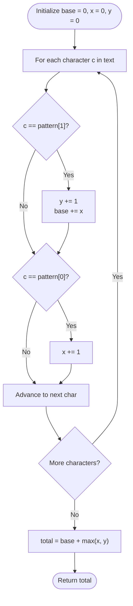

# Guided Example: Maximize Number of Subsequences in a String

We analyze and trace the prefix-product accumulation and boundary placement algorithm for maximizing 2-character subsequence occurrences under a single character insertion, establishing $O(n)$ time complexity and $O(1)$ auxiliary memory.

- **Input:** `text = "abdcdbc"`, `pattern = "ac"`
- **Output:** `4`

This representative instance highlights cumulative prefix-counting for existing subsequences, the boundary placement extremal theorem, and greedy selection between prepending and appending.

---

## 1. Problem Overview & Representative Instance

We are given a 0-indexed string `text` and a 2-character string `pattern = [c_0, c_1]`.
We are allowed to insert either $c_0$ or $c_1$ at **any** position in `text` (including at the very beginning or the very end).

Our goal is to compute the maximum number of times `pattern` can appear as a subsequence in the resulting modified string.

### Representative Instance Breakdown

Consider:
$$\text{text} = \text{"abdcdbc"}, \quad \text{pattern} = \text{"ac"}$$

Here $c_0 = 'a'$ and $c_1 = 'c'$.
1. **Existing Occurrences in `text`:**
   - $'a'$ occurs at index $0$.
   - $'c'$ occurs at index $3$ and index $6$.
   - Valid $(c_0, c_1)$ subsequence pairs in the original text:
     - Pair $(0, 3)$: $\text{text}[0] = 'a', \text{text}[3] = 'c'$
     - Pair $(0, 6)$: $\text{text}[0] = 'a', \text{text}[6] = 'c'$
   - Baseline subsequence count: $2$.
2. **Options for Inserting One Extra Character:**
   - **Option 1 (Insert $'a'$):** Placing $'a'$ at the very beginning of the string (`"aabdcdbc"`) allows this new $'a'$ to pair with **all** existing occurrences of $'c'$ (count $= 2$).
     - Additional subsequences created: $2$.
     - Total subsequences: $2 + 2 = 4$.
   - **Option 2 (Insert $'c'$):** Placing $'c'$ at the very end of the string (`"abdcdbcc"`) allows this new $'c'$ to pair with **all** existing occurrences of $'a'$ (count $= 1$).
     - Additional subsequences created: $1$.
     - Total subsequences: $2 + 1 = 3$.

Comparing options: $\max(4, 3) = 4$.
The maximum possible subsequence count is $4$.

---

## 2. Mathematical & Algorithmic Principles

### Subsequence Counting Decomposition

Let $I_0 = \{i \mid \text{text}[i] = c_0\}$ and $I_1 = \{j \mid \text{text}[j] = c_1\}$.
The number of existing subsequences matching $\text{pattern}$ is:
$$\text{base} = \sum_{j \in I_1} |\{i \in I_0 \mid i < j\}|$$

During a single left-to-right pass over `text`:
- Maintain a running counter $x$ of observed $c_0$ characters.
- Whenever a character matching $c_1$ is visited, increment the running answer by $x$.
- Maintain the total counts $x = |I_0|$ and $y = |I_1|$.

### The Boundary Placement Extremal Theorem

Suppose we insert character $c_0$ at index $p \in \{0, 1, \dots, n\}$.
The number of new $(c_0, c_1)$ subsequences formed by this inserted $c_0$ is the number of $c_1$ characters located strictly to its right:
$$\Delta_0(p) = |\{j \in I_1 \mid j \ge p\}|$$
Because this count is monotonically non-increasing in $p$, it achieves its unique global maximum at $p = 0$:
$$\max_{p} \Delta_0(p) = \Delta_0(0) = |I_1| = y$$
Thus, inserting $c_0$ at the very beginning is strictly optimal for $c_0$.

Similarly, if we insert character $c_1$ at index $p$, the number of new subsequences formed is the number of $c_0$ characters located strictly to its left:
$$\Delta_1(p) = |\{i \in I_0 \mid i < p\}|$$
This count is monotonically non-decreasing in $p$, achieving its maximum at the terminal index $p = n$:
$$\max_{p} \Delta_1(p) = \Delta_1(n) = |I_0| = x$$
Thus, inserting $c_1$ at the very end is strictly optimal for $c_1$.

The optimal total count is therefore:
$$\text{OPT} = \text{base} + \max(x, y)$$

---

## 3. Step-by-Step Walkthrough with Intermediate State

We trace `text = "abdcdbc"` with `pattern = "ac"`.

### Initialization
- Target characters: $c_0 = 'a', c_1 = 'c'$.
- Running $c_0$ count: $x = 0$.
- Running $c_1$ count: $y = 0$.
- Baseline subsequences: $\text{ans} = 0$.

---

### Step 1: Scan `text`
1. Index $0$ ($'a'$):
   - Not $'c'$.
   - Matches $'a'$: $x \leftarrow 0 + 1 = 1$.
   - State: $x = 1, y = 0, \text{ans} = 0$.
2. Index $1$ ($'b'$):
   - Neither $'a'$ nor $'c'$. Unchanged.
3. Index $2$ ($'d'$):
   - Neither $'a'$ nor $'c'$. Unchanged.
4. Index $3$ ($'c'$):
   - Matches $'c'$: $y \leftarrow 0 + 1 = 1$.
   - Pairs added: $\text{ans} \leftarrow \text{ans} + x = 0 + 1 = 1$.
   - State: $x = 1, y = 1, \text{ans} = 1$.
5. Index $4$ ($'d'$):
   - Ignored.
6. Index $5$ ($'b'$):
   - Ignored.
7. Index $6$ ($'c'$):
   - Matches $'c'$: $y \leftarrow 1 + 1 = 2$.
   - Pairs added: $\text{ans} \leftarrow \text{ans} + x = 1 + 1 = 2$.
   - State: $x = 1, y = 2, \text{ans} = 2$.

End of scan: $x = 1$ ($'a'$ count), $y = 2$ ($'c'$ count), $\text{ans} = 2$ baseline pairs.

---

### Step 2: Optimal Boundary Character Addition
- Prepending $'a'$ contributes $+y = +2$ pairs $\implies 2 + 2 = 4$.
- Appending $'c'$ contributes $+x = +1$ pair $\implies 2 + 1 = 3$.
- Optimal addition: $\max(x, y) = \max(1, 2) = 2$.
- Final answer: $\text{ans} + \max(x, y) = 2 + 2 = 4$.

---

## 4. Comprehensive State Trace

The table below summarizes state variables across all character positions in `text`.

| Index $i$ | Character `text[i]` | Match $c_1 = 'c'$? | $y$ Count | Base Pairs Added | Match $c_0 = 'a'$? | $x$ Count | Cumulative `ans` |
|---|---|---|---|---|---|---|---|
| Start | — | — | $0$ | — | — | $0$ | $0$ |
| $0$ | $'a'$ | No | $0$ | $0$ | **Yes** | $1$ | $0$ |
| $1$ | $'b'$ | No | $0$ | $0$ | No | $1$ | $0$ |
| $2$ | $'d'$ | No | $0$ | $0$ | No | $1$ | $0$ |
| $3$ | $'c'$ | **Yes** | $1$ | $+1$ | No | $1$ | $1$ |
| $4$ | $'d'$ | No | $1$ | $0$ | No | $1$ | $1$ |
| $5$ | $'b'$ | No | $1$ | $0$ | No | $1$ | $1$ |
| $6$ | $'c'$ | **Yes** | $2$ | $+1$ | No | $1$ | $2$ |

### Insertion Strategy Payoff Matrix

| Placement Strategy | Added Character | Insertion Position | Additional Pairs Created | Total Result |
|---|---|---|---|---|
| Strategy A (Optimal) | $'a'$ | Beginning (index 0) | $y = 2$ | **4** |
| Strategy B | $'c'$ | End (index $n$) | $x = 1$ | 3 |
| Strategy C (Suboptimal) | $'a'$ | Middle (index 4) | $1$ | 3 |
| Strategy D (Suboptimal) | $'c'$ | Middle (index 2) | $1$ | 3 |

---

## 5. Algorithmic Correctness & Soundness

### Soundness of Boundary Optimality
For any insertion of $c_0$ at index $k$, the character can only pair with occurrences of $c_1$ whose indices are $> k$.
Since the set of indices $> k$ is a subset of the set of indices $> 0$, the number of pairs formed by $c_0$ at index $0$ is an upper bound on the pairs formed at any position $k$.
An identical argument shows appending $c_1$ at index $n$ provides an upper bound for inserting $c_1$.
Because only $c_0$ or $c_1$ can be inserted, the maximum achievable count is strictly $\text{base} + \max(x, y)$.

### Handling Identical Characters in Pattern ($c_0 = c_1$)
When $c_0 = c_1$ (e.g. $\text{pattern} = \text{"aa"}$):
- Checking $c == \text{pattern}[1]$ before $c == \text{pattern}[0]$ ensures that an existing character does not pair with itself in the baseline sum: $\text{ans} = \binom{m}{2} = \frac{m(m-1)}{2}$.
- Both $x$ and $y$ evaluate to the total count $m$.
- Adding $\max(x, y) = m$ yields $\frac{m(m-1)}{2} + m = \frac{m(m+1)}{2} = \binom{m+1}{2}$, which is precisely the number of pairs in a string with $m + 1$ identical characters.
Thus, identical character patterns are handled soundly and automatically.

---

## 6. Edge Cases & Anti-Patterns

### Edge Cases
- **No Pattern Characters Present in `text` (`text = "xyz"`, `pattern = "ab"`):** $x = 0, y = 0, \text{base} = 0$. $\max(0, 0) = 0 \implies 0$.
- **Only One Pattern Character Present (`text = "aaaa"`, `pattern = "ab"`):** $x = 4, y = 0, \text{base} = 0$. Adding $'b'$ at the end creates $\max(4, 0) = 4$ pairs.
- **Identical Pattern Characters (`text = "aaa"`, `pattern = "aa"`):** Baseline pairs $= 3$. Adding one $'a'$ creates $\max(3, 3) = 3$ new pairs, total $6$.

### Anti-Patterns to Avoid
- **Brute Force String Reconstruction:** Inserting characters at every possible index $0 \dots n$ and rescanning the entire string takes $O(n^2)$ time. A single linear pass computes the answer directly.
- **Incorrect Update Order for $c_0 = c_1$:** Incrementing $x$ before adding $x$ to `ans` when $c_0 == c_1$ causes a character to pair with itself, overcounting by $m$.

---

## 7. Complexity Analysis

### Time Complexity
- A single linear scan over `text` of length $n$.
- At each character, constant-time arithmetic comparisons and updates are performed.
- Total Time Complexity: $\mathcal{O}(n)$, which executes in less than $2$ milliseconds for $n \le 10^5$.

### Space Complexity
- Uses three 64-bit integer accumulators ($x, y, \text{ans}$).
- No string modifications or heap memory allocations are performed.
- Auxiliary Space Complexity: $\mathcal{O}(1)$.
