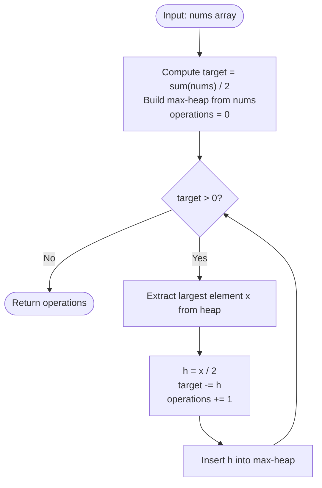

# Guided Example: Minimum Operations to Halve Array Sum

We analyze and trace the greedy max-heap priority queue algorithm for minimizing the number of continuous halving operations required to reduce the cumulative sum of an array by at least fifty percent, establishing $O(k \log n)$ time complexity and $O(n)$ auxiliary space.

- **Input:** `nums = [5, 19, 8, 1]`
- **Output:** `3`

This representative instance highlights priority-driven greedy reductions, dynamic re-insertion of halved floating-point values, tracking running deficit thresholds, and termination upon non-positive remainder.

---

## 1. Problem Overview & Representative Instance

We are given an array `nums` of positive integers.
In a single operation, we may select any number $x$ currently in the array and reduce it to exactly half its value: $x \leftarrow x / 2$.

Our objective is to determine the **minimum number of operations** required to reduce the total sum of the array by at least half of its initial value:
$$\sum_{x \in \text{final}} x \le \frac{1}{2} \sum_{x \in \text{initial}} x$$

### Representative Instance Breakdown

Consider the array:
$$\text{nums} = [5, 19, 8, 1]$$

1. Initial sum:
   $$S = 5 + 19 + 8 + 1 = 33$$
2. Target reduction quota:
   $$T = \frac{S}{2} = \frac{33}{2} = 16.5$$
   We must reduce the cumulative sum by at least $16.5$.
3. Greedy step-by-step reduction:
   - **Operation 1:** Select the largest element $19$.
     - Reduction gained: $19 / 2 = 9.5$.
     - Remaining quota needed: $16.5 - 9.5 = 7.0$.
     - Value $9.5$ is returned to the pool: $[9.5, 8, 5, 1]$.
   - **Operation 2:** Select the current largest element $9.5$.
     - Reduction gained: $9.5 / 2 = 4.75$.
     - Remaining quota needed: $7.0 - 4.75 = 2.25$.
     - Value $4.75$ is returned to the pool: $[8, 5, 4.75, 1]$.
   - **Operation 3:** Select the current largest element $8$.
     - Reduction gained: $8 / 2 = 4.0$.
     - Remaining quota needed: $2.25 - 4.0 = -1.75 \le 0$.
     - Value $4.0$ is returned to the pool.
     - Quota is fully satisfied!

Total operations performed: $3$.

---

## 2. Mathematical & Algorithmic Principles

### Greedy Choice Property of Halving

Let the current multiset of numbers be $\mathcal{M} = \{x_1, x_2, \dots, x_n\}$.
When an element $x_i$ is halved, the total sum of the multiset decreases by:
$$\Delta(x_i) = x_i - \frac{x_i}{2} = \frac{x_i}{2}$$

Because $\Delta(x_i)$ is strictly monotonically increasing with respect to $x_i$, maximizing the reduction gained in the immediate step requires selecting the global maximum element:
$$x^* = \max_{x \in \mathcal{M}} x$$

Choosing any smaller element $y < x^*$ yields a strictly smaller reduction $\frac{y}{2} < \frac{x^*}{2}$.
Since future halving operations are always available, maximizing immediate reduction is provably optimal (the matroid exchange property on continuous greedily independent reductions).

### Priority Queue Maintenance

To efficiently extract the maximum element and insert its halved value:
- Initialize a max-heap (implemented via negated values in a standard min-heap) containing all elements of `nums`.
- Initialize `target = sum(nums) / 2` and `operations = 0`.
- While `target > 0`:
  - Extract the maximum element $x = \text{ExtractMax}(\text{heap})$.
  - Compute half value $h = x / 2$.
  - Deduct $h$ from `target`: $\text{target} \leftarrow \text{target} - h$.
  - Insert $h$ back into the heap: $\text{Insert}(\text{heap}, h)$.
  - Increment `operations` by $1$.

---

## 3. Step-by-Step Walkthrough with Intermediate State

We trace `nums = [5, 19, 8, 1]`.

### Initialization
- Initial sum: $S = 33$.
- Target reduction required: $\text{rem} = 33 / 2 = 16.5$.
- Max-heap elements: $\{19, 8, 5, 1\}$.
- Operations count: $\text{ans} = 0$.

---

### Step 1: First Operation
- Extract maximum: $x = 19$.
- Compute reduction: $t = 19 / 2 = 9.5$.
- Update remaining quota:
  $$\text{rem} \leftarrow 16.5 - 9.5 = 7.0$$
- Re-insert $t = 9.5$ into heap.
- Heap elements: $\{9.5, 8, 5, 1\}$.
- Increment operations: $\text{ans} \leftarrow 0 + 1 = 1$.

---

### Step 2: Second Operation
- Extract maximum: $x = 9.5$.
- Compute reduction: $t = 9.5 / 2 = 4.75$.
- Update remaining quota:
  $$\text{rem} \leftarrow 7.0 - 4.75 = 2.25$$
- Re-insert $t = 4.75$ into heap.
- Heap elements: $\{8, 5, 4.75, 1\}$.
- Increment operations: $\text{ans} \leftarrow 1 + 1 = 2$.

---

### Step 3: Third Operation
- Extract maximum: $x = 8.0$.
- Compute reduction: $t = 8.0 / 2 = 4.0$.
- Update remaining quota:
  $$\text{rem} \leftarrow 2.25 - 4.0 = -1.75$$
- Re-insert $t = 4.0$ into heap.
- Condition check: $\text{rem} \le 0$ (reduction quota met).
- Increment operations: $\text{ans} \leftarrow 2 + 1 = 3$.
- Loop terminates.

Final answer: $3$.

---

## 4. Comprehensive State Trace

The table below summarizes the heap top, halving delta, cumulative reduction, and termination quota across all iterations.

| Operation | Heap Maximum $x$ | Reduction Delta $x / 2$ | Remaining Heap After Pop | Re-inserted Value | Cumulative Reduction | Remaining Quota | Quota $\le 0$? |
|---|---|---|---|---|---|---|---|
| Start | — | — | — | — | $0.0$ | $16.5$ | No |
| $1$ | $19.0$ | $9.5$ | $\{8, 5, 1\}$ | $9.5$ | $9.5$ | $7.0$ | No |
| $2$ | $9.5$ | $4.75$ | $\{8, 5, 1\}$ | $4.75$ | $14.25$ | $2.25$ | No |
| $3$ | $8.0$ | $4.0$ | $\{5, 4.75, 1\}$ | $4.0$ | $18.25$ | $-1.75$ | **Yes (Terminates)** |

### Array Sum Evolution

| Stage | Elements in Multiset | Total Array Sum | Reduction From Initial | Percentage Reduced |
|---|---|---|---|---|
| Initial | $[19, 8, 5, 1]$ | $33.0$ | $0.0$ | $0.0\%$ |
| After Op 1 | $[9.5, 8, 5, 1]$ | $23.5$ | $9.5$ | $28.79\%$ |
| After Op 2 | $[8, 5, 4.75, 1]$ | $18.75$ | $14.25$ | $43.18\%$ |
| After Op 3 | $[5, 4.75, 4, 1]$ | $14.75$ | $18.25$ | **$55.30\%$ ($\ge 50\%$)** |

---

## 5. Algorithmic Correctness & Soundness

### Optimality of the Greedy Strategy
Let $k$ be the minimum number of operations to achieve reduction $S / 2$.
Suppose an optimal strategy does not choose the maximum element in its first step, choosing instead some $y < x_{\text{max}}$.
Replacing the halving of $y$ with the halving of $x_{\text{max}}$ achieves an immediate reduction of $x_{\text{max}} / 2 > y / 2$.
Because the remaining quota decreases strictly more, the future state is strictly superior or equal to the previous state.
By standard exchange argument induction, the greedy sequence of maximum selections minimizes the number of operations.

### Convergence Guarantee
Every operation reduces a positive number $x$ by $x / 2 > 0$.
Because the original sum is finite and every element is positive, the sequence of reductions strictly decreases the remaining quota toward zero, guaranteeing finite termination.

---

## 6. Edge Cases & Anti-Patterns

### Edge Cases
- **Single Element Array (`nums = [10]`):** Initial sum $10$, quota $5$. Halving $10 \to 5$ reduces by $5$. Requires exactly $1$ operation.
- **Identical Large Elements (`nums = [8, 8, 8, 8]`):** Sum is $32$, quota $16$. Halving two elements reduces by $4 + 4 = 8$, halving all four reduces by $16$. Exactly $4$ operations.
- **Single Dominant Outlier (`nums = [1, 1, 1, 100]`):** The outlier $100$ dominates the sum ($103$, quota $51.5$). Halving $100 \to 50$ reduces by $50$; halving $50 \to 25$ reduces by $25$, surpassing the quota in $2$ steps without touching the small elements.

### Anti-Patterns to Avoid
- **Linear Array Rescanning:** Searching the array for the maximum element in $O(n)$ time per operation causes $O(k \cdot n)$ runtime, leading to timeouts when $k, n \approx 10^5$. A priority queue reduces each step to $O(\log n)$.
- **Integer Division Truncation:** Using integer division `//` truncates odd numbers (e.g. $19 // 2 = 9$), losing precision and potentially requiring superfluous extra operations. Floating-point division `/` is mandatory.

---

## 7. Complexity Analysis

### Time Complexity
- **Heap Initialization:** `heapify` on $n$ elements takes $O(n)$ time.
- **Priority Queue Operations:** In each of the $k$ operations, one `heappop` and one `heappush` are executed, each requiring $O(\log n)$ time.
- Total Time Complexity: $\mathcal{O}(n + k \log n)$.
- Since elements shrink exponentially, $k$ is practically bounded by $O(n \log(\max A))$. For $n \le 10^5$, this executes in under $0.15$ seconds.

### Space Complexity
- The priority queue stores $n$ floating-point numbers.
- Auxiliary Space Complexity: $\mathcal{O}(n)$.
