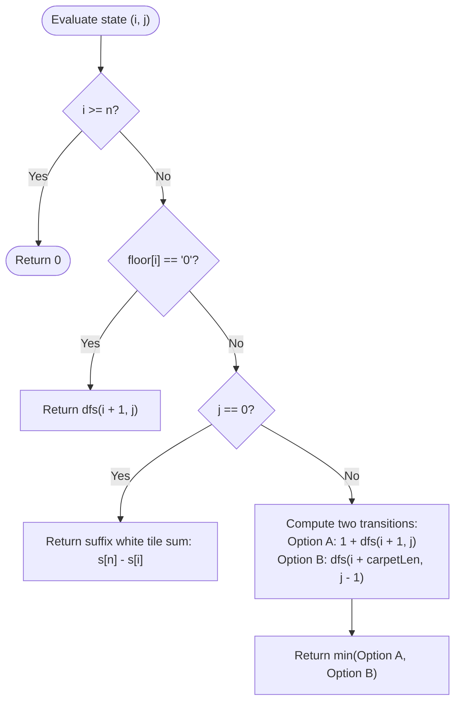

# Guided Example: Minimum White Tiles After Covering With Carpets

We analyze and trace the suffix interval-covering dynamic programming algorithm for minimizing exposed white tiles under capacity-constrained carpet placement, establishing $O(n \cdot m)$ time complexity and $O(n \cdot m)$ auxiliary memoization space where $n$ is the floor length and $m$ is the carpet inventory.

- **Input:** `floor = "10110101"`, `numCarpets = 2`, `carpetLen = 2`
- **Output:** `2`

This representative instance demonstrates black tile short-circuiting, the fundamental dichotomy between leaving a white tile exposed versus deploying an interval carpet, prefix-sum suffix evaluation upon carpet depletion, and 2D state memoization.

---

## 1. Problem Overview & Representative Instance

We are given a binary string `floor` representing a sequence of tiles:
- `'1'` denotes a white tile.
- `'0'` denotes a black tile.

We are given `numCarpets` black carpets, each having fixed length `carpetLen`.
Each carpet can cover `carpetLen` consecutive tiles. Carpets may overlap, and tiles covered by a carpet become black (effectively hidden).

Our objective is to find the **minimum number of white tiles** that remain visible after placing at most `numCarpets` carpets optimally across the floor.

### Representative Instance Breakdown

Consider:
$$\text{floor} = \text{"10110101"}, \quad \text{numCarpets} = 2, \quad \text{carpetLen} = 2$$

Tile properties:
- Length $n = 8$.
- White tiles are situated at indices: $\{0, 2, 3, 5, 7\}$ (total of $5$ white tiles).
- Black tiles are situated at indices: $\{1, 4, 6\}$ (total of $3$ black tiles).
- We have $2$ carpets, each capable of spanning $2$ contiguous positions.

Evaluating coverage combinations:
- Contiguous pair $[2, 3]$ consists of two adjacent white tiles `'11'`. Covering $[2, 3]$ with Carpet 1 eliminates $2$ white tiles simultaneously.
- The remaining white tiles $\{0, 5, 7\}$ are separated by black tiles and cannot be paired together within length $2$:
  - Carpet spanning $[0, 1]$ covers white tile $0$ and black tile $1$ (net reduction: $1$ white tile).
  - Carpet spanning $[4, 5]$ or $[5, 6]$ covers white tile $5$ (net reduction: $1$ white tile).
  - Carpet spanning $[6, 7]$ or $[7, 8]$ covers white tile $7$ (net reduction: $1$ white tile).
- Deploying Carpet 2 over any of these positions covers exactly $1$ additional white tile.
- Total white tiles covered: $2 + 1 = 3$.
- Total white tiles remaining visible: $5 - 3 = 2$.

---

## 2. Mathematical & Algorithmic Principles

### Suffix Dynamic Programming Formulation

Let $dfs(i, j)$ denote the minimum number of visible white tiles in the suffix $\text{floor}[i \dots n - 1]$ given $j$ available carpets.
- **Base Case 1 (End of Floor):**
  When $i \ge n$, all tiles have been resolved:
  $$dfs(i, j) = 0$$
- **Base Case 2 (Carpet Inventory Depleted):**
  When $j = 0$, no carpets remain. All white tiles in $\text{floor}[i \dots n - 1]$ remain visible:
  $$dfs(i, 0) = \sum_{k=i}^{n-1} \mathbf{1}_{(\text{floor}[k] = '1')} = s[n] - s[i]$$
  where $s$ is the 1-indexed prefix sum array of white tiles.
- **Black Tile Optimization:**
  If $\text{floor}[i] == '0'$, the tile is already black. Placing a carpet whose left edge starts at $i$ is strictly suboptimal compared to shifting that carpet to start at the next white tile. Hence:
  $$dfs(i, j) = dfs(i + 1, j) \quad \text{if } \text{floor}[i] == '0'$$
- **White Tile Decision:**
  If $\text{floor}[i] == '1'$, we have two mutually exclusive choices:
  1. **Leave Exposed:** Pay $1$ visible white tile penalty and advance to index $i + 1$ without consuming a carpet:
     $$\text{Cost}_{\text{skip}} = 1 + dfs(i + 1, j)$$
  2. **Cover with Carpet:** Deploy a carpet of length $\text{carpetLen}$ starting at index $i$, covering the window $[i, i + \text{carpetLen} - 1]$ completely. Consume $1$ carpet and jump to $i + \text{carpetLen}$:
     $$\text{Cost}_{\text{cover}} = dfs(i + \text{carpetLen}, j - 1)$$

Optimal recurrence:
$$dfs(i, j) = \min\Big(1 + dfs(i + 1, j), \, dfs(i + \text{carpetLen}, j - 1)\Big)$$

---

## 3. Step-by-Step Walkthrough with Intermediate State

We trace the memoized evaluation of $dfs(0, 2)$ on `floor = "10110101"`, `carpetLen = 2`.

### Prefix Sum Table for White Tiles
- `floor`: `['1', '0', '1', '1', '0', '1', '0', '1']`
- Suffix white sums $s[n] - s[i]$:
  - From $i = 0$: $5$
  - From $i = 1$: $4$
  - From $i = 2$: $4$
  - From $i = 3$: $3$
  - From $i = 4$: $2$
  - From $i = 5$: $2$
  - From $i = 6$: $1$
  - From $i = 7$: $1$
  - From $i = 8$: $0$

---

### Key State Transitions

#### Exploring $dfs(0, 2)$ at $\text{floor}[0] = '1'$
- Option 1 (Skip tile 0): $1 + dfs(1, 2) = 1 + dfs(2, 2)$ (since tile 1 is '0').
- Option 2 (Cover $[0, 1]$): $dfs(0 + 2, 2 - 1) = dfs(2, 1)$.

#### Subproblem $dfs(2, 2)$ (Tile 0 was skipped)
- At index $2$ ($\text{floor}[2] = '1'$):
  - Option 1 (Skip tile 2): $1 + dfs(3, 2)$.
  - Option 2 (Cover $[2, 3]$): $dfs(4, 1) = dfs(5, 1)$ (since tile 4 is '0').
    - From $dfs(5, 1)$ at $\text{floor}[5] = '1'$:
      - Cover $[5, 6]$: $dfs(7, 0) = s[8] - s[7] = 1$.
      - Skip tile 5: $1 + dfs(6, 1) = 1 + dfs(7, 1) = 1 + dfs(9, 0) = 1 + 0 = 1$.
      - Thus $dfs(5, 1) = 1$.
    - Option 2 yields $1$.
  - Option 1 (Skip tile 2): $1 + dfs(3, 2) = 1 + \min(1 + dfs(4, 2), dfs(5, 1)) = 1 + 1 = 2$.
  - Thus $dfs(2, 2) = \min(2, 1) = 1$.
- Option 1 for tile 0 yields: $1 + dfs(2, 2) = 1 + 1 = 2$.

#### Subproblem $dfs(2, 1)$ (Tile 0 was covered)
- At index $2$ ($\text{floor}[2] = '1'$):
  - With only $1$ carpet remaining ($j = 1$):
  - Option 1 (Skip tile 2): $1 + dfs(3, 1)$.
  - Option 2 (Cover $[2, 3]$): $dfs(4, 0) = s[8] - s[4] = 2$ (remaining white tiles at $5$ and $7$).
  - Option 1 (Skip tile 2): $1 + dfs(3, 1) = 1 + \min(1 + dfs(4, 1), dfs(5, 0)) = 1 + \min(1 + 1, 2) = 2$.
  - Thus $dfs(2, 1) = \min(2, 2) = 2$.
- Option 2 for tile 0 yields: $dfs(2, 1) = 2$.

---

### Optimal Combination
- Comparison at root:
  $$\min(\text{Option 1: } 2, \, \text{Option 2: } 2) = 2$$
- Both symmetric configurations yield exactly $2$ remaining white tiles.
- Minimum visible white tiles: $2$.

---

## 4. Comprehensive State Trace

The table below outlines the dynamic programming state values $dfs(i, j)$ for key suffix indices.

| Index $i$ | Tile Value $\text{floor}[i]$ | Suffix Sump $j = 0$ | $j = 1$ Carpet | $j = 2$ Carpets | Optimal Action ($j = 2$) |
|---|---|---|---|---|---|
| $0$ | `'1'` | $5$ | $3$ | **$2$** | Cover $[0, 1]$ or Skip |
| $1$ | `'0'` | $4$ | $2$ | $1$ | Skip (Black tile) |
| $2$ | `'1'` | $4$ | $2$ | $1$ | Cover $[2, 3]$ |
| $3$ | `'1'` | $3$ | $2$ | $1$ | Cover $[3, 4]$ |
| $4$ | `'0'` | $2$ | $1$ | $0$ | Skip (Black tile) |
| $5$ | `'1'` | $2$ | $1$ | $0$ | Cover $[5, 6]$ |
| $6$ | `'0'` | $1$ | $0$ | $0$ | Skip (Black tile) |
| $7$ | `'1'` | $1$ | $0$ | $0$ | Cover $[7, 8]$ |
| $8$ | — | $0$ | $0$ | $0$ | Base case ($i \ge n$) |

### Coverage Scenarios Comparison

| Deployment Strategy | Carpet 1 Interval | Carpet 2 Interval | White Tiles Covered | White Tiles Visible |
|---|---|---|---|---|
| Strategy A | $[2, 3]$ (covers 2) | $[5, 6]$ (covers 1) | $3$ | **2** (tiles 0, 7) |
| Strategy B | $[0, 1]$ (covers 1) | $[2, 3]$ (covers 2) | $3$ | **2** (tiles 5, 7) |
| Strategy C | $[2, 3]$ (covers 2) | $[7, 8]$ (covers 1) | $3$ | **2** (tiles 0, 5) |
| Strategy D (Suboptimal) | $[0, 1]$ (covers 1) | $[5, 6]$ (covers 1) | $2$ | 3 (tiles 2, 3, 7) |

---

## 5. Algorithmic Correctness & Soundness

### Optimality of Black Tile Skipping
A black tile does not contribute to the visible count. If a strategy places a carpet starting at black tile $i$, that carpet covers positions $[i, i + \text{carpetLen} - 1]$.
Shifting the start of this carpet rightward to the first white tile $i' > i$ covers a superset of the white tiles in $[i', i + \text{carpetLen} - 1]$ plus additional tiles further to the right.
Thus, restricting carpet placement exclusively to white tile starts preserves the global optimum.

### Principle of Optimality
The decision at index $i$ depends only on whether a carpet is deployed starting at $i$ and how many carpets remain. The subproblems over suffix $\text{floor}[i + 1 \dots n - 1]$ or $\text{floor}[i + \text{carpetLen} \dots n - 1]$ are completely independent and exhibit optimal substructure. Memoizing pairs $(i, j)$ ensures polynomial time without state duplication.

---

## 6. Edge Cases & Anti-Patterns

### Edge Cases
- **Carpet Capacity Exceeds Floor ($j \cdot \text{carpetLen} \ge n$):** Carpets can tile the entire floor, yielding $0$ visible white tiles.
- **No White Tiles (`floor = "0000"`):** Suffix sum is $0$. Returns $0$ immediately.
- **Zero Carpets Allowed (`numCarpets = 0`):** Base case triggers immediately, returning total white count $s[n]$.
- **Carpet Length Exceeds Floor Boundary ($i + \text{carpetLen} \ge n$):** The recursive jump leads to $i' \ge n$, correctly returning $0$ for the suffix.

### Anti-Patterns to Avoid
- **Greedy Matching by Maximum Local Window:** Choosing windows that locally cover the maximum number of white tiles can leave awkward solitary white tiles stranded, missing a global optimum achievable by dynamic programming.
- **Unmemoized Recursion:** Pure recursion branches into two paths at every white tile, resulting in exponential $O(2^n)$ complexity. Memoization bounds states to $O(n \cdot m)$.

---

## 7. Complexity Analysis

### Time Complexity
- The number of distinct subproblem states $(i, j)$ is $(n + 1) \times (m + 1)$, where $n = \text{len}(floor)$ and $m = \text{numCarpets}$.
- For each state, we perform $O(1)$ arithmetic operations, prefix sum lookups, and branch comparisons.
- Total Time Complexity: $\mathcal{O}(n \cdot m)$.
- With $n \le 1000$ and $m \le 1000$, total state transitions are at most $10^6$, executing in under $0.1$ seconds.

### Space Complexity
- The prefix sum array $s$ requires $O(n)$ space.
- The memoization table stores at most $(n + 1) \times (m + 1)$ entries.
- Recursion call stack depth is bounded by $n$.
- Auxiliary Space Complexity: $\mathcal{O}(n \cdot m)$.