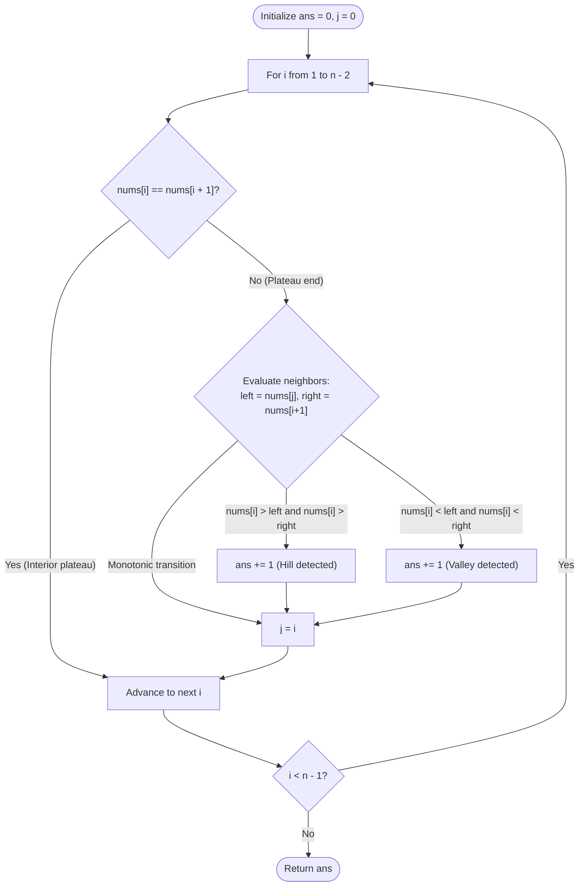

# Guided Example: Count Hills and Valleys in an Array

We analyze and trace the plateau-collapsing bilateral neighborhood comparison algorithm for detecting local extrema across discrete numeric sequences, establishing $O(n)$ time complexity and $O(1)$ auxiliary working space.

- **Input:** `nums = [2, 4, 1, 1, 6, 5]`
- **Output:** `3`

This representative instance illustrates adjacent duplicate suppression, non-equal neighbor pointer tracking, simultaneous hill and valley classification, and boundary exclusion.

---

## 1. Problem Overview & Representative Instance

We are given a 0-indexed integer array `nums`.
An index $i$ ($0 < i < n - 1$) is designated as part of a **hill** or a **valley** based on its closest non-equal neighbors:
- Let $L(i)$ be the closest index strictly to the left of $i$ such that $\text{nums}[L(i)] \ne \text{nums}[i]$.
- Let $R(i)$ be the closest index strictly to the right of $i$ such that $\text{nums}[R(i)] \ne \text{nums}[i]$.

Classification criteria:
1. **Hill:** $\text{nums}[i] > \text{nums}[L(i)]$ and $\text{nums}[i] > \text{nums}[R(i)]$.
2. **Valley:** $\text{nums}[i] < \text{nums}[L(i)]$ and $\text{nums}[i] < \text{nums}[R(i)]$.

Adjacent indices that share identical values belong to the same plateau. A contiguous plateau constitutes at most one hill or one valley.
We must return the total count of hills and valleys present in `nums`.

### Representative Instance Breakdown

Consider the sequence:
$$\text{nums} = [2, 4, 1, 1, 6, 5], \quad n = 6$$

Plateau analysis:
1. **Index 0 (Value 2):** Boundary endpoint. Excluded by definition.
2. **Index 1 (Value 4):**
   - Closest left non-equal neighbor: $\text{nums}[0] = 2$.
   - Closest right non-equal neighbor: $\text{nums}[2] = 1$.
   - Comparisons: $4 > 2$ and $4 > 1$.
   - Classification: **Hill 1**.
3. **Indices 2 and 3 (Plateau of 1s):**
   - Left non-equal neighbor: $\text{nums}[1] = 4$.
   - Right non-equal neighbor: $\text{nums}[4] = 6$.
   - At index 2: $\text{nums}[2] = \text{nums}[3] = 1$. It is an interior plateau cell.
   - At index 3: represents the right boundary of the plateau.
   - Comparisons: $1 < 4$ and $1 < 6$.
   - Classification: **Valley 1**.
4. **Index 4 (Value 6):**
   - Closest left non-equal neighbor: $\text{nums}[3] = 1$.
   - Closest right non-equal neighbor: $\text{nums}[5] = 5$.
   - Comparisons: $6 > 1$ and $6 > 5$.
   - Classification: **Hill 2**.
5. **Index 5 (Value 5):** Boundary endpoint. Excluded.

Total hills: $2$ (at values $4$ and $6$).
Total valleys: $1$ (at value $1$).
Total count: $2 + 1 = 3$.

---

## 2. Mathematical & Algorithmic Principles

### Plateau Condensation Invariant

Any sequence containing identical adjacent runs can be contracted into an equivalent sequence of strictly alternating differences by merging adjacent equal elements:
$$\text{nums} = [x_0, x_1, \dots, x_{n-1}] \longrightarrow \text{condensed} = [y_0, y_1, \dots, y_{m-1}]$$
where $y_k \ne y_{k+1}$ for all $k$.

In the condensed sequence, every interior element $y_k$ ($0 < k < m - 1$) has immediate distinct neighbors $y_{k-1}$ and $y_{k+1}$.
- $y_k$ is a hill $\iff (y_k - y_{k-1}) > 0$ and $(y_k - y_{k+1}) > 0$.
- $y_k$ is a valley $\iff (y_k - y_{k-1}) < 0$ and $(y_k - y_{k+1}) < 0$.

### Online State Tracking via Left-Anchor Pointer

Rather than constructing an explicit auxiliary condensed list, we can evaluate plateaus online in a single linear pass:
- Maintain an index pointer $j$ representing the location of the most recent distinct left neighbor. Initially $j = 0$.
- Iterate $i$ from $1$ to $n - 2$:
  - If $\text{nums}[i] == \text{nums}[i + 1]$, we are inside or at the start of a flat plateau. Skip to prevent duplicate counts.
  - If $\text{nums}[i] \ne \text{nums}[i + 1]$, index $i$ is the terminal right element of the current plateau.
    - Check for hill: $\text{nums}[i] > \text{nums}[j]$ and $\text{nums}[i] > \text{nums}[i + 1]$.
    - Check for valley: $\text{nums}[i] < \text{nums}[j]$ and $\text{nums}[i] < \text{nums}[i + 1]$.
    - Update left anchor: $j \leftarrow i$.

---

## 3. Step-by-Step Walkthrough with Intermediate State

We trace the algorithm execution on `nums = [2, 4, 1, 1, 6, 5]`.

### Initialization
- Array length: $n = 6$.
- Left anchor: $j = 0$ ($\text{nums}[j] = 2$).
- Extremum count: $\text{ans} = 0$.

---

### Iteration $i = 1$ ($\text{nums}[1] = 4$)
- Lookahead: $\text{nums}[2] = 1$.
- Plateau check: $\text{nums}[1] \ne \text{nums}[2]$ ($4 \ne 1$).
- Left neighbor: $\text{nums}[j] = \text{nums}[0] = 2$.
- Right neighbor: $\text{nums}[2] = 1$.
- Condition evaluation:
  - Is $4 > 2$ and $4 > 1$? **Yes, Hill!**
  - Increment count: $\text{ans} \leftarrow 0 + 1 = 1$.
- Update left anchor: $j \leftarrow 1$ ($\text{nums}[j] = 4$).

---

### Iteration $i = 2$ ($\text{nums}[2] = 1$)
- Lookahead: $\text{nums}[3] = 1$.
- Plateau check: $\text{nums}[2] == \text{nums}[3]$ ($1 == 1$).
- Intermediate plateau cell detected.
- Action: Skip. Pointer $j$ remains $1$, $\text{ans}$ remains $1$.

---

### Iteration $i = 3$ ($\text{nums}[3] = 1$)
- Lookahead: $\text{nums}[4] = 6$.
- Plateau check: $\text{nums}[3] \ne \text{nums}[4]$ ($1 \ne 6$).
- Left neighbor: $\text{nums}[j] = \text{nums}[1] = 4$.
- Right neighbor: $\text{nums}[4] = 6$.
- Condition evaluation:
  - Is $1 < 4$ and $1 < 6$? **Yes, Valley!**
  - Increment count: $\text{ans} \leftarrow 1 + 1 = 2$.
- Update left anchor: $j \leftarrow 3$ ($\text{nums}[j] = 1$).

---

### Iteration $i = 4$ ($\text{nums}[4] = 6$)
- Lookahead: $\text{nums}[5] = 5$.
- Plateau check: $\text{nums}[4] \ne \text{nums}[5]$ ($6 \ne 5$).
- Left neighbor: $\text{nums}[j] = \text{nums}[3] = 1$.
- Right neighbor: $\text{nums}[5] = 5$.
- Condition evaluation:
  - Is $6 > 1$ and $6 > 5$? **Yes, Hill!**
  - Increment count: $\text{ans} \leftarrow 2 + 1 = 3$.
- Update left anchor: $j \leftarrow 4$ ($\text{nums}[j] = 6$).

---

### Loop Termination
- Loop over $i \in [1 \dots 4]$ completes.
- Final answer: $3$.

---

## 4. Comprehensive State Trace

The table below tracks pointer indices, neighbor lookups, classification results, and running sums for all loop steps.

| Index $i$ | Value $\text{nums}[i]$ | Lookahead $\text{nums}[i+1]$ | Plateau Interior? | Left Neighbor $\text{nums}[j]$ | Right Neighbor $\text{nums}[i+1]$ | Classification | Updated `ans` | Updated $j$ |
|---|---|---|---|---|---|---|---|---|
| Start | — | — | — | — | — | — | $0$ | $0$ |
| $1$ | $4$ | $1$ | No | $\text{nums}[0] = 2$ | $\text{nums}[2] = 1$ | **Hill** ($4 > 2, 4 > 1$) | $1$ | $1$ |
| $2$ | $1$ | $1$ | **Yes** | — | — | Skipped | $1$ | $1$ |
| $3$ | $1$ | $6$ | No | $\text{nums}[1] = 4$ | $\text{nums}[4] = 6$ | **Valley** ($1 < 4, 1 < 6$) | $2$ | $3$ |
| $4$ | $6$ | $5$ | No | $\text{nums}[3] = 1$ | $\text{nums}[5] = 5$ | **Hill** ($6 > 1, 6 > 5$) | $3$ | $4$ |

### Condensed Plateau Sequence Audit

| Plateau Index | Condensed Value | Preceding Value | Succeeding Value | Local Extremum Type |
|---|---|---|---|---|
| $0$ | $2$ | None (Boundary) | $4$ | None |
| $1$ | $4$ | $2$ | $1$ | **Hill** |
| $2$ | $1$ (span indices 2-3) | $4$ | $6$ | **Valley** |
| $3$ | $6$ | $1$ | $5$ | **Hill** |
| $4$ | $5$ | $6$ | None (Boundary) | None |

---

## 5. Algorithmic Correctness & Soundness

### Soundness of Duplicate Suppression
If an entire plateau consists of identical values $\text{nums}[a \dots b] = v$, every interior element $\text{nums}[k]$ ($a \le k < b$) satisfies $\text{nums}[k] == \text{nums}[k + 1]$.
The `continue` statement skips these elements. The extremum check fires exclusively at the terminal right boundary $i = b$.
Because the entire plateau is evaluated exactly once at $i = b$, no plateau can be counted multiple times.

### Invariant Maintenance of Left Anchor $j$
Whenever a plateau terminates at index $i$, setting $j \leftarrow i$ guarantees that for the subsequent distinct plateau, $\text{nums}[j]$ correctly reflects the value of the immediate left distinct neighbor.
Thus, regardless of how many identical elements separate the left distinct value from the right distinct value, $j$ always references the correct left value.

---

## 6. Edge Cases & Anti-Patterns

### Edge Cases
- **Strictly Monotonic Sequence (`nums = [1, 2, 3, 4, 5]`):** Every element satisfies either $y_{k-1} < y_k < y_{k+1}$ or $y_{k-1} > y_k > y_{k+1}$. No hills or valleys exist. Output: $0$.
- **All Elements Equal (`nums = [3, 3, 3, 3]`):** Every element triggers the `continue` branch. Output: $0$.
- **Alternating Sequence (`nums = [1, 3, 1, 3, 1]`):** Every interior element is alternately a hill or valley. Output: $3$.
- **Long Flat Plateau at Extremum (`nums = [1, 5, 5, 5, 1]`):** Indices $1$ and $2$ are skipped; index $3$ verifies $5 > 1$ and $5 > 1$, incrementing count once to $1$.

### Anti-Patterns to Avoid
- **Checking Immediate Neighbors Without Skipping Duplicates:** Comparing $\text{nums}[i]$ strictly to $\text{nums}[i - 1]$ and $\text{nums}[i + 1]$ fails on flat plateaus because $\text{nums}[i] == \text{nums}[i + 1]$ is not strictly greater/lesser, completely missing valid hills and valleys with plateau tops.
- **Counting Each Index of a Plateau Separately:** Incrementing the count for every cell in a plateau of length $L > 1$ artificially inflates the answer by counting one plateau $L$ times.

---

## 7. Complexity Analysis

### Time Complexity
- The loop iterates from index $1$ to $n - 2$, executing exactly $n - 2$ iterations.
- In each iteration, $O(1)$ comparisons and pointer updates are performed.
- Total Time Complexity: $\mathcal{O}(n)$, which processes $10^5$ elements in less than $2$ milliseconds.

### Space Complexity
- The algorithm uses two integer variables ($j$ and $\text{ans}$) beyond the input array.
- No dynamic memory allocation or array copies are created.
- Auxiliary Space Complexity: $\mathcal{O}(1)$.
