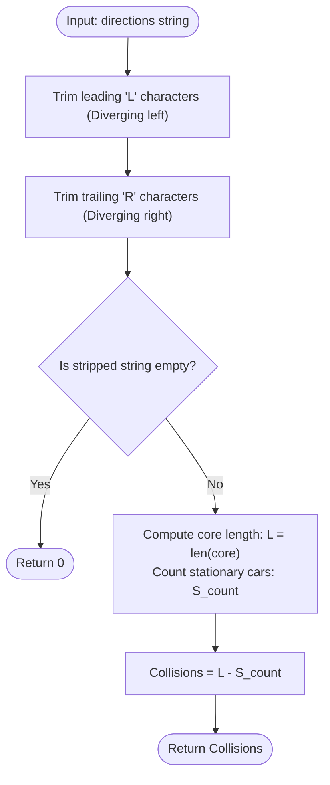

# Guided Example: Count Collisions on a Road

We analyze and trace the escaping-boundary trimming and collision conservation algorithm for simulating 1D vehicular kinetic interactions, establishing $O(n)$ time complexity and $O(1)$ auxiliary space.

- **Input:** `directions = "RLRSLL"`
- **Output:** `5`

This representative instance demonstrates boundary particle divergence (escaping left/right boundaries), stationary obstacle accumulation, head-on versus stationary collisions, and the fundamental moving-particle conservation theorem.

---

## 1. Problem Overview & Representative Instance

There are $n$ cars on an infinitely long single-lane road, represented by a string `directions` of length $n$:
- `'L'` signifies a car moving to the left at speed $1$.
- `'R'` signifies a car moving to the right at speed $1$.
- `'S'` signifies a stationary car at speed $0$.

When cars meet, collisions occur according to the following physical laws:
1. **Head-on collision:** A right-moving car (`'R'`) and a left-moving car (`'L'`) collide. Both cars become stationary (`'S'`), producing **$2$ collisions**.
2. **Stationary rear-end:** A moving car (`'R'` or `'L'`) collides with a stationary car (`'S'`). The moving car stops and becomes stationary (`'S'`), producing **$1$ collision**.
3. Once a car becomes stationary, it remains stationary forever, acting as an immovable obstacle for subsequent approaching cars.

Our goal is to compute the total number of collision points generated until all possible collisions have occurred.

### Representative Instance Breakdown

Consider the string:
$$\text{directions} = \text{"RLRSLL"}, \quad n = 6$$

Initial vehicular configuration:
- Car 0: `'R'` (moving right)
- Car 1: `'L'` (moving left)
- Car 2: `'R'` (moving right)
- Car 3: `'S'` (stationary)
- Car 4: `'L'` (moving left)
- Car 5: `'L'` (moving left)

Dynamic simulation of collisions:
1. **Event 1:** Car 0 (`'R'`) and Car 1 (`'L'`) meet head-on between positions $0$ and $1$.
   - Yields $2$ collisions.
   - Both cars stop: Car 0 and Car 1 become `'S'`.
   - Road state: `"SSRSLL"`.
2. **Event 2:** Car 2 (`'R'`) moves right and strikes stationary Car 3 (`'S'`).
   - Yields $1$ collision.
   - Car 2 stops: becomes `'S'`.
   - Road state: `"SSSSLL"`.
3. **Event 3:** Car 4 (`'L'`) moves left and strikes the stationary obstacle at Car 3 (`'S'`).
   - Yields $1$ collision.
   - Car 4 stops: becomes `'S'`.
   - Road state: `"SSSSSL"`.
4. **Event 4:** Car 5 (`'L'`) moves left and strikes the stationary obstacle at Car 4 (`'S'`).
   - Yields $1$ collision.
   - Car 5 stops: becomes `'S'`.
   - Road state: `"SSSSSS"`.

Total collisions: $2 + 1 + 1 + 1 = 5$.

---

## 2. Mathematical & Algorithmic Principles

### The Boundary Escaping Theorem

On an open 1D line:
1. Any prefix of cars with direction `'L'` that has no stationary or rightward car to its left will move leftward into infinity $\mathbb{R}_{-\infty}$ and never collide with any vehicle.
2. Any suffix of cars with direction `'R'` that has no stationary or leftward car to its right will move rightward into infinity $\mathbb{R}_{+\infty}$ and never collide with any vehicle.

Therefore, we can strip all leading `'L'`s and trailing `'R'`s from the string:
$$s = \text{lstrip}(\text{rstrip}(\text{directions}, \text{'R'}), \text{'L'})$$

### The Moving-Car Conservation Invariant

In the stripped substring $s$:
- The first element cannot be `'L'` (it is either `'R'` or `'S'`).
- The last element cannot be `'R'` (it is either `'L'` or `'S'`).

**Theorem.** *Every moving vehicle in the stripped core $s$ is guaranteed to collide and come to a complete stop.*
- Every `'L'` has either an `'S'` or an `'R'` somewhere to its left, which it must eventually hit.
- Every `'R'` has either an `'S'` or an `'L'` somewhere to its right, which it must eventually hit.

**Conservation of Collision Points:**
- When an `'R'` and an `'L'` collide, $2$ moving cars stop, generating $2$ collision points ($1$ point per moving car).
- When an `'R'` hits an `'S'`, $1$ moving car stops, generating $1$ collision point ($1$ point per moving car).
- When an `'L'` hits an `'S'`, $1$ moving car stops, generating $1$ collision point ($1$ point per moving car).

Because every collision event brings moving cars to rest at a rate of exactly $1$ collision point per halted moving car, the total collision count is identically equal to the number of moving cars in $s$:
$$\text{Total Collisions} = (\text{Count of 'L' in } s) + (\text{Count of 'R' in } s) = \text{len}(s) - \text{count}(s, \text{'S'})$$

---

## 3. Step-by-Step Walkthrough with Intermediate State

We trace `directions = "RLRSLL"`.

### Step 1: Boundary Escaping Analysis
- Leading `'L'` characters:
  - First character is `'R'`. No leading `'L'`s exist.
  - Left-trimmed string: `"RLRSLL"`.
- Trailing `'R'` characters:
  - Last character is `'L'`. No trailing `'R'`s exist.
  - Fully trimmed core: $s = \text{"RLRSLL"}$.

---

### Step 2: Core Analysis
- Core string length:
  $$L = \text{len}(s) = 6$$
- Count stationary vehicles `'S'`:
  - Index $0$: `'R'`
  - Index $1$: `'L'`
  - Index $2$: `'R'`
  - Index $3$: `'S'` (stationary)
  - Index $4$: `'L'`
  - Index $5$: `'L'`
  - Total stationary count: $S_{\text{count}} = 1$.

---

### Step 3: Collision Summation
- Moving vehicles trapped in the core:
  $$\text{moving} = L - S_{\text{count}} = 6 - 1 = 5$$
- By the conservation invariant, every trapped moving vehicle generates exactly $1$ collision point upon stopping.
- Total collision points: $5$.

---

## 4. Comprehensive State Trace

The table below summarizes the fate of each car in the string `directions = "RLRSLL"`.

| Car Index | Initial Direction | Stripped Core Status | Collision Mechanism | Final State | Collisions Contributed |
|---|---|---|---|---|---|
| $0$ | `'R'` | In Core | Head-on collision with Car 1 | `'S'` | $1$ |
| $1$ | `'L'` | In Core | Head-on collision with Car 0 | `'S'` | $1$ |
| $2$ | `'R'` | In Core | Rear-ends stationary Car 3 | `'S'` | $1$ |
| $3$ | `'S'` | In Core | Stationary obstacle | `'S'` | $0$ (Never moves) |
| $4$ | `'L'` | In Core | Strikes stationary chain at Car 3 | `'S'` | $1$ |
| $5$ | `'L'` | In Core | Strikes stationary chain at Car 4 | `'S'` | $1$ |
| Total | — | — | — | — | **5** |

### Boundary Escaping Trace on Mixed Instance: `"LLRRSSRL"`

| Segment | Characters | Classification | Trapped in Core? | Collision Contribution |
|---|---|---|---|---|
| Leading Prefix | `"LL"` | Escaping Left ($\mathbb{R}_{-\infty}$) | No (Trimmed) | $0$ |
| Trapped Core | `"RRSSRL"` | Internal moving & stationary | **Yes** | $\text{len} - \text{count}(S) = 6 - 2 = 4$ |
| Trailing Suffix | `""` | Escaping Right ($\mathbb{R}_{+\infty}$) | None | $0$ |

---

## 5. Algorithmic Correctness & Soundness

### Soundness of Boundary Trimming
Let a car at index $k$ have direction `'L'` such that all indices $i < k$ have direction `'L'`.
Its coordinate $x_k(t) = x_k(0) - t$. Since all preceding cars also move left at velocity $-1$, the distance $x_k(t) - x_{k-1}(t) = x_k(0) - x_{k-1}(0) > 0$ remains strictly constant for all $t \ge 0$.
No car can ever approach it from the right because no car to its left moves rightward or stays stationary. Thus, all leading `'L'`s can never collide.
Symmetric reasoning applies to all trailing `'R'`s.

### Completeness of the Moving-Car Count
Within the stripped core, the leftmost car cannot move left and the rightmost car cannot move right.
Therefore, the convex hull of positions occupied by the core vehicles is bounded.
Since cars move at non-zero velocity until colliding, no moving car in this bounded region can continue moving indefinitely.
Because every transition from motion to rest yields exactly $1$ collision point per car involved, the total number of collision points must strictly equal the total number of moving cars in the core.

---

## 6. Edge Cases & Anti-Patterns

### Edge Cases
- **All Cars Diverging (`directions = "LLRR"`):** Leading `'L'`s and trailing `'R'`s are trimmed, leaving an empty string. Output: $0$.
- **All Stationary (`directions = "SSSS"`):** Core length is $4$, stationary count is $4$. $4 - 4 = 0$.
- **Single Car (`directions = "R"` or `"L"` or `"S"`):** Trimmed to empty or $1 - 1 = 0$. Output: $0$.
- **Dense Head-On Oscillations (`directions = "RLRLRL"`):** All cars collide in pairs, producing $6$ collisions.

### Anti-Patterns to Avoid
- **Step-by-Step Discrete Event Simulation:** Simulating positions using floating-point timestamps takes $O(n^2)$ time in the worst case. The closed-form string trimming identity runs in optimal $O(n)$ time.
- **Stack-Based Matching Without S-Propagation:** Using a stack to cancel `'R'` and `'L'` pairs requires re-inserting `'S'` and bubbling collisions leftward, which is complex and prone to edge-case errors.

---

## 7. Complexity Analysis

### Time Complexity
- Trimming leading `'L'` characters scans at most $n$ characters.
- Trimming trailing `'R'` characters scans at most $n$ characters.
- Counting `'S'` in the remaining string takes a single pass of length $\le n$.
- Total Time Complexity: $\mathcal{O}(n)$, executing in under $1$ millisecond for $n \le 10^5$.

### Space Complexity
- In Python, slicing creates a substring of length $\le n$.
- In two-pointer index form, only two index variables ($i, j$) are maintained.
- Auxiliary Space Complexity: $\mathcal{O}(1)$ working memory.
