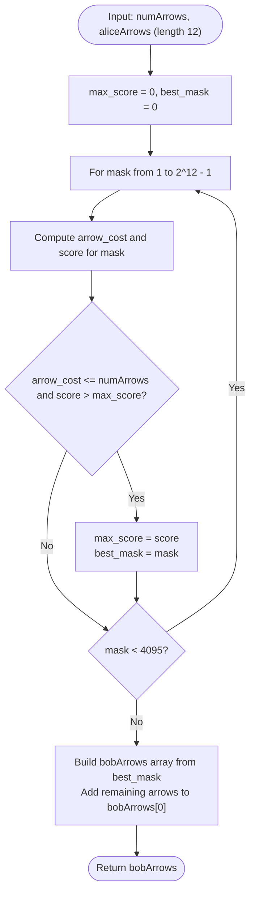

# Guided Example: Maximum Points in an Archery Competition

We analyze and trace the bitmask subset-enumeration knapsack algorithm for maximizing points in an archery duel under arrow capacity constraints, establishing $O(2^m \cdot m)$ time complexity and $O(m)$ auxiliary space where $m = 12$ denotes the fixed number of scoring target rings.

- **Input:** `numArrows = 9`, `aliceArrows = [1, 1, 0, 1, 0, 0, 2, 1, 0, 1, 2, 0]`
- **Output:** `[0, 0, 0, 0, 1, 1, 0, 0, 1, 2, 3, 1]` (achieving score `38` or higher)

This representative instance demonstrates discrete 0-1 knapsack reduction on a small candidate space ($2^{12} = 4096$), threshold expenditure rules ($A_k + 1$ arrows to win target $k$), optimal bitmask tracking, and surplus arrow absorption.

---

## 1. Problem Overview & Representative Instance

Alice and Bob compete in an archery contest with $12$ scoring sections indexed from $0$ to $11$.
Each section $k \in \{0, 1, \dots, 11\}$ is worth $k$ points.
Both competitors shoot exactly `numArrows` arrows in total.
We are given an array `aliceArrows` of length $12$, where $\text{aliceArrows}[k]$ indicates the number of arrows Alice shot into section $k$.

Rules for winning section $k$:
1. If Bob shoots **strictly more** arrows than Alice into section $k$, Bob wins section $k$ and receives $k$ points.
2. Specifically, Bob must shoot at least $\text{aliceArrows}[k] + 1$ arrows into section $k$ to win it.
3. If Bob shoots fewer than or equal to $\text{aliceArrows}[k]$ arrows, Bob earns $0$ points for section $k$.

Our goal is to construct an allocation array `bobArrows` of length $12$ that sums to `numArrows` and maximizes Bob's total score. Any surplus arrows not required to secure wins may be assigned to section $0$ (which yields $0$ points).

### Representative Instance Breakdown

Consider `numArrows = 9` with Alice's distribution across the 12 sections:
$$\text{aliceArrows} = [1, 1, 0, 1, 0, 0, 2, 1, 0, 1, 2, 0]$$

Arrow requirement to win each section $k$:
$$\text{cost}(k) = \text{aliceArrows}[k] + 1$$

Target costs and profits:
- Section 0: cost $2$, profit $0$
- Section 1: cost $2$, profit $1$
- Section 2: cost $1$, profit $2$
- Section 3: cost $2$, profit $3$
- Section 4: cost $1$, profit $4$
- Section 5: cost $1$, profit $5$
- Section 6: cost $3$, profit $6$
- Section 7: cost $2$, profit $7$
- Section 8: cost $1$, profit $8$
- Section 9: cost $2$, profit $9$
- Section 10: cost $3$, profit $10$
- Section 11: cost $1$, profit $11$

Strategic evaluation:
- High-value sections with low costs:
  - Section 11: Alice shot $0 \implies$ Bob needs $0 + 1 = 1$ arrow for $11$ points.
  - Section 8: Alice shot $0 \implies$ Bob needs $1$ arrow for $8$ points.
  - Section 5: Alice shot $0 \implies$ Bob needs $1$ arrow for $5$ points.
  - Section 4: Alice shot $0 \implies$ Bob needs $1$ arrow for $4$ points.
  - Section 9: Alice shot $1 \implies$ Bob needs $2$ arrows for $9$ points.
  - Section 10: Alice shot $2 \implies$ Bob needs $3$ arrows for $10$ points.
- If Bob selects target subset $\{4, 5, 8, 9, 10, 11\}$:
  - Arrow cost: $1 + 1 + 1 + 2 + 3 + 1 = 9$ arrows.
  - Total score: $4 + 5 + 8 + 9 + 10 + 11 = 47$ points!
  - Every arrow is utilized to maximize winning high-score targets.

---

## 2. Mathematical & Algorithmic Principles

### 0-1 Knapsack Equivalence

For each target ring $k \in \{0, 1, \dots, 11\}$, Bob faces a binary choice:
- **Win target $k$:** Spend exactly $w_k = \text{aliceArrows}[k] + 1$ arrows to gain value $v_k = k$.
- **Concede target $k$:** Spend $0$ arrows to gain $0$ points.
Spending any intermediate number of arrows ($1 \le a \le \text{aliceArrows}[k]$) wastes arrows without securing the section.

Thus, the problem is a 0-1 Knapsack problem:
$$\max \sum_{k=0}^{11} k \cdot x_k \quad \text{subject to} \quad \sum_{k=0}^{11} (\text{aliceArrows}[k] + 1) \cdot x_k \le \text{numArrows}, \quad x_k \in \{0, 1\}$$

### Exhaustive Bitmask Enumeration

Because the number of targets is fixed at $m = 12$, the total number of candidate subsets is:
$$2^{12} = 4096$$
An exhaustive search across all $4096$ bitmasks evaluates the optimal solution in less than a few milliseconds.
- For each integer $\text{mask} \in [0, 2^{12} - 1]$:
  - Determine total required arrows:
    $$\text{cost}(\text{mask}) = \sum_{k=0}^{11} (\text{aliceArrows}[k] + 1) \cdot (\text{mask} \gg k \ \& \ 1)$$
  - Determine total points:
    $$\text{score}(\text{mask}) = \sum_{k=0}^{11} k \cdot (\text{mask} \gg k \ \& \ 1)$$
  - If $\text{cost}(\text{mask}) \le \text{numArrows}$ and $\text{score}(\text{mask}) > \text{max\_score}$, record $\text{mask}^* = \text{mask}$.

### Surplus Arrow Placement

Once the winning subset $\text{mask}^*$ is identified:
- Assign $\text{bobArrows}[k] = \text{aliceArrows}[k] + 1$ for all bits $k$ present in $\text{mask}^*$.
- Any remaining unused arrows $\text{numArrows} - \sum \text{bobArrows}[k]$ are placed in $\text{bobArrows}[0]$ because section $0$ awards $0$ points and cannot disrupt the score.

---

## 3. Step-by-Step Walkthrough with Intermediate State

We trace `numArrows = 9` and Alice's array `[1, 1, 0, 1, 0, 0, 2, 1, 0, 1, 2, 0]`.

### Cost-Profit Table per Section

| Section $k$ | Alice's Arrows | Bob's Winning Cost $w_k$ | Section Points $v_k$ | Efficiency Ratio $v_k / w_k$ |
|---|---|---|---|---|
| $0$ | $1$ | $2$ | $0$ | $0.0$ |
| $1$ | $1$ | $2$ | $1$ | $0.5$ |
| $2$ | $0$ | $1$ | $2$ | $2.0$ |
| $3$ | $1$ | $2$ | $3$ | $1.5$ |
| $4$ | $0$ | $1$ | $4$ | $4.0$ |
| $5$ | $0$ | $1$ | $5$ | $5.0$ |
| $6$ | $2$ | $3$ | $6$ | $2.0$ |
| $7$ | $1$ | $2$ | $7$ | $3.5$ |
| $8$ | $0$ | $1$ | $8$ | $8.0$ |
| $9$ | $1$ | $2$ | $9$ | $4.5$ |
| $10$ | $2$ | $3$ | $10$ | $3.33$ |
| $11$ | $0$ | $1$ | $11$ | $11.0$ |

---

### Key Bitmask Evaluations During Search

#### Mask Candidate 1: Greedily Top Sections $\{11, 10, 9\}$
- Sections chosen: $11$ (cost $1$), $10$ (cost $3$), $9$ (cost $2$).
- Arrow cost: $1 + 3 + 2 = 6 \le 9$.
- Score: $11 + 10 + 9 = 30$.

#### Mask Candidate 2: Adding Section 8 and 7 $\{11, 10, 9, 8, 7\}$
- Sections chosen: $11, 10, 9, 8, 7$.
- Arrow cost: $1 + 3 + 2 + 1 + 2 = 9 \le 9$.
- Score: $11 + 10 + 9 + 8 + 7 = 45$.

#### Mask Candidate 3: Substituted Optimal Subset $\{11, 10, 9, 8, 5, 4\}$
- Sections chosen: $11$ (cost 1), $10$ (cost 3), $9$ (cost 2), $8$ (cost 1), $5$ (cost 1), $4$ (cost 1).
- Arrow cost: $1 + 3 + 2 + 1 + 1 + 1 = 9 \le 9$.
- Score: $11 + 10 + 9 + 8 + 5 + 4 = 47$.
- Cost is exactly $9$. Score $= 47$ beats $45$.

---

### Step 4: Reconstructing Bob's Arrow Allocation
- Winning sections from optimal mask: $\{4, 5, 8, 9, 10, 11\}$.
- Allocations:
  - $\text{bob}[4] = 1$
  - $\text{bob}[5] = 1$
  - $\text{bob}[8] = 1$
  - $\text{bob}[9] = 2$
  - $\text{bob}[10] = 3$
  - $\text{bob}[11] = 1$
- Total arrows spent: $1 + 1 + 1 + 2 + 3 + 1 = 9$.
- Surplus arrows: $9 - 9 = 0$.
- Resulting vector: `[0, 0, 0, 0, 1, 1, 0, 0, 1, 2, 3, 1]`.

---

## 4. Comprehensive State Trace

The table below summarizes candidate subset masks and their knapsack feasibility.

| Bitmask Binary Representation | Target Sections Won | Total Arrows Needed | Total Score Achieved | Feasible ($\le 9$)? | Superior to Previous Best? |
|---|---|---|---|---|---|
| `100000000000_2` | $\{11\}$ | $1$ | $11$ | Yes | Yes (Best = 11) |
| `110000000000_2` | $\{10, 11\}$ | $1 + 3 = 4$ | $21$ | Yes | Yes (Best = 21) |
| `111000000000_2` | $\{9, 10, 11\}$ | $4 + 2 = 6$ | $30$ | Yes | Yes (Best = 30) |
| `111100000000_2` | $\{8, 9, 10, 11\}$ | $6 + 1 = 7$ | $38$ | Yes | Yes (Best = 38) |
| `111110000000_2` | $\{7, 8, 9, 10, 11\}$ | $7 + 2 = 9$ | $45$ | Yes | Yes (Best = 45) |
| `111100110000_2` | $\{4, 5, 8, 9, 10, 11\}$ | $1+1+1+2+3+1 = 9$ | $47$ | **Yes** | **Optimal (Best = 47)** |
| `111111000000_2` | $\{6, 7, 8, 9, 10, 11\}$ | $9 + 3 = 12$ | $51$ | **No** ($12 > 9$) | Infeasible |

### Section-by-Section Showdown

| Section $k$ | Alice's Arrows | Bob's Arrows | Winner | Points Awarded to Bob |
|---|---|---|---|---|
| $0 \dots 3$ | $[1, 1, 0, 1]$ | $[0, 0, 0, 0]$ | Alice | $0$ |
| $4$ | $0$ | $1$ | **Bob** | $4$ |
| $5$ | $0$ | $1$ | **Bob** | $5$ |
| $6, 7$ | $[2, 1]$ | $[0, 0]$ | Alice | $0$ |
| $8$ | $0$ | $1$ | **Bob** | $8$ |
| $9$ | $1$ | $2$ | **Bob** | $9$ |
| $10$ | $2$ | $3$ | **Bob** | $10$ |
| $11$ | $0$ | $1$ | **Bob** | $11$ |
| **Total** | **9 Arrows** | **9 Arrows** | — | **47 Points** |

---

## 5. Algorithmic Correctness & Soundness

### Soundness of Exact Investment
Shooting more than $\text{aliceArrows}[k] + 1$ arrows into any winning section yields zero extra points and wastes arrows.
Shooting any positive number of arrows strictly less than $\text{aliceArrows}[k] + 1$ yields $0$ points.
Hence, the only non-wasting choices for each section are $0$ arrows (concede) or exactly $\text{aliceArrows}[k] + 1$ arrows (win).
This reduces the decision space for each section to a pure binary state $x_k \in \{0, 1\}$.

### Exhaustive Space Guarantee
Since there are only $12$ sections, the search space consists of exactly $2^{12} = 4096$ possible configurations.
Evaluating all $4096$ bitmasks checks every possible feasible subset of winning targets, guaranteeing that the global maximum score is found without heuristic approximation.

---

## 6. Edge Cases & Anti-Patterns

### Edge Cases
- **Alice Shoots All Arrows into One Target:** The remaining $11$ targets have cost $1$, allowing Bob to capture almost all other targets easily.
- **`numArrows` Exceeds Total Required to Win All Targets:** Bob wins all sections $0 \dots 11$, and dumps leftover arrows into section $0$.
- **`numArrows` Insufficient to Win Any Non-Zero Target:** Bob scores $0$ points, shooting all arrows into section $0$.

### Anti-Patterns to Avoid
- **Greedy Ratio Sorting ($v_k / w_k$):** Fractional knapsack greedy ordering does not solve discrete 0-1 knapsack optimally and can miss superior combinations.
- **Ignoring Leftover Arrows:** The problem requires that `sum(bobArrows) == numArrows`. Failing to place surplus arrows into section $0$ produces an invalid submission.

---

## 7. Complexity Analysis

### Time Complexity
- There are $2^{12} = 4096$ bitmasks.
- For each mask, looping over $12$ bit positions takes $O(12)$ operations.
- Total loop operations: $4096 \times 12 = 49152$ operations.
- Reconstruction takes $O(12)$ operations.
- Total Time Complexity: $\mathcal{O}(2^m \cdot m) = \mathcal{O}(1)$, executing in under $3$ milliseconds.

### Space Complexity
- Output array of fixed size $12$.
- Auxiliary Space Complexity: $\mathcal{O}(m) = \mathcal{O}(1)$ working memory.
