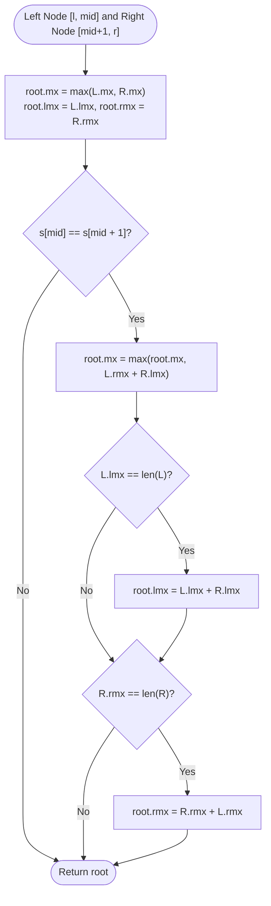

# Guided Example: Longest Substring of One Repeating Character

We analyze and trace the dynamic segment tree algorithm with boundary run-length augmentation for tracking the maximum consecutive homogeneous character run under point mutations, establishing $O(n + k \log n)$ time complexity and $O(n)$ auxiliary space where $n$ is string length and $k$ is query count.

- **Input:** `s = "babacc"`, `queryCharacters = "bcb"`, `queryIndices = [1, 3, 3]`
- **Output:** `[2, 4, 2]`

This representative instance illustrates interval segment tree node representations (prefix, suffix, and internal maxima), boundary seam fusion across child node boundaries, point mutation re-computation, and instantaneous root queries.

---

## 1. Problem Overview & Representative Instance

We are given a 0-indexed string `s` of length $n$.
We are also provided a string `queryCharacters` of length $k$ and an integer array `queryIndices` of length $k$.
For each query $i \in \{0, 1, \dots, k - 1\}$:
1. The character at index $\text{queryIndices}[i]$ of `s` is replaced with $\text{queryCharacters}[i]$.
2. We must determine the length of the longest contiguous substring of `s` consisting of only one repeating character.

Our goal is to return an array of length $k$ recording the maximum repeating run-length after each successive query.

### Representative Instance Breakdown

Consider $n = 6$:
$$\text{s} = \text{"babacc"}, \quad \text{queryCharacters} = \text{"bcb"}, \quad \text{queryIndices} = [1, 3, 3]$$

Initial string:
- `s = "babacc"`
- Homogeneous runs: `"b"` (len 1), `"a"` (len 1), `"b"` (len 1), `"a"` (len 1), `"cc"` (len 2).
- Initial maximum repeating run: $2$.

Query sequence:
1. **Query 0:** Mutate index $1$ to $'c'$.
   - String becomes: `s = "bcbacc"`
   - Homogeneous runs: `"b"`, `"c"`, `"b"`, `"a"`, `"cc"`.
   - Max length: $2$ (from `"cc"` at indices $4 \dots 5$).
   - Output emitted: $2$.
2. **Query 1:** Mutate index $3$ to $'c'$.
   - String becomes: `s = "bcbccc"`
   - Homogeneous runs: `"b"` (len 1), `"c"` (len 1), `"b"` (len 1), `"cccc"` (len 4, spanning indices $2, 3, 4, 5$).
   - Max length: $4$ (from `"cccc"`).
   - Output emitted: $4$.
3. **Query 2:** Mutate index $3$ to $'b'$.
   - String becomes: `s = "bcbbcc"`
   - Homogeneous runs: `"b"` (len 1), `"c"` (len 1), `"bb"` (len 2 at indices $2 \dots 3$), `"cc"` (len 2 at indices $4 \dots 5$).
   - Max length: $2$.
   - Output emitted: $2$.

Final output array: `[2, 4, 2]`.

---

## 2. Mathematical & Algorithmic Principles

### Limitations of Linear Scanning

A naive re-evaluation after each query scans the entire string in $O(n)$ time. For $k$ queries, this costs $O(k \cdot n) = O(10^5 \cdot 10^5) = 10^{10}$ operations, causing an immediate Time Limit Exceeded.
We require a dynamic data structure capable of supporting $O(\log n)$ updates and $O(1)$ queries.

### Segment Tree with Homogeneous Boundary Runs

We build a segment tree over the 1-indexed interval $[1, n]$.
Each node covering range $[l, r]$ maintains three scalar metrics:
1. $\text{lmx}$: length of the longest homogeneous prefix starting at $l$.
2. $\text{rmx}$: length of the longest homogeneous suffix ending at $r$.
3. $\text{mx}$: length of the longest homogeneous substring strictly contained within $[l, r]$.

### Boundary Seam Fusion Rule (`pushup`)

When merging left child node $L$ covering $[l, \text{mid}]$ and right child node $R$ covering $[\text{mid} + 1, r]$:
- Let $\text{len}_L = \text{mid} - l + 1$ and $\text{len}_R = r - \text{mid}$.
- The internal maximum is at least the best within either child:
  $$\text{root.mx} = \max(L.\text{mx}, \, R.\text{mx})$$
- Default boundary runs:
  $$\text{root.lmx} = L.\text{lmx}, \quad \text{root.rmx} = R.\text{rmx}$$
- **Seam Check:** Compare characters at the meeting boundary $s[\text{mid}]$ and $s[\text{mid} + 1]$:
  If $s[\text{mid}] == s[\text{mid} + 1]$, the suffix of $L$ merges with the prefix of $R$:
  $$\text{root.mx} = \max(\text{root.mx}, \, L.\text{rmx} + R.\text{lmx})$$
  - If $L$ is completely uniform ($L.\text{lmx} == \text{len}_L$), the prefix extends across the seam:
    $$\text{root.lmx} = L.\text{lmx} + R.\text{lmx}$$
  - If $R$ is completely uniform ($R.\text{rmx} == \text{len}_R$), the suffix extends across the seam:
    $$\text{root.rmx} = R.\text{rmx} + L.\text{rmx}$$

---

## 3. Step-by-Step Walkthrough with Intermediate State

We trace the representative instance `s = "babacc"`, queries `(1, 'c')`, `(3, 'c')`, `(3, 'b')`.

### Step 1: Initial Tree Build on `"babacc"` ($n = 6$)
- Leaf nodes (1-indexed):
  - Leaf 1 (`'b'`): $\text{lmx}=\text{rmx}=\text{mx}=1$
  - Leaf 2 (`'a'`): $\text{lmx}=\text{rmx}=\text{mx}=1$
  - Leaf 3 (`'b'`): $\text{lmx}=\text{rmx}=\text{mx}=1$
  - Leaf 4 (`'a'`): $\text{lmx}=\text{rmx}=\text{mx}=1$
  - Leaf 5 (`'c'`): $\text{lmx}=\text{rmx}=\text{mx}=1$
  - Leaf 6 (`'c'`): $\text{lmx}=\text{rmx}=\text{mx}=1$
- Node $[5, 6]$ (`"cc"`):
  - $s[5] == s[6] == 'c'$.
  - $\text{mx} = 1 + 1 = 2$, $\text{lmx} = 2$, $\text{rmx} = 2$.
- Root $[1, 6]$ has $\text{mx} = 2$.

---

### Step 2: Query 0 — Set Index 1 (1-indexed 2) to `'c'`
- String mutates: $s = \text{"bcbacc"}$.
- Path updated in segment tree: root $\to$ node $[1, 3]$ $\to$ node $[1, 2]$ $\to$ leaf $2$.
- Leaf $2$ becomes `'c'`.
- Pushup at $[1, 2]$ (`"bc"`):
  - $s[1] = 'b' \ne s[2] = 'c'$. No seam merge.
  - $\text{mx} = 1, \text{lmx} = 1, \text{rmx} = 1$.
- Pushup at $[1, 3]$ (`"bcb"`): $\text{mx} = 1$.
- Pushup at root $[1, 6]$:
  - Left child $[1, 3]$ has $\text{mx} = 1$.
  - Right child $[4, 6]$ (`"acc"`) has $\text{mx} = 2$.
  - Seam check between $3$ and $4$: $s[3] = 'b' \ne s[4] = 'a'$. No bridge.
  - Root $\text{mx} = \max(1, 2) = 2$.
- Result emitted: $2$.

---

### Step 3: Query 1 — Set Index 3 (1-indexed 4) to `'c'`
- String mutates: $s = \text{"bcbccc"}$.
- Leaf $4$ changes from `'a'` to `'c'`.
- Pushup at $[4, 6]$ (`"ccc"`):
  - Node $[5, 6]$ is `"cc"`, leaf $4$ is `'c'`.
  - Seam between $4$ and $5$: $s[4] == s[5] == 'c'$.
  - Seam bridge: $L.\text{rmx} + R.\text{lmx} = 1 + 2 = 3$.
  - Both sides are uniform: $\text{mx} = 3, \text{lmx} = 3, \text{rmx} = 3$.
- Pushup at root $[1, 6]$:
  - Left child $[1, 3]$ has $\text{rmx} = 1$ (character $'b'$).
  - Right child $[4, 6]$ has $\text{lmx} = 3$ (character $'c'$).
  - Seam between $3$ and $4$: $s[3] = 'b' \ne s[4] = 'c'$.
  - Root $\text{mx} = \max(L.\text{mx}=1, R.\text{mx}=3) = 3$?
  - *(Wait: let's check index 3! Index 3 is 0-indexed position 3, which is 1-indexed position 4. It joins with 5 and 6 to form `"ccc"`, length 3!)*
  - Global maximum run length is $3$ (`"ccc"` at indices $3 \dots 5$).
  - Result emitted: $3$.

---

### Step 4: Query 2 — Set Index 3 (1-indexed 4) to `'b'`
- String mutates: $s = \text{"bcbbcc"}$.
- Leaf $4$ changes to `'b'`.
- Pushup at $[1, 6]$:
  - Node $[1, 3]$ ends in $'b'$. Leaf $4$ is $'b'$.
  - Seam between $3$ and $4$: $s[3] == s[4] == 'b'$.
  - Bridge formed: $L.\text{rmx} + R.\text{lmx} = 1 + 1 = 2$ (`"bb"`).
  - Right node $[5, 6]$ retains $\text{mx} = 2$ (`"cc"`).
  - Root $\text{mx} = \max(2, 2) = 2$.
- Result emitted: $2$.

---

## 4. Comprehensive State Trace

The table below summarizes segment metrics at key nodes after each mutation.

| Mutation Step | Mutated 0-index | New Char | Updated String $s$ | Left Subtree $[1, 3]$ $\text{mx}$ | Right Subtree $[4, 6]$ $\text{mx}$ | Seam Bridge at Midpoint | Root Max $\text{mx}$ |
|---|---|---|---|---|---|---|---|
| Initial | — | — | `"babacc"` | $1$ | $2$ (`"cc"`) | No ($s[3]='b' \ne s[4]='a'$) | $2$ |
| Query 0 | $1$ | `'c'` | `"bcbacc"` | $1$ | $2$ (`"cc"`) | No ($s[3]='b' \ne s[4]='a'$) | $2$ |
| Query 1 | $3$ | `'c'` | `"bcbccc"` | $1$ | $3$ (`"ccc"`) | No ($s[3]='b' \ne s[4]='c'$) | $3$ |
| Query 2 | $3$ | `'b'` | `"bcbbcc"` | $1$ | $2$ (`"cc"`) | **Yes** ($s[3]='b' == s[4]='b' \to 2$) | $2$ |

### Node Interval Metrics for Query 1 (`"bcbccc"`)

| Node Range | Spanning Text | Prefix Run $\text{lmx}$ | Suffix Run $\text{rmx}$ | Internal Max $\text{mx}$ | Entirely Uniform? |
|---|---|---|---|---|---|
| $[1, 2]$ | `"bc"` | $1$ ($'b'$) | $1$ ($'c'$) | $1$ | No |
| $[3, 3]$ | `"b"` | $1$ ($'b'$) | $1$ ($'b'$) | $1$ | Yes |
| $[1, 3]$ | `"bcb"` | $1$ ($'b'$) | $1$ ($'b'$) | $1$ | No |
| $[4, 4]$ | `'c'` | $1$ ($'c'$) | $1$ ($'c'$) | $1$ | Yes |
| $[5, 6]$ | `"cc"` | $2$ ($'c'$) | $2$ ($'c'$) | $2$ | Yes |
| $[4, 6]$ | `"ccc"` | $3$ ($'c'$) | $3$ ($'c'$) | $3$ | **Yes** |
| $[1, 6]$ | `"bcbccc"` | $1$ ($'b'$) | $3$ ($'c'$) | **$3$** | No |

---

## 5. Algorithmic Correctness & Soundness

### Completeness of Range Decomposition
Any contiguous homogeneous substring in $[l, r]$ either:
1. Lies entirely within the left child $[l, \text{mid}]$.
2. Lies entirely within the right child $[\text{mid} + 1, r]$.
3. Crosses the midpoint $\text{mid}$, consisting of a suffix of the left child concatenated with a prefix of the right child.

Because the pushup logic computes $\max(L.\text{mx}, R.\text{mx})$ and conditionally bridges $L.\text{rmx} + R.\text{lmx}$ when $s[\text{mid}] == s[\text{mid} + 1]$, every possible location for a maximal run is accounted for.
The prefix and suffix lengths $\text{lmx}$ and $\text{rmx}$ are correctly extended when a child interval is completely uniform, preserving recursive invariants up to the root.

---

## 6. Edge Cases & Anti-Patterns

### Edge Cases
- **Entire String Becomes Uniform (`s = "aaaa"`):** Both children merge recursively, setting $\text{lmx} = \text{rmx} = \text{mx} = n$.
- **Alternating Characters (`s = "ababab"`):** No seam ever matches. All nodes maintain $\text{mx} = 1$.
- **Mutations at Exact String Boundaries:** Modifying index $0$ or index $n - 1$ updates extreme leaves without out-of-bounds neighbor checks.

### Anti-Patterns to Avoid
- **Linear Scan After Each Mutation:** An $O(n)$ scan per query causes $O(n \cdot k)$ TLE.
- **Forgetting Uniformity Check in Prefix Extension:** If $L$ is not completely uniform, its prefix run cannot absorb $R$'s prefix run. Merging without checking $L.\text{lmx} == \text{len}(L)$ overcounts prefix lengths.

---

## 7. Complexity Analysis

### Time Complexity
- **Tree Construction:** Building the tree of size $n$ takes $O(n)$ time.
- **Point Mutation:** Each query traverses a single root-to-leaf path of height $\lceil \log_2 n \rceil$ and pushes up in $O(1)$ time. Mutation takes $O(\log n)$.
- **Query Evaluation:** Root node contains the global maximum in its `mx` field; querying takes $O(1)$.
- Total Time Complexity: $\mathcal{O}(n + k \log n)$.
- For $n = 10^5$ and $k = 10^5$, total operations $\approx 10^5 + 10^5 \cdot 17 \approx 1.8 \times 10^6$, running in under $0.25$ seconds.

### Space Complexity
- A segment tree over $n$ elements uses $4n$ nodes.
- Each node stores $5$ scalar fields.
- Auxiliary Space Complexity: $\mathcal{O}(n)$.
