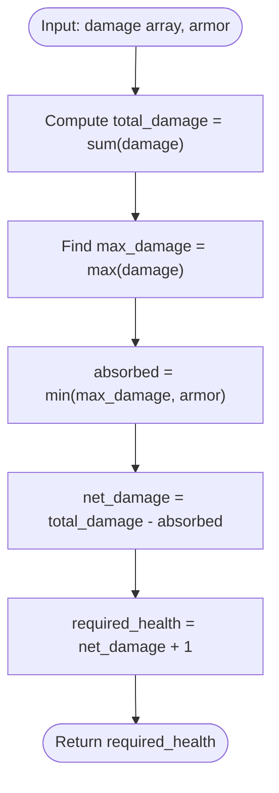

# Guided Example: Minimum Health to Beat Game

We analyze and trace the linear-scan extremal absorption algorithm for calculating the minimal initial vitality required to survive sequential damage rounds under single-use armor mitigation, establishing $O(n)$ time complexity and $O(1)$ auxiliary space.

- **Input:** `damage = [2, 7, 4, 3]`, `armor = 4`
- **Output:** `13`

This representative instance illustrates commutative total-damage summation, greedy single-round armor mitigation against the global damage maximum, and boundary threshold offset.

---

## 1. Problem Overview & Representative Instance

We are playing a sequential game consisting of $n$ levels:
- At level $i$, we take `damage[i]` points of damage.
- We possess an armor ability that may be activated at most once throughout the entire game on any single chosen level.
- When activated on level $k$, the armor absorbs $\min(\text{damage}[k], \text{armor})$ damage points, so we take only $\max(0, \text{damage}[k] - \text{armor})$ damage on that level.
- Our health must remain strictly positive ($\text{health} \ge 1$) at all times.

Our objective is to determine the minimum initial health required to start the game and successfully beat all $n$ levels.

### Representative Instance Breakdown

Consider:
$$\text{damage} = [2, 7, 4, 3], \quad \text{armor} = 4$$

1. Total gross damage across all $4$ levels:
   $$S_{\text{gross}} = 2 + 7 + 4 + 3 = 16$$
2. Armor mitigation choices:
   - Apply armor to level 0 (damage $2$): absorbs $\min(2, 4) = 2$ damage.
   - Apply armor to level 1 (damage $7$): absorbs $\min(7, 4) = 4$ damage.
   - Apply armor to level 2 (damage $4$): absorbs $\min(4, 4) = 4$ damage.
   - Apply armor to level 3 (damage $3$): absorbs $\min(3, 4) = 3$ damage.
3. Maximum possible damage absorption:
   $$\Delta^* = \max(2, 4, 4, 3) = 4$$
   This maximal reduction is achieved by shielding level $1$ (or level $2$).
4. Net total damage inflicted on the player:
   $$S_{\text{net}} = S_{\text{gross}} - \Delta^* = 16 - 4 = 12$$
5. Minimum health to survive with $\text{health} \ge 1$ at completion:
   $$\text{health}_{\text{initial}} = S_{\text{net}} + 1 = 12 + 1 = 13$$

Verifying health progression with initial health $13$ (applying armor to level 1):
- After level 0: $13 - 2 = 11$
- After level 1: takes $7 - 4 = 3 \implies 11 - 3 = 8$
- After level 2: $8 - 4 = 4$
- After level 3: $4 - 3 = 1 > 0$ (Survives!)

---

## 2. Mathematical & Algorithmic Principles

### Commutativity of Damage and Non-Negative Depletion

Because every damage value is non-negative ($\text{damage}[i] \ge 0$), the player's health sequence $H_0, H_1, \dots, H_n$ is monotonically non-increasing.
Consequently, the minimum health throughout the game is always achieved at the very end after the final level:
$$H_{\min} = H_n = H_0 - \text{Total Damage Inflicted}$$

The survival condition $\forall t, \, H_t \ge 1$ simplifies completely to:
$$H_n \ge 1 \iff H_0 - \text{Total Damage Inflicted} \ge 1$$
$$H_0 \ge \text{Total Damage Inflicted} + 1$$

The order in which damage occurs is completely irrelevant to the total initial health needed; only the total net damage matters!

### Optimal Armor Placement via Extremal Clamping

Let level $k$ be the level where armor is deployed.
The reduction gained is:
$$\text{Reduction}(k) = \min(\text{damage}[k], \text{armor})$$
Because the function $f(x) = \min(x, \text{armor})$ is monotonically non-decreasing in $x$, maximizing the reduction is achieved by choosing a level with the maximum damage:
$$x^* = \max_{0 \le i < n} \text{damage}[i]$$
$$\Delta^* = \min(x^*, \text{armor})$$

The closed-form minimum initial health is:
$$\text{OPT} = \sum_{i=0}^{n-1} \text{damage}[i] - \min\Big(\max_{0 \le i < n} \text{damage}[i], \, \text{armor}\Big) + 1$$

---

## 3. Step-by-Step Walkthrough with Intermediate State

We trace the algorithm execution on `damage = [2, 7, 4, 3]` and `armor = 4`.

### Step 1: Scan and Aggregate Metrics
- Initialize running sum: $S = 0$.
- Initialize running maximum: $M = 0$.

Iterating through levels:
1. Level $0$ (damage $2$):
   - $S \leftarrow 0 + 2 = 2$
   - $M \leftarrow \max(0, 2) = 2$
2. Level $1$ (damage $7$):
   - $S \leftarrow 2 + 7 = 9$
   - $M \leftarrow \max(2, 7) = 7$
3. Level $2$ (damage $4$):
   - $S \leftarrow 9 + 4 = 13$
   - $M \leftarrow \max(7, 4) = 7$
4. Level $3$ (damage $3$):
   - $S \leftarrow 13 + 3 = 16$
   - $M \leftarrow \max(7, 3) = 7$

Summary:
- Gross damage sum $S = 16$.
- Maximum damage round $M = 7$.

---

### Step 2: Armor Absorption Computation
- Armor limit: $4$.
- Maximum possible absorption:
  $$\text{absorbed} = \min(M, \text{armor}) = \min(7, 4) = 4$$

---

### Step 3: Net Damage and Minimum Vitality
- Net damage taken:
  $$S_{\text{net}} = 16 - 4 = 12$$
- Minimum health required to finish with at least $1$ HP:
  $$\text{ans} = 12 + 1 = 13$$

---

## 4. Comprehensive State Trace

The table below illustrates the level-by-level evaluation and armor comparison.

| Level Index $i$ | `damage[i]` | Running Sum $S$ | Running Max $M$ | Potential Armor Absorption $\min(\text{damage}[i], 4)$ |
|---|---|---|---|---|
| $0$ | $2$ | $2$ | $2$ | $2$ |
| $1$ | $7$ | $9$ | $7$ | **$4$ (Optimal)** |
| $2$ | $4$ | $13$ | $7$ | **$4$ (Optimal)** |
| $3$ | $3$ | $16$ | $7$ | $3$ |

### Simulation of Health Progression with Initial HP $= 13$

| Game Stage | Incident Damage | Armor Applied? | Net Damage Taken | Remaining Health | Status |
|---|---|---|---|---|---|
| Start | — | — | — | $13$ | Alive |
| Level 0 | $2$ | No | $2$ | $13 - 2 = 11$ | Alive |
| Level 1 | $7$ | **Yes** (absorbs 4) | $3$ | $11 - 3 = 8$ | Alive |
| Level 2 | $4$ | No | $4$ | $8 - 4 = 4$ | Alive |
| Level 3 | $3$ | No | $3$ | $4 - 3 = 1$ | **Victory ($\ge 1$)** |

---

## 5. Algorithmic Correctness & Soundness

### Soundness of the Single Extremum Choice
Let $k \in \{0, \dots, n - 1\}$ be the level where the player activates armor.
The net damage taken by the player is:
$$D(k) = \sum_{i \ne k} \text{damage}[i] + \max(0, \text{damage}[k] - \text{armor}) = \sum_{i=0}^{n-1} \text{damage}[i] - \min(\text{damage}[k], \text{armor})$$
Because the sum $\sum \text{damage}[i]$ is fixed, minimizing $D(k)$ is mathematically identical to maximizing $\min(\text{damage}[k], \text{armor})$.
Since $\min(x, \text{armor})$ is a non-decreasing function of $x$, setting $\text{damage}[k] = \max_i \text{damage}[i]$ maximizes the subtracted term, guaranteeing minimal net damage.

### Necessity of the $+1$ Offset
To survive all levels, the health remaining after the final level must satisfy $H_n \ge 1$.
Thus $H_0 \ge D^* + 1$. Since health can only be an integer, the minimal initial health is exactly $D^* + 1$.

---

## 6. Edge Cases & Anti-Patterns

### Edge Cases
- **Zero Armor (`armor = 0`):** $\min(\max(\text{damage}), 0) = 0$. Initial health is $\sum \text{damage}[i] + 1$.
- **Armor Exceeds All Damage (`armor \gg \max(damage)`):** The armor absorbs the entire damage of the maximum round, $\max(\text{damage})$.
- **Single Level Game (`damage = [10]`, `armor = 6`):** Gross damage $10$, absorbed $6 \implies$ net damage $4 \implies$ health $5$.
- **Large Arrays ($n = 10^5$, damage up to $10^5$):** Sum can reach $10^{10}$, fitting naturally within standard 64-bit integer types without overflow.

### Anti-Patterns to Avoid
- **Greedy Usage at the First Threshold:** Using the armor on the first level where $\text{damage}[i] \ge \text{armor}$ wastes the opportunity if a larger damage value appears later.
- **Dynamic Programming or Binary Search:** Simulating with binary search over health is unnecessary because the closed-form equation evaluates the exact answer directly in $O(n)$ time.

---

## 7. Complexity Analysis

### Time Complexity
- A single linear pass computes $\sum \text{damage}[i]$ and $\max(\text{damage}[i])$ in $O(n)$ time.
- The scalar formula evaluation takes $O(1)$ time.
- Total Time Complexity: $\mathcal{O}(n)$, running in under $1$ millisecond for $n \le 10^5$.

### Space Complexity
- Uses two scalar integer accumulators for the sum and maximum.
- Auxiliary Space Complexity: $\mathcal{O}(1)$.
