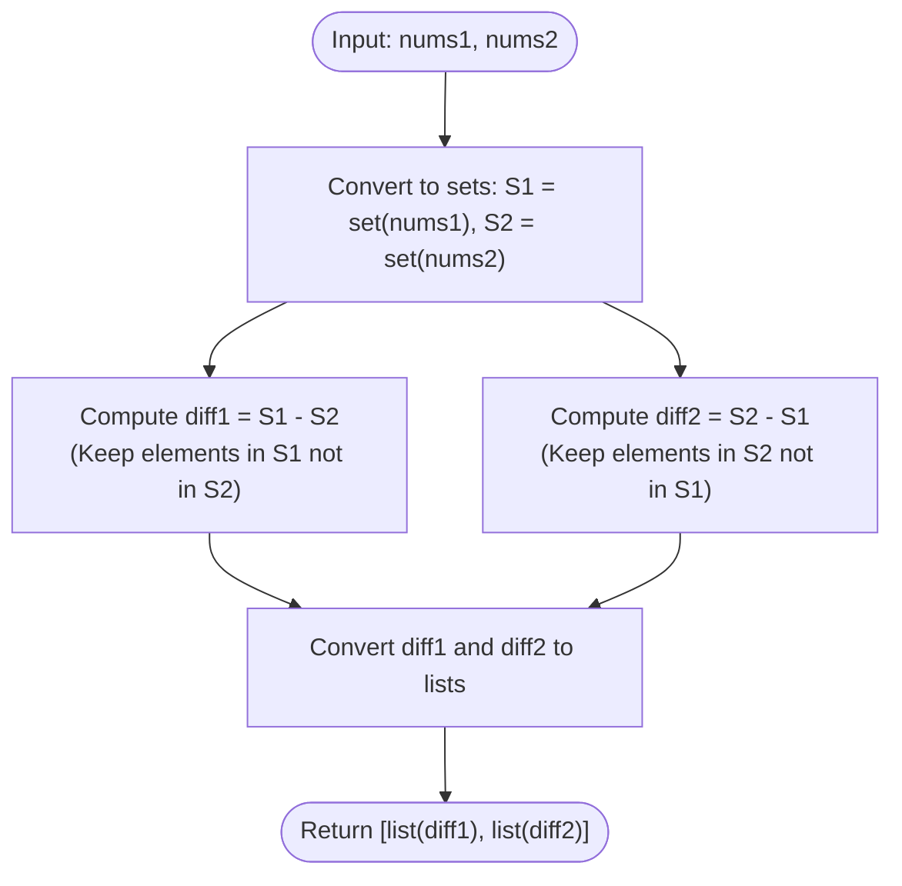

# Guided Example: Find the Difference of Two Arrays

We analyze and trace the hash-set relative complement algorithm for determining mutually exclusive distinct elements across two integer sequences, establishing $O(n_1 + n_2)$ time complexity and $O(n_1 + n_2)$ auxiliary space.

- **Input:** `nums1 = [1, 2, 3, 3]`, `nums2 = [2, 4, 6]`
- **Output:** `[[1, 3], [4, 6]]`

This representative instance highlights duplicate elimination via set construction, relative set complement projection ($S_1 \setminus S_2$ and $S_2 \setminus S_1$), intersection filtration, and list materialization.

---

## 1. Problem Overview & Representative Instance

We are given two 0-indexed integer arrays `nums1` and `nums2`.
We must return a list of two integer lists `[answer1, answer2]` where:
1. `answer1` contains all **distinct** integers in `nums1` that are **not** present in `nums2`.
2. `answer2` contains all **distinct** integers in `nums2` that are **not** present in `nums1`.

The integers within each list may be returned in any order.

### Representative Instance Breakdown

Consider:
$$\text{nums1} = [1, 2, 3, 3], \quad \text{nums2} = [2, 4, 6]$$

Constructing distinct element sets:
- $\text{nums1}$ contains elements $1, 2, 3, 3$.
  $$\mathcal{S}_1 = \{1, 2, 3\}$$
- $\text{nums2}$ contains elements $2, 4, 6$.
  $$\mathcal{S}_2 = \{2, 4, 6\}$$

Evaluating intersection and set differences:
- Shared elements: $\mathcal{S}_1 \cap \mathcal{S}_2 = \{2\}$.
- Elements unique to $\text{nums1}$:
  $$\mathcal{D}_1 = \mathcal{S}_1 \setminus \mathcal{S}_2 = \{1, 2, 3\} \setminus \{2\} = \{1, 3\}$$
- Elements unique to $\text{nums2}$:
  $$\mathcal{D}_2 = \mathcal{S}_2 \setminus \mathcal{S}_1 = \{2, 4, 6\} \setminus \{2\} = \{4, 6\}$$

Final output structure:
$$[[1, 3], [4, 6]]$$

---

## 2. Mathematical & Algorithmic Principles

### Set Complement and Symmetric Difference

Let $U = \mathcal{S}_1 \cup \mathcal{S}_2$ be the universe of observed integers.
The two required answer lists are the relative complements:
$$\mathcal{D}_1 = \mathcal{S}_1 \setminus \mathcal{S}_2 = \{x \in \mathcal{S}_1 \mid x \notin \mathcal{S}_2\}$$
$$\mathcal{D}_2 = \mathcal{S}_2 \setminus \mathcal{S}_1 = \{y \in \mathcal{S}_2 \mid y \notin \mathcal{S}_1\}$$

Notice that:
$$\mathcal{D}_1 \cap \mathcal{D}_2 = \emptyset, \quad \mathcal{D}_1 \cup \mathcal{D}_2 = \mathcal{S}_1 \Delta \mathcal{S}_2$$
where $\Delta$ denotes the symmetric difference between $\mathcal{S}_1$ and $\mathcal{S}_2$.

### Hash Set Lookup Acceleration

If we check each element of `nums1` against an unindexed array `nums2`, each test takes $O(n_2)$ time, resulting in $O(n_1 \cdot n_2)$ quadratic time.
By converting both arrays into hash sets $\mathcal{S}_1$ and $\mathcal{S}_2$:
- Set conversion automatically collapses duplicates in $O(n_1 + n_2)$ time.
- Membership testing $x \in \mathcal{S}_2$ executes in $O(1)$ expected time.
- Filtering elements of $\mathcal{S}_1$ against $\mathcal{S}_2$ takes $O(|\mathcal{S}_1|)$ time.
- Filtering elements of $\mathcal{S}_2$ against $\mathcal{S}_1$ takes $O(|\mathcal{S}_2|)$ time.
- Total processing time is strictly linear in the input sizes.

---

## 3. Step-by-Step Walkthrough with Intermediate State

We trace the algorithm execution on `nums1 = [1, 2, 3, 3]` and `nums2 = [2, 4, 6]`.

### Step 1: Set Ingestion
- Ingest `nums1`:
  - Add $1 \implies \{1\}$
  - Add $2 \implies \{1, 2\}$
  - Add $3 \implies \{1, 2, 3\}$
  - Add $3$ (duplicate, ignored) $\implies \mathcal{S}_1 = \{1, 2, 3\}$
- Ingest `nums2`:
  - Add $2 \implies \{2\}$
  - Add $4 \implies \{2, 4\}$
  - Add $6 \implies \mathcal{S}_2 = \{2, 4, 6\}$

---

### Step 2: Compute $\mathcal{D}_1 = \mathcal{S}_1 \setminus \mathcal{S}_2$
Iterate through distinct elements of $\mathcal{S}_1 = \{1, 2, 3\}$:
1. Candidate $1$: is $1 \in \mathcal{S}_2$? No. Retain in $\mathcal{D}_1$.
2. Candidate $2$: is $2 \in \mathcal{S}_2$? Yes. Discard from $\mathcal{D}_1$.
3. Candidate $3$: is $3 \in \mathcal{S}_2$? No. Retain in $\mathcal{D}_1$.
Resulting set: $\mathcal{D}_1 = \{1, 3\}$.

---

### Step 3: Compute $\mathcal{D}_2 = \mathcal{S}_2 \setminus \mathcal{S}_1$
Iterate through distinct elements of $\mathcal{S}_2 = \{2, 4, 6\}$:
1. Candidate $2$: is $2 \in \mathcal{S}_1$? Yes. Discard from $\mathcal{D}_2$.
2. Candidate $4$: is $4 \in \mathcal{S}_1$? No. Retain in $\mathcal{D}_2$.
3. Candidate $6$: is $6 \in \mathcal{S}_1$? No. Retain in $\mathcal{D}_2$.
Resulting set: $\mathcal{D}_2 = \{4, 6\}$.

---

### Step 4: Final Serialization
- Convert sets to lists:
  $$\text{ans} = [[1, 3], [4, 6]]$$

---

## 4. Comprehensive State Trace

The table below summarizes membership and retention across all distinct elements in $\mathcal{S}_1 \cup \mathcal{S}_2$.

| Value $x$ | In `nums1` ($\mathcal{S}_1$)? | In `nums2` ($\mathcal{S}_2$)? | Shared in Both ($\mathcal{S}_1 \cap \mathcal{S}_2$)? | In `answer[0]` ($\mathcal{S}_1 \setminus \mathcal{S}_2$)? | In `answer[1]` ($\mathcal{S}_2 \setminus \mathcal{S}_1$)? |
|---|---|---|---|---|---|
| $1$ | **Yes** | No | No | **Yes** | No |
| $2$ | **Yes** | **Yes** | **Yes** | No | No |
| $3$ | **Yes** (twice) | No | No | **Yes** | No |
| $4$ | No | **Yes** | No | No | **Yes** |
| $6$ | No | **Yes** | No | No | **Yes** |

### Venn Diagram Cardinality Breakdown

| Component | Set Notation | Elements Contained | Subset Cardinality |
|---|---|---|---|
| Left Only | $\mathcal{S}_1 \setminus \mathcal{S}_2$ | $\{1, 3\}$ | $2$ |
| Intersection | $\mathcal{S}_1 \cap \mathcal{S}_2$ | $\{2\}$ | $1$ |
| Right Only | $\mathcal{S}_2 \setminus \mathcal{S}_1$ | $\{4, 6\}$ | $2$ |
| Total Distinct | $\mathcal{S}_1 \cup \mathcal{S}_2$ | $\{1, 2, 3, 4, 6\}$ | $5$ |

---

## 5. Algorithmic Correctness & Soundness

### Duplicate Suppression
By constructing hash sets $\mathcal{S}_1$ and $\mathcal{S}_2$, duplicate entries in the inputs (such as multiple $3$s in `nums1`) are consolidated into a single element.
When the difference operation $\mathcal{S}_1 \setminus \mathcal{S}_2$ is performed, each qualifying integer is included at most once, strictly satisfying the requirement that the returned lists contain distinct integers.

### Soundness of Relative Complements
By definition of set difference, an integer $x$ belongs to $\mathcal{S}_1 \setminus \mathcal{S}_2$ if and only if $x \in \text{nums1}$ and $x \notin \text{nums2}$.
Testing membership via hash set lookups guarantees that no element present in the opposite array can enter the output list.

---

## 6. Edge Cases & Anti-Patterns

### Edge Cases
- **Completely Disjoint Arrays (`nums1 = [1, 2]`, `nums2 = [3, 4]`):** Intersection is empty. Outputs are `[[1, 2], [3, 4]]`.
- **Identical Arrays (`nums1 = [1, 2]`, `nums2 = [2, 1]`):** Every element is shared. Outputs are `[[], []]`.
- **One Array is a Subset of Another (`nums1 = [1, 2]`, `nums2 = [1, 2, 3]`):** Output is `[[], [3]]`.
- **Negative and Zero Values:** Handled seamlessly by standard integer hashing.

### Anti-Patterns to Avoid
- **Linear Search via `x not in nums2`:** If applied directly to the list `nums2`, this incurs $O(n_1 \cdot n_2)$ quadratic comparisons and retains duplicate elements in the result.
- **Modifying Lists In-Place:** Attempting to remove shared elements from a list during iteration can skip elements due to index shifting.

---

## 7. Complexity Analysis

### Time Complexity
- Building hash set $\mathcal{S}_1$ from $n_1$ elements: $O(n_1)$.
- Building hash set $\mathcal{S}_2$ from $n_2$ elements: $O(n_2)$.
- Computing $\mathcal{S}_1 \setminus \mathcal{S}_2$ takes $O(|\mathcal{S}_1| \cdot 1) = O(n_1)$ time.
- Computing $\mathcal{S}_2 \setminus \mathcal{S}_1$ takes $O(|\mathcal{S}_2| \cdot 1) = O(n_2)$ time.
- Total Time Complexity: $\mathcal{O}(n_1 + n_2)$, which executes in less than $1$ millisecond for $n_1, n_2 \le 1000$.

### Space Complexity
- Hash sets $\mathcal{S}_1$ and $\mathcal{S}_2$ store at most $n_1$ and $n_2$ elements respectively.
- Output lists contain at most $n_1 + n_2$ elements.
- Auxiliary Space Complexity: $\mathcal{O}(n_1 + n_2)$.
