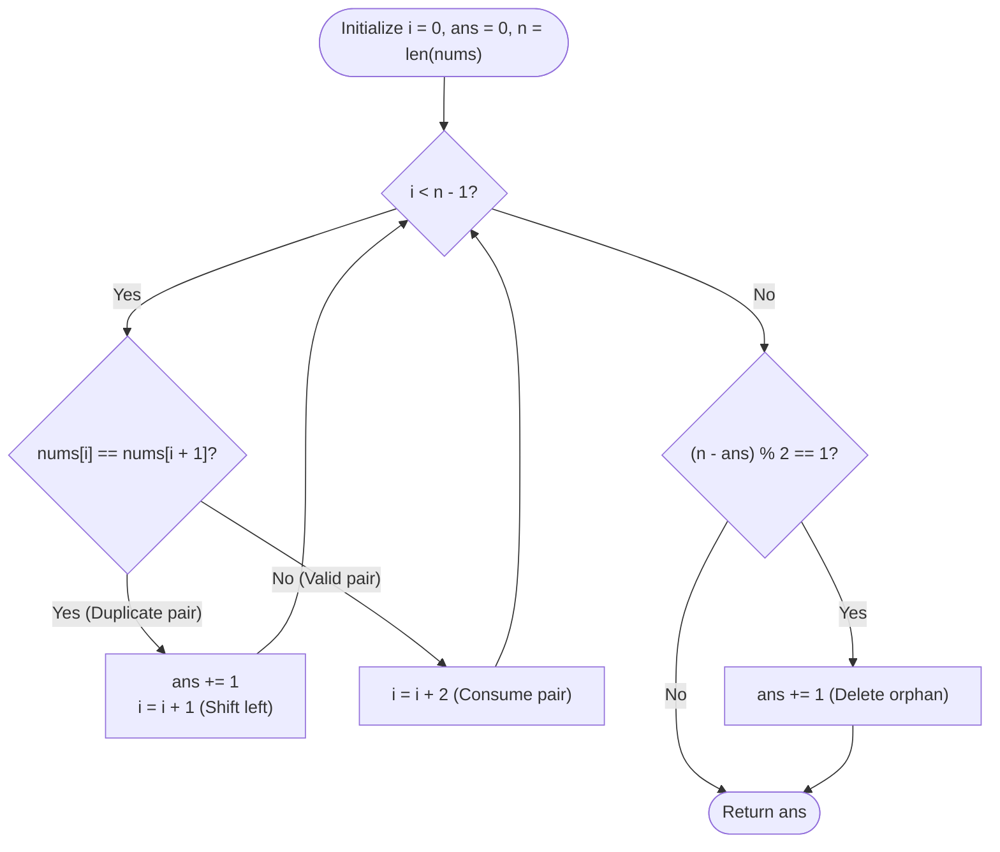

# Guided Example: Minimum Deletions to Make Array Beautiful

We analyze and trace the greedy parity-alignment and virtual-shift algorithm for transforming an integer sequence into a beautiful array of distinct even-indexed pairs, establishing $O(n)$ time complexity and $O(1)$ auxiliary space.

- **Input:** `nums = [1, 1, 2, 3, 5]`
- **Output:** `1`

This representative instance highlights greedy adjacent duplicate elimination, pointer stride adaptation ($+1$ on deletion versus $+2$ on successful pairing), and terminal odd-length parity correction.

---

## 1. Problem Overview & Representative Instance

We are given a 0-indexed integer array `nums`.
An array is defined as **beautiful** if and only if:
1. Its total length is **even**: $\text{len}(\text{nums}) \equiv 0 \pmod 2$.
2. Every pair starting at an even index consists of distinct adjacent elements:
   $$\text{nums}[i] \ne \text{nums}[i + 1] \quad \text{for all } i \in \{0, 2, 4, \dots, \text{len}(\text{nums}) - 2\}$$

When an element is deleted, all elements situated to its right shift one position to the left, altering the parity of their indices.
Our goal is to compute the minimum number of deletions required to make `nums` beautiful.

### Representative Instance Breakdown

Consider the sequence:
$$\text{nums} = [1, 1, 2, 3, 5], \quad n = 5$$

Evaluating from left to right:
1. **At index 0:**
   - Elements: $\text{nums}[0] = 1$ and $\text{nums}[1] = 1$.
   - The condition $\text{nums}[0] \ne \text{nums}[1]$ is violated because $1 = 1$.
   - One of these identical elements must be deleted.
   - Deleting one copy costs $1$ deletion.
   - The remaining elements shift left: the second $1$ becomes the new element at index $0$.
2. **Forming the first pair:**
   - We now pair the remaining $1$ with its new right neighbor $2$.
   - Since $1 \ne 2$, this forms a valid pair $(1, 2)$ spanning indices $0$ and $1$.
3. **Forming the second pair:**
   - The next available elements are $3$ and $5$.
   - Since $3 \ne 5$, this forms a valid pair $(3, 5)$ spanning indices $2$ and $3$.
4. **Parity Check:**
   - Remaining elements: $[1, 2, 3, 5]$.
   - Length is $4$, which is even ($4 \equiv 0 \pmod 2$).
   - Total deletions: $1$.

---

## 2. Mathematical & Algorithmic Principles

### Greedy Pairing with Index Shifting

In any beautiful array, elements are partitioned into disjoint adjacent pairs:
$$(x_0, x_1), \, (x_2, x_3), \, (x_4, x_5), \dots$$
where each pair $(x_{2k}, x_{2k+1})$ must satisfy $x_{2k} \ne x_{2k+1}$.

Suppose we scan the original array with index pointer $i$:
- If $\text{nums}[i] == \text{nums}[i + 1]$:
  These two adjacent identical values cannot form a valid pair. We must delete at least one of them.
  Deleting $\text{nums}[i]$ increments our deletion count $\text{ans} \leftarrow \text{ans} + 1$.
  Crucially, deleting $\text{nums}[i]$ means the element formerly at $i + 1$ now becomes the left candidate of the pair. Thus, the scan pointer advances by only $1$: $i \leftarrow i + 1$.
- If $\text{nums}[i] \ne \text{nums}[i + 1]$:
  The two elements successfully form a valid pair $(x_{2k}, x_{2k+1})$.
  Both elements are consumed, so the scan pointer advances by $2$: $i \leftarrow i + 2$.

### Terminal Parity Adjustment

After the loop terminates (when $i \ge n - 1$):
- The number of retained elements is $n - \text{ans}$.
- If $n - \text{ans}$ is odd, the final element is left stranded without a matching partner.
- To fulfill the requirement that the final length is even, this trailing orphan element must be deleted:
  $$\text{Final Deletions} = \text{ans} + ((n - \text{ans}) \bmod 2)$$

---

## 3. Step-by-Step Walkthrough with Intermediate State

We trace `nums = [1, 1, 2, 3, 5]` ($n = 5$).

### Initialization
- Length: $n = 5$.
- Pointer: $i = 0$.
- Deletion counter: $\text{ans} = 0$.

---

### Iteration 1: $i = 0$
- Pair examined: $(\text{nums}[0], \text{nums}[1]) = (1, 1)$.
- Comparison: $\text{nums}[0] == \text{nums}[1]$ ($1 == 1$).
- Equality violation detected!
- Action:
  - Delete element at $i$: $\text{ans} \leftarrow 0 + 1 = 1$.
  - Advance pointer by $1$: $i \leftarrow 0 + 1 = 1$.
- State: $\text{ans} = 1, i = 1$.

---

### Iteration 2: $i = 1$
- Pair examined: $(\text{nums}[1], \text{nums}[2]) = (1, 2)$.
- Comparison: $\text{nums}[1] \ne \text{nums}[2]$ ($1 \ne 2$).
- Valid pair formed!
- Action:
  - Consume both elements: advance pointer by $2$: $i \leftarrow 1 + 2 = 3$.
- State: $\text{ans} = 1, i = 3$.

---

### Iteration 3: $i = 3$
- Pair examined: $(\text{nums}[3], \text{nums}[4]) = (3, 5)$.
- Comparison: $\text{nums}[3] \ne \text{nums}[4]$ ($3 \ne 5$).
- Valid pair formed!
- Action:
  - Consume both elements: advance pointer by $2$: $i \leftarrow 3 + 2 = 5$.
- State: $\text{ans} = 1, i = 5$.

---

### Loop Termination & Parity Check
- Loop condition $i < n - 1 \implies 5 < 4$ is False. Loop terminates.
- Total retained elements:
  $$\text{retained} = n - \text{ans} = 5 - 1 = 4$$
- Parity verification:
  $$4 \bmod 2 = 0 \implies \text{even}$$
- No trailing deletion needed ($0$ added).
- Final answer: $1$.

---

## 4. Comprehensive State Trace

The table below summarizes pointer movements, comparisons, actions, and cumulative deletions for each step.

| Step | Scan Index $i$ | Pair Inspected $(\text{nums}[i], \text{nums}[i+1])$ | Are Elements Equal? | Action Taken | Pointer Stride $\Delta i$ | Updated $i$ | Cumulative Deletions `ans` |
|---|---|---|---|---|---|---|---|
| Start | — | — | — | — | — | $0$ | $0$ |
| $1$ | $0$ | $(1, 1)$ | **Yes** | Delete $\text{nums}[0]$ | $+1$ | $1$ | $1$ |
| $2$ | $1$ | $(1, 2)$ | No | Form Pair $(1, 2)$ | $+2$ | $3$ | $1$ |
| $3$ | $3$ | $(3, 5)$ | No | Form Pair $(3, 5)$ | $+2$ | $5$ | $1$ |
| End | $5$ | — | — | Parity Check ($4$ is even) | — | — | **1** |

### Trace on a Multi-Duplicate Array: `nums = [1, 1, 2, 2, 3, 3]` ($n = 6$)

| Step | Index $i$ | Pair | Condition | Action | Next $i$ | Cumulative `ans` |
|---|---|---|---|---|---|---|
| 1 | $0$ | $(1, 1)$ | Equal | Delete $1$ | $1$ | $1$ |
| 2 | $1$ | $(1, 2)$ | Not Equal | Form Pair $(1, 2)$ | $3$ | $1$ |
| 3 | $3$ | $(2, 3)$ | Not Equal | Form Pair $(2, 3)$ | $5$ | $1$ |
| Finish | $5$ | Orphan $3$ | End of array | Retained $= 6 - 1 = 5$ (odd) $\implies$ Delete orphan | — | **2** |

---

## 5. Algorithmic Correctness & Soundness

### Optimality of Greedy Deletion
Suppose we encounter $\text{nums}[i] == \text{nums}[i + 1]$.
Any valid pairing must choose an element to pair with $\text{nums}[i]$. If $\text{nums}[i]$ is paired with some future element $\text{nums}[k]$ ($k > i + 1$), all intervening elements $\text{nums}[i + 1 \dots k - 1]$ must either be deleted or form complete pairs.
Because $\text{nums}[i + 1] = \text{nums}[i]$, pairing $\text{nums}[i]$ with $\text{nums}[k]$ is algebraically identical to deleting $\text{nums}[i]$ and pairing $\text{nums}[i + 1]$ with $\text{nums}[k]$.
Thus, immediately deleting $\text{nums}[i]$ whenever $\text{nums}[i] == \text{nums}[i + 1]$ is a globally optimal choice that never requires backtracking.

### Parity Invariant
Because the loop only consumes elements in valid pairs of $2$ or marks single elements for deletion, all retained elements prior to the loop exit are grouped into valid pairs of size $2$.
If the total number of retained elements is odd, exactly one element remains at the tail without a pair. Deleting it ensures the remaining array length is even, maintaining the invariant.

---

## 6. Edge Cases & Anti-Patterns

### Edge Cases
- **All Identical Elements (`nums = [2, 2, 2, 2]`):**
  Each pair $(2, 2)$ triggers a deletion. All $4$ elements are deleted, returning $4$ (empty array is trivially even and beautiful).
- **Already Beautiful Array (`nums = [1, 2, 3, 4]`):**
  Pairs $(1, 2)$ and $(3, 4)$ are valid. Deletions: $0$.
- **Odd-Length Beautiful Prefix (`nums = [1, 2, 3]`):**
  Pair $(1, 2)$ forms, leaving $3$ stranded. Tail deletion triggers, returning $1$.

### Anti-Patterns to Avoid
- **Physically Deleting from Array:** Using `del nums[i]` in Python shifts elements in $O(n)$ time per deletion, resulting in $O(n^2)$ complexity. Simulating index shifts with variable strides runs in $O(n)$ time.
- **Forgetting the Parity Check:** Forgetting to delete the trailing orphan when $n - \text{ans}$ is odd fails condition 1 ($\text{len}$ must be even).

---

## 7. Complexity Analysis

### Time Complexity
- The pointer $i$ starts at $0$ and increases by at least $1$ in every step.
- The while loop executes at most $n$ times.
- Each iteration performs $O(1)$ scalar comparisons and additions.
- The final parity check takes $O(1)$ arithmetic.
- Total Time Complexity: $\mathcal{O}(n)$, running in under $2$ milliseconds for $n \le 10^5$.

### Space Complexity
- The algorithm operates exclusively with integer pointers $i, \text{ans}, n$.
- Auxiliary Space Complexity: $\mathcal{O}(1)$.
