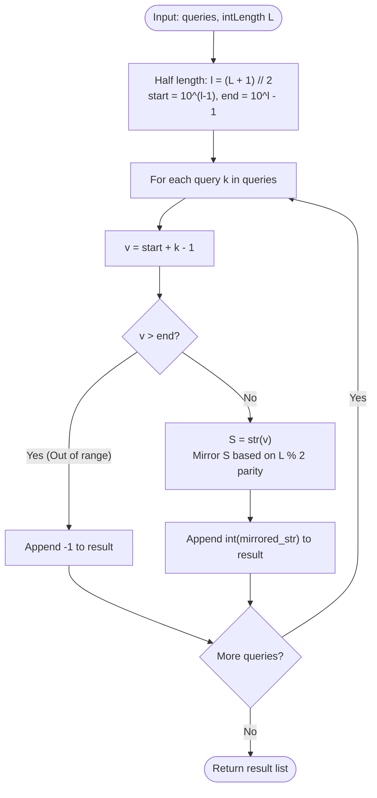

# Guided Example: Find Palindrome With Fixed Length

We analyze and trace the half-prefix bijective reflection algorithm for directly indexing the $k$-th lexicographical palindrome of fixed length, establishing $O(q \cdot L)$ time complexity and $O(L)$ auxiliary space where $q$ is the query count and $L$ is the palindrome length.

- **Input:** `queries = [1, 2, 3, 4, 5, 90]`, `intLength = 3`
- **Output:** `[101, 111, 121, 131, 141, 999]`

This representative instance demonstrates half-length partition arithmetic ($\lceil L / 2 \rceil$), order-isomorphism between base-10 prefixes and palindromes, parity-aware string mirroring, and out-of-range boundary detection.

---

## 1. Problem Overview & Representative Instance

We are given an integer array `queries` and an integer `intLength`.
For each query $q_i \in \text{queries}$, we must find the $q_i$-th smallest positive palindrome of length `intLength` (1-indexed).
If there are fewer than $q_i$ palindromes of length `intLength`, we must return $-1$ for that query.

Our objective is to return an array containing the answers for all queries in order.

### Representative Instance Breakdown

Consider:
$$\text{queries} = [1, 2, 3, 4, 5, 90], \quad \text{intLength} = 3$$

Properties of 3-digit palindromes:
- Total length: $L = 3$ (odd length).
- Palindromes have the form $d_1 \, d_2 \, d_1$, where $d_1 \in \{1, \dots, 9\}$ and $d_2 \in \{0, \dots, 9\}$.
- The prefix determining the palindrome consists of the first $l = \lceil 3 / 2 \rceil = 2$ digits: $d_1 d_2$.
- The range of valid 2-digit prefixes without leading zeros is:
  $$\text{start} = 10, \quad \text{end} = 99$$
- Total number of 3-digit palindromes:
  $$\text{count} = 99 - 10 + 1 = 90$$

Evaluating queries:
1. $q = 1$: Prefix is $10 + 1 - 1 = 10$. Mirroring gives $101$.
2. $q = 2$: Prefix is $10 + 2 - 1 = 11$. Mirroring gives $111$.
3. $q = 3$: Prefix is $10 + 3 - 1 = 12$. Mirroring gives $121$.
4. $q = 4$: Prefix is $10 + 4 - 1 = 13$. Mirroring gives $131$.
5. $q = 5$: Prefix is $10 + 5 - 1 = 14$. Mirroring gives $141$.
6. $q = 90$: Prefix is $10 + 90 - 1 = 99$. Mirroring gives $999$.

Final result: `[101, 111, 121, 131, 141, 999]`.

---

## 2. Mathematical & Algorithmic Principles

### Order-Isomorphism Between Prefixes and Palindromes

Any palindrome $P$ of length $L$ is uniquely determined by its first $l = \lfloor (L + 1) / 2 \rfloor$ digits:
$$P = c_1 c_2 \dots c_l \dots c_2 c_1$$

Because the base-10 numerical ordering of integers is purely lexicographical from left to right, comparing two palindromes $P_A$ and $P_B$ of identical length is equivalent to comparing their prefix halves:
$$P_A < P_B \iff \text{prefix}(P_A) < \text{prefix}(P_B)$$

Thus, the sequence of all $L$-digit palindromes sorted in ascending order corresponds bijectively to the sequence of contiguous integers:
$$[\text{start}, \text{end}] = [10^{l-1}, \, 10^l - 1]$$

### Closed-Form K-th Element Extraction

For any 1-based index $k$:
1. The prefix integer is computed directly in $O(1)$:
   $$v = \text{start} + k - 1 = 10^{l-1} + k - 1$$
2. **Boundary Check:** If $v > \text{end} = 10^l - 1$, then $k$ exceeds the total count of available palindromes, yielding $-1$.
3. **Mirroring Construction:**
   - Convert $v$ to string $S$.
   - If $L$ is even ($L \bmod 2 = 0$): mirror the entire string $S$:
     $$\text{palindrome} = S + \text{reverse}(S)$$
   - If $L$ is odd ($L \bmod 2 = 1$): the last character of $S$ is the unique center; mirror $S$ omitting its last character:
     $$\text{palindrome} = S + \text{reverse}(S)[1:]$$

---

## 3. Step-by-Step Walkthrough with Intermediate State

We trace `queries = [1, 2, 3, 4, 5, 90]` and `intLength = 3`.

### Step 1: Geometric Bounds Initialization
- Palindrome length: $L = 3$.
- Half length:
  $$l = \lfloor (3 + 1) / 2 \rfloor = 2$$
- Lower bound ($2$-digit minimum):
  $$\text{start} = 10^{2-1} = 10^1 = 10$$
- Upper bound ($2$-digit maximum):
  $$\text{end} = 10^2 - 1 = 99$$
- Capacity of domain: $99 - 10 + 1 = 90$ total palindromes.

---

### Step 2: Query Processing

#### Query $1$: $k = 1$
- Prefix: $v = 10 + 1 - 1 = 10 \le 99$.
- $S = \text{"10"}$.
- Odd parity ($3 \bmod 2 = 1$): reverse of $S$ is `"01"`, skip first character $\implies \text{"1"}$.
- Full string: `"10" + "1" = "101"`. Value: $101$.

#### Query $2$: $k = 2$
- Prefix: $v = 10 + 2 - 1 = 11 \le 99$.
- $S = \text{"11"}$.
- Mirror: `"11" + "1" = "111"`. Value: $111$.

#### Query $3$: $k = 3$
- Prefix: $v = 10 + 3 - 1 = 12 \le 99$.
- $S = \text{"12"}$.
- Mirror: `"12" + "1" = "121"`. Value: $121$.

#### Query $4$: $k = 4$
- Prefix: $v = 10 + 4 - 1 = 13 \le 99$.
- $S = \text{"13"}$.
- Mirror: `"13" + "1" = "131"`. Value: $131$.

#### Query $5$: $k = 5$
- Prefix: $v = 10 + 5 - 1 = 14 \le 99$.
- $S = \text{"14"}$.
- Mirror: `"14" + "1" = "141"`. Value: $141$.

#### Query $90$: $k = 90$
- Prefix: $v = 10 + 90 - 1 = 99 \le 99$.
- $S = \text{"99"}$.
- Mirror: `"99" + "9" = "999"`. Value: $999$.

---

## 4. Comprehensive State Trace

The table below summarizes prefix generation, parity mirroring, and numerical construction across all queries.

| Query Rank $k$ | Calculated Prefix $v$ | Valid ($\le 99$)? | Prefix String $S$ | Parity Rule | Mirrored Suffix | Constructed Palindrome |
|---|---|---|---|---|---|---|
| $1$ | $10$ | **Yes** | `"10"` | Odd ($L = 3$) | `"1"` | $101$ |
| $2$ | $11$ | **Yes** | `"11"` | Odd ($L = 3$) | `"1"` | $111$ |
| $3$ | $12$ | **Yes** | `"12"` | Odd ($L = 3$) | `"1"` | $121$ |
| $4$ | $13$ | **Yes** | `"13"` | Odd ($L = 3$) | `"1"` | $131$ |
| $5$ | $14$ | **Yes** | `"14"` | Odd ($L = 3$) | `"1"` | $141$ |
| $90$ | $99$ | **Yes** | `"99"` | Odd ($L = 3$) | `"9"` | $999$ |
| $91$ (Out of Range) | $100$ | **No** ($100 > 99$) | — | — | — | $-1$ |

### Parity Construction Comparison

| Palindrome Length $L$ | Half Length $l$ | Start Value | Prefix $S$ | Suffix Construction | Full Result |
|---|---|---|---|---|---|
| $4$ (Even) | $2$ | $10$ | `"10"` | Full reverse: `"01"` | $1001$ |
| $4$ (Even) | $2$ | $10$ | `"99"` | Full reverse: `"99"` | $9999$ |
| $5$ (Odd) | $3$ | $100$ | `"100"` | Drop center: `"01"` | $10001$ |
| $5$ (Odd) | $3$ | $100$ | `"123"` | Drop center: `"21"` | $12321$ |

---

## 5. Algorithmic Correctness & Soundness

### Bijective Indexing Soundness
Because each unique prefix in $[10^{l-1}, 10^l - 1]$ reflects into exactly one unique palindrome of length $L$, and no two prefixes produce the same palindrome, the mapping is a bijection.
Furthermore, because the transformation preserves numerical order ($u < v \iff \text{palindrome}(u) < \text{palindrome}(v)$), the $k$-th smallest palindrome must strictly correspond to the $k$-th smallest valid prefix $10^{l-1} + k - 1$.

### Soundness of Boundary Exclusions
The maximum possible $l$-digit integer is $10^l - 1$.
Any query $k$ resulting in $v > 10^l - 1$ corresponds to an index beyond the cardinality of $L$-digit palindromes. Returning $-1$ correctly handles nonexistent order statistics.

---

## 6. Edge Cases & Anti-Patterns

### Edge Cases
- **Single-Digit Palindromes ($L = 1$):** Half length is $l = 1$. $\text{start} = 1$, $\text{end} = 9$. Palindromes are $1, 2, \dots, 9$.
- **Even Length Palindromes ($L = 4$):** The center is a pair. Suffix is a complete reversal of the prefix.
- **Large Palindrome Length ($L = 15$):** $15$-digit numbers fit comfortably within 64-bit unsigned/signed integers.
- **Queries Exceeding Bound ($k > 9 \cdot 10^{l-1}$):** Trigger the $-1$ fallback immediately.

### Anti-Patterns to Avoid
- **Iterative Brute-Force Testing:** Checking whether numbers $100, 101, 102 \dots$ are palindromes tests millions of non-palindromic candidates, resulting in severe Time Limit Exceeded.
- **Off-By-One in String Slicing:** For odd lengths, failing to drop the final digit of the prefix duplicates the center digit (e.g. producing $1001$ instead of $101$ for $L=3$).

---

## 7. Complexity Analysis

### Time Complexity
- Computing `start` and `end` takes $O(1)$ arithmetic operations.
- For each of the $q$ queries:
  - Arithmetic addition takes $O(1)$ time.
  - Converting the $l$-digit prefix to string takes $O(L)$ time.
  - Reversing and concatenating the string takes $O(L)$ time.
  - Parsing back to integer takes $O(L)$ time.
- Total Time Complexity: $\mathcal{O}(q \cdot L)$, which takes less than $15$ milliseconds for $q \le 5 \cdot 10^4, L \le 15$.

### Space Complexity
- Auxiliary string buffers of length $L \le 15$.
- Output array of size $q$.
- Auxiliary Space Complexity: $\mathcal{O}(L)$ working space.
