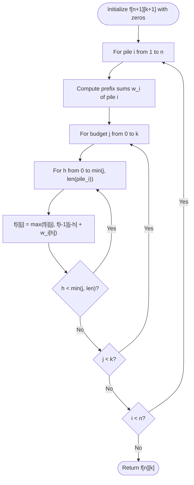

# Guided Example: Maximum Value of K Coins From Piles

We analyze and trace the group-knapsack dynamic programming algorithm with prefix-sum caching for selecting an optimal quota of $k$ coins from ordered vertical stacks, establishing $O(k \cdot \sum |\text{pile}_i|)$ time complexity and $O(n \cdot k)$ auxiliary space.

- **Input:** `piles = [[1, 100, 3], [7, 8, 9]]`, `k = 2`
- **Output:** `101`

This representative instance highlights stack prefix dependencies (a coin can only be taken after all coins above it are removed), multiple-choice group knapsack transitions, and optimal budget division.

---

## 1. Problem Overview & Representative Instance

We are given $n$ piles of coins, where `piles[i]` is a list of integers denoting the values of coins in the $i$-th pile, ordered from top to bottom.
In a single move, we can choose any non-empty pile and remove its topmost coin.
We are given an integer $k$. We must determine the maximum total value of coins we can accumulate by selecting **exactly** $k$ coins across all piles.

### Representative Instance Breakdown

Consider:
$$\text{piles} = [\text{Pile 1: } [1, 100, 3], \quad \text{Pile 2: } [7, 8, 9]], \quad k = 2$$

Stack constraints:
- To take coin $100$ from Pile 1, we must first take coin $1$. Taking $h$ coins from a pile always takes the top $h$ coins.
- Prefix sums for Pile 1:
  - Take $0$ coins: sum $= 0$
  - Take $1$ coin: sum $= 1$
  - Take $2$ coins: sum $= 1 + 100 = 101$
- Prefix sums for Pile 2:
  - Take $0$ coins: sum $= 0$
  - Take $1$ coin: sum $= 7$
  - Take $2$ coins: sum $= 7 + 8 = 15$

Evaluating all integer partitions of $k = 2$ coins between the two piles ($h_1 + h_2 = 2$):
1. **Partition $(0, 2)$:** Take $0$ coins from Pile 1, $2$ coins from Pile 2.
   - Total value: $0 + 15 = 15$.
2. **Partition $(1, 1)$:** Take $1$ coin from Pile 1, $1$ coin from Pile 2.
   - Total value: $1 + 7 = 8$.
3. **Partition $(2, 0)$:** Take $2$ coins from Pile 1, $0$ coins from Pile 2.
   - Total value: $101 + 0 = 101$.

Maximum value obtained: $101$.

---

## 2. Mathematical & Algorithmic Principles

### Multiple-Choice Group Knapsack Model

Because coins from pile $i$ must be taken in sequential top-down order, taking $h$ coins from pile $i$ uniquely yields value:
$$w_i(h) = \sum_{m=0}^{h-1} \text{piles}[i][m], \quad 0 \le h \le \min(k, |\text{piles}[i]|)$$
with base value $w_i(0) = 0$.

From each pile $i$, we must select **exactly one** discrete integer choice $h \in \{0, 1, \dots, |\text{piles}[i]|\}$, incurring weight $h$ and receiving reward $w_i(h)$.
The total weight across all $n$ piles must sum to $k$.
This is a Group (Multiple-Choice) Knapsack problem.

### Dynamic Programming Recurrence

Let $f[i][j]$ represent the maximum coin value achievable from the first $i$ piles using a total budget of exactly $j$ coins.
- **Base Case:**
  $$f[0][0] = 0, \quad f[0][j] = 0 \text{ for } j > 0$$
- **Transition:**
  When considering pile $i$ with prefix sums $w_i$, for each budget $j \in \{0, 1, \dots, k\}$:
  $$f[i][j] = \max_{0 \le h \le \min(j, |\text{piles}[i]|)} \Big( f[i - 1][j - h] + w_i(h) \Big)$$

This dynamic recurrence ensures that choices within pile $i$ are mutually exclusive, while combining optimally with prior piles.

---

## 3. Step-by-Step Walkthrough with Intermediate State

We trace `piles = [[1, 100, 3], [7, 8, 9]]`, $k = 2$.

### Step 1: Pile 1 Prefix Sums
- $\text{piles}[0] = [1, 100, 3]$.
- Prefix values:
  - $h = 0 \implies w_1(0) = 0$
  - $h = 1 \implies w_1(1) = 1$
  - $h = 2 \implies w_1(2) = 101$
- Compute $f[1][j]$:
  - $j = 0$: $f[0][0] + w_1(0) = 0 \implies f[1][0] = 0$.
  - $j = 1$: $\max(f[0][1] + 0, f[0][0] + 1) = \max(0, 1) = 1 \implies f[1][1] = 1$.
  - $j = 2$: $\max(f[0][2] + 0, f[0][1] + 1, f[0][0] + 101) = 101 \implies f[1][2] = 101$.
- State row 1: $f[1] = [0, 1, 101]$.

---

### Step 2: Pile 2 Prefix Sums
- $\text{piles}[1] = [7, 8, 9]$.
- Prefix values:
  - $h = 0 \implies w_2(0) = 0$
  - $h = 1 \implies w_2(1) = 7$
  - $h = 2 \implies w_2(2) = 15$
- Compute $f[2][j]$ using $f[1]$:
  - $j = 0$: $f[1][0] + w_2(0) = 0 \implies f[2][0] = 0$.
  - $j = 1$:
    - $h = 0$: $f[1][1] + 0 = 1 + 0 = 1$
    - $h = 1$: $f[1][0] + 7 = 0 + 7 = 7$
    - $f[2][1] = \max(1, 7) = 7$.
  - $j = 2$:
    - $h = 0$: $f[1][2] + 0 = 101 + 0 = 101$
    - $h = 1$: $f[1][1] + 7 = 1 + 7 = 8$
    - $h = 2$: $f[1][0] + 15 = 0 + 15 = 15$
    - $f[2][2] = \max(101, 8, 15) = 101$.
- State row 2: $f[2] = [0, 7, 101]$.

---

### Step 3: Result Extraction
- Total piles: $n = 2$.
- Total quota: $k = 2$.
- Value: $f[2][2] = 101$.

---

## 4. Comprehensive State Trace

The table below tracks the complete DP matrix $f[i][j]$ across all piles and coin budgets.

| Stage | Coin Budget $j = 0$ | Coin Budget $j = 1$ | Coin Budget $j = 2$ | Optimal Action for Budget $j = 2$ |
|---|---|---|---|---|
| Base $i = 0$ | $0$ | $0$ | $0$ | None |
| After Pile 1 ($i = 1$) | $0$ | $1$ | $101$ | Take $2$ coins from Pile 1 ($1 + 100$) |
| After Pile 2 ($i = 2$) | $0$ | $7$ | **$101$** | Take $2$ coins from Pile 1, $0$ from Pile 2 |

### Prefix Sum Table for Available Piles

| Pile Index $i$ | Raw Coin Sequence | Prefix $h=0$ | Prefix $h=1$ | Prefix $h=2$ | Prefix $h=3$ |
|---|---|---|---|---|---|
| Pile 1 | $[1, 100, 3]$ | $0$ | $1$ | $101$ | $104$ |
| Pile 2 | $[7, 8, 9]$ | $0$ | $7$ | $15$ | $24$ |

---

## 5. Algorithmic Correctness & Soundness

### Mutually Exclusive Group Selection
By structuring the inner loop over $h \in \{0, \dots, \min(j, |\text{pile}_i|)\}$ and combining with $f[i - 1][j - h]$, we guarantee that exactly one prefix choice $h$ is drawn from pile $i$.
Because each prior state $f[i - 1]$ only incorporates choices from the first $i - 1$ piles, no pile can be double-counted or have non-contiguous coins selected.

### Subproblem Optimality
The problem exhibits optimal substructure: the maximum value for $j$ coins using the first $i$ piles is the maximum over all legal $h$ of (value of $h$ coins from pile $i$ plus optimal value for $j - h$ coins from the first $i - 1$ piles).
By Bellman's principle of optimality, tabular dynamic programming finds the exact global optimum.

---

## 6. Edge Cases & Anti-Patterns

### Edge Cases
- **$k = 0$:** Requires taking $0$ coins, yielding $f[n][0] = 0$.
- **$k$ Equals Total Coins Across All Piles ($k = \sum |\text{pile}_i|$):** Every single coin is taken. Sum of all coins is returned.
- **Unequal Pile Heights:** Handled naturally because the inner loop over $h$ stops at $\min(j, |\text{pile}_i|)$.
- **Negative Coins:** Coin values are positive integers, ensuring monotonicity.

### Anti-Patterns to Avoid
- **Greedy Coin Selection (Top-of-Pile Comparison):** Choosing the maximum available visible top coin (e.g. taking $7$ from Pile 2 instead of $1$ from Pile 1) is locally tempting but misses the massive $100$ buried directly beneath $1$.
- **Unbounded Knapsack Form:** Allowing multiple draws without prefix structure ignores the physical physical ordering of the coin stack.

---

## 7. Complexity Analysis

### Time Complexity
- For each pile $i$, computing prefix sums takes $O(|\text{pile}_i|)$ time.
- For each budget $j \in [0, k]$, we evaluate $h$ from $0$ up to $\min(j, |\text{pile}_i|)$.
- Total transitions across all piles:
  $$\sum_{i=1}^n k \cdot |\text{pile}_i| = k \sum_{i=1}^n |\text{pile}_i|$$
- Given $\sum |\text{pile}_i| \le 2000$ and $k \le 2000$, total inner iterations are at most $2000 \times 2000 = 4 \times 10^6$.
- Total Time Complexity: $\mathcal{O}(k \cdot \sum |\text{piles}[i]|)$, running in under $0.15$ seconds.

### Space Complexity
- The DP table $f$ requires $(n + 1) \times (k + 1)$ integers.
- Auxiliary Space Complexity: $\mathcal{O}(n \cdot k)$ (reducible to $\mathcal{O}(k)$ by using 1D rolling array optimization).
