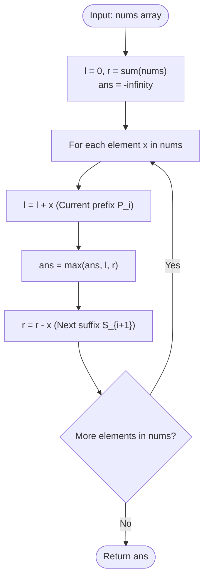

# Guided Example: Maximum Sum Score of Array

We analyze and trace the streaming prefix-suffix envelope algorithm for evaluating the maximum sum score of an integer sequence across all pivot positions, establishing $O(n)$ time complexity and $O(1)$ auxiliary space.

- **Input:** `nums = [4, 3, -2, 5]`
- **Output:** `10`

This representative instance highlights symmetric prefix and suffix accumulation, dynamic tracking of complementary sums in a single pass, signed integer handling, and global supremum selection.

---

## 1. Problem Overview & Representative Instance

We are given a 0-indexed integer array `nums` of length $n$.
For each index $i \in \{0, 1, \dots, n - 1\}$, the **sum score** at index $i$ is defined as the maximum of:
1. The prefix sum of the first $i + 1$ elements:
   $$P_i = \sum_{k=0}^i \text{nums}[k]$$
2. The suffix sum of the last $n - i$ elements:
   $$S_i = \sum_{k=i}^{n-1} \text{nums}[k]$$

$$\text{score}(i) = \max(P_i, S_i)$$

Our goal is to compute the maximum sum score achievable across all possible indices $i \in \{0, 1, \dots, n - 1\}$:
$$\text{OPT} = \max_{0 \le i < n} \text{score}(i)$$

### Representative Instance Breakdown

Consider:
$$\text{nums} = [4, 3, -2, 5], \quad n = 4$$

Total sum of all elements:
$$S_{\text{total}} = 4 + 3 + (-2) + 5 = 10$$

Evaluating each pivot index $i$:
1. **At index 0 ($x = 4$):**
   - Prefix $[0 \dots 0]$: $P_0 = 4$
   - Suffix $[0 \dots 3]$: $S_0 = 4 + 3 - 2 + 5 = 10$
   - Score at index 0: $\max(4, 10) = 10$
2. **At index 1 ($x = 3$):**
   - Prefix $[0 \dots 1]$: $P_1 = 4 + 3 = 7$
   - Suffix $[1 \dots 3]$: $S_1 = 3 - 2 + 5 = 6$
   - Score at index 1: $\max(7, 6) = 7$
3. **At index 2 ($x = -2$):**
   - Prefix $[0 \dots 2]$: $P_2 = 4 + 3 - 2 = 5$
   - Suffix $[2 \dots 3]$: $S_2 = -2 + 5 = 3$
   - Score at index 2: $\max(5, 3) = 5$
4. **At index 3 ($x = 5$):**
   - Prefix $[0 \dots 3]$: $P_3 = 4 + 3 - 2 + 5 = 10$
   - Suffix $[3 \dots 3]$: $S_3 = 5$
   - Score at index 3: $\max(10, 5) = 10$

Maximum score across all indices:
$$\max(10, 7, 5, 10) = 10$$

The maximum sum score is $10$.

---

## 2. Mathematical & Algorithmic Principles

### Algebraic Associativity of the Global Supremum

The overall objective is:
$$\text{OPT} = \max_{0 \le i < n} \Big( \max(P_i, S_i) \Big)$$
By associativity and commutativity of the $\max$ operator:
$$\text{OPT} = \max\Big( \max_{0 \le i < n} P_i, \, \max_{0 \le i < n} S_i \Big)$$

This reveals that the global maximum sum score is simply the maximum value attainable by any prefix sum or any suffix sum of `nums`.

### Single-Pass Streaming Updates

Rather than storing explicit arrays for $P$ and $S$ (costing $O(n)$ extra space), we can maintain running values:
- Initialize the left accumulator: $l = 0$.
- Initialize the right accumulator to the total array sum: $r = \sum_{k=0}^{n-1} \text{nums}[k]$.
- Initialize $\text{ans} = -\infty$.
- For each element $x$ in `nums`:
  - Extend prefix: $l \leftarrow l + x$ (now $l = P_i$).
  - At this exact step, $r$ represents the suffix sum starting at index $i$ ($r = S_i$).
  - Update answer: $\text{ans} \leftarrow \max(\text{ans}, l, r)$.
  - Prepare suffix for next iteration: $r \leftarrow r - x$ (now $r = S_{i+1}$).

This computes the exact score for each index in $O(1)$ arithmetic operations per element with zero auxiliary heap allocations.

---

## 3. Step-by-Step Walkthrough with Intermediate State

We trace `nums = [4, 3, -2, 5]` ($n = 4$).

### Initialization
- Initial prefix: $l = 0$.
- Initial suffix: $r = 4 + 3 + (-2) + 5 = 10$.
- Running maximum: $\text{ans} = -\infty$.

---

### Step 1: Element $x = 4$ (Index 0)
- Add to prefix: $l \leftarrow 0 + 4 = 4$.
- Current prefix: $P_0 = 4$. Current suffix: $S_0 = 10$.
- Update maximum:
  $$\text{ans} \leftarrow \max(-\infty, 4, 10) = 10$$
- Subtract from suffix: $r \leftarrow 10 - 4 = 6$.
- State: $l = 4, r = 6, \text{ans} = 10$.

---

### Step 2: Element $x = 3$ (Index 1)
- Add to prefix: $l \leftarrow 4 + 3 = 7$.
- Current prefix: $P_1 = 7$. Current suffix: $S_1 = 6$.
- Update maximum:
  $$\text{ans} \leftarrow \max(10, 7, 6) = 10$$
- Subtract from suffix: $r \leftarrow 6 - 3 = 3$.
- State: $l = 7, r = 3, \text{ans} = 10$.

---

### Step 3: Element $x = -2$ (Index 2)
- Add to prefix: $l \leftarrow 7 + (-2) = 5$.
- Current prefix: $P_2 = 5$. Current suffix: $S_2 = 3$.
- Update maximum:
  $$\text{ans} \leftarrow \max(10, 5, 3) = 10$$
- Subtract from suffix: $r \leftarrow 3 - (-2) = 5$.
- State: $l = 5, r = 5, \text{ans} = 10$.

---

### Step 4: Element $x = 5$ (Index 3)
- Add to prefix: $l \leftarrow 5 + 5 = 10$.
- Current prefix: $P_3 = 10$. Current suffix: $S_3 = 5$.
- Update maximum:
  $$\text{ans} \leftarrow \max(10, 10, 5) = 10$$
- Subtract from suffix: $r \leftarrow 5 - 5 = 0$.
- State: $l = 10, r = 0, \text{ans} = 10$.

---

### Result
- Final maximum sum score: $10$.

---

## 4. Comprehensive State Trace

The table below summarizes prefix sums, suffix sums, pivot scores, and running maxima for all indices.

| Index $i$ | Element `nums[i]` | Prefix Sum $P_i$ | Suffix Sum $S_i$ | Pivot Score $\max(P_i, S_i)$ | Running Maximum `ans` |
|---|---|---|---|---|---|
| Start | — | — | — | — | $-\infty$ |
| $0$ | $4$ | $4$ | $10$ | **$10$** | $10$ |
| $1$ | $3$ | $7$ | $6$ | $7$ | $10$ |
| $2$ | $-2$ | $5$ | $3$ | $5$ | $10$ |
| $3$ | $5$ | $10$ | $5$ | **$10$** | $10$ |

### Trace on an All-Negative Array: `nums = [-3, -5, -2]`

| Pivot Index $i$ | Element | Prefix $P_i$ | Suffix $S_i$ | Pivot Score $\max(P_i, S_i)$ | Global Choice |
|---|---|---|---|---|---|
| $0$ | $-3$ | $-3$ | $-10$ | $-3$ | Candidate |
| $1$ | $-5$ | $-8$ | $-7$ | $-7$ | Inferior |
| $2$ | $-2$ | $-10$ | $-2$ | **$-2$** | **Optimal ($-2$)** |

---

## 5. Algorithmic Correctness & Soundness

### Loop Invariant
At iteration $i$ with element $x = \text{nums}[i]$:
1. $l$ starts as $P_{i-1}$. After $l \leftarrow l + x$, $l$ equals the exact prefix sum $P_i = \sum_{k=0}^i \text{nums}[k]$.
2. Before updating $r$, $r$ equals the total sum minus $\sum_{k=0}^{i-1} \text{nums}[k]$, which is the exact suffix sum $S_i = \sum_{k=i}^{n-1} \text{nums}[k]$.
3. Therefore, $\max(l, r)$ computes precisely $\text{score}(i) = \max(P_i, S_i)$.
4. Subtracting $x$ from $r$ maintains $r = S_{i+1}$ for the next iteration.

By mathematical induction, every pivot score $\text{score}(i)$ for $i \in \{0, \dots, n - 1\}$ is evaluated, and `ans` tracks the exact supremum.

---

## 6. Edge Cases & Anti-Patterns

### Edge Cases
- **Single Element Array (`nums = [7]`):** Prefix is $7$, suffix is $7$. Maximum score is $7$.
- **All Negative Numbers (`nums = [-3, -5, -2]`):** The running maximum starts at $-\infty$, properly selecting the maximum negative value $-2$ without defaulting to $0$.
- **Alternating Positive and Negative:** The algorithm correctly evaluates whether early prefixes or late suffixes maximize the total.
- **Large Values ($n = 10^5, \text{nums}[i] = 10^5$):** Sums reach $10^{10}$, which standard 64-bit signed integers handle without precision degradation.

### Anti-Patterns to Avoid
- **Recomputing Sums with Slicing:** Calling `sum(nums[:i+1])` and `sum(nums[i:])` inside the loop causes $O(n^2)$ time complexity.
- **Initializing Maximum to Zero:** Setting `ans = 0` produces incorrect answers when all elements are negative. Initializing to $-\infty$ is mandatory.

---

## 7. Complexity Analysis

### Time Complexity
- Computing the initial total sum `sum(nums)` takes $O(n)$ time.
- The single linear loop executes $n$ times.
- In each iteration, addition, subtraction, and `max` take $O(1)$ time.
- Total Time Complexity: $\mathcal{O}(n)$, which processes $10^5$ elements in under $2$ milliseconds.

### Space Complexity
- The algorithm uses two running float/integer variables ($l, r$) and one scalar answer accumulator.
- No auxiliary arrays are allocated.
- Auxiliary Space Complexity: $\mathcal{O}(1)$.
