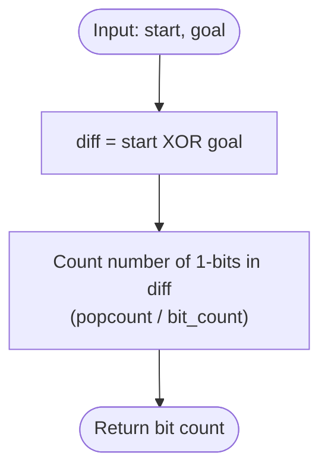

# Guided Example: Minimum Bit Flips to Convert Number

We analyze and trace the bitwise XOR Hamming distance algorithm for calculating the minimal single-bit inversions needed to transform one integer into another, establishing $O(\log(\max(A, B)))$ time complexity and $O(1)$ auxiliary space.

- **Input:** `start = 10`, `goal = 7`
- **Output:** `3`

This representative instance demonstrates binary radix expansion, bitwise difference isolation via XOR, popcount (Hamming weight) enumeration, and Brian Kernighan bit-clearing mechanics.

---

## 1. Problem Overview & Representative Instance

A bit flip of a non-negative integer $x$ consists of choosing any bit position in its binary representation and toggling it ($0 \to 1$ or $1 \to 0$).
We are given two non-negative integers `start` and `goal`.
Our objective is to determine the **minimum number of bit flips** required to transform `start` into `goal`.

### Representative Instance Breakdown

Consider:
$$\text{start} = 10, \quad \text{goal} = 7$$

Binary representations aligned across 4 bits:
- $\text{start} = 10 = 1010_2$
- $\text{goal} = 7 = 0111_2$

Position-by-position comparison from most to least significant bit:
1. **Bit 3 (Weight $2^3 = 8$):**
   - $\text{start}$ has $1$, $\text{goal}$ has $0$. Differ! Must flip: $1 \to 0$.
2. **Bit 2 (Weight $2^2 = 4$):**
   - $\text{start}$ has $0$, $\text{goal}$ has $1$. Differ! Must flip: $0 \to 1$.
3. **Bit 1 (Weight $2^1 = 2$):**
   - $\text{start}$ has $1$, $\text{goal}$ has $1$. Identical. No flip needed.
4. **Bit 0 (Weight $2^0 = 1$):**
   - $\text{start}$ has $0$, $\text{goal}$ has $1$. Differ! Must flip: $0 \to 1$.

Total bits that differ: $3$ (at positions $0, 2, 3$).
Minimum bit flips needed: $3$.

---

## 2. Mathematical & Algorithmic Principles

### Hamming Distance and Bitwise XOR

The minimum number of bit flips required to transform integer $A$ into integer $B$ is formally the **Hamming distance** between their infinite binary sequences:
$$d_H(A, B) = \sum_{k=0}^{\infty} \mathbf{1}_{(A_k \ne B_k)}$$

The bitwise exclusive-OR ($\oplus$) operator isolates precisely the positions where the binary representations differ:
$$(A \oplus B)_k = A_k \oplus B_k = \begin{cases} 1 & \text{if } A_k \ne B_k \\ 0 & \text{if } A_k = B_k \end{cases}$$

Therefore, the problem reduces to calculating the number of set bits (Hamming weight or popcount) of the XOR difference:
$$\text{Flips}(A, B) = \text{popcount}(A \oplus B)$$

### Population Count (Brian Kernighan's Algorithm)

To count the number of set bits in $X = A \oplus B$:
- The algebraic operation $X \ \& \ (X - 1)$ strips the lowest set bit of $X$.
- Repeating $X \leftarrow X \ \& \ (X - 1)$ until $X = 0$ requires exactly as many iterations as there are set bits in $X$.
- Modern processors execute this in $O(1)$ hardware cycles via dedicated machine instructions (`POPCNT`).

---

## 3. Step-by-Step Walkthrough with Intermediate State

We trace `start = 10` and `goal = 7`.

### Step 1: Bitwise XOR Computation
- Express in binary:
  $$\text{start} = 1010_2$$
  $$\text{goal} = 0111_2$$
- Perform bitwise XOR:
  $$X = \text{start} \oplus \text{goal} = 1010_2 \oplus 0111_2 = 1101_2 = 13_{10}$$

---

### Step 2: Population Count Evaluation (Brian Kernighan Iterations)
Initial difference: $X = 13 = 1101_2$. Counter: $\text{count} = 0$.

1. **Iteration 1:**
   - Lowest set bit is at position 0:
     $$X - 1 = 13 - 1 = 12 = 1100_2$$
     $$X \ \& \ (X - 1) = 1101_2 \ \& \ 1100_2 = 1100_2 = 12$$
   - $X \leftarrow 12$. Increment: $\text{count} \leftarrow 0 + 1 = 1$.
2. **Iteration 2:**
   - Lowest set bit is at position 2:
     $$X - 1 = 12 - 1 = 11 = 1011_2$$
     $$X \ \& \ (X - 1) = 1100_2 \ \& \ 1011_2 = 1000_2 = 8$$
   - $X \leftarrow 8$. Increment: $\text{count} \leftarrow 1 + 1 = 2$.
3. **Iteration 3:**
   - Lowest set bit is at position 3:
     $$X - 1 = 8 - 1 = 7 = 0111_2$$
     $$X \ \& \ (X - 1) = 1000_2 \ \& \ 0111_2 = 0000_2 = 0$$
   - $X \leftarrow 0$. Increment: $\text{count} \leftarrow 2 + 1 = 3$.
4. **Termination:**
   - $X = 0$. Loop terminates.

Final bit flip count: $3$.

---

## 4. Comprehensive State Trace

The table below illustrates the bitwise comparison across individual power-of-two positions.

| Bit Index $k$ | Positional Weight $2^k$ | $\text{start}$ Bit Value | $\text{goal}$ Bit Value | $\text{start} \oplus \text{goal}$ | Inversion Required? | Running Inversions |
|---|---|---|---|---|---|---|
| $0$ | $2^0 = 1$ | $0$ | $1$ | $1$ | **Yes** ($0 \to 1$) | $1$ |
| $1$ | $2^1 = 2$ | $1$ | $1$ | $0$ | No | $1$ |
| $2$ | $2^2 = 4$ | $0$ | $1$ | $1$ | **Yes** ($0 \to 1$) | $2$ |
| $3$ | $2^3 = 8$ | $1$ | $0$ | $1$ | **Yes** ($1 \to 0$) | $3$ |
| $\ge 4$ | $2^{\ge 4} \ge 16$ | $0$ | $0$ | $0$ | No | $3$ |

### Brian Kernighan Bit Clearning State Table

| Step | State of $X$ (Binary) | Decimal $X$ | Decremented $X - 1$ | Bitwise AND $X \ \& \ (X - 1)$ | Cumulative Set Bits |
|---|---|---|---|---|---|
| Start | $1101_2$ | $13$ | — | — | $0$ |
| Step 1 | $1100_2$ | $12$ | $1100_2$ | $1100_2$ | $1$ |
| Step 2 | $1000_2$ | $8$ | $1011_2$ | $1000_2$ | $2$ |
| Step 3 | $0000_2$ | $0$ | $0111_2$ | $0000_2$ | **3** |

---

## 5. Algorithmic Correctness & Soundness

### Independence of Bit Flips
A bit flip at position $i$ modifies only the $i$-th bit of a number. It does not generate any carry, borrow, or side-effect on any other bit position $j \ne i$.
Consequently, each differing bit position must be flipped at least once, and flipping each differing position exactly once transforms `start` into `goal`.
Because no single flip can correct more than one bit position, the minimum number of flips is strictly the number of differing positions.

### Popcount Soundness
The property $A_k \ne B_k \iff (A \oplus B)_k = 1$ establishes that the differing positions of $A$ and $B$ are in 1-to-1 correspondence with the 1-bits of $A \oplus B$.
Thus, evaluating the popcount of $A \oplus B$ is mathematically sound and exact.

---

## 6. Edge Cases & Anti-Patterns

### Edge Cases
- **Identical Numbers (`start == goal`):** $A \oplus B = 0$. Popcount is $0$. No flips required.
- **Converting to Zero (`goal = 0`):** $A \oplus 0 = A$. Flips equal the number of set bits in $A$.
- **Disjoint Bits (`start = 5 (101_2)`, `goal = 2 (010_2)`):** No bits in common. Flips equal the sum of set bits in both numbers ($2 + 1 = 3$).
- **Large Inputs ($10^9 < 2^{30}$):** At most $30$ bits need inspection, fitting in standard integer registers.

### Anti-Patterns to Avoid
- **String Formatting and Counting:** Converting numbers to binary strings (e.g. `bin(start ^ goal).count('1')`) introduces unnecessary heap allocations and string parsing. Using native bitwise hardware popcount (`bit_count()`) is direct and instantaneous.
- **Arithmetic Subtraction:** Using subtraction $|A - B|$ is completely invalid because carries cause difference values to diverge from Hamming distance.

---

## 7. Complexity Analysis

### Time Complexity
- Evaluating bitwise XOR takes $O(1)$ machine instructions.
- The population count operation inspects at most $\lfloor \log_2(\max(A, B)) \rfloor + 1 \le 30$ bits.
- Using hardware instructions (`POPCNT` or `.bit_count()`), execution requires $O(1)$ time.
- Total Time Complexity: $\mathcal{O}(1)$.

### Space Complexity
- No heap structures or arrays are created.
- Auxiliary Space Complexity: $\mathcal{O}(1)$.
