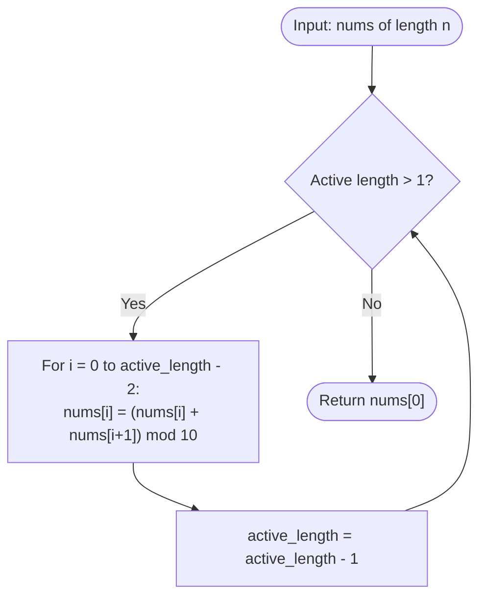

# Guided Example: Find Triangular Sum of an Array

We analyze and trace the in-place triangular reduction algorithm that computes the single remaining digit of an integer array under iterative adjacent summation modulo 10.

- **Input:** `nums = [1, 2, 3, 4, 5]`
- **Output:** `8`

This representative instance illustrates the inverted triangular reduction process, modular arithmetic reduction, in-place prefix contraction without auxiliary array allocations, and the equivalence to Pascal's triangle convolution.

---

## 1. Problem Overview & Representative Instance

Given a 0-indexed integer array `nums` of length $n$, where each element is a decimal digit between $0$ and $9$ inclusive, we construct an inverted triangle of numbers.

In each round:
1. If the current sequence contains only $1$ element, the process terminates and that element is returned.
2. Otherwise, a new sequence of length $m - 1$ is generated from a sequence of length $m$ by defining each adjacent pair sum modulo 10:
   $$\text{newNums}[i] = (\text{nums}[i] + \text{nums}[i + 1]) \pmod{10}, \quad \text{for } 0 \le i < m - 1$$
3. The original array is replaced by $\text{newNums}$, and the process repeats.

### Representative Instance Breakdown

Consider `nums = [1, 2, 3, 4, 5]` of initial length $n = 5$:
- **Initial row ($m = 5$):** $[1, 2, 3, 4, 5]$
- **Row 1 ($m = 4$):** $[(1+2)\%10, (2+3)\%10, (3+4)\%10, (4+5)\%10] = [3, 5, 7, 9]$
- **Row 2 ($m = 3$):** $[(3+5)\%10, (5+7)\%10, (7+9)\%10] = [8, 12\%10, 16\%10] = [8, 2, 6]$
- **Row 3 ($m = 2$):** $[(8+2)\%10, (2+6)\%10] = [10\%10, 8] = [0, 8]$
- **Row 4 ($m = 1$):** $[(0+8)\%10] = [8]$

Final triangular sum: $8$.

---

## 2. Mathematical & Algorithmic Principles

### Pascal's Triangle Convolution Modulo 10

Each reduction step is a linear combination of adjacent elements. By induction, the coefficient of each initial element $\text{nums}[i]$ in the final single element corresponds exactly to row $n - 1$ of Pascal's triangle:

$$\text{TriangularSum}(\text{nums}) = \left( \sum_{i=0}^{n-1} \binom{n-1}{i} \text{nums}[i] \right) \pmod{10}$$

While combinatorial evaluation using Lucas' Theorem (via Chinese Remainder Theorem modulo $2$ and $5$) is theoretically possible in $O(n)$ time, the constraints ($n \le 1000$) make the direct $O(n^2)$ simulation both optimal in implementation simplicity and free from combinatorial modular inversion pitfalls.

### In-Place Left-to-Right Contraction Invariant

To achieve $O(1)$ auxiliary space, we overwrite `nums` directly from left to right:
- When computing $\text{nums}[i] \leftarrow (\text{nums}[i] + \text{nums}[i + 1]) \pmod{10}$, the value at $\text{nums}[i]$ is the old value from the prior row.
- The value at $\text{nums}[i + 1]$ has not yet been overwritten because the inner loop proceeds strictly left-to-right ($i = 0, 1, \dots, k - 1$).
- Thus, both required operands are preserved at the exact moment of computation.

---

## 3. Step-by-Step Walkthrough with Intermediate State

We trace the execution on `nums = [1, 2, 3, 4, 5]`. Initial active length is $5$.

### Round 1: Active boundary $k = 4$ (contracting length 5 to 4)
- $i = 0$: $\text{nums}[0] \leftarrow (1 + 2) \pmod{10} = 3$. Array: $[3, 2, 3, 4, 5]$
- $i = 1$: $\text{nums}[1] \leftarrow (2 + 3) \pmod{10} = 5$. Array: $[3, 5, 3, 4, 5]$
- $i = 2$: $\text{nums}[2] \leftarrow (3 + 4) \pmod{10} = 7$. Array: $[3, 5, 7, 4, 5]$
- $i = 3$: $\text{nums}[3] \leftarrow (4 + 5) \pmod{10} = 9$. Array: $[3, 5, 7, 9, 5]$
- Meaningful prefix of length $4$ is now $[3, 5, 7, 9]$. (The trailing $5$ is discarded).

### Round 2: Active boundary $k = 3$ (contracting length 4 to 3)
- $i = 0$: $\text{nums}[0] \leftarrow (3 + 5) \pmod{10} = 8$. Array: $[8, 5, 7, 9, \dots]$
- $i = 1$: $\text{nums}[1] \leftarrow (5 + 7) \pmod{10} = 2$. Array: $[8, 2, 7, 9, \dots]$
- $i = 2$: $\text{nums}[2] \leftarrow (7 + 9) \pmod{10} = 6$. Array: $[8, 2, 6, 9, \dots]$
- Meaningful prefix of length $3$ is now $[8, 2, 6]$.

### Round 3: Active boundary $k = 2$ (contracting length 3 to 2)
- $i = 0$: $\text{nums}[0] \leftarrow (8 + 2) \pmod{10} = 0$. Array: $[0, 2, 6, \dots]$
- $i = 1$: $\text{nums}[1] \leftarrow (2 + 6) \pmod{10} = 8$. Array: $[0, 8, 6, \dots]$
- Meaningful prefix of length $2$ is now $[0, 8]$.

### Round 4: Active boundary $k = 1$ (contracting length 2 to 1)
- $i = 0$: $\text{nums}[0] \leftarrow (0 + 8) \pmod{10} = 8$. Array: $[8, 8, \dots]$
- Meaningful prefix of length $1$ is now $[8]$.
- Outer loop terminates. The final result is $\text{nums}[0] = 8$.

---

## 4. Comprehensive State Trace

### Iteration Table Across Reduction Rounds

| Round $r$ | Outer Bound $k$ | Active Subarray Input | Inner Computations $(a + b) \pmod{10}$ | Resulting Meaningful Prefix |
|---|---|---|---|---|
| Initial | - | $[1, 2, 3, 4, 5]$ | None (initial state) | $[1, 2, 3, 4, 5]$ |
| 1 | 4 | $[1, 2, 3, 4, 5]$ | $(1+2)\%10=3, (2+3)\%10=5, (3+4)\%10=7, (4+5)\%10=9$ | $[3, 5, 7, 9]$ |
| 2 | 3 | $[3, 5, 7, 9]$ | $(3+5)\%10=8, (5+7)\%10=2, (7+9)\%10=6$ | $[8, 2, 6]$ |
| 3 | 2 | $[8, 2, 6]$ | $(8+2)\%10=0, (2+6)\%10=8$ | $[0, 8]$ |
| 4 | 1 | $[0, 8]$ | $(0+8)\%10=8$ | $[8]$ |

### Memory Invariance & In-Place Overwrite Verification

| Index $i$ | Pre-Read Value $\text{nums}[i]$ | Adjacent Value $\text{nums}[i+1]$ | Sum Modulo 10 | Post-Write State of Array Prefix |
|---|---|---|---|---|
| Round 1, $i=0$ | 1 | 2 | $(1+2)\pmod{10} = 3$ | $[3, 2, 3, 4, 5]$ |
| Round 1, $i=1$ | 2 | 3 | $(2+3)\pmod{10} = 5$ | $[3, 5, 3, 4, 5]$ |
| Round 1, $i=2$ | 3 | 4 | $(3+4)\pmod{10} = 7$ | $[3, 5, 7, 4, 5]$ |
| Round 1, $i=3$ | 4 | 5 | $(4+5)\pmod{10} = 9$ | $[3, 5, 7, 9, 5]$ |
| Round 2, $i=0$ | 3 | 5 | $(3+5)\pmod{10} = 8$ | $[8, 5, 7, 9, \dots]$ |
| Round 2, $i=1$ | 5 | 7 | $(5+7)\pmod{10} = 2$ | $[8, 2, 7, 9, \dots]$ |
| Round 2, $i=2$ | 7 | 9 | $(7+9)\pmod{10} = 6$ | $[8, 2, 6, 9, \dots]$ |
| Round 3, $i=0$ | 8 | 2 | $(8+2)\pmod{10} = 0$ | $[0, 2, 6, \dots]$ |
| Round 3, $i=1$ | 2 | 6 | $(2+6)\pmod{10} = 8$ | $[0, 8, 6, \dots]$ |
| Round 4, $i=0$ | 0 | 8 | $(0+8)\pmod{10} = 8$ | $[8, 8, \dots]$ |

---

## 5. Algorithmic Correctness & Soundness

### Mathematical Induction on Prefix Invariance

Let $P(r)$ be the induction hypothesis: after completing round $r \in \{1, 2, \dots, n-1\}$, the prefix $\text{nums}[0 \dots n-1-r]$ contains the exact elements of the $r$-th row of the theoretical triangular reduction.

1. **Base Case ($r = 0$):** Before round 1, $\text{nums}[0 \dots n-1]$ is the original input array. The hypothesis trivially holds.
2. **Inductive Step:** Assume $P(r-1)$ holds. The active elements are stored in $\text{nums}[0 \dots k]$ where $k = n - r$.
   During round $r$, for each $i \in \{0, \dots, k - 1\}$ processed in increasing order:
   - When updating position $i$, $\text{nums}[i]$ has not been modified during round $r$ and holds the $(r-1)$-th row value at index $i$.
   - The element $\text{nums}[i + 1]$ has index strictly greater than $i$, so it has not been modified during round $r$ either, and holds the $(r-1)$-th row value at index $i + 1$.
   - Hence, the newly stored value $(\text{nums}[i] + \text{nums}[i + 1]) \pmod{10}$ is precisely the $i$-th element of row $r$.
3. **Termination:** After $n - 1$ rounds, the active prefix has length $1$, containing $\text{nums}[0]$. By induction, this value is the true triangular sum.

---

## 6. Edge Cases & Anti-Patterns

### Boundary Scenarios

1. **Single-Element Input ($n = 1$):**
   - If $\text{nums} = [5]$, the outer loop range from $n - 1 = 0$ down to $1$ is empty.
   - The function immediately returns $\text{nums}[0] = 5$, exactly matching the definition.
2. **Two-Element Input ($n = 2$):**
   - If $\text{nums} = [3, 7]$, exactly one reduction occurs: $\text{nums}[0] = (3 + 7) \pmod{10} = 0$.
3. **All Zeros Input:**
   - If $\text{nums} = [0, 0, \dots, 0]$, every modular sum yields $0$. The algorithm naturally returns $0$.
4. **All Nines Input:**
   - Demonstrates frequent carry-dropping modulo 10: e.g., $9 + 9 = 18 \equiv 8 \pmod{10}$.

### Common Anti-Patterns

- **Right-to-Left In-Place Mutation:** If the inner loop iterates backwards from $k-1$ down to $0$, modifying $\text{nums}[i]$ before $\text{nums}[i-1]$ would corrupt $\text{nums}[i]$ before it is read as the right operand for $i-1$. Left-to-right order is mandatory.
- **Repeated Auxiliary Allocations:** Allocating a new array of length $m-1$ at each step incurs $O(n^2)$ total heap allocation overhead and unnecessary garbage collection.
- **Unbounded Integer Pascal Coefficients:** Directly calculating $\binom{n-1}{i}$ using standard 64-bit integers causes arithmetic overflow for $n > 62$ because $\binom{999}{500}$ exceeds $10^{290}$.

---

## 7. Complexity Analysis

### Time Complexity

The outer loop runs $n - 1$ times as the active length decreases from $n$ to $1$:
- Round 1 performs $n - 1$ additions and modulo operations.
- Round 2 performs $n - 2$ operations.
- $\dots$
- Round $n - 1$ performs $1$ operation.

Total operations count:
$$\sum_{k=1}^{n-1} k = \frac{(n - 1)n}{2} = \frac{n^2 - n}{2} = O(n^2)$$

Given $n \le 1000$, the maximum number of operations is approximately $\frac{1000 \times 999}{2} \approx 4.995 \times 10^5$, executing in a few milliseconds.

### Auxiliary Space Complexity

- The algorithm mutates the input array in-place without allocating auxiliary vectors, buffers, or recursion stacks.
- Thus, the auxiliary space complexity is strictly $O(1)$.
