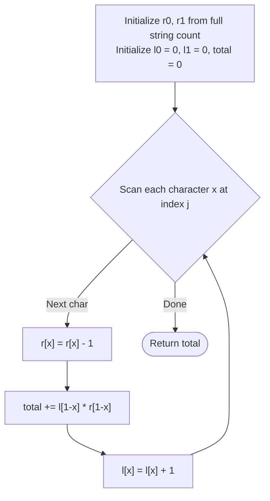

# Guided Example: Number of Ways to Select Buildings

We analyze and trace the middle-element prefix-suffix combinatorial algorithm that counts the number of valid alternating building triplets in a binary street sequence in $O(n)$ time and $O(1)$ auxiliary space.

- **Input:** `s = "001101"`
- **Output:** `6`

This representative instance demonstrates binary character classification, subsequence pattern matching for alternating triplets (`"010"` and `"101"`), middle-pivot decomposition, and prefix-suffix product accumulation.

---

## 1. Problem Overview & Representative Instance

Given a binary string `s` of length $n$ consisting of characters `'0'` (representing an office) and `'1'` (representing a restaurant), an urban planner must select three distinct buildings at indices $(i, j, k)$ with $0 \le i < j < k < n$.

A selection of three buildings is valid if and only if no two consecutive selected buildings are of the same type. This requirement limits valid triplet subsequences to exactly two alternating patterns:
1. `"010"` (office, restaurant, office)
2. `"101"` (restaurant, office, restaurant)

Our objective is to compute the total number of valid triplets $(i, j, k)$.

### Representative Instance Breakdown

Consider `s = "001101"` of length $n = 6$:
- Total occurrences of `'0'`: $3$ (at indices $0, 1, 4$).
- Total occurrences of `'1'`: $3$ (at indices $2, 3, 5$).

Enumerating all valid triplets:
- For pattern `"010"`:
  - $(0, 2, 4) \to s[0]='0', s[2]='1', s[4]='0'$
  - $(0, 3, 4) \to s[0]='0', s[3]='1', s[4]='0'$
  - $(1, 2, 4) \to s[1]='0', s[2]='1', s[4]='0'$
  - $(1, 3, 4) \to s[1]='0', s[3]='1', s[4]='0'$
- For pattern `"101"`:
  - $(2, 4, 5) \to s[2]='1', s[4]='0', s[5]='1'$
  - $(3, 4, 5) \to s[3]='1', s[4]='0', s[5]='1'$

Total valid selections: $4 + 2 = 6$.

---

## 2. Mathematical & Algorithmic Principles

### Middle-Pivot Decomposition Theorem

Any alternating triplet $(i, j, k)$ with $i < j < k$ is uniquely characterized by its central element at index $j$.
- If the central building $s[j] = '1'$, the flanking buildings must be $s[i] = '0'$ and $s[k] = '0'$. By the multiplication principle of combinatorics, the number of valid triplets centered at $j$ is:
  $$\text{Ways}(j) = \text{zeros\_left}(j) \times \text{zeros\_right}(j)$$
- If the central building $s[j] = '0'$, the flanking buildings must be $s[i] = '1'$ and $s[k] = '1'$. The number of valid triplets centered at $j$ is:
  $$\text{Ways}(j) = \text{ones\_left}(j) \times \text{ones\_right}(j)$$

Summing across all candidate centers $j \in \{0, 1, \dots, n-1\}$ gives the exact total:
$$\text{TotalWays} = \sum_{j: s[j]='1'} \text{zeros\_left}(j) \times \text{zeros\_right}(j) + \sum_{j: s[j]='0'} \text{ones\_left}(j) \times \text{ones\_right}(j)$$

### Streaming Prefix-Suffix Counters

Rather than allocating prefix and suffix arrays, we maintain running counts:
1. Initialize right-hand totals: $r_0 = \text{count}(s, '0')$ and $r_1 = \text{count}(s, '1')$.
2. Initialize left-hand totals: $l_0 = 0$ and $l_1 = 0$.
3. When scanning character $x \in \{0, 1\}$ at index $j$:
   - Decrement the right pool: $r_x \leftarrow r_x - 1$.
   - Add $l_{1-x} \times r_{1-x}$ to the cumulative total.
   - Increment the left pool: $l_x \leftarrow l_x + 1$.

---

## 3. Step-by-Step Walkthrough with Intermediate State

We trace `s = "001101"`:
- Initial counts:
  $$r_0 = 3, \quad r_1 = 3, \quad l_0 = 0, \quad l_1 = 0, \quad \text{ans} = 0$$

### Index 0: $s[0] = '0'$ ($x = 0$)
- Remove from right pool: $r_0 \leftarrow 3 - 1 = 2$.
- Opposite character is `'1'`. Product: $l_1 \times r_1 = 0 \times 3 = 0$.
- Update answer: $\text{ans} \leftarrow 0 + 0 = 0$.
- Add to left pool: $l_0 \leftarrow 0 + 1 = 1$.
- State: $l = [1, 0], r = [2, 3], \text{ans} = 0$.

### Index 1: $s[1] = '0'$ ($x = 0$)
- Remove from right pool: $r_0 \leftarrow 2 - 1 = 1$.
- Opposite character is `'1'`. Product: $l_1 \times r_1 = 0 \times 3 = 0$.
- Update answer: $\text{ans} \leftarrow 0 + 0 = 0$.
- Add to left pool: $l_0 \leftarrow 1 + 1 = 2$.
- State: $l = [2, 0], r = [1, 3], \text{ans} = 0$.

### Index 2: $s[2] = '1'$ ($x = 1$)
- Remove from right pool: $r_1 \leftarrow 3 - 1 = 2$.
- Opposite character is `'0'`. Product: $l_0 \times r_0 = 2 \times 1 = 2$.
  *(Forms triplets $(0, 2, 4)$ and $(1, 2, 4)$).*
- Update answer: $\text{ans} \leftarrow 0 + 2 = 2$.
- Add to left pool: $l_1 \leftarrow 0 + 1 = 1$.
- State: $l = [2, 1], r = [1, 2], \text{ans} = 2$.

### Index 3: $s[3] = '1'$ ($x = 1$)
- Remove from right pool: $r_1 \leftarrow 2 - 1 = 1$.
- Opposite character is `'0'`. Product: $l_0 \times r_0 = 2 \times 1 = 2$.
  *(Forms triplets $(0, 3, 4)$ and $(1, 3, 4)$).*
- Update answer: $\text{ans} \leftarrow 2 + 2 = 4$.
- Add to left pool: $l_1 \leftarrow 1 + 1 = 2$.
- State: $l = [2, 2], r = [1, 1], \text{ans} = 4$.

### Index 4: $s[4] = '0'$ ($x = 0$)
- Remove from right pool: $r_0 \leftarrow 1 - 1 = 0$.
- Opposite character is `'1'`. Product: $l_1 \times r_1 = 2 \times 1 = 2$.
  *(Forms triplets $(2, 4, 5)$ and $(3, 4, 5)$).*
- Update answer: $\text{ans} \leftarrow 4 + 2 = 6$.
- Add to left pool: $l_0 \leftarrow 2 + 1 = 3$.
- State: $l = [3, 2], r = [0, 1], \text{ans} = 6$.

### Index 5: $s[5] = '1'$ ($x = 1$)
- Remove from right pool: $r_1 \leftarrow 1 - 1 = 0$.
- Opposite character is `'0'`. Product: $l_0 \times r_0 = 3 \times 0 = 0$.
- Update answer: $\text{ans} \leftarrow 6 + 0 = 6$.
- Add to left pool: $l_1 \leftarrow 2 + 1 = 3$.
- State: $l = [3, 3], r = [0, 0], \text{ans} = 6$.

Final total valid ways: $6$.

---

## 4. Comprehensive State Trace

### Complete Pivot Iteration Trace

| Index $j$ | Char $s[j]$ | Pre-Right $[r_0, r_1]$ | Post-Right $[r_0, r_1]$ | Left $[l_0, l_1]$ | Opposite Product | Cumulative Ways | New Left $[l_0, l_1]$ |
|---|---|---|---|---|---|---|---|
| Initial | - | $[3, 3]$ | - | $[0, 0]$ | - | 0 | $[0, 0]$ |
| 0 | `'0'` | $[3, 3]$ | $[2, 3]$ | $[0, 0]$ | $l_1 \times r_1 = 0 \times 3 = 0$ | 0 | $[1, 0]$ |
| 1 | `'0'` | $[2, 3]$ | $[1, 3]$ | $[1, 0]$ | $l_1 \times r_1 = 0 \times 3 = 0$ | 0 | $[2, 0]$ |
| 2 | `'1'` | $[1, 3]$ | $[1, 2]$ | $[2, 0]$ | $l_0 \times r_0 = 2 \times 1 = 2$ | 2 | $[2, 1]$ |
| 3 | `'1'` | $[1, 2]$ | $[1, 1]$ | $[2, 1]$ | $l_0 \times r_0 = 2 \times 1 = 2$ | 4 | $[2, 2]$ |
| 4 | `'0'` | $[1, 1]$ | $[0, 1]$ | $[2, 2]$ | $l_1 \times r_1 = 2 \times 1 = 2$ | 6 | $[3, 2]$ |
| 5 | `'1'` | $[0, 1]$ | $[0, 0]$ | $[3, 2]$ | $l_0 \times r_0 = 3 \times 0 = 0$ | 6 | $[3, 3]$ |

### Subsequence Pattern Contribution Breakdown

| Pivot Index $j$ | Pivot Type | Target Pattern | Left Candidates | Right Candidates | Generated Combinations |
|---|---|---|---|---|---|
| 2 | `'1'` | `"010"` | $i \in \{0, 1\}$ (2 zeros) | $k \in \{4\}$ (1 zero) | $(0, 2, 4), (1, 2, 4)$ |
| 3 | `'1'` | `"010"` | $i \in \{0, 1\}$ (2 zeros) | $k \in \{4\}$ (1 zero) | $(0, 3, 4), (1, 3, 4)$ |
| 4 | `'0'` | `"101"` | $i \in \{2, 3\}$ (2 ones) | $k \in \{5\}$ (1 one) | $(2, 4, 5), (3, 4, 5)$ |

---

## 5. Algorithmic Correctness & Soundness

### Disjoint Partitioning of the Search Space

1. **Uniqueness:** Every valid triplet $(i, j, k)$ has a unique middle index $j$. Therefore, partitioning the universe of valid triplets by their middle index $j \in \{1, \dots, n-2\}$ produces mutually exclusive subsets.
2. **Exhaustiveness:** Any valid triplet must have an alternating pattern (`"010"` or `"101"`). If $s[j] = '1'$, any valid triplet centered at $j$ must choose some index $i < j$ with $s[i] = '0'$ and some index $k > j$ with $s[k] = '0'$. Because every choice of $i$ is independent of $k$, the Cartesian product of left zeros and right zeros precisely yields all valid triplets centered at $j$.
3. **Absence of Overcounting or Missed Combinations:** Since each triplet $(i, j, k)$ is counted at its middle index $j$ exactly once, the sum $\sum_j \text{Ways}(j)$ equals the exact number of valid selections.

---

## 6. Edge Cases & Anti-Patterns

### Boundary Scenarios

1. **Short Strings ($n = 3$):**
   - E.g., $s = "010"$: returns $1$. $s = "111"$: returns $0$.
2. **Monochromatic Strings:**
   - E.g., $s = "00000"$ or $s = "11111"$:
     No alternating sequence exists. $l_{1-x} \times r_{1-x}$ is always $0 \times 0 = 0$, yielding total $0$.
3. **Strictly Alternating Strings:**
   - E.g., $s = "010101"$: every interior character contributes non-zero products.
4. **Large Inputs ($n = 10^5$):**
   - With $n = 10^5$, if half the characters are `'0'` and half are `'1'`, the total count can reach up to $\approx \frac{n}{2} \times (\frac{n}{4})^2 \approx 10^{13}$, which exceeds the 32-bit signed integer maximum ($2^{31}-1 \approx 2.14 \times 10^9$). Using a 64-bit integer accumulator is mandatory.

### Common Anti-Patterns

- **Brute-Force Triple Loop ($O(n^3)$):** Testing all $\binom{n}{3}$ index combinations will time out for $n > 1000$.
- **Dynamic Programming with Full Matrices:** Allocating an $O(n)$ state table for sequence prefixes of lengths $1, 2, 3$ uses unnecessary memory when streaming two scalar counters achieves the same in $O(1)$ space.
- **Off-By-One Right Decrement:** Failing to decrement $r_x$ before computing the product would include $s[j]$ itself as a right-hand candidate, producing invalid triplets where $j = k$.

---

## 7. Complexity Analysis

### Time Complexity

- **Initial Count:** One linear pass over $s$ of length $n$ to count occurrences of `'0'` and `'1'`: $O(n)$ time.
- **Main Iteration:** A single linear pass through $s$ where each step performs $O(1)$ arithmetic updates (decrement, multiplication, addition, increment).
- **Total Time Complexity:** $O(n)$ deterministic time, optimal since every character must be inspected.

### Auxiliary Space Complexity

- The algorithm maintains two counters of size 2 ($l$ and $r$) and an accumulator integer `ans`.
- No extra arrays or data structures are allocated.
- **Total Auxiliary Space Complexity:** $O(1)$ space.