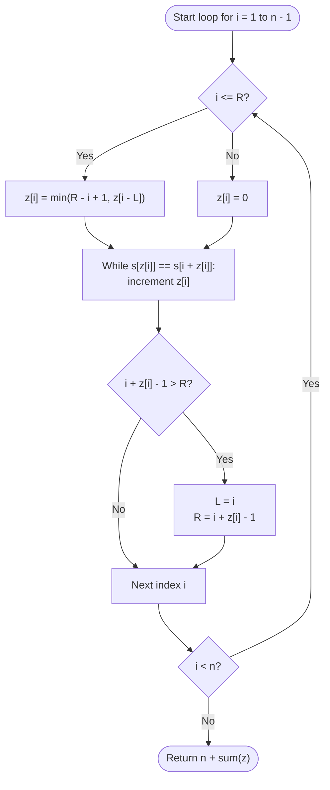

# Guided Example: Sum of Scores of Built Strings

We analyze and trace the linear-time Z-algorithm for computing the sum of longest common prefix lengths across all built suffixes of a string, establishing $O(n)$ time complexity and $O(n)$ auxiliary space.

- **Input:** `s = "babab"`
- **Output:** `9`

This representative instance demonstrates reverse string generation, longest common prefix (LCP) evaluation against the full string, Z-box sliding interval caching, and optimal linear string matching without hash collisions.

---

## 1. Problem Overview & Representative Instance

You are building a string $s$ of length $n$ across $n$ sequential steps.
In the $1$-st step, you take the last character $s[n-1]$.
In each subsequent $k$-th step ($2 \le k \le n$), you prepend the character $s[n-k]$ to the current string, forming string $s_k$.

Consequently, after step $k$, the string $s_k$ is precisely the suffix of $s$ that begins at index $n - k$:
$$s_k = s[n-k \dots n-1]$$
At the final step $k = n$, $s_n = s[0 \dots n-1] = s$.

For each built string $s_k$, we define its **score** as the length of the longest common prefix ($\text{LCP}$) between $s_k$ and the complete string $s_n$:
$$\text{Score}(s_k) = \text{LCP}(s_k, s)$$

The objective is to compute the sum of scores across all $n$ built strings:
$$\text{Total Score} = \sum_{k=1}^n \text{Score}(s_k)$$

### Representative Instance Breakdown

Consider $s = \text{"babab"}$ of length $n = 5$:
- **Step 1 ($k = 1$):** $s_1 = s[4 \dots 4] = \text{"b"}$.
  $\text{LCP}(\text{"b"}, \text{"babab"}) = \text{"b"}$ (length $1$). Score = $1$.
- **Step 2 ($k = 2$):** $s_2 = s[3 \dots 4] = \text{"ab"}$.
  $\text{LCP}(\text{"ab"}, \text{"babab"}) = \text{""}$ (length $0$). Score = $0$.
- **Step 3 ($k = 3$):** $s_3 = s[2 \dots 4] = \text{"bab"}$.
  $\text{LCP}(\text{"bab"}, \text{"babab"}) = \text{"bab"}$ (length $3$). Score = $3$.
- **Step 4 ($k = 4$):** $s_4 = s[1 \dots 4] = \text{"abab"}$.
  $\text{LCP}(\text{"abab"}, \text{"babab"}) = \text{""}$ (length $0$). Score = $0$.
- **Step 5 ($k = 5$):** $s_5 = s[0 \dots 4] = \text{"babab"}$.
  $\text{LCP}(\text{"babab"}, \text{"babab"}) = \text{"babab"}$ (length $5$). Score = $5$.

Total Score: $1 + 0 + 3 + 0 + 5 = 9$.

---

## 2. Mathematical & Algorithmic Principles

### Equivalence to the Z-Algorithm

Let $Z[i]$ denote the length of the longest common prefix between the full string $s[0 \dots n-1]$ and the suffix starting at index $i$, $s[i \dots n-1]$:
$$Z[i] = \max \{ \ell \ge 0 \mid s[i \dots i+\ell-1] = s[0 \dots \ell-1] \}$$

Each built string $s_k$ corresponds to the suffix beginning at index $i = n - k$. Therefore:
$$\text{Score}(s_k) = \text{LCP}(s[n-k \dots n-1], s) = Z[n - k]$$

For the entire collection of suffixes:
- The final string $s_n$ is the entire string $s$, which has an identical match with itself of length $n$.
- Every other string $s_k$ ($1 \le k < n$) starts at index $i \in \{1, \dots, n-1\}$, giving score $Z[i]$.

Thus, the total score simplifies to:
$$\text{Total Score} = n + \sum_{i=1}^{n-1} Z[i]$$

### The Z-Box Window Mechanism

To compute the array $Z$ in $O(n)$ time, we maintain the rightmost segment $[L, R]$ such that $s[L \dots R]$ matches the prefix $s[0 \dots R - L]$.
When computing $Z[i]$ for $i > 0$:
1. **Inside the Z-box ($i \le R$):**
   By the matching invariant $s[L \dots R] = s[0 \dots R - L]$, the substring at index $i$ mirrors the prefix substring at $k' = i - L$.
   The known match length is at least:
   $$Z[i] \ge \min(R - i + 1, Z[i - L])$$
   - If $Z[i - L] < R - i + 1$, the mismatch is strictly within the known box, so $Z[i] = Z[i - L]$ immediately without extra character comparisons.
   - If $Z[i - L] \ge R - i + 1$, the match extends up to $R$, and further characters beyond $R$ must be compared naively.
2. **Outside the Z-box ($i > R$):**
   No prior information is available. We compare characters $s[Z[i]]$ and $s[i + Z[i]]$ starting from $Z[i] = 0$.
3. **Window Update:**
   Whenever $i + Z[i] - 1 > R$, we update the Z-box to $[L, R] = [i, i + Z[i] - 1]$.

---

## 3. Step-by-Step Walkthrough with Intermediate State

We execute the Z-algorithm on $s = \text{"babab"}$ ($n = 5$).
Initialize $Z = [0, 0, 0, 0, 0]$, $L = 0$, $R = 0$.

### Index $i = 1$: Suffix `"abab"`
- Check window: $i = 1 > R = 0$ (outside box).
- Compare $s[0]$ with $s[1]$: $s[0] = \text{'b'}, s[1] = \text{'a'}$. Mismatch!
- $Z[1] = 0$.
- Box condition $1 + 0 - 1 = 0 \ngtr R$. Window remains $[L, R] = [0, 0]$.

### Index $i = 2$: Suffix `"bab"`
- Check window: $i = 2 > R = 0$ (outside box).
- Character comparisons:
  - $s[0] == s[2]$ ($\text{'b'} == \text{'b'}$): match, $Z[2] \leftarrow 1$.
  - $s[1] == s[3]$ ($\text{'a'} == \text{'a'}$): match, $Z[2] \leftarrow 2$.
  - $s[2] == s[4]$ ($\text{'b'} == \text{'b'}$): match, $Z[2] \leftarrow 3$.
  - End of string reached ($2 + 3 = 5 \ge n$).
- $Z[2] = 3$.
- Update Z-box: $i + Z[2] - 1 = 2 + 3 - 1 = 4 > R = 0$.
  New window: $[L, R] = [2, 4]$.

### Index $i = 3$: Suffix `"ab"`
- Check window: $i = 3 \le R = 4$ (inside box).
- Mirror position: $k' = i - L = 3 - 2 = 1$.
- Remaining box width: $R - i + 1 = 4 - 3 + 1 = 2$.
- $Z[k'] = Z[1] = 0$.
- Since $Z[1] < 2$, no characters beyond the box can match.
  $Z[3] = \min(2, 0) = 0$.
- Check while-loop: $s[0] = \text{'b'} \ne s[3] = \text{'a'}$. Loop does not advance.
- Window remains $[L, R] = [2, 4]$.

### Index $i = 4$: Suffix `"b"`
- Check window: $i = 4 \le R = 4$ (inside box).
- Mirror position: $k' = i - L = 4 - 2 = 2$.
- Remaining box width: $R - i + 1 = 4 - 4 + 1 = 1$.
- $Z[k'] = Z[2] = 3$.
- Bound initialization: $Z[4] = \min(1, 3) = 1$.
- Check while-loop: $i + Z[4] = 4 + 1 = 5 \ge n$ (end of string). Loop terminates.
- Window check: $4 + 1 - 1 = 4 \ngtr R$. Window remains $[L, R] = [2, 4]$.

### Accumulation
$$\text{Total Score} = n + \sum_{i=1}^4 Z[i] = 5 + (0 + 3 + 0 + 1) = 5 + 4 = 9$$

---

## 4. Comprehensive State Trace

### Z-Algorithm Execution Trace

| Index $i$ | Char $s[i]$ | Prior $[L, R]$ | Inside Box? | Mirror $k'$ | Initial $Z[i]$ | Character Extensions | Final $Z[i]$ | Updated $[L, R]$ |
|---|---|---|---|---|---|---|---|---|
| 1 | `'a'` | $[0, 0]$ | No | - | 0 | None ($s[0] \ne s[1]$) | 0 | $[0, 0]$ |
| 2 | `'b'` | $[0, 0]$ | No | - | 0 | Match 3 chars (`"bab"`) | 3 | $[2, 4]$ |
| 3 | `'a'` | $[2, 4]$ | Yes ($3 \le 4$) | $3-2=1$ | $\min(2, Z[1])=0$ | None ($s[0] \ne s[3]$) | 0 | $[2, 4]$ |
| 4 | `'b'` | $[2, 4]$ | Yes ($4 \le 4$) | $4-2=2$ | $\min(1, Z[2])=1$ | None (string boundary) | 1 | $[2, 4]$ |

### Built Suffix Score Mapping

| Step $k$ | Built String $s_k$ | Suffix Index $i = n - k$ | Target Prefix Match | Common Prefix Substring | Score ($Z[i]$) |
|---|---|---|---|---|---|
| 1 | `"b"` | 4 | `"babab"` | `"b"` | 1 |
| 2 | `"ab"` | 3 | `"babab"` | `""` | 0 |
| 3 | `"bab"` | 2 | `"babab"` | `"bab"` | 3 |
| 4 | `"abab"` | 1 | `"babab"` | `""` | 0 |
| 5 | `"babab"` | 0 | `"babab"` | `"babab"` | 5 |

$$\sum_{k=1}^5 \text{Score}(s_k) = 1 + 0 + 3 + 0 + 5 = 9$$

---

## 5. Algorithmic Correctness & Soundness

### Formal Invariant of the Z-Box

At the start of processing index $i$, $[L, R]$ represents an interval where $L \le R$ and:
$$s[L \dots R] = s[0 \dots R - L]$$

For any $i$ such that $L \le i \le R$:
1. Let $k' = i - L$. The substring $s[i \dots R]$ is identical to $s[k' \dots R - L]$.
2. The prefix of $s$ of length $R - i + 1$ that starts at $i$ is identical to the prefix of $s$ of length $R - i + 1$ that starts at $k'$.
3. If $Z[k'] < R - i + 1$, the mismatch that terminates the prefix match at $k'$ occurs strictly before $R - L$. Since the characters in $s[i \dots R]$ match those in $s[k' \dots R - L]$, the exact same mismatch occurs at $i + Z[k'] < R$. Hence, $Z[i]$ must be strictly equal to $Z[k']$.
4. If $Z[k'] \ge R - i + 1$, the match extends at least up to position $R$. Any additional characters beyond $R$ have not been explored yet, which is why explicit character-by-character checks start from index $R + 1$.

Because $R$ increases whenever an explicit character match succeeds, no character comparison is ever evaluated redundant times.

---

## 6. Edge Cases & Anti-Patterns

### Boundary Scenarios

1. **Single-Character String ($n = 1$):**
   - $s = \text{"a"}$. Suffix loop for $i \in [1, 0]$ is empty. Total score is $n = 1$.
2. **All Identical Characters:**
   - E.g., $s = \text{"aaaaa"}$ ($n = 5$):
     $Z = [0, 4, 3, 2, 1]$.
     Total score $= 5 + (4 + 3 + 2 + 1) = \frac{5 \times 6}{2} = 15$.
3. **All Unique Characters:**
   - E.g., $s = \text{"abcdef"}$ ($n = 6$):
     No suffix shares a prefix with $s$. $Z[i] = 0$ for all $i \ge 1$.
     Total score $= 6 + 0 = 6$.
4. **Large Inputs ($n = 10^5$):**
   - For $s = \text{"a"} \times 10^5$, total score is $\frac{10^5 \times 100001}{2} \approx 5 \times 10^9$.
   - This value exceeds the maximum value of a 32-bit signed integer ($2 \times 10^9$). A 64-bit integer accumulator is mandatory.

### Common Anti-Patterns

- **Brute-Force Suffix Comparison ($O(n^2)$):**
  Comparing each of the $n$ suffixes against the prefix character by character performs $\approx \frac{n^2}{2} = 5 \times 10^9$ operations on strings of length $10^5$, causing Time Limit Exceeded (TLE).
- **Polynomial Rolling Hash with Binary Search ($O(n \log n)$):**
  While $O(n \log n)$ passes some tests, it suffers from potential hash collisions on adversarial test suites unless double 64-bit hashing with large primes is carefully engineered. The Z-algorithm is simpler, faster, deterministic, and strictly $O(n)$.

---

## 7. Complexity Analysis

### Time Complexity

- **Z-Box Maintenance:**
  In each iteration of $i$, we either determine $Z[i]$ in $O(1)$ from the mirror position $k'$, or we enter the `while` loop.
  Each successful character match in the `while` loop strictly advances $i + Z[i]$, which pushes the right window boundary $R$ to the right.
  Because $R$ starts at $0$ and cannot exceed $n - 1$, the `while` loop executes a successful comparison at most $n$ times across the entire algorithm.
  At most one unsuccessful comparison occurs per index $i$.
- **Total Time Complexity:** $O(n)$ deterministic time, which is asymptotically optimal.

### Auxiliary Space Complexity

- **Z-Array Storage:** The array $Z$ of size $n$ requires $O(n)$ space.
- **Pointers:** Scalar pointers $L, R$ and index counters require $O(1)$ space.
- **Total Auxiliary Space Complexity:** $O(n)$ auxiliary memory.