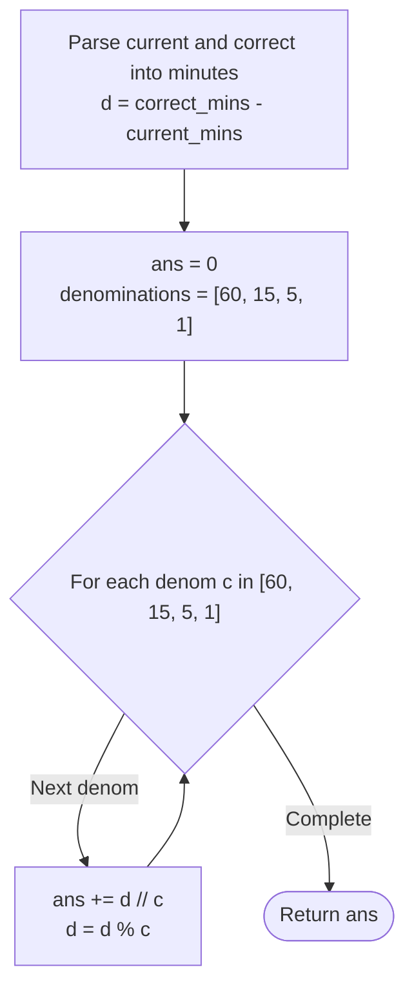

# Guided Example: Minimum Number of Operations to Convert Time

We analyze and trace the greedy canonical coin-change algorithm that converts a start time to a target time using the minimum number of minute increment operations in $O(1)$ time and $O(1)$ auxiliary space.

- **Input:** `current = "02:30"`, `correct = "04:35"`
- **Output:** `3`

This representative instance illustrates 24-hour time parsing, linear minute mapping, the canonical divisible property of greedy coin systems, and remainder propagation.

---

## 1. Problem Overview & Representative Instance

We are given two strings `current` and `correct` representing two times on a 24-hour clock in the format `"HH:MM"`.
We are guaranteed that `current <= correct` on the same calendar day.

In one operation, we can advance `current` forward by any of four fixed minute increments:
$$\Delta t \in \{60, 15, 5, 1\}$$

Our goal is to find the **minimum number of operations** required to make `current` equal to `correct`.

### Representative Instance Breakdown

Consider `current = "02:30"` and `correct = "04:35"`:
1. **Convert to absolute minutes from midnight:**
   - $\text{minutes}(\text{"02:30"}) = 2 \times 60 + 30 = 120 + 30 = 150$ minutes.
   - $\text{minutes}(\text{"04:35"}) = 4 \times 60 + 35 = 240 + 35 = 275$ minutes.
2. **Compute total minute deficit:**
   - $\Delta = 275 - 150 = 125$ minutes.
3. **Decompose into available increments $\{60, 15, 5, 1\}$:**
   - Two $60$-minute increments: $2 \times 60 = 120$ minutes. (Remainder: $125 - 120 = 5$).
   - Zero $15$-minute increments: $0 \times 15 = 0$ minutes. (Remainder: $5$).
   - One $5$-minute increment: $1 \times 5 = 5$ minutes. (Remainder: $5 - 5 = 0$).
   - Zero $1$-minute increments.

Total operations: $2 + 0 + 1 + 0 = 3$.

---

## 2. Mathematical & Algorithmic Principles

### The Canonical Divisibility Condition

In general coin-change problems, the greedy strategy of choosing the largest possible coin first does not always yield the minimum number of coins. For example, with denominations $\{1, 3, 4\}$, making change for $6$ via greedy yields $4 + 1 + 1$ ($3$ coins), whereas the optimum is $3 + 3$ ($2$ coins).

However, the set of increments $\mathcal{C} = \{60, 15, 5, 1\}$ forms a **canonical coin system** because each denomination is an exact integer multiple of the next smaller denomination:
- $60 = 4 \times 15$
- $15 = 3 \times 5$
- $5 = 5 \times 1$

### Greedy Choice Property Proof

Because each larger denomination $c_k$ is a multiple of $c_{k+1}$:
- Any collection of $4$ fifteen-minute operations ($4 \times 15 = 60$) can be replaced by $1$ sixty-minute operation, saving $3$ operations.
- Any collection of $3$ five-minute operations ($3 \times 5 = 15$) can be replaced by $1$ fifteen-minute operation, saving $2$ operations.
- Any collection of $5$ one-minute operations ($5 \times 1 = 5$) can be replaced by $1$ five-minute operation, saving $4$ operations.

Therefore, an optimal solution can never contain $\ge 4$ operations of size 15, $\ge 3$ operations of size 5, or $\ge 5$ operations of size 1. Consequently, taking the maximal possible count of the largest available denomination at each step is unconditionally optimal:
$$\text{count}_i = \lfloor \Delta / c_i \rfloor, \quad \Delta \leftarrow \Delta \pmod{c_i}$$

---

## 3. Step-by-Step Walkthrough with Intermediate State

We trace the algorithm on `current = "02:30"` and `correct = "04:35"`.

### Phase 1: Timestamp Serialization
- Parse `current`:
  - Hours: $H_1 = \text{int}(\text{"02"}) = 2$
  - Minutes: $M_1 = \text{int}(\text{"30"}) = 30$
  - Total minutes $a = 2 \times 60 + 30 = 150$
- Parse `correct`:
  - Hours: $H_2 = \text{int}(\text{"04"}) = 4$
  - Minutes: $M_2 = \text{int}(\text{"35"}) = 35$
  - Total minutes $b = 4 \times 60 + 35 = 275$
- Compute deficit:
  $$d = b - a = 275 - 150 = 125$$
- Initialize $\text{ans} = 0$.

### Phase 2: Greedy Denomination Reduction

1. **Step 1: Denomination $c = 60$**
   - Number of 60-minute blocks: $\lfloor 125 / 60 \rfloor = 2$.
   - Increment accumulator: $\text{ans} \leftarrow 0 + 2 = 2$.
   - Update deficit: $d \leftarrow 125 \pmod{60} = 5$.
   - State: $d = 5$, $\text{ans} = 2$.

2. **Step 2: Denomination $c = 15$**
   - Number of 15-minute blocks: $\lfloor 5 / 15 \rfloor = 0$.
   - Increment accumulator: $\text{ans} \leftarrow 2 + 0 = 2$.
   - Update deficit: $d \leftarrow 5 \pmod{15} = 5$.
   - State: $d = 5$, $\text{ans} = 2$.

3. **Step 3: Denomination $c = 5$**
   - Number of 5-minute blocks: $\lfloor 5 / 5 \rfloor = 1$.
   - Increment accumulator: $\text{ans} \leftarrow 2 + 1 = 3$.
   - Update deficit: $d \leftarrow 5 \pmod{5} = 0$.
   - State: $d = 0$, $\text{ans} = 3$.

4. **Step 4: Denomination $c = 1$**
   - Number of 1-minute blocks: $\lfloor 0 / 1 \rfloor = 0$.
   - Increment accumulator: $\text{ans} \leftarrow 3 + 0 = 3$.
   - Update deficit: $d \leftarrow 0 \pmod{1} = 0$.
   - State: $d = 0$, $\text{ans} = 3$.

Final minimum operations: $3$.

---

## 4. Comprehensive State Trace

### Denomination Reduction Trace for $\Delta = 125$

| Step | Denomination $c_i$ | Deficit Before $d$ | Quotient $\lfloor d / c_i \rfloor$ | Remainder $d \pmod{c_i}$ | Operations Added | Total Operations $\text{ans}$ |
|---|---|---|---|---|---|---|
| Initial | - | 125 | - | - | - | 0 |
| 1 | 60 | 125 | 2 | 5 | +2 | 2 |
| 2 | 15 | 5 | 0 | 5 | +0 | 2 |
| 3 | 5 | 5 | 1 | 0 | +1 | 3 |
| 4 | 1 | 0 | 0 | 0 | +0 | 3 |

### Multi-Instance Operational Breakdown

| `current` | `correct` | $t_{\text{current}}$ | $t_{\text{correct}}$ | Difference $\Delta$ | Count 60 | Count 15 | Count 5 | Count 1 | Optimal Moves |
|---|---|---|---|---|---|---|---|---|---|
| `"02:30"` | `"04:35"` | 150 | 275 | 125 | 2 | 0 | 1 | 0 | 3 |
| `"11:00"` | `"11:01"` | 660 | 661 | 1 | 0 | 0 | 0 | 1 | 1 |
| `"00:00"` | `"23:59"` | 0 | 1439 | 1439 | 23 | 2 | 1 | 4 | 30 |
| `"09:41"` | `"09:41"` | 581 | 581 | 0 | 0 | 0 | 0 | 0 | 0 |
| `"00:00"` | `"01:15"` | 0 | 75 | 75 | 1 | 1 | 0 | 0 | 2 |

---

## 5. Algorithmic Correctness & Soundness

### Global Optimality via Subproblem Replacement

Let $S = (k_{60}, k_{15}, k_{5}, k_{1})$ be any valid sequence of operations summing to $d$:
$$60 k_{60} + 15 k_{15} + 5 k_{5} + 1 k_{1} = d$$
The total cost of $S$ is $|S| = k_{60} + k_{15} + k_{5} + k_{1}$.

1. **Minimizing 1-minute increments:**
   If $k_1 \ge 5$, replacing $5$ one-minute increments with $1$ five-minute increment preserves the sum while decreasing $|S|$ by $4$. Therefore, in any minimal solution, $k_1 \le 4$.
2. **Minimizing 5-minute increments:**
   If $k_5 \ge 3$, replacing $3$ five-minute increments with $1$ fifteen-minute increment preserves the sum while decreasing $|S|$ by $2$. Therefore, in any minimal solution, $k_5 \le 2$.
3. **Minimizing 15-minute increments:**
   If $k_{15} \ge 4$, replacing $4$ fifteen-minute increments with $1$ sixty-minute increment preserves the sum while decreasing $|S|$ by $3$. Therefore, in any minimal solution, $k_{15} \le 3$.

Under these necessary conditions for optimality, the maximum value that can be represented by the three smaller denominations combined is:
$$15 \times 3 + 5 \times 2 + 1 \times 4 = 45 + 10 + 4 = 59 < 60$$

Because the smaller denominations can represent at most $59$ minutes, the remaining $d$ must satisfy $d - (15 k_{15} + 5 k_{5} + k_1) = 60 k_{60}$. Since the subtracted term is strictly less than $60$, $k_{60}$ must be precisely $\lfloor d / 60 \rfloor$.
Applying the same argument inductively to $15$ and $5$ proves that the greedy selection is the unique optimal solution.

---

## 6. Edge Cases & Anti-Patterns

### Boundary Scenarios

1. **Zero Difference (`current == correct`):**
   - $\Delta = 0$. All quotients are $0$, returns $0$ operations immediately.
2. **Pure Hour Shift (e.g. `"01:00"` to `"05:00"`):**
   - $\Delta = 240$. $240 / 60 = 4$, remainder $0$. Exactly $4$ sixty-minute operations.
3. **Single Minute Shift (e.g. `"11:00"` to `"11:01"`):**
   - $\Delta = 1$. Yields $0$ for 60, 15, and 5; exactly $1$ one-minute operation.
4. **Maximum Span (`"00:00"` to `"23:59"`):**
   - $\Delta = 1439$. Requires $23 \times 60 + 2 \times 15 + 1 \times 5 + 4 \times 1$, total $30$ operations.

### Common Anti-Patterns

- **Dynamic Programming Table ($O(\Delta)$ space):** Allocating a 1D DP table of size up to $1440$ to solve unbounded knapsack. While functionally correct, it is unnecessary overhead for a canonical coin system that is provably solvable in $O(1)$.
- **BFS State Space Search:** Exploring a shortest path graph where each node is a minute timestamp $[0 \dots 1440]$ adds vertex queue overhead for a closed-form arithmetic solution.
- **Handling Hours and Minutes Separately:** Attempting to adjust minutes first and then hours leads to complicated borrowing and conditional branches when minute increments exceed $60$. Flattening both timestamps into total minutes since midnight completely eliminates carry logic.

---

## 7. Complexity Analysis

### Time Complexity

- **Time Parsing:** Slicing two strings of fixed length $5$ and converting two two-digit substrings to integers takes $O(1)$ operations.
- **Greedy Loop:** Exactly $4$ iterations (for $60, 15, 5, 1$). Each iteration executes one integer division and one modulo operation.
- **Total Time Complexity:** Strictly $O(1)$ constant time.

### Auxiliary Space Complexity

- The algorithm uses a handful of primitive integer variables (`a`, `b`, `d`, `ans`, `i`).
- No heap memory, lists, or tables are allocated.
- **Total Auxiliary Space Complexity:** Strictly $O(1)$ auxiliary memory.
