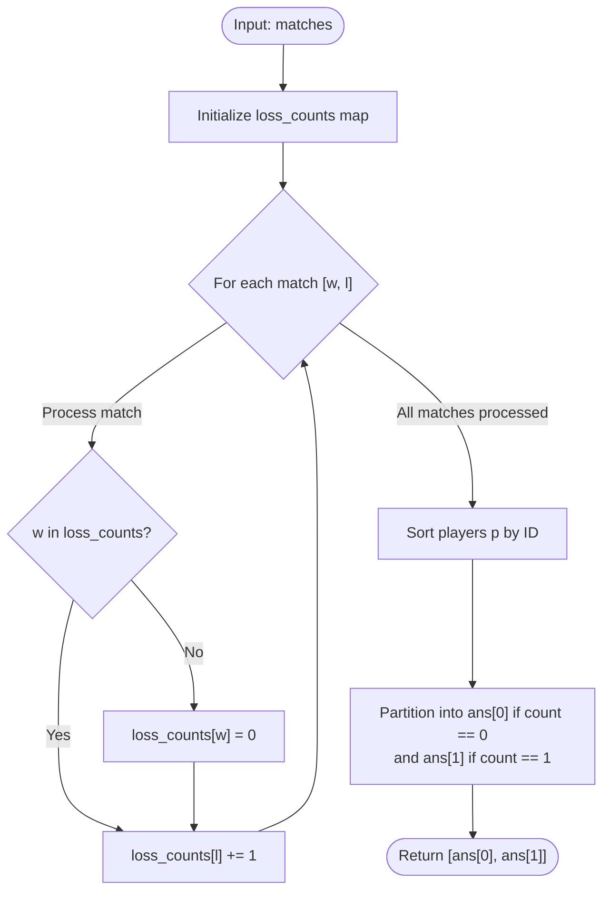

# Guided Example: Find Players With Zero or One Losses

We analyze and trace the in-degree counting and sorting algorithm for categorizing tournament players based on their cumulative losses in $O(m + u \log u)$ time and $O(u)$ auxiliary space.

- **Input:** `matches = [[1, 3], [2, 3], [3, 6], [5, 6], [5, 7], [4, 5], [4, 8], [4, 9], [10, 4], [10, 9]]`
- **Output:** `[[1, 2, 10], [4, 5, 7, 8]]`

This representative instance illustrates directed tournament graph modeling, in-degree tallying for loss tracking, zero-loss registration for undefeated winners, threshold filtering, and ascending key collation.

---

## 1. Problem Overview & Representative Instance

We are given an integer array `matches` of length $m$, where each element $\text{matches}[i] = [\text{winner}_i, \text{loser}_i]$ records that $\text{winner}_i$ defeated $\text{loser}_i$ in a competition. No match results in a tie.

Our objective is to return a list `answer` of length $2$:
1. `answer[0]` contains all players that have **not lost any matches** (zero losses).
2. `answer[1]` contains all players that have **lost exactly one match**.

Both lists must be sorted in strictly ascending numerical order. Players who have never played in any match must not be included.

### Representative Instance Breakdown

Consider the 10-match tournament:
$$\text{matches} = [[1, 3], [2, 3], [3, 6], [5, 6], [5, 7], [4, 5], [4, 8], [4, 9], [10, 4], [10, 9]]$$

- Total unique participants: $\{1, 2, 3, 4, 5, 6, 7, 8, 9, 10\}$.
- Loss count per participant:
  - Player 1: 0 losses (won against 3).
  - Player 2: 0 losses (won against 3).
  - Player 3: 2 losses (lost to 1 and 2).
  - Player 4: 1 loss (lost to 10; won against 5, 8, 9).
  - Player 5: 1 loss (lost to 4; won against 6, 7).
  - Player 6: 2 losses (lost to 3 and 5).
  - Player 7: 1 loss (lost to 5).
  - Player 8: 1 loss (lost to 4).
  - Player 9: 2 losses (lost to 4 and 10).
  - Player 10: 0 losses (won against 4 and 9).

Grouping by loss counts:
- 0 losses: $[1, 2, 10]$
- 1 loss: $[4, 5, 7, 8]$
- $\ge 2$ losses: $\{3, 6, 9\}$ (omitted from output)

Result: `[[1, 2, 10], [4, 5, 7, 8]]`.

---

## 2. Mathematical & Algorithmic Principles

### Tournament Directed Graph & In-Degree Formulation

We model the tournament as a directed multigraph $G = (V, E)$, where each vertex $v \in V$ represents a participant, and each directed edge $(u, v) \in E$ denotes that player $u$ defeated player $v$.

In this formulation:
- Out-degree $\text{deg}^+(v)$ corresponds to the number of victories achieved by player $v$.
- In-degree $\text{deg}^-(v)$ corresponds to the number of defeats suffered by player $v$.

The categorization requires selecting vertices based strictly on their in-degree:
$$\text{Undefeated} = \{ v \in V \mid \text{deg}^-(v) = 0 \}$$
$$\text{OneLoss} = \{ v \in V \mid \text{deg}^-(v) = 1 \}$$

### Single-Map Invariant

To avoid allocating separate sets for winners and losers:
1. When encountering pair $(u, v)$:
   - If winner $u$ is not present in the loss table, set $\text{loss\_count}[u] = 0$. This guarantees that a player with only victories is recorded.
   - If winner $u$ is already in the table, do not alter their recorded losses (a victory never erases an earlier defeat).
   - Increment loser $v$'s count: $\text{loss\_count}[v] \leftarrow \text{loss\_count}[v] + 1$.
2. After scanning all matches, iterate over the keys in sorted order:
   - If $\text{loss\_count}[p] = 0$, append $p$ to `answer[0]`.
   - If $\text{loss\_count}[p] = 1$, append $p$ to `answer[1]`.
   - If $\text{loss\_count}[p] \ge 2$, ignore.

---

## 3. Step-by-Step Walkthrough with Intermediate State

We trace the execution on `matches = [[1, 3], [2, 3], [3, 6], [5, 6], [5, 7], [4, 5], [4, 8], [4, 9], [10, 4], [10, 9]]`.

### Match Ingestion Pass

1. **Match 1: `[1, 3]`**
   - Winner $1 \notin \text{cnt} \implies \text{cnt}[1] = 0$.
   - Loser $3 \implies \text{cnt}[3] = 1$.
2. **Match 2: `[2, 3]`**
   - Winner $2 \notin \text{cnt} \implies \text{cnt}[2] = 0$.
   - Loser $3 \implies \text{cnt}[3] = 1 + 1 = 2$.
3. **Match 3: `[3, 6]`**
   - Winner $3 \in \text{cnt} \implies \text{cnt}[3]$ remains $2$.
   - Loser $6 \implies \text{cnt}[6] = 1$.
4. **Match 4: `[5, 6]`**
   - Winner $5 \notin \text{cnt} \implies \text{cnt}[5] = 0$.
   - Loser $6 \implies \text{cnt}[6] = 1 + 1 = 2$.
5. **Match 5: `[5, 7]`**
   - Winner $5 \in \text{cnt}$ (unchanged).
   - Loser $7 \implies \text{cnt}[7] = 1$.
6. **Match 6: `[4, 5]`**
   - Winner $4 \notin \text{cnt} \implies \text{cnt}[4] = 0$.
   - Loser $5 \implies \text{cnt}[5] = 0 + 1 = 1$.
7. **Match 7: `[4, 8]`**
   - Winner $4 \in \text{cnt}$ (unchanged).
   - Loser $8 \implies \text{cnt}[8] = 1$.
8. **Match 8: `[4, 9]`**
   - Winner $4 \in \text{cnt}$ (unchanged).
   - Loser $9 \implies \text{cnt}[9] = 1$.
9. **Match 9: `[10, 4]`**
   - Winner $10 \notin \text{cnt} \implies \text{cnt}[10] = 0$.
   - Loser $4 \implies \text{cnt}[4] = 0 + 1 = 1$.
10. **Match 10: `[10, 9]`**
    - Winner $10 \in \text{cnt}$ (unchanged).
    - Loser $9 \implies \text{cnt}[9] = 1 + 1 = 2$.

### Final Filtering & Sorting
Sorted keys: $1, 2, 3, 4, 5, 6, 7, 8, 9, 10$.
- $p = 1: \text{cnt}[1] = 0 \to \text{ans}[0] = [1]$
- $p = 2: \text{cnt}[2] = 0 \to \text{ans}[0] = [1, 2]$
- $p = 3: \text{cnt}[3] = 2 \to$ skipped
- $p = 4: \text{cnt}[4] = 1 \to \text{ans}[1] = [4]$
- $p = 5: \text{cnt}[5] = 1 \to \text{ans}[1] = [4, 5]$
- $p = 6: \text{cnt}[6] = 2 \to$ skipped
- $p = 7: \text{cnt}[7] = 1 \to \text{ans}[1] = [4, 5, 7]$
- $p = 8: \text{cnt}[8] = 1 \to \text{ans}[1] = [4, 5, 7, 8]$
- $p = 9: \text{cnt}[9] = 2 \to$ skipped
- $p = 10: \text{cnt}[10] = 0 \to \text{ans}[0] = [1, 2, 10]$

Final result: `[[1, 2, 10], [4, 5, 7, 8]]`.

---

## 4. Comprehensive State Trace

### Match Ingestion State Transition Table

| Match Step $i$ | Pair $[w, l]$ | Winner Action | Loser Action | Map State $\text{cnt}$ After Step |
|---|---|---|---|---|
| 1 | $[1, 3]$ | Insert $\text{cnt}[1]=0$ | Increment $\text{cnt}[3]=1$ | $\{1:0, 3:1\}$ |
| 2 | $[2, 3]$ | Insert $\text{cnt}[2]=0$ | Increment $\text{cnt}[3]=2$ | $\{1:0, 3:2, 2:0\}$ |
| 3 | $[3, 6]$ | $3$ exists (keep $2$) | Increment $\text{cnt}[6]=1$ | $\{1:0, 3:2, 2:0, 6:1\}$ |
| 4 | $[5, 6]$ | Insert $\text{cnt}[5]=0$ | Increment $\text{cnt}[6]=2$ | $\{1:0, 3:2, 2:0, 6:2, 5:0\}$ |
| 5 | $[5, 7]$ | $5$ exists (keep $0$) | Increment $\text{cnt}[7]=1$ | $\{1:0, 3:2, 2:0, 6:2, 5:0, 7:1\}$ |
| 6 | $[4, 5]$ | Insert $\text{cnt}[4]=0$ | Increment $\text{cnt}[5]=1$ | $\{1:0, 3:2, 2:0, 6:2, 5:1, 7:1, 4:0\}$ |
| 7 | $[4, 8]$ | $4$ exists (keep $0$) | Increment $\text{cnt}[8]=1$ | $\{1:0, \dots, 4:0, 8:1\}$ |
| 8 | $[4, 9]$ | $4$ exists (keep $0$) | Increment $\text{cnt}[9]=1$ | $\{1:0, \dots, 9:1\}$ |
| 9 | $[10, 4]$ | Insert $\text{cnt}[10]=0$ | Increment $\text{cnt}[4]=1$ | $\{1:0, \dots, 4:1, 10:0\}$ |
| 10 | $[10, 9]$ | $10$ exists (keep $0$) | Increment $\text{cnt}[9]=2$ | $\{1:0, 2:0, 3:2, 4:1, 5:1, 6:2, 7:1, 8:1, 9:2, 10:0\}$ |

### Final Participant Classification Table

| Player ID | Matches Won | Matches Lost | Classification Rule | Target Output List |
|---|---|---|---|---|
| 1 | 1 | 0 | $\text{losses} = 0$ | `answer[0]` |
| 2 | 1 | 0 | $\text{losses} = 0$ | `answer[0]` |
| 3 | 1 | 2 | $\text{losses} \ge 2$ | Excluded |
| 4 | 3 | 1 | $\text{losses} = 1$ | `answer[1]` |
| 5 | 2 | 1 | $\text{losses} = 1$ | `answer[1]` |
| 6 | 0 | 2 | $\text{losses} \ge 2$ | Excluded |
| 7 | 0 | 1 | $\text{losses} = 1$ | `answer[1]` |
| 8 | 0 | 1 | $\text{losses} = 1$ | `answer[1]` |
| 9 | 0 | 2 | $\text{losses} \ge 2$ | Excluded |
| 10 | 2 | 0 | $\text{losses} = 0$ | `answer[0]` |

---

## 5. Algorithmic Correctness & Soundness

### Invariant Preservation

1. **Participant Completeness:**
   Every player $p$ mentioned anywhere in `matches` appears as either a winner or a loser at least once. If $p$ appears as a winner, condition `p not in cnt` ensures $\text{cnt}[p]$ is initialized to $0$. If $p$ appears as a loser, $\text{cnt}[p]$ is automatically initialized and incremented. Thus, no participating player is omitted.
2. **Loss Count Accuracy:**
   The value $\text{cnt}[p]$ strictly counts the incoming edges $(u, p) \in E$. Since each match corresponds to exactly one loser, $\text{cnt}[p]$ equals the exact number of losses player $p$ sustained.
3. **Ordering Invariant:**
   Sorting the dictionary items by key prior to classification guarantees that both `answer[0]` and `answer[1]` are populated in strictly ascending numerical order.

---

## 6. Edge Cases & Anti-Patterns

### Boundary Scenarios

1. **All Players Have At Least One Loss:**
   - E.g., a cyclic tournament $1 \to 2 \to 3 \to 1$. Every player has exactly $1$ loss.
   - `answer[0] = []`, `answer[1] = [1, 2, 3]`. Both empty and populated partitions are correctly supported.
2. **Single Match:**
   - `matches = [[1, 2]]`. Winner $1$ has 0 losses, loser $2$ has 1 loss. Returns `[[1], [2]]`.
3. **Repeated Encounters Between Identical Players:**
   - E.g., `[[1, 2], [1, 2]]`. Loser 2 accumulates 2 losses, which exceeds the threshold and is appropriately excluded from both lists.
4. **Disjoint Components:**
   - Multiple disconnected sub-tournaments (e.g. $[[1, 2], [10, 20]]$): sorted output interleaves correctly across components: `[[1, 10], [2, 20]]`.

### Common Anti-Patterns

- **Multiple Separate Sets for Winners and Losers:**
  Maintaining `all_winners - all_losers` identifies 0-loss players, but determining 1-loss players still requires a full frequency map of losers. Using a single unified frequency map avoids redundant data structures.
- **Sorting the Entire Matches Array:**
  Sorting the raw $m$ matches before processing adds $O(m \log m)$ overhead. Sorting only the distinct participant IDs $u \le 2m$ after counting takes $O(u \log u)$ time.

---

## 7. Complexity Analysis

### Time Complexity

- **Frequency Ingestion:** Processing $m$ matches involves $2m$ dictionary lookups and insertions, each running in $O(1)$ expected time: $O(m)$.
- **Sorting Distinct Players:** Let $u$ be the number of unique participants ($u \le 2m$). Sorting $u$ distinct IDs takes $O(u \log u)$ time.
- **Classification Pass:** Iterating through $u$ sorted pairs takes $O(u)$ time.
- **Total Time Complexity:** $O(m + u \log u)$ time, bounded by $O(m \log m)$ in the worst case where all players are distinct.

### Auxiliary Space Complexity

- **Hash Map Storage:** The map stores at most $u \le 2m$ distinct player entries.
- **Output Lists:** The output lists store at most $u$ elements.
- **Total Auxiliary Space Complexity:** $O(u)$ auxiliary space.
