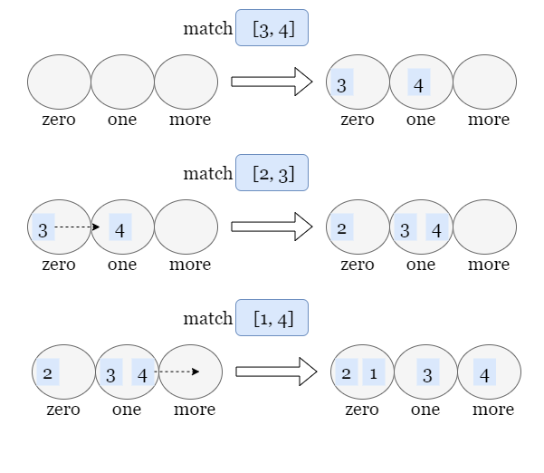
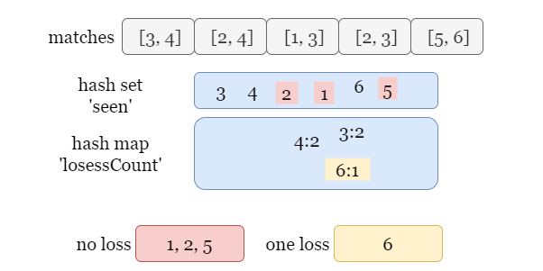
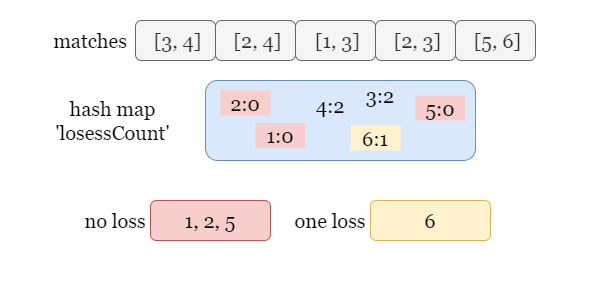
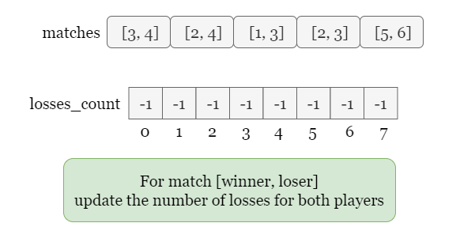
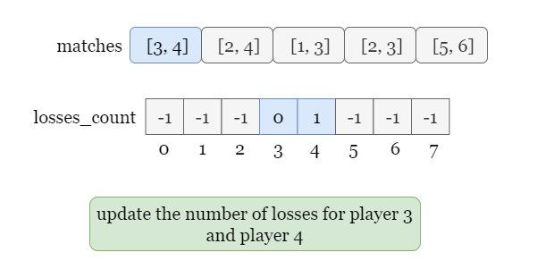
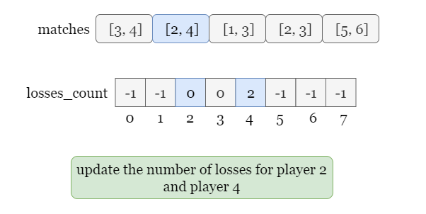
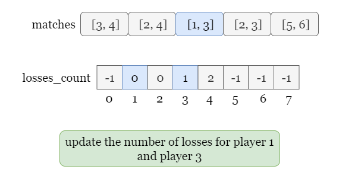
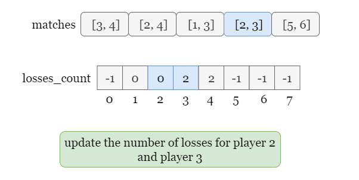
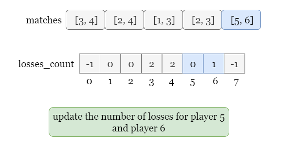
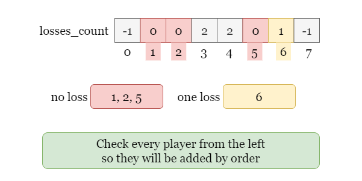

[TOC]

## Solution

---

### Overview

In this problem, we are given an array `matches` consisting of matches `[winner, loser]` where `winner` defeats `loser`.

We need to collect these 2 kinds of players into two lists separately:
- players that have not lost any matches.
- players that have lost exactly one match.

then return the two lists in increasing order.

Here we introduce several approaches that use different data structures.

---

### Approach 1: Hash Set

#### Intuition

We use three hash sets to store the players with different numbers of losses:
- $\text{zero}_{loss}$ to store players with zero loss.
- $\text{one}_{loss}$ to store players with one loss.
- $\text{more}_{loss}$ to store players with more than one loss.

For each match $\text{match}[i] = [winner, loser]$, two players `winner` and `loser` may need to move to other sets and we update the sets they should move to. For example, if $\text{player}_{A}$ is in $\text{zero}_{loss}$ previously, assume we encounter a match `[player_X, player_A]`, it means $\text{player}_{A}$ has one loss now, so we need to remove $\text{player}_{A}$ from $\text{zero}_{loss}$ and add it to $\text{one}_{loss}$.



<br>

#### Algorithm

1) Initialize three empty hash sets, $\text{zero}_{loss}$, $\text{one}_{loss}$ and $\text{more}_{losses}$.
2) Iterate over `matches`, for each match `[winner, loser]`, update the sets they are in according to the following rule:
- For `winner`:
- If `winner` is not in $\text{more}_{losses}$ or $\text{one}_{loss}$, it means he should be in $\text{zero}_{loss}$, add it to $\text{zero}_{loss}$.
- Otherwise, the number of losses for `winner` doesn't change, keep this player in the original set.
- For `loser`:
- If `loser` is in $\text{zero}_{loss}$, remove it from $\text{zero}_{loss}$ and add it to $\text{one}_{loss}$ since this player has one more loss now.
- If `loser` is in $\text{one}_{loss}$, remove it from $\text{one}_{loss}$ and add it to $\text{more}_{losses}$ since this player has one more loss now.
- If `loser` is in $\text{more}_{losses}$, keep this player in $\text{more}_{losses}$.
- Otherwise, it means that this match is `loser`'s first match, we add this player to $\text{one}_{loss}$.
3) After the iteration ends, get the players from $\text{zero}_{loss}$ and $\text{one}_{loss}$ and sort them, as required by the problem.

#### Implementation

```python
class Solution:
    def findWinners(self, matches: List[List[int]]) -> List[List[int]]:
        zero_loss = set()
        one_loss = set()
        more_losses = set()

        for winner, loser in matches:
            # Add winner
            if (winner not in one_loss) and (winner not in more_losses):
                zero_loss.add(winner)
            # Add or move loser.
            if loser in zero_loss:
                zero_loss.remove(loser)
                one_loss.add(loser)
            elif loser in one_loss:
                one_loss.remove(loser)
                more_losses.add(loser)
            elif loser in more_losses:
                continue
            else:
                one_loss.add(loser)

        return [sorted(list(zero_loss)), sorted(list(one_loss))]
```

#### Complexity Analysis

Let $n$ be the size of the input array `matches`.

* Time complexity: $O(n\cdot \log n)$

- For each match from `matches`, we have up to 3 operations on these sets. Operations on hash set require $O(1)$ time. Thus the iteration over `matches` takes $O(n)$ time.
- We need to store two kinds of players in two arrays and sort them. In the worst-case scenario, there may be $O(n)$ players in these arrays, thus it requires $O(n \cdot\log n)$ time.
- To sum up, the time complexity is $O(n\cdot \log n)$.

* Space complexity: $O(n)$

- We use three hash sets to store all the players, there are at most $O(n)$ players.

<br/>

---

### Approach 2: Hash Set + Hash Map

#### Intuition

The previous approach works but has very limited usability. It seems very concise because of the fact that the question asks us to find only $k = 2$ kinds of players. What if `k` be a very large number, or even worse, `k` is of the same order of magnitude as `n`? We need to create $O(n)$ hash sets and more complex decision conditions!

Therefore, instead of using the set itself to represent the number of losses of players (i.e `set 1` for players of 1 loss, `set 2` for players of 2 losses, and so forth), we would better consider the number losses as a value bound to the player. We can use a hash map $\text{losses}_{count}$ to store players and the number of losses each has.

Hence, we use a hash set `seen` to store all the players, and a hash map $\text{losses}_{count}$ to store the number of losses each `loser` has.



<br>

#### Algorithm

1) Initialize an empty hash set `seen` and an empty hash map $\text{losses}_{count}$.
2) Iterate over `matches` and for each match `[winner, loser]`, add both `winner` and `loser` to `seen`. Increment $\text{losses}_{count}[loser]$ by 1.
3) After the iteration stops, we iterate through all the players in `seen` and collect players with 0 loss or 1 loss to two arrays respectively.
4) Sort these two arrays.

#### Implementation

```python
class Solution:
    def findWinners(self, matches : List[List[int]]) ->List[List[int]]:
        seen = set() losses_count = {}

        for winner, loser in matches:
            seen.add(winner)
            seen.add(loser)
            losses_count[loser] = losses_count.get(loser, 0) + 1

        #Add players with 0 or 1 loss to the corresponding list.
        zero_lose, one_lose = [], []
        for player in seen:
            count = losses_count.get(player, 0)
            if count == 0:
                zero_lose.append(player)
            elif count == 1:
                one_lose.append(player)

        return [sorted(zero_lose), sorted(one_lose)]
```

#### Complexity Analysis

Let $n$ be the size of the input array `matches`.

* Time complexity: $O(n\cdot \log n)$

- For each match in `matches`, we need to update `seen` and $\text{losses}_{count}$ once. The operation on hash set or hash map takes $O(1)$ time. Thus the iteration over `matches` takes $O(n)$ time.
- We need to store and sort two kinds of players in two arrays respectively. In the worst-case scenario, there may be $O(n)$ players in these two arrays, so it requires $O(n \cdot\log n)$ time.
- To sum up, the time complexity is $O(n\cdot \log n)$.

* Space complexity: $O(n)$

- We use a hash set and a hash map to store all the players, there are at most $O(n)$ players.

<br/>

---

### Approach 3: Hash Map

#### Intuition

If the previous approach, we use a hash map to store the players with at least 1 loss. We can also store the players with 0 loss in the same hash map, so we no longer need the hash set `seen` to store all the players!

For a given match `[winner, loser]`:
- We increment `loser`'s number of losses by 1.
- If `winner` has 1 or more losses already, we don't need to make any change, otherwise, we set his value to 0, which means that `winner` has played at least 1 game and hasn't received a loss yet.

Therefore, we can update the number of losses of each player using only 1 hash map, as shown in the picture below.



<br>

#### Algorithm

- Initialize a map called `lossesCount` to track the number of losses for each player.
- Iterate over each match:
  - Extract the `winner` and `loser` from the match.
  - Update `lossesCount`:
- Set the number of losses for `winner` to 0 if not already present.
- Increment the number of losses for `loser` by 1.
- Initialize a list of list of integer called `answer` with two empty lists:
  - The first list will store players with 0 losses.
  - The second list will store players with exactly 1 loss.
- Iterate over the `lossesCount` map:
  - If a player's loss count is 0, add the player to the first list in `answer`.
  - If a player's loss count is 1, add the player to the second list in `answer`.
- Sort both lists in `answer` to ensure the output is in ascending order.
- Return the `answer` list containing the two sorted lists of players.

#### Implementation

```python
class Solution:
    def findWinners(self, matches: List[List[int]]) ->List[List[int]]:
        losses_count = {}

        for winner, loser in matches:
            losses_count[winner] = losses_count.get(winner, 0)
            losses_count[loser] = losses_count.get(loser, 0) + 1

        zero_lose, one_lose = [], []
        for player, count in losses_count.items():
            if count == 0:
                zero_lose.append(player)
            if count == 1:
                one_lose.append(player)

        return [sorted(zero_lose), sorted(one_lose)]
```

#### Complexity Analysis

Let $n$ be the size of the input array `matches`.

* Time complexity: $O(n\cdot \log n)$

- For each match in `matches`, we need to update the value of both players in $\text{losses}_{count}$. Operations on hash map require $O(1)$ time. Thus the iteration over `matches` takes $O(n)$ time.
- We need to store two kinds of players in two arrays and sort them. In the worst-case scenario, there may be $O(n)$ players in these arrays, so it requires $O(n \cdot\log n)$ time.
- To sum up, the time complexity is $O(n\cdot \log n)$.

* Space complexity: $O(n)$

- We use a hash map to store all players and their number of losses, which requires $O(n)$ space in the worst-case scenario.

<br/>

---

### Approach 4: Counting with Array

#### Intuition

In the previous approaches, we store players without so we need to sort them after adding them to arrays. Can we store the players in order so that we don't need an additional sorting process after we collect them?

Notice that the valid range of players is of the same order of magnitude as the size of `match`. This reminds us of counting sort, a sorting algorithm with linear time complexity.

> What is Counting Sort?

For a detailed introduction, you can refer to this article on [Counting Sort](https://en.wikipedia.org/wiki/Counting_sort).

In short, Counting Sort is not a comparison sort; thus, the $O(n \cdot \log(n))$ time complexity for comparison sorting does not apply. Note that the approach we use to solve this problem is not exactly a counting sort, but has the same idea behind it: mapping each of the players to an (unique) index within a specific range.

We create an auxiliary array ($\text{losses}_{count}$) and fill it with a specific value (let's say `-1`) indicating that none of the players have played the match yet. For each match `[winner, loser]`, we modify $\text{losses}_{count}[winner]$ and $\text{losses}_{count}[loser]$ to other numbers than `-1` to reflect that both players have played at least one match.

> How do we use different values to represent different kinds of players?

- $\text{losses}_{count}[i] = -1$, player `i` has not played.
- $\text{losses}_{count}[i] = 0$, player `i` has played at least one game and has 0 loss.
- $\text{losses}_{count}[i] = 1$, player `i` has exact 1 loss.
- $\text{losses}_{count}[i] > 1$, player `i` has more than 1 loss.

Therefore, we initialize all the values in $\text{losses}_{count}$ as `-1`, iterate through `matches` and update values at index `winner` and `loser` for each match. Each value $\text{losses}_{count}[i] \neq -1$ stands for a player `i` who has played at least one match. We just need to iterate over $\text{losses}_{count}$ from low to high and add the two kinds of players to corresponding arrays, so we don't need to sort them anymore.

Please refer to the slides below.















<br>

#### Algorithm

1) Use an array $\text{losses}_{count}$ to store the number of losses for each player. Initially, $\text{losses}_{count}[i] = -1$ for every index `i`.
2) For each match `[winner, loser]`:
- If $\text{losses}_{count}[loser] = -1$, set it to 1, otherwise increment it by 1.
- If $\text{losses}_{count}[winner] = -1$, set it to 0.
3) Iterate over $\text{losses}_{count}$ and use two arrays to store these 2 kinds of players, for each index `i`:
- If $\text{losses}_{count}[i] = 0$, add this player to the first array.
- If $\text{losses}_{count}[i] = 1$, add this player to the second array.

#### Implementation

```python
def findWinners(self, matches: List[List[int]]) -> List[List[int]]:
        losses_count = [-1] * 100001

        for winner, loser in matches:
            if losses_count[winner] == -1:
                losses_count[winner] = 0
            if losses_count[loser] == -1:
                losses_count[loser] = 1
            else:
                losses_count[loser] += 1

        answer = [[], []]
        for i in range(100001):
            if losses_count[i] == 0:
                answer[0].append(i)
            elif losses_count[i] == 1:
                answer[1].append(i)

        return answer
```

#### Complexity Analysis

Let $n$ be the size of the input array `matches`, and $k$ be the range of values in `winner` or `loser`.

* Time complexity: $O(n + k)$

- For each match, we need to update two values in the array $\text{losses}_{count}$ which takes constant time. Thus the iteration requires $O(n)$ time.
- We need to iterate over $\text{losses}_{count}$ to collect two kinds of players, which takes $O(k)$ time.
- Since we iterate over players from low to high, we don't need to sort them anymore.
- To sum up, the overall time complexity is $O(n + k)$.

* Space complexity: $O(k)$

- We need to create an array of size $O(k)$ to cover all players. Thus the overall space complexity is $O(k)$.

<br/>