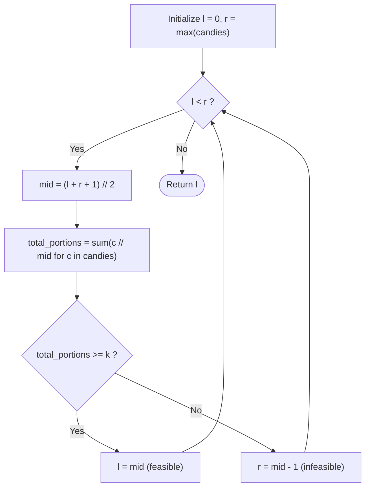

# Guided Example: Maximum Candies Allocated to K Children

We analyze and trace the monotonic binary search on answer algorithm for determining the maximum identical candy allocation per child in $O(n \log(\max(C)))$ time and $O(1)$ auxiliary space.

- **Input:** `candies = [5, 8, 6]`, `k = 3`
- **Output:** `5`

This representative instance demonstrates resource partitioning under non-mergeable constraints, floor division yield aggregation, upper-midpoint bisection, and monotonic feasibility preservation.

---

## 1. Problem Overview & Representative Instance

You are given a 0-indexed integer array `candies` where each element $\text{candies}[i]$ denotes the number of candies in the $i$-th pile, and an integer $k$ representing the number of children.

You must allocate candies to $k$ children such that:
1. Each child receives the **exact same number of candies** $m$.
2. Each child can take candies from **at most one pile** (candies from different piles cannot be merged together).
3. Any pile may be partitioned into any number of sub-piles, but any unused candies remaining in a pile are discarded.

Our goal is to find the **maximum possible value of $m$**. If it is impossible to give each child even $1$ candy, the answer is $0$.

### Representative Instance Breakdown

Consider `candies = [5, 8, 6]` and $k = 3$:
- Pile 0 has $5$ candies.
- Pile 1 has $8$ candies.
- Pile 2 has $6$ candies.

Let us test candidate allocation size $m = 5$:
- From Pile 0 ($5$ candies): $\lfloor 5 / 5 \rfloor = 1$ child portion of size $5$. ($0$ leftover).
- From Pile 1 ($8$ candies): $\lfloor 8 / 5 \rfloor = 1$ child portion of size $5$. ($3$ leftover).
- From Pile 2 ($6$ candies): $\lfloor 6 / 5 \rfloor = 1$ child portion of size $5$. ($1$ leftover).
- Total portions produced: $1 + 1 + 1 = 3$.
Since $3 \ge k = 3$, allocating $5$ candies per child is feasible.

Can we allocate $m = 6$?
- From Pile 0: $\lfloor 5 / 6 \rfloor = 0$.
- From Pile 1: $\lfloor 8 / 6 \rfloor = 1$.
- From Pile 2: $\lfloor 6 / 6 \rfloor = 1$.
- Total portions produced: $0 + 1 + 1 = 2 < 3$. Infeasible!

Hence, the maximum feasible allocation is $m = 5$.

---

## 2. Mathematical & Algorithmic Principles

### Monotonic Feasibility Predicate

Let $S(m)$ be the maximum number of children that can be served if each child receives exactly $m$ candies:
$$S(m) = \sum_{c \in \text{candies}} \left\lfloor \frac{c}{m} \right\rfloor$$

For any non-negative integer $c$, the function $f(m) = \lfloor c / m \rfloor$ is monotonically non-increasing in $m$.
Because the sum of non-increasing functions is itself non-increasing, $S(m)$ is monotonically non-increasing:
$$m_1 \le m_2 \implies S(m_1) \ge S(m_2)$$

We define the feasibility predicate:
$$P(m) = [S(m) \ge k]$$

The truth-value sequence of $P(m)$ for $m \ge 1$ has the form:
$$[\text{True}, \text{True}, \dots, \text{True}, \text{False}, \text{False}, \dots]$$
This step-function structure guarantees that the maximum $m$ satisfying $P(m) = \text{True}$ can be located via binary search over the domain $[0, \max(\text{candies})]$.

### Upper-Midpoint Bisection Invariant

When binary searching for the *largest* value satisfying a condition:
- Interval: $[l, r]$.
- We select the upper midpoint:
  $$\text{mid} = \left\lfloor \frac{l + r + 1}{2} \right\rfloor$$
- If $P(\text{mid}) = \text{True}$, $\text{mid}$ is feasible and might be the optimum: $l \leftarrow \text{mid}$.
- If $P(\text{mid}) = \text{False}$, $\text{mid}$ is too large: $r \leftarrow \text{mid} - 1$.
- Choosing $(l + r + 1) // 2$ prevents an infinite loop when $r = l + 1$.

---

## 3. Step-by-Step Walkthrough with Intermediate State

We trace `candies = [5, 8, 6]` and $k = 3$.
Initial bounds: $l = 0, r = \max(5, 8, 6) = 8$.

### Iteration 1: Interval $[0, 8]$
- Compute upper midpoint:
  $$\text{mid} = \left\lfloor \frac{0 + 8 + 1}{2} \right\rfloor = \left\lfloor \frac{9}{2} \right\rfloor = 4$$
- Evaluate portion yield per pile at $m = 4$:
  - $\lfloor 5 / 4 \rfloor = 1$
  - $\lfloor 8 / 4 \rfloor = 2$
  - $\lfloor 6 / 4 \rfloor = 1$
  - Total yield: $S(4) = 1 + 2 + 1 = 4$.
- Compare with $k$: $4 \ge 3$ ($\text{True}$).
- Midpoint is feasible. Eliminate values below $4$:
  $$l \leftarrow 4$$
- New active interval: $[4, 8]$.

### Iteration 2: Interval $[4, 8]$
- Compute upper midpoint:
  $$\text{mid} = \left\lfloor \frac{4 + 8 + 1}{2} \right\rfloor = \left\lfloor \frac{13}{2} \right\rfloor = 6$$
- Evaluate portion yield per pile at $m = 6$:
  - $\lfloor 5 / 6 \rfloor = 0$
  - $\lfloor 8 / 6 \rfloor = 1$
  - $\lfloor 6 / 6 \rfloor = 1$
  - Total yield: $S(6) = 0 + 1 + 1 = 2$.
- Compare with $k$: $2 \ge 3$ ($\text{False}$).
- Midpoint is infeasible. Eliminate $6$ and above:
  $$r \leftarrow 6 - 1 = 5$$
- New active interval: $[4, 5]$.

### Iteration 3: Interval $[4, 5]$
- Compute upper midpoint:
  $$\text{mid} = \left\lfloor \frac{4 + 5 + 1}{2} \right\rfloor = \left\lfloor \frac{10}{2} \right\rfloor = 5$$
- Evaluate portion yield per pile at $m = 5$:
  - $\lfloor 5 / 5 \rfloor = 1$
  - $\lfloor 8 / 5 \rfloor = 1$
  - $\lfloor 6 / 5 \rfloor = 1$
  - Total yield: $S(5) = 1 + 1 + 1 = 3$.
- Compare with $k$: $3 \ge 3$ ($\text{True}$).
- Midpoint is feasible. Update lower bound:
  $$l \leftarrow 5$$
- New active interval: $[5, 5]$.

### Termination
$l = r = 5$. Loop terminates.
Return $l = 5$.

---

## 4. Comprehensive State Trace

### Binary Search Bisection Iteration Log

| Iteration | Lower $l$ | Upper $r$ | Probe $\text{mid}$ | Pile Yields $[\lfloor c / \text{mid} \rfloor]$ | Total Portions $S(\text{mid})$ | Feasible ($S \ge 3$)? | Next Range $[l, r]$ |
|---|---|---|---|---|---|---|---|
| Initial | 0 | 8 | - | - | - | - | $[0, 8]$ |
| 1 | 0 | 8 | 4 | $[1, 2, 1]$ | 4 | $\text{True}$ ($4 \ge 3$) | $[4, 8]$ |
| 2 | 4 | 8 | 6 | $[0, 1, 1]$ | 2 | $\text{False}$ ($2 < 3$) | $[4, 5]$ |
| 3 | 4 | 5 | 5 | $[1, 1, 1]$ | 3 | $\text{True}$ ($3 \ge 3$) | $[5, 5]$ |

### Final Allocation Matrix at Optimal $m = 5$

| Pile Index $i$ | Initial Candies | Portions Allocated ($m = 5$) | Candies Distributed | Unused Candies (Remainder) |
|---|---|---|---|---|
| 0 | 5 | 1 | $1 \times 5 = 5$ | 0 |
| 1 | 8 | 1 | $1 \times 5 = 5$ | 3 |
| 2 | 6 | 1 | $1 \times 5 = 5$ | 1 |
| **Total** | **19** | **3** | **15** | **4** |

---

## 5. Algorithmic Correctness & Soundness

### Loop Invariant & Convergence Proof

1. **Range Invariant:**
   At the start of every iteration, the optimal answer $m^*$ satisfies $l \le m^* \le r$.
   - Base case: $m^* \ge 0$ (at least 0 candies can always be given) and $m^* \le \max(\text{candies})$ (no child can receive more candies than the largest existing pile).
   - Inductive step: If $\text{mid}$ is feasible ($S(\text{mid}) \ge k$), then $m^* \ge \text{mid}$, so setting $l \leftarrow \text{mid}$ preserves $m^* \in [l, r]$. If $\text{mid}$ is infeasible, then $m^* < \text{mid}$, so setting $r \leftarrow \text{mid} - 1$ preserves $m^* \in [l, r]$.
2. **Strict Interval Reduction:**
   When $l < r$, $\text{mid} = \lfloor (l + r + 1) / 2 \rfloor > l$.
   - If $l \leftarrow \text{mid}$, the lower bound strictly increases.
   - If $r \leftarrow \text{mid} - 1$, since $\text{mid} \le r$, the upper bound strictly decreases.
   In both cases, the search space $r - l$ decreases by at least 1, guaranteeing termination in $\lceil \log_2(\max(C) + 1) \rceil$ iterations.

---

## 6. Edge Cases & Anti-Patterns

### Boundary Scenarios

1. **Total Candies Less Than $k$ ($\sum c < k$):**
   - E.g., $\text{candies} = [1, 2, 1], k = 5$. Total candies $= 4 < 5$.
   - Even at $m = 1$, $S(1) = 4 < 5$.
   - The binary search collapses to $l = 0$, correctly returning $0$.
2. **$k = 1$ (Single Child):**
   - The child can take the entire largest pile, so the answer is always $\max(\text{candies})$.
3. **Piles Smaller Than $m$:**
   - Handled naturally by integer division: $\lfloor c / m \rfloor = 0$ contributes $0$ portions without runtime errors.

### Common Anti-Patterns

- **Floor Midpoint Invariant Trap:**
  Using $\text{mid} = (l + r) // 2$ with $l = \text{mid}$ causes an infinite loop when $r = l + 1$. For example, with $l = 4, r = 5$, $(4 + 5) // 2 = 4$. If feasible, $l$ remains $4$, stalling execution forever. Upper midpoint $(l + r + 1) // 2$ is mandatory.
- **Linear Search from $\max(C)$ Downwards ($O(n \cdot \max(C))$):**
  When $\max(candies) = 10^7$ and $n = 10^5$, linear search requires up to $10^{12}$ operations, which exceeds time limits by orders of magnitude.
- **Summing First and Dividing ($S = \lfloor \sum c / k \rfloor$):**
  Assuming candies can be pooled across piles violates constraint (2). E.g., for $\text{candies} = [2, 2], k = 1$, $\lfloor 4 / 1 \rfloor = 4$, but the maximum single pile is only $2$.

---

## 7. Complexity Analysis

### Time Complexity

- **Bisection Span:** The search domain is $[0, \max(\text{candies})]$. The number of binary search iterations is at most:
  $$\lfloor \log_2(\max(\text{candies})) \rfloor + 1$$
  For $\max(C) \le 10^7$, $\log_2(10^7) \approx 23.25$, so at most $24$ iterations occur.
- **Predicate Evaluation:** Each iteration scans through all $n$ piles to compute $\lfloor c / \text{mid} \rfloor$, taking $O(n)$ operations.
- **Total Time Complexity:** $O(n \log(\max(\text{candies})))$ time. With $n \le 10^5$, the total operations count is $\approx 2.4 \times 10^6$, executing in roughly $15$ milliseconds.

### Auxiliary Space Complexity

- The algorithm uses scalar variables for search boundaries (`l`, `r`, `mid`) and the sum aggregator.
- No dynamic memory or recursive stack frames are created.
- **Total Auxiliary Space Complexity:** Strictly $O(1)$ auxiliary memory.
