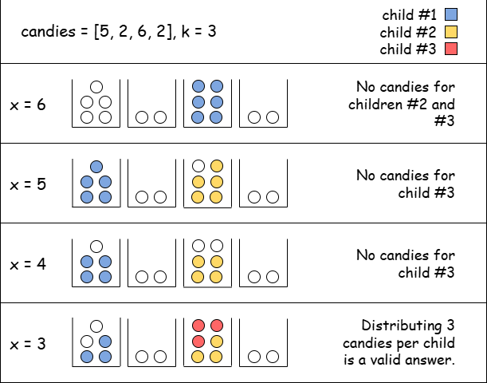
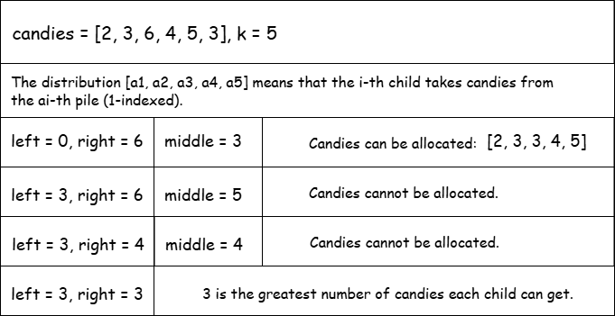

[TOC]

## Solution

---

### Overview

We are given an array called `candies`, where each element $\text{candies}[i]$ represents the number of candies in the `i-th` pile. We also have an integer `k`, which denotes the number of children we must give candies to. Our goal is to find the greatest number of candies each child can get, following these rules:

-   Each child must get the same number of candies.
-   Each child's candies must come from just one pile. We can divide candies from a pile among multiple children, but we cannot combine candies from different piles for one child.

Note that we do not have to use all the candies from any given pile—some candies from a pile or even entire piles may remain unused.

To better understand the task, let's go through an example. Suppose we have $candies = [5, 2, 6, 2]$ and $k = 3$.

First, since each child's candies must come from a single pile, the greatest number of candies each child can get is at most equal to the largest element in the array — in this case, `6`. If we tried to give, for example, `7` candies to each child, we would need to combine candies from multiple piles, which is not allowed.

After determining the upper bound, we can start from `6` and go down to `0` until we find the first number for which an allocation is valid. Let's denote the number of candies each child receives with `x`.
-   For $x = 6$, no valid distribution exists, as the total number of candies is less than $3 * 6 = 18$.
-   For $x = 5$, the first child can get candies from the first pile and the second child can get candies from the third pile. However, it is impossible to give `5` candies to the last child without combining the remaining piles.
-   Similarly, for $x = 4$, giving candies to the last child would require merging piles, which is not allowed.
-   For $x = 3$, we can give `3` candies from the first pile to the first child, `3` candies from the third pile to the second child, and the remaining `3` candies from the third pile to the third child.

Since `3` is the largest number of candies that satisfies all conditions, it is our final result.



### Approach: Binary Search on The Answer

#### Intuition

Let's first try to answer a slightly different question: given a target number of candies `x` per child, can we distribute the candies so that each child gets exactly `x`?

To check this, we calculate how many children each pile can serve. For example, with $candies = [5, 2, 6, 2]$ and $x = 4$, the first and third piles can serve one child each, with some leftover, while the second and fourth piles can't be used because they contain fewer than `x` candies. In total, the piles can serve at most `2` children.

Generally, each pile can serve up to $\lfloor \frac{\text{\text{candies}[i]}}{x} \rfloor$ children, possibly with some leftover candies. By summing the number of children each pile can serve, we can easily determine if an allocation is possible by comparing the total to the number of children (`k`) we must distribute candies to.

Additionally, note that if a valid distribution exists for a given number `x`, then a distribution is also possible for any number smaller than or equal to `x`. Conversely, if we cannot allocate the candies such that each child receives `x` candies, then it's impossible to distribute them in a way that gives each child more than `x` candies. This monotonic property allows us to use a binary search approach, where we check if a distribution is possible for the middle value of our search range. Based on that, we either move to the upper half of the range if a distribution is possible, or to the lower half if it's not.



> For a more comprehensive understanding of binary search, check out the [Binary Search Explore Card 🔗](https://leetcode.com/explore/learn/card/binary-search/). This resource offers an in-depth look at binary search, explaining its key concepts and applications with a variety of problems to solidify understanding of the pattern. Additionally, for extra practice, consider taking a look at the classic binary search problem [Koko Eating Bananas](https://leetcode.com/problems/koko-eating-bananas/description/).

#### Algorithm

-   Define a function `canAllocateCandies(candies, k, numOfCandies)`:
-   Initialize `maxNumOfChildren` to `0`, denoting the maximum number of children that can be served.
-   Iterate over `candies`, with `pileIndex` from `0` to $\text{candies.size} - 1$, to find the greatest number of children each pile can serve:
-   Add $\text{candies}[pileIndex] / numOfCandies$ to `maxNumOfChildren`.
-   If the number of children that can be served is at least `k`, return `true`. Otherwise, return `false`.

-   In the main `maximumCandies` function:
-   Iterate over `candies` to find the maximum element and store it as `maxCandiesInPile`.
-   Initialize the boundaries of the binary search: $left = 0$ and $right = maxCandiesInPile$.
-   While `left < right`:
-   Find `middle` as $(left + right + 1) / 2$.
-   Check if an allocation where each child receives `middle` candies is possible, using the `canAllocateCandies` function. If so, move to the upper half of the range to search for greater values, by setting $left = middle$.
-   Otherwise, move to the lower half, by setting $right = middle - 1$.
-   When exiting the loop, $left = right$, so return `left`, which corresponds to the maximum number of candies each child can get.

#### Implementation

```python
class Solution:
    def maximumCandies(self, candies, k):
        # Find the maximum number of candies in any pile
        max_candies_in_pile = 0
        for candy in candies:
            max_candies_in_pile = max(max_candies_in_pile, candy)

        # Set the initial search range for binary search
        left = 0
        right = max_candies_in_pile

        # Binary search to find the maximum number of candies each child can get
        while left < right:
            # Calculate the middle value of the current range
            middle = (left + right + 1) // 2

            # Check if it's possible to allocate candies so that each child gets 'middle' candies
            if self._can_allocate_candies(candies, k, middle):
                # If possible, move to the upper half to search for a larger number
                left = middle
            else:
                # Otherwise, move to the lower half
                right = middle - 1

        return left

    def _can_allocate_candies(self, candies, k, num_of_candies):
        # Initialize the total number of children that can be served
        max_num_of_children = 0

        # Iterate over all piles to calculate how many children each pile can serve
        for pile in candies:
            max_num_of_children += pile // num_of_candies

        return max_num_of_children >= k
```

#### Complexity Analysis

Let $n$ be the size of the `candies` array and $m$ be the greatest value in it.

-   Time complexity: $O(n \log m)$

    The `canAllocateCandies` function iterates through the $n$ candy piles, executing constant-time (arithmetic) operations, during each iteration. As a result, its time complexity is $O(n)$.

    The main function, `maximumCandies`, performs a binary search over the range $[0, m]$, calling in each iteration the `canAllocateCandies` function. Since the binary search runs in $O(\log m)$ time, the overall time complexity of the `maximumCandies` function is $O(n \log m)$.

-   Space complexity: $O(1)$

    We only use a fixed number of integer variables (`left`, `right`, `maxNumberOfChildren`), which do not increase with input size.

---