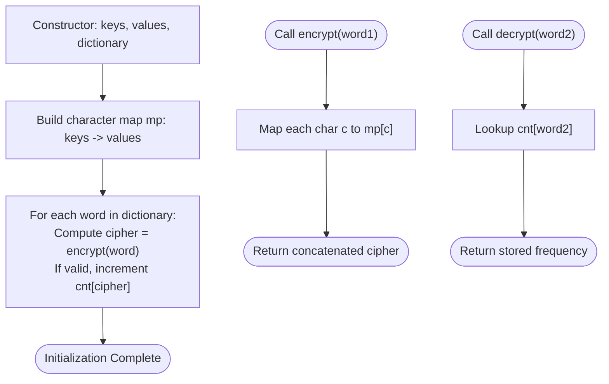

# Guided Example: Encrypt and Decrypt Strings

We analyze and trace the dictionary pre-encryption and frequency mapping algorithm for instant decryption queries in $O(|word|)$ time per operation, avoiding exponential backtracking over ambiguous inverse character mappings.

- **Input:**
  - `keys = ["a", "b", "c", "d"]`
  - `values = ["ei", "zf", "ei", "am"]`
  - `dictionary = ["abcd", "acbd", "adbc", "badc", "dacb", "cadb", "cbda", "abad"]`
  - Calls: `encrypt("abcd")`, `decrypt("eizfeiam")`
- **Output:** `["eizfeiam", 2]`

This representative instance demonstrates many-to-one character substitution, the exponential explosion trap of naive inverse backtracking, and forward pre-computation to invert search complexity into constant-time hash map lookups.

---

## 1. Problem Overview & Representative Instance

We are designing a cryptographic helper class `Encrypter` initialized with:
1. `keys`: an array of unique characters.
2. `values`: an array of 2-character strings where $\text{keys}[i]$ maps to $\text{values}[i]$.
3. `dictionary`: a collection of strings permitted as valid plaintext outputs.

The class provides two operational methods:
- `encrypt(word1)`: Replaces each character $c$ in `word1` with its corresponding 2-character code $\text{values}[i]$. If any character in `word1` has no mapping in `keys`, the method returns the empty string `""`.
- `decrypt(word2)`: Returns the number of distinct words in `dictionary` that encrypt to the exact string `word2`.

### Representative Instance Breakdown

Consider the mapping:
- `'a' \to \text{"ei"}`
- `'b' \to \text{"zf"}`
- `'c' \to \text{"ei"}`
- `'d' \to \text{"am"}`

Notice that both `'a'` and `'c'` map to the identical 2-character string `"ei"`.

1. **`encrypt("abcd")`:**
   - $'a' \to \text{"ei"}$
   - $'b' \to \text{"zf"}$
   - $'c' \to \text{"ei"}$
   - $'d' \to \text{"am"}$
   - Concatenated result: `"eizfeiam"`.
2. **`decrypt("eizfeiam")`:**
   - The 2-character pairs are: `"ei"`, `"zf"`, `"ei"`, `"am"`.
   - Pre-images for `"ei"` are $\{'a', 'c'\}$.
   - Pre-images for `"zf"` is $\{'b'\}$.
   - Pre-images for `"am"` is $\{'d'\}$.
   - Cartesian product of candidates: $\{'a', 'c'\} \times \{'b'\} \times \{'a', 'c'\} \times \{'d'\} = \{\text{"abad"}, \text{"abcd"}, \text{"cbad"}, \text{"cbcd"}\}$.
   - Intersecting with `dictionary`: both `"abcd"` and `"abad"` exist in `dictionary`.
   - Output count: $2$.

---

## 2. Mathematical & Algorithmic Principles

### Many-to-One Non-Invertible Mapping

The substitution cipher $E: \Sigma \to \Sigma^2$ is **not injective**. When multiple keys map to the same value (e.g., $E('a') = E('c') = \text{"ei"}$), the preimage of a 2-character block has size $|E^{-1}(v)| > 1$.
For a ciphertext $C$ of length $2L$ composed of $L$ blocks:
$$|\text{Decryptions}(C)| = \prod_{i=1}^L |E^{-1}(C[2i-2 \dots 2i-1])|$$

In the worst case, if each block has $k$ possible character origins, naive backtracking explores $k^L$ candidate strings. For $L = 100$ and $k = 2$, $2^{100} \approx 10^{30}$ branches, which renders runtime decryption completely intractable.

### The Inversion Insight: Pre-Encrypting the Dictionary

The query does not ask us to generate all possible plaintext strings. It only asks how many strings **in the fixed dictionary** encrypt to `word2`.
Let $D$ denote the dictionary. The answer to $\text{decrypt}(C)$ is simply:
$$\text{decrypt}(C) = |\{ w \in D \mid E(w) = C \}|$$

Instead of computing the multi-valued inverse $E^{-1}(C)$ on each query:
1. During initialization, compute the forward encryption $E(w)$ for every word $w \in D$.
2. Store the counts of each resulting ciphertext in a frequency hash map $\text{cnt}$.
3. Answering $\text{decrypt}(word2)$ then becomes a simple $O(1)$ dictionary lookup: $\text{cnt}[word2]$.

---

## 3. Step-by-Step Walkthrough with Intermediate State

We trace initialization and operations on the representative instance.

### Phase 1: Initialization (`__init__`)
1. **Build Character Map `mp`:**
   - `'a' \to \text{"ei"}`
   - `'b' \to \text{"zf"}`
   - `'c' \to \text{"ei"}`
   - `'d' \to \text{"am"}`
2. **Pre-Encrypt Dictionary Words:**
   - $w_1 = \text{"abcd"} \to \text{"ei"} + \text{"zf"} + \text{"ei"} + \text{"am"} = \text{"eizfeiam"}$. $\text{cnt}[\text{"eizfeiam"}] \leftarrow 1$.
   - $w_2 = \text{"acbd"} \to \text{"ei"} + \text{"ei"} + \text{"zf"} + \text{"am"} = \text{"eieizfam"}$. $\text{cnt}[\text{"eieizfam"}] \leftarrow 1$.
   - $w_3 = \text{"adbc"} \to \text{"ei"} + \text{"am"} + \text{"zf"} + \text{"ei"} = \text{"eiamzfei"}$. $\text{cnt}[\text{"eiamzfei"}] \leftarrow 1$.
   - $w_4 = \text{"badc"} \to \text{"zf"} + \text{"ei"} + \text{"am"} + \text{"ei"} = \text{"zfeiamyei"}$. $\text{cnt}[\text{"zfeiamyei"}] \leftarrow 1$.
   - $w_5 = \text{"dacb"} \to \text{"am"} + \text{"ei"} + \text{"ei"} + \text{"zf"} = \text{"ameieizf"}$. $\text{cnt}[\text{"ameieizf"}] \leftarrow 1$.
   - $w_6 = \text{"cadb"} \to \text{"ei"} + \text{"ei"} + \text{"am"} + \text{"zf"} = \text{"eieiamzf"}$. $\text{cnt}[\text{"eieiamzf"}] \leftarrow 1$.
   - $w_7 = \text{"cbda"} \to \text{"ei"} + \text{"zf"} + \text{"am"} + \text{"ei"} = \text{"eizfamei"}$. $\text{cnt}[\text{"eizfamei"}] \leftarrow 1$.
   - $w_8 = \text{"abad"} \to \text{"ei"} + \text{"zf"} + \text{"ei"} + \text{"am"} = \text{"eizfeiam"}$.
     Ciphertext matches $w_1$! Increment: $\text{cnt}[\text{"eizfeiam"}] \leftarrow 1 + 1 = 2$.

---

### Phase 2: Operations Execution

1. **`encrypt("abcd")`:**
   - Character 0: `'a'` in `mp` $\implies \text{"ei"}$.
   - Character 1: `'b'` in `mp` $\implies \text{"zf"}$.
   - Character 2: `'c'` in `mp` $\implies \text{"ei"}$.
   - Character 3: `'d'` in `mp` $\implies \text{"am"}$.
   - Concatenation: `"eizfeiam"`.
   - Returns `"eizfeiam"`.

2. **`decrypt("eizfeiam")`:**
   - Directly query $\text{cnt}[\text{"eizfeiam"}]$.
   - Found with count $2$.
   - Returns $2$.

---

## 4. Comprehensive State Trace

### Dictionary Pre-Encryption Log

| Word Index | Plaintext $w$ | Character Sequence | 2-Char Block Sequence | Resulting Ciphertext $E(w)$ | Updated Map Frequency |
|---|---|---|---|---|---|
| 1 | `"abcd"` | `['a', 'b', 'c', 'd']` | `["ei", "zf", "ei", "am"]` | `"eizfeiam"` | `{"eizfeiam": 1}` |
| 2 | `"acbd"` | `['a', 'c', 'b', 'd']` | `["ei", "ei", "zf", "am"]` | `"eieizfam"` | `{"eieizfam": 1}` |
| 3 | `"adbc"` | `['a', 'd', 'b', 'c']` | `["ei", "am", "zf", "ei"]` | `"eiamzfei"` | `{"eiamzfei": 1}` |
| 4 | `"badc"` | `['b', 'a', 'd', 'c']` | `["zf", "ei", "am", "ei"]` | `"zfeiamyei"` | `{"zfeiamyei": 1}` |
| 5 | `"dacb"` | `['d', 'a', 'c', 'b']` | `["am", "ei", "ei", "zf"]` | `"ameieizf"` | `{"ameieizf": 1}` |
| 6 | `"cadb"` | `['c', 'a', 'd', 'b']` | `["ei", "ei", "am", "zf"]` | `"eieiamzf"` | `{"eieiamzf": 1}` |
| 7 | `"cbda"` | `['c', 'b', 'd', 'a']` | `["ei", "zf", "am", "ei"]` | `"eizfamei"` | `{"eizfamei": 1}` |
| 8 | `"abad"` | `['a', 'b', 'a', 'd']` | `["ei", "zf", "ei", "am"]` | `"eizfeiam"` | `{"eizfeiam": 2}` |

### Method Invocation Trace

| Operation | Parameter | Action Taken | Internal Lookup | Return Value |
|---|---|---|---|---|
| `encrypt` | `"abcd"` | Forward character map substitution | `mp['a'], mp['b'], mp['c'], mp['d']` | `"eizfeiam"` |
| `decrypt` | `"eizfeiam"` | Direct hash map frequency query | `cnt["eizfeiam"]` | `2` |
| `decrypt` | `"eieizfam"` | Direct hash map frequency query | `cnt["eieizfam"]` | `1` |
| `decrypt` | `"zzzzzzzz"` | Direct hash map frequency query | Key not found | `0` |

---

## 5. Algorithmic Correctness & Soundness

### Set-Theoretic Equivalence

Let $D$ be the dictionary, and let $E: D \to \Sigma^*$ be the deterministic encryption function.
For any query ciphertext $C \in \Sigma^*$, the set of valid decryptions in $D$ is:
$$\text{Dec}(C) = \{ w \in D \mid E(w) = C \}$$
The cardinality of this set is:
$$|\text{Dec}(C)| = \sum_{w \in D} [E(w) = C]$$
Because the pre-encryption pass iterates through every $w \in D$ and increments the counter for $E(w)$, the stored count $\text{cnt}[C]$ is mathematically identical to $|\text{Dec}(C)|$.
No valid dictionary word can be missed because all words in $D$ are encrypted.
No invalid word can be counted because only words belonging to $D$ are registered.

---

## 6. Edge Cases & Anti-Patterns

### Boundary Scenarios

1. **Unmapped Character in `encrypt`:**
   - If `word1` contains a character $c \notin \text{keys}$, the problem specifies returning `""`.
   - The algorithm verifies `c in mp` for every character, returning `""` immediately upon encountering an unmapped symbol.
2. **Dictionary Word with Unmapped Characters:**
   - If a word in `dictionary` cannot be encrypted, `encrypt(word)` returns `""`.
   - Because query ciphertexts in `decrypt` are non-empty valid 2-character combinations, they will never match `""`.
3. **Ciphertext with Odd Length:**
   - Any valid encrypted string has an even length ($2 \times \text{len}(word)$).
   - If `word2` has odd length, it will never exist in $\text{cnt}$ and lookup safely returns $0$.
4. **Multiple Keys with Same Value:**
   - Illustrated by $a \to \text{"ei"}$ and $c \to \text{"ei"}$. Correctly handles multiple plaintexts coalescing into the identical ciphertext.

### Common Anti-Patterns

- **Backtracking Decryption with Trie:**
  Attempting to parse `word2` two characters at a time and searching in a Trie of `dictionary` words. While pruning helps, adversarial test cases with repeated ambiguous blocks (e.g., `"eieieieiei"`) can cause exponential branching.
- **Dynamic Programming on Suffixes:**
  Constructing a 1D DP table for `decrypt` on every call adds $O(|word2| \cdot |keys|)$ cost per query, whereas the hash map lookup is $O(|word2|)$ time.

---

## 7. Complexity Analysis

### Time Complexity

- **Constructor (`__init__`):**
  - Building character map `mp`: $O(|keys|)$ time.
  - Pre-encrypting all dictionary words: For each word $w \in \text{dictionary}$, encrypting takes $O(|w|)$ time.
  - Total initialization time: $O(|keys| + \sum_{w \in D} |w|)$.
- **`encrypt(word1)`:**
  - One pass over `word1` of length $L$, looking up each character in `mp` and joining $L$ 2-character strings: $O(L)$ time.
- **`decrypt(word2)`:**
  - Hashing `word2` of length $2L$ and querying the hash map: $O(L)$ time.

### Auxiliary Space Complexity

- **Character Map `mp`:** Stores $|keys|$ character pairs: $O(|keys|)$ space.
- **Ciphertext Frequency Map `cnt`:** Stores at most $|D|$ distinct encrypted strings, each of length $2|w|$: $O(\sum_{w \in D} |w|)$ space.
- **Total Auxiliary Space Complexity:** $O(|keys| + \sum_{w \in D} |w|)$ auxiliary memory.
