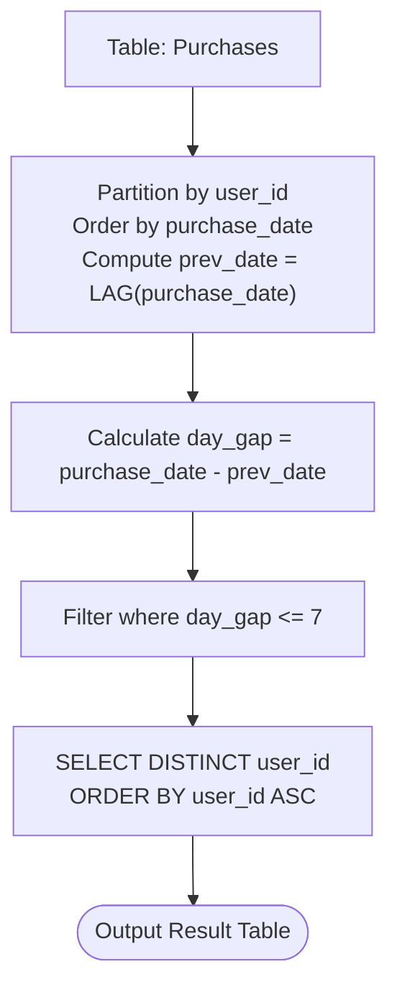

# Guided Example: Users With Two Purchases Within Seven Days

We analyze and trace the relational window evaluation algorithm for detecting users who completed multiple transactions within a 7-day temporal window in $O(n \log n)$ time and $O(n)$ space.

- **Input:** `Purchases` table containing records for users 2, 5, and 7.
- **Output:** `user_id` values `[2, 7]`

This representative instance demonstrates multi-row event sequencing, window function partitioning by customer entity, date arithmetic subtraction, adjacent delta sufficiency, and distinct key projection.

---

## 1. Problem Overview & Representative Instance

We are given a relational database table `Purchases`:
- `purchase_id` (integer, primary key): Unique identifier for each purchase transaction.
- `user_id` (integer): Identifier for the customer making the purchase.
- `purchase_date` (date): The calendar date on which the purchase occurred.

Our objective is to identify all `user_id` values corresponding to users who made **at least two purchases at most 7 days apart** (meaning the absolute difference between the two purchase dates is $\le 7$ days).

The final table must contain unique `user_id` values and be sorted in ascending order.

### Representative Instance Breakdown

Consider the `Purchases` table:

| purchase_id | user_id | purchase_date |
|---|---|---|
| 4 | 2 | 2022-03-13 |
| 1 | 5 | 2022-02-11 |
| 3 | 7 | 2022-06-19 |
| 6 | 2 | 2022-03-20 |
| 5 | 7 | 2022-06-19 |
| 2 | 2 | 2022-06-08 |

Evaluating by user:
1. **User 2:**
   - Chronological purchases: `2022-03-13`, `2022-03-20`, `2022-06-08`.
   - Gap between `2022-03-13` and `2022-03-20`: $20 - 13 = 7$ days.
   - Since $7 \le 7$, User 2 qualifies.
2. **User 5:**
   - Chronological purchases: `2022-02-11`.
   - Single purchase only; cannot form a pair. User 5 is excluded.
3. **User 7:**
   - Chronological purchases: `2022-06-19`, `2022-06-19`.
   - Two purchases on the identical date: $19 - 19 = 0$ days.
   - Since $0 \le 7$, User 7 qualifies.

Resulting `user_id` list: `[2, 7]`.

---

## 2. Mathematical & Algorithmic Principles

### Adjacent Gap Sufficiency Theorem

Suppose a user has $m$ purchases sorted chronologically:
$$t_1 \le t_2 \le \dots \le t_m$$

**Theorem:** There exists a pair of indices $(j, k)$ with $j < k$ such that $t_k - t_j \le 7$ if and only if there exists some adjacent index $i$ such that $t_{i+1} - t_i \le 7$.

**Proof:**
- If an adjacent pair satisfies $t_{i+1} - t_i \le 7$, setting $(j, k) = (i, i+1)$ immediately satisfies the condition.
- Conversely, suppose there exists a qualifying pair $(j, k)$ with $k > j$ such that $t_k - t_j \le 7$. We can express the total time span as a telescoping sum of adjacent differences:
  $$t_k - t_j = \sum_{i=j}^{k-1} (t_{i+1} - t_i)$$
  If every adjacent difference were strictly greater than 7 ($t_{i+1} - t_i > 7$ for all $i$), then:
  $$t_k - t_j > 7 \times (k - j) \ge 7$$
  which contradicts $t_k - t_j \le 7$.
  Hence, at least one adjacent difference must be $\le 7$.

This theorem proves that we never need to compare all $\binom{m}{2}$ pairs for a user. Comparing each purchase against its immediate chronological predecessor is both necessary and sufficient.

### Relational Window Partitioning

In SQL execution:
1. Partition the rows by `user_id` so that transactions of different customers are processed in isolation.
2. Order each partition by `purchase_date ASC`.
3. Use `LAG(purchase_date, 1)` over the partition to fetch the preceding transaction date.
4. Filter rows where `purchase_date - LAG(purchase_date, 1) <= 7`.
5. Apply `DISTINCT` on `user_id` to eliminate duplicates when a user has multiple qualifying purchase pairs.

---

## 3. Step-by-Step Walkthrough with Intermediate State

We trace the relational pipeline on the 6-row dataset.

### Phase 1: Window Partitioning and LAG Computation
We partition by `user_id` and sort each partition by `purchase_date`:

#### Partition `user_id = 2`
1. Row 1: `purchase_id = 4`, `purchase_date = 2022-03-13`.
   Preceding purchase date: `NULL`.
   Difference: `NULL`.
2. Row 2: `purchase_id = 6`, `purchase_date = 2022-03-20`.
   Preceding purchase date: `2022-03-13`.
   Difference: `2022-03-20 - 2022-03-13 = 7` days.
3. Row 3: `purchase_id = 2`, `purchase_date = 2022-06-08`.
   Preceding purchase date: `2022-03-20`.
   Difference: `2022-06-08 - 2022-03-20 = 80` days.

#### Partition `user_id = 5`
1. Row 1: `purchase_id = 1`, `purchase_date = 2022-02-11`.
   Preceding purchase date: `NULL`.
   Difference: `NULL`.

#### Partition `user_id = 7`
1. Row 1: `purchase_id = 3`, `purchase_date = 2022-06-19`.
   Preceding purchase date: `NULL`.
   Difference: `NULL`.
2. Row 2: `purchase_id = 5`, `purchase_date = 2022-06-19`.
   Preceding purchase date: `2022-06-19`.
   Difference: `2022-06-19 - 2022-06-19 = 0` days.

---

### Phase 2: Filtering and Distinct Projection

Rows evaluated against predicate `day_gap <= 7`:
- User 2, Row 2: `7 <= 7` $\implies$ **True**. User 2 qualifies.
- User 7, Row 2: `0 <= 7` $\implies$ **True**. User 7 qualifies.
- All other rows evaluate to False or NULL.

Projecting distinct `user_id` values and sorting ascending:
- Selected IDs: $\{2, 7\}$.
- Sorted result: `[2, 7]`.

---

## 4. Comprehensive State Trace

### Intermediate Window Function Evaluation

| `purchase_id` | `user_id` | `purchase_date` | `LAG(purchase_date)` | Computed `day_gap` | Predicate `day_gap <= 7` |
|---|---|---|---|---|---|
| 4 | 2 | 2022-03-13 | `NULL` | `NULL` | False |
| 6 | 2 | 2022-03-20 | 2022-03-13 | 7 | **True** (Qualifies) |
| 2 | 2 | 2022-06-08 | 2022-03-20 | 80 | False |
| 1 | 5 | 2022-02-11 | `NULL` | `NULL` | False |
| 3 | 7 | 2022-06-19 | `NULL` | `NULL` | False |
| 5 | 7 | 2022-06-19 | 2022-06-19 | 0 | **True** (Qualifies) |

### Customer Qualification and Output Summary

| `user_id` | Total Purchases | Evaluated Gaps | Minimum Gap | Status | Final Included in Output? |
|---|---|---|---|---|---|
| 2 | 3 | [7, 80] | 7 days | $\le 7$ days | **Yes** |
| 5 | 1 | [] | None | No pairs | No |
| 7 | 2 | [0] | 0 days | $\le 7$ days | **Yes** |

---

## 5. Algorithmic Correctness & Soundness

### Relational Proof of Invariants

1. **Partition Isolation:**
   The `PARTITION BY user_id` clause guarantees that purchases belonging to different users are placed in separate evaluation windows. A purchase by User 2 is never compared against a purchase by User 5 or User 7.
2. **Deterministic Sequence:**
   Ordering within the partition by `purchase_date` arranges all events chronologically. If multiple purchases occur on the same date, their relative order is arbitrary, but the difference between them evaluates to $0$ days, which preserves correctness.
3. **Handling of Boundary Nulls:**
   The first row of each partition has no predecessor; `LAG` produces `NULL`. SQL comparison operators with `NULL` evaluate to `UNKNOWN` (falsy in `WHERE` clauses), guaranteeing that single-purchase users are never falsely matched.
4. **Deduplication:**
   If a user has multiple qualifying transaction pairs (e.g. 5 purchases each 2 days apart), the `DISTINCT` keyword ensures their `user_id` appears exactly once in the final result table.

---

## 6. Edge Cases & Anti-Patterns

### Boundary Scenarios

1. **Same-Day Purchases ($gap = 0$):**
   - Multiple purchases on the exact same date have a delta of 0 days. Since $0 \le 7$, this is fully valid and included.
2. **Boundary Day Difference ($gap = 7$):**
   - E.g., March 13 to March 20 is exactly 7 days. The problem specification states "at most 7 days", which is inclusive ($\le 7$).
3. **Multiple Qualifying Gaps for the Same User:**
   - A user with purchases on Day 1, Day 3, and Day 5 satisfies the condition on multiple rows. Without `DISTINCT`, that user would appear multiple times in the query result.
4. **Empty Table or No Qualifying Users:**
   - If no user has two purchases within 7 days, the filter returns an empty relation with header `user_id`.

### Common Anti-Patterns

- **Self-Join Cartesian Product ($O(n^2)$):**
  Joining `Purchases p1 JOIN Purchases p2 ON p1.user_id = p2.user_id AND p1.purchase_id != p2.purchase_id` generates $O(m^2)$ intermediate pairs per user. For users with thousands of purchases, this creates quadratic data explosion and excessive memory pressure. Window functions operate linearly per partition after sorting.
- **Strict Inequality Trap ($< 7$ vs $\le 7$):**
  Using `< 7` incorrectly excludes purchases made exactly 7 days apart (such as March 13 to March 20).

---

## 7. Complexity Analysis

### Time Complexity

- **Partitioning & Sorting:** The primary execution cost in the database engine is sorting the $n$ rows of `Purchases` by `user_id` and `purchase_date`. This requires $O(n \log n)$ time.
- **Window Scan:** Computing `LAG` requires a single sequential scan over the sorted partitions: $O(n)$ time.
- **Filtering & Deduplication:** Filtering qualifying rows and hashing/sorting distinct `user_id` values takes $O(n)$ time.
- **Total Time Complexity:** $O(n \log n)$ time.

### Auxiliary Space Complexity

- **Sort & Window Buffer:** The database engine allocates an internal buffer to perform sorting and window frame evaluation: $O(n)$ space.
- **Result Set:** Stores at most $u \le n$ distinct qualifying user identifiers: $O(u)$ space.
- **Total Auxiliary Space Complexity:** $O(n)$ space.
