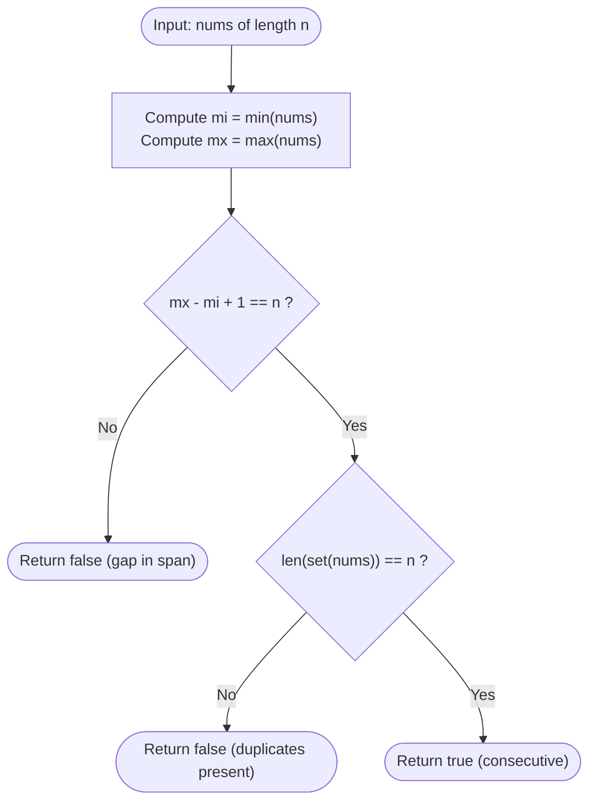

# Guided Example: Check if an Array Is Consecutive

We analyze and trace the set cardinality and extremal span algorithm for verifying whether an unsorted array contains a contiguous sequence of integers in $O(n)$ time and $O(n)$ auxiliary space.

- **Input:** `nums = [1, 3, 4, 2]`
- **Output:** `true`

This representative instance demonstrates the Pigeonhole Principle applied to bounded integer intervals, simultaneous min-max tracking, duplicate detection via hash sets, and span invariant validation.

---

## 1. Problem Overview & Representative Instance

Given an integer array `nums` of length $n$, we are tasked with determining whether `nums` is **consecutive**.

An array is defined as consecutive if and only if it contains every integer in the closed interval:
$$[\min(\text{nums}), \min(\text{nums}) + n - 1]$$
Each integer within this range must appear exactly once. The elements in the input array may appear in any arbitrary order.

### Representative Instance Breakdown

Consider `nums = [1, 3, 4, 2]` of length $n = 4$:
- Minimum value: $mi = \min(1, 3, 4, 2) = 1$.
- Maximum value: $mx = \max(1, 3, 4, 2) = 4$.
- Required consecutive interval:
  $$[mi, mi + n - 1] = [1, 1 + 4 - 1] = [1, 4] = \{1, 2, 3, 4\}$$
- Observed elements in `nums`: $\{1, 3, 4, 2\}$.
- The set of elements in `nums` matches the required range $\{1, 2, 3, 4\}$ precisely.

Output: `true`.

---

## 2. Mathematical & Algorithmic Principles

### Range-Cardinality Bounded Equivalence Theorem

Let $A$ be an array of length $n$. Let $mi = \min(A)$ and $mx = \max(A)$.

**Theorem:** The elements of $A$ form a permutation of consecutive integers if and only if:
1. $|\text{Set}(A)| = n$ (Injectivity: all elements in $A$ are distinct).
2. $mx - mi + 1 = n$ (Span condition: the bounding interval contains exactly $n$ integers).

**Proof:**
- **Necessity ($\implies$):**
  If $A$ contains every integer in $[mi, mi + n - 1]$ without omission, then $A$ contains exactly $n$ distinct values, so $|\text{Set}(A)| = n$. Furthermore, the maximum element is $mx = mi + n - 1$, which directly implies $mx - mi + 1 = n$.
- **Sufficiency ($\impliedby$):**
  Assume both conditions hold.
  Condition (2) states that the target range $[mi, mx]$ contains exactly $n$ integers.
  Condition (1) asserts that $A$ contains $n$ distinct elements.
  Since every element $x \in A$ satisfies $mi \le x \le mx$, the $n$ distinct elements of $A$ all reside within the range $[mi, mx]$ of size $n$.
  By the Pigeonhole Principle, every integer in $[mi, mx]$ must be occupied by exactly one element of $A$. Hence, $A$ contains all consecutive integers in that interval.

---

## 3. Step-by-Step Walkthrough with Intermediate State

We trace `nums = [1, 3, 4, 2]` ($n = 4$).

### Step 1: Input Dimensions & Boundary Scans
- Determine array length: $n = \text{len}(\text{nums}) = 4$.
- Compute minimum value:
  $$mi = \min([1, 3, 4, 2]) = 1$$
- Compute maximum value:
  $$mx = \max([1, 3, 4, 2]) = 4$$

---

### Step 2: Span Condition Check
- Calculate interval width:
  $$\text{span} = mx - mi + 1 = 4 - 1 + 1 = 4$$
- Compare with array length $n$:
  $$\text{span} == n \iff 4 == 4 \implies \text{True}$$
- The span constraint is satisfied.

---

### Step 3: Uniqueness & Set Cardinality Check
- Construct the set of unique values:
  $$\text{seen} = \{1, 3, 4, 2\}$$
- Cardinality of distinct elements:
  $$|\text{seen}| = 4$$
- Compare with array length $n$:
  $$|\text{seen}| == n \iff 4 == 4 \implies \text{True}$$
- All elements are distinct.

---

### Step 4: Chained Conjunction
Both conditions hold simultaneously:
$$|\text{Set}(\text{nums})| == (mx - mi + 1) == n \iff 4 == 4 == 4 \implies \text{True}$$
Final return value: `true`.

---

## 4. Comprehensive State Trace

### Step-by-Step Extremal and Set Ingestion

| Step $i$ | Element $\text{nums}[i]$ | Running Minimum $mi$ | Running Maximum $mx$ | Distinct Set Elements $\text{seen}$ | Set Size $|\text{seen}|$ |
|---|---|---|---|---|---|
| Initial | - | $\infty$ | $-\infty$ | $\emptyset$ | 0 |
| 0 | 1 | 1 | 1 | $\{1\}$ | 1 |
| 1 | 3 | 1 | 3 | $\{1, 3\}$ | 2 |
| 2 | 4 | 1 | 4 | $\{1, 3, 4\}$ | 3 |
| 3 | 2 | 1 | 4 | $\{1, 2, 3, 4\}$ | 4 |

### Comparative Verification Across Characteristic Scenarios

| Test Array `nums` | Length $n$ | $mi$ | $mx$ | Span $mx - mi + 1$ | Set Size $|\text{seen}|$ | Predicate Conjunction | Evaluation |
|---|---|---|---|---|---|---|---|
| `[1, 3, 4, 2]` | 4 | 1 | 4 | $4 - 1 + 1 = 4$ | 4 | $4 == 4 == 4$ | **True** (Valid consecutive) |
| `[1, 2, 2, 4]` | 4 | 1 | 4 | $4 - 1 + 1 = 4$ | 3 | $3 \ne 4$ | **False** (Duplicate masks gap) |
| `[1, 3, 5]` | 3 | 1 | 5 | $5 - 1 + 1 = 5$ | 3 | $5 \ne 3$ | **False** (Span too wide) |
| `[7]` | 1 | 7 | 7 | $7 - 7 + 1 = 1$ | 1 | $1 == 1 == 1$ | **True** (Trivially consecutive) |
| `[-2, 0, -1, 1]` | 4 | -2 | 1 | $1 - (-2) + 1 = 4$ | 4 | $4 == 4 == 4$ | **True** (Negative range) |

---

## 5. Algorithmic Correctness & Soundness

### Decoupling Span from Uniqueness

Neither condition alone is sufficient:
1. **Span without Uniqueness Fails:**
   Consider `nums = [1, 2, 2, 4]`.
   $mi = 1, mx = 4 \implies mx - mi + 1 = 4 = n$.
   The span appears valid, but $3$ is missing and $2$ is duplicated. Checking $|\text{Set}(A)| = n$ immediately flags the duplicate.
2. **Uniqueness without Span Fails:**
   Consider `nums = [1, 3, 5]`.
   $|\text{Set}(A)| = 3 = n$.
   All elements are unique, but $mx - mi + 1 = 5 - 1 + 1 = 5 \ne 3$. Checking the span immediately exposes the internal missing values.

Because both conditions are tested simultaneously, any missing value or duplicate is guaranteed to violate at least one of the two equality checks.

---

## 6. Edge Cases & Anti-Patterns

### Boundary Scenarios

1. **Single-Element Array ($n = 1$):**
   - E.g., `nums = [42]`. $mi = 42, mx = 42$.
   - $mx - mi + 1 = 1 = n$ and $|\text{Set}| = 1 = n$. Correctly returns `true`.
2. **Negative Numbers:**
   - E.g., `nums = [-3, -1, -2]`. $mi = -3, mx = -1$.
   - Span: $-1 - (-3) + 1 = 3 = n$. Set size $= 3$. Correctly returns `true`.
3. **Array with Disconnected Components:**
   - E.g., `nums = [10, 20, 30]`. $mx - mi + 1 = 21 \ne 3$. Fails span check.

### Common Anti-Patterns

- **Sorting-Based Approach ($O(n \log n)$):**
  Sorting the array and checking whether $\text{nums}[i+1] == \text{nums}[i] + 1$ achieves the same goal, but requires $O(n \log n)$ time. The dual-condition set approach achieves optimal $O(n)$ time.
- **Sum Verification Shortcut ($\sum A == \frac{n(mi + mx)}{2}$):**
  Relying solely on arithmetic sum is flawed: e.g., `[1, 2, 5, 6]` has sum $14$, while `[2, 3, 4, 5]` also has sum $14$, but the former is non-consecutive. Arithmetic sums cannot replace explicit set uniqueness.

---

## 7. Complexity Analysis

### Time Complexity

- **Extremal Scan:** Computing $\min(\text{nums})$ and $\max(\text{nums})$ requires one linear scan: $O(n)$ comparisons.
- **Set Construction:** Inserting $n$ elements into a hash set takes $O(1)$ amortized time per element: $O(n)$ time.
- **Comparison:** Scalar comparisons take $O(1)$ operations.
- **Total Time Complexity:** Strictly $O(n)$ time.

### Auxiliary Space Complexity

- **Hash Set:** The set stores at most $n$ distinct integer keys.
- **Scalars:** Integer variables `mi`, `mx`, and length $n$ take $O(1)$ memory.
- **Total Auxiliary Space Complexity:** $O(n)$ auxiliary space.
