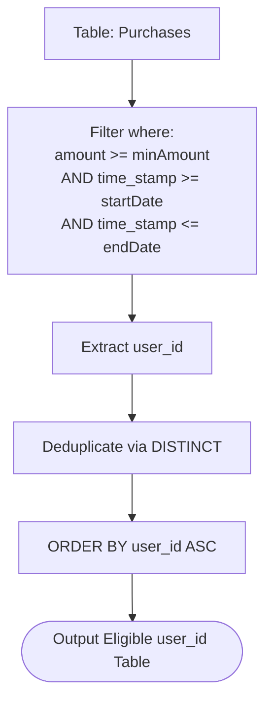

# Guided Example: The Users That Are Eligible for Discount

We analyze and trace the parameterized relational filter query that identifies distinct customer accounts satisfying temporal interval and minimum spend criteria in $O(n)$ scan time and $O(u)$ auxiliary space.

- **Input:** `Purchases` table with transactions across users 1, 2, and 3; parameters `startDate = "2022-03-08"`, `endDate = "2022-03-20"`, `minAmount = 1000`.
- **Output:** `user_id` list `[3]`

This representative instance demonstrates multi-attribute predicate conjunction, timestamp range boundary validation, single-transaction threshold enforcement (contrasted with cumulative aggregation), and distinct entity projection.

---

## 1. Problem Overview & Representative Instance

We are given a relational database table `Purchases`:
- `user_id` (integer): Identifier for the customer making the purchase.
- `time_stamp` (datetime): The timestamp when the transaction occurred.
- `amount` (integer): The monetary value of the purchase transaction.

We are implementing a stored function or procedure taking three parameters:
- `startDate` (date): The inclusive start of the promotional window.
- `endDate` (date): The inclusive end of the promotional window.
- `minAmount` (integer): The minimum purchase amount required on a single transaction.

A user is eligible for a discount if they have completed **at least one purchase** that simultaneously satisfies:
1. `amount >= minAmount`
2. `time_stamp >= startDate`
3. `time_stamp <= endDate`

The query must return distinct `user_id` values sorted in ascending order.

### Representative Instance Breakdown

Consider the parameters:
$$\text{startDate} = \text{"2022-03-08 00:00:00"}, \quad \text{endDate} = \text{"2022-03-20 00:00:00"}, \quad \text{minAmount} = 1000$$

Evaluating the rows in `Purchases`:
- **Row 1:** `user_id = 1`, `time_stamp = "2022-04-20 09:03:00"`, `amount = 4416`.
  - Amount: $4416 \ge 1000$ (Satisfied).
  - Time: April 20 is after March 20 (Violated).
  - Ineligible.
- **Row 2:** `user_id = 2`, `time_stamp = "2022-03-19 19:24:02"`, `amount = 678`.
  - Time: March 19 falls within March 8 to March 20 (Satisfied).
  - Amount: $678 < 1000$ (Violated).
  - Ineligible.
- **Row 3:** `user_id = 3`, `time_stamp = "2022-03-18 12:03:09"`, `amount = 4523`.
  - Time: March 18 falls within March 8 to March 20 (Satisfied).
  - Amount: $4523 \ge 1000$ (Satisfied).
  - **Eligible!** User 3 qualifies.
- **Row 4:** `user_id = 3`, `time_stamp = "2022-03-30 09:43:42"`, `amount = 626`.
  - Time: March 30 is after March 20 (Violated).
  - Amount: $626 < 1000$ (Violated).
  - Ineligible.

Distinct eligible users: `[3]`.

---

## 2. Mathematical & Algorithmic Principles

### Conjunctive Filter Formulation

For a purchase record $r \in \text{Purchases}$, the eligibility indicator function is a Boolean conjunction of three atomic predicates:
$$\Phi(r) = (r.\text{amount} \ge \text{minAmount}) \land (r.\text{time\_stamp} \ge \text{startDate}) \land (r.\text{time\_stamp} \le \text{endDate})$$

The relational algebra expression for the result is:
$$\text{Result} = \tau_{\text{user\_id} \uparrow} \left( \pi_{\text{user\_id}} \left( \sigma_{\Phi(r)} (\text{Purchases}) \right) \right)$$
where:
- $\sigma_{\Phi(r)}$ filters individual records meeting all three constraints.
- $\pi_{\text{user\_id}}$ projects only the customer identifier column.
- Relational deduplication (`DISTINCT`) collapses multiple qualifying purchases per customer into a single identifier.
- $\tau_{\text{user\_id} \uparrow}$ sorts the unique keys in ascending numerical order.

---

## 3. Step-by-Step Walkthrough with Intermediate State

We trace the query execution on the 4-row dataset.
Parameters: $\text{startDate} = \text{"2022-03-08"}$, $\text{endDate} = \text{"2022-03-20"}$, $\text{minAmount} = 1000$.

### Phase 1: Record-Level Predicate Evaluation

1. **Row 1: User 1**
   - Record: `(user_id: 1, time_stamp: "2022-04-20 09:03:00", amount: 4416)`
   - Predicate 1 (Amount): $4416 \ge 1000 \implies$ True.
   - Predicate 2 (Start Bound): $\text{"2022-04-20"} \ge \text{"2022-03-08"} \implies$ True.
   - Predicate 3 (End Bound): $\text{"2022-04-20"} \le \text{"2022-03-20"} \implies$ False.
   - Conjunction: $\text{True} \land \text{True} \land \text{False} = \text{False}$.
   - Disposition: Dropped.

2. **Row 2: User 2**
   - Record: `(user_id: 2, time_stamp: "2022-03-19 19:24:02", amount: 678)`
   - Predicate 1 (Amount): $678 \ge 1000 \implies$ False.
   - Conjunction: Short-circuits to False.
   - Disposition: Dropped.

3. **Row 3: User 3 (Transaction 1)**
   - Record: `(user_id: 3, time_stamp: "2022-03-18 12:03:09", amount: 4523)`
   - Predicate 1 (Amount): $4523 \ge 1000 \implies$ True.
   - Predicate 2 (Start Bound): $\text{"2022-03-18"} \ge \text{"2022-03-08"} \implies$ True.
   - Predicate 3 (End Bound): $\text{"2022-03-18"} \le \text{"2022-03-20"} \implies$ True.
   - Conjunction: $\text{True} \land \text{True} \land \text{True} = \text{True}$.
   - Disposition: Retained. Projected candidate: `user_id = 3`.

4. **Row 4: User 3 (Transaction 2)**
   - Record: `(user_id: 3, time_stamp: "2022-03-30 09:43:42", amount: 626)`
   - Predicate 1 (Amount): $626 \ge 1000 \implies$ False.
   - Conjunction: Evaluates to False.
   - Disposition: Dropped.

---

### Phase 2: Deduplication and Sorting

- Candidates passing filter: `[3]`.
- Distinct deduplication: $\{3\}$.
- Ascending sort: `[3]`.
- Output table:
  `user_id: 3`

---

## 4. Comprehensive State Trace

### Record Evaluation Matrix

| Row | `user_id` | `time_stamp` | `amount` | `amount >= 1000` | Temporal Window Valid? | Conjunction $\Phi(r)$ | Disposition |
|---|---|---|---|---|---|---|---|
| 1 | 1 | 2022-04-20 09:03:00 | 4416 | True | False (after end date) | False | Discarded |
| 2 | 2 | 2022-03-19 19:24:02 | 678 | False | True | False | Discarded |
| 3 | 3 | 2022-03-18 12:03:09 | 4523 | True | True | **True** | **Accepted** |
| 4 | 3 | 2022-03-30 09:43:42 | 626 | False | False (after end date) | False | Discarded |

### Final User Grouping & Distinct Projection

| `user_id` | Total Transactions | Transactions Meeting All Criteria | Eligible for Discount? | Included in Output |
|---|---|---|---|---|
| 1 | 1 | 0 | No | No |
| 2 | 1 | 0 | No | No |
| 3 | 2 | 1 (Row 3) | **Yes** | **Yes (Row 1)** |

---

## 5. Algorithmic Correctness & Soundness

### Independence of Transactions

The discount qualification rule is defined on individual purchases rather than aggregated spending.
- If a user performs multiple small transactions inside the date window that sum to over `minAmount`, but no individual purchase reaches `minAmount`, the user is not eligible.
- Conversely, a single transaction with `amount >= minAmount` occurring between `startDate` and `endDate` is both necessary and sufficient to grant eligibility.
- Because the `WHERE` clause applies row-level filtering without grouping, every transaction is tested independently, guaranteeing adherence to the single-transaction threshold semantic.
- The `DISTINCT` operator ensures that if a user has multiple qualifying purchases within the window, their `user_id` is output exactly once.

---

## 6. Edge Cases & Anti-Patterns

### Boundary Scenarios

1. **Exact Boundary Dates:**
   - A purchase occurring at `startDate` or `endDate` satisfies the condition because comparisons are inclusive ($\ge$ and $\le$).
2. **Exact Boundary Amount:**
   - A purchase with `amount == minAmount` satisfies `amount >= minAmount`.
3. **No Qualifying Purchases:**
   - If no purchases satisfy all criteria, the query returns an empty result table with the `user_id` schema.
4. **Users with Multiple Qualifying Purchases:**
   - E.g., User 3 has two purchases of 5000 units in the window. `DISTINCT` prevents multiple duplicate output rows for User 3.

### Common Anti-Patterns

- **Aggregating Amounts via `SUM(amount)` with `GROUP BY`:**
  A common mistake is grouping by `user_id` and requiring `SUM(amount) >= minAmount`. This erroneously qualifies users who made several minor purchases below the single-transaction threshold.
- **Strict Inequality on Date Ranges:**
  Using `>` or `<` instead of `>=` and `<=` excludes purchases made on the boundary days.

---

## 7. Complexity Analysis

### Time Complexity

- **Table Scan & Filtering:** Scanning $n$ rows in `Purchases` and evaluating three comparison operations per row takes $O(n)$ time. If an index on `(time_stamp, amount)` or `(amount, time_stamp)` exists, candidate retrieval takes $O(\log n + k)$ time where $k$ is the number of matching rows.
- **Deduplication and Sorting:** Deduplicating and sorting the $k$ qualifying rows takes $O(k \log k)$ time, bounded by $O(n \log n)$ in the worst case.
- **Total Time Complexity:** $O(n \log n)$ time worst case, $O(n)$ expected with hash deduplication.

### Auxiliary Space Complexity

- **Hash / Sort Buffer:** The query engine allocates memory to store the distinct qualifying `user_id` values: $O(u)$ space where $u \le n$ is the number of distinct eligible users.
- **Total Auxiliary Space Complexity:** $O(u)$ space.
