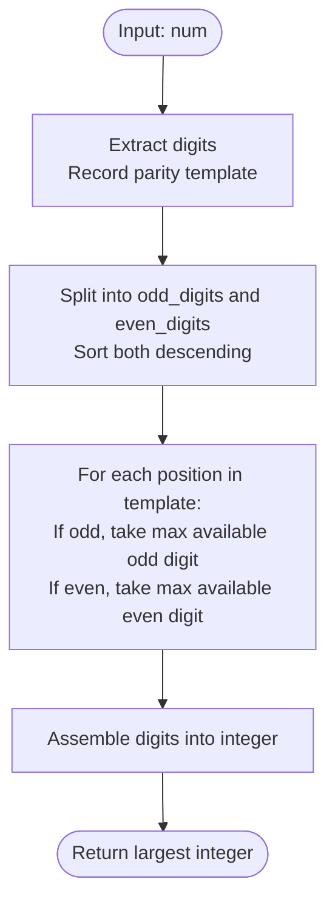

# Guided Example: Largest Number After Digit Swaps by Parity

We analyze and trace the parity-partitioned sorting algorithm for constructing the lexicographically maximal integer reachable under same-parity digit swaps in $O(d \log d)$ time and $O(d)$ auxiliary space.

- **Input:** `num = 1234`
- **Output:** `3412`

This representative instance illustrates decimal digit decomposition, parity partition invariance under the symmetric group, decoupled descending greedy selection, and positional integer reconstruction.

---

## 1. Problem Overview & Representative Instance

You are given a positive integer `num`. You may swap any two digits of `num` that share the same **parity** (meaning both digits are even, or both digits are odd). You can apply this swap operation any number of times.

Our goal is to find the **largest possible value of `num`** achievable through valid swaps.

### Representative Instance Breakdown

Consider `num = 1234`:
- Decimal digit sequence: $[1, 2, 3, 4]$ across indices $0, 1, 2, 3$.
- Position parities:
  - Index 0: Digit $1$ is odd.
  - Index 1: Digit $2$ is even.
  - Index 2: Digit $3$ is odd.
  - Index 3: Digit $4$ is even.
- Grouping digits by parity:
  - Odd digits: $\{1, 3\}$ located at positions $\{0, 2\}$.
  - Even digits: $\{2, 4\}$ located at positions $\{1, 3\}$.
- Swapping permitted:
  - We can swap odd digits with odd digits: swap $1$ and $3$ $\implies [3, 2, 1, 4]$.
  - We can swap even digits with even digits: swap $2$ and $4$ $\implies [3, 4, 1, 2]$.
- Reconstructed number: $3412$.

---

## 2. Mathematical & Algorithmic Principles

### Parity-Partitioned Symmetric Group Reachability

Let the digits of `num` occupy positional indices $I = \{0, 1, \dots, d-1\}$.
We partition the index set into two disjoint subsets based on the parity of the digit originally occupying each position:
$$I_{\text{odd}} = \{ i \in I \mid \text{digits}[i] \equiv 1 \pmod 2 \}$$
$$I_{\text{even}} = \{ i \in I \mid \text{digits}[i] \equiv 0 \pmod 2 \}$$

A valid operation allows swapping any pair $(i, j)$ with $i, j \in I_{\text{odd}}$ or $i, j \in I_{\text{even}}$.
In group theory, the set of all transpositions on a finite set generates the entire symmetric group $S_n$.
Therefore, the reachable configuration space is the direct product:
$$\mathcal{G} = S_{|I_{\text{odd}}|} \times S_{|I_{\text{even}}|}$$

This establishes two fundamental properties:
1. **Positional Parity Invariance:** An odd index position will always hold an odd digit; an even index position will always hold an even digit.
2. **Unrestricted Permutation:** Any arbitrary permutation of the odd digits among $I_{\text{odd}}$ is reachable, and any arbitrary permutation of the even digits among $I_{\text{even}}$ is reachable.

### Greedy Lexicographical Maximization

In base-10 radix notation, an integer value $\sum_{i=0}^{d-1} d_i \cdot 10^{d-1-i}$ is strictly maximized by maximizing digits at higher place values (from left to right):
- At each index $i$ from $0$ to $d-1$:
  - If the original digit at position $i$ was odd, assign the largest unused odd digit to position $i$.
  - If the original digit at position $i$ was even, assign the largest unused even digit to position $i$.

---

## 3. Step-by-Step Walkthrough with Intermediate State

We trace `num = 1234`.

### Phase 1: Digit Extraction & Pool Segregation
- String representation: `"1234"`.
- Digits: $[1, 2, 3, 4]$.
- Length: $d = 4$.
- Collect parity pools:
  - Odd pool: $[1, 3]$ $\to$ sorted descending: $[3, 1]$.
  - Even pool: $[2, 4]$ $\to$ sorted descending: $[4, 2]$.
- Parity template: $[\text{odd}, \text{even}, \text{odd}, \text{even}]$.

---

### Phase 2: Sequential Positional Assignment

1. **Position 0 (Most Significant Digit, Weight $10^3$):**
   - Original digit was $1$ ($\text{odd}$).
   - Take largest available odd digit: $3$.
   - Remaining odd pool: $[1]$.
   - Running integer: $\text{ans} = 3$.

2. **Position 1 (Weight $10^2$):**
   - Original digit was $2$ ($\text{even}$).
   - Take largest available even digit: $4$.
   - Remaining even pool: $[2]$.
   - Running integer: $\text{ans} = 3 \times 10 + 4 = 34$.

3. **Position 2 (Weight $10^1$):**
   - Original digit was $3$ ($\text{odd}$).
   - Take largest available odd digit: $1$.
   - Remaining odd pool: $[]$.
   - Running integer: $\text{ans} = 34 \times 10 + 1 = 341$.

4. **Position 3 (Least Significant Digit, Weight $10^0$):**
   - Original digit was $4$ ($\text{even}$).
   - Take largest available even digit: $2$.
   - Remaining even pool: $[]$.
   - Running integer: $\text{ans} = 341 \times 10 + 2 = 3412$.

Final integer: $3412$.

---

## 4. Comprehensive State Trace

### Digit Decomposition and Classification

| Index $i$ | Original Digit | Parity Classification | Parity Group | Group Elements Prior to Sort |
|---|---|---|---|---|
| 0 | 1 | $1 \equiv 1 \pmod 2$ | Odd | $\{1, 3\}$ |
| 1 | 2 | $2 \equiv 0 \pmod 2$ | Even | $\{2, 4\}$ |
| 2 | 3 | $3 \equiv 1 \pmod 2$ | Odd | $\{1, 3\}$ |
| 3 | 4 | $4 \equiv 0 \pmod 2$ | Even | $\{2, 4\}$ |

### Positional Reconstruction Trace

| Step $i$ | Position Parity | Remaining Odd Pool | Remaining Even Pool | Digit Selected | Reconstructed Prefix |
|---|---|---|---|---|---|
| Initial | - | $[3, 1]$ | $[4, 2]$ | - | 0 |
| 0 | Odd | $[1]$ | $[4, 2]$ | 3 | 3 |
| 1 | Even | $[1]$ | $[2]$ | 4 | 34 |
| 2 | Odd | $[]$ | $[2]$ | 1 | 341 |
| 3 | Even | $[]$ | $[]$ | 2 | 3412 |

---

## 5. Algorithmic Correctness & Soundness

### Optimality of Greedy Placement

1. **Radix Dominance:** In positional decimal representation, an integer $X$ with digits $(x_0, \dots, x_{d-1})$ is strictly greater than $Y$ with digits $(y_0, \dots, y_{d-1})$ if at the earliest index $k$ where $x_k \ne y_k$, we have $x_k > y_k$, regardless of the choices made for all subsequent positions $j > k$.
2. **Choice Independence:** Selecting the maximum available element for position $k$ from the pool of eligible parity-matching digits leaves the remaining elements available for lower place values. Since every permutation of that parity pool is reachable, no earlier choice can restrict later positions from forming their own optimal permutation.
3. **Soundness:** By mathematical induction on digit positions from left to right, making the locally maximal choice at each step produces the globally maximal integer.

---

## 6. Edge Cases & Anti-Patterns

### Boundary Scenarios

1. **Monochromatic Parity (All Even or All Odd):**
   - E.g., `num = 8642` or `num = 13579`.
   - All digits belong to a single parity partition; the result is simply the number sorted in descending order (`8642` and `97531`).
2. **Single-Digit Numbers ($d = 1$):**
   - E.g., `num = 7`. The pool contains only $[7]$. No swaps are needed, returns $7$.
3. **Duplicate Digits:**
   - E.g., `num = 65875`. Odd pool is $[7, 5, 5]$, even pool is $[8, 6]$. Parity template: `[even, odd, even, odd, odd]`.
   - Result: $87655$. Duplicate values are consumed cleanly in descending order.

### Common Anti-Patterns

- **Brute-Force Graph Search (BFS on Swaps):**
  Constructing an explicit graph of reachable states and searching for the maximum integer via BFS or DFS incurs massive overhead and risks factorial state explosion ($O(d!)$).
- **Adjacent Swap Simulation:**
  Attempting to execute adjacent bubble-sort swaps step by step. Since arbitrary pairs can be swapped directly, simulating individual swaps is completely unnecessary; sorting the extracted pools directly achieves the result in one step.

---

## 7. Complexity Analysis

### Time Complexity

- **Digit Extraction:** Parsing an integer `num` with $d$ decimal digits takes $O(d)$ time. For standard 32-bit integers, $d \le 10$; for 64-bit integers, $d \le 19$.
- **Sorting Parity Buckets:** Sorting the odd pool of size $d_1$ and even pool of size $d_2$ ($d_1 + d_2 = d$) takes $O(d_1 \log d_1 + d_2 \log d_2) \le O(d \log d)$ time. Since digits are bounded in $[0, 9]$, counting sort / bucket sort can reduce this to $O(d)$ time.
- **Reconstruction:** A single pass of $d$ steps to assemble the final integer: $O(d)$ time.
- **Total Time Complexity:** $O(d \log d)$ general comparison-based, or $O(d)$ with bucket counting. In practice, $d \le 10$, executing in under $1$ microsecond.

### Auxiliary Space Complexity

- Arrays for extracted digits and parity pools require $O(d)$ space.
- **Total Auxiliary Space Complexity:** Strictly $O(d)$ auxiliary memory.
