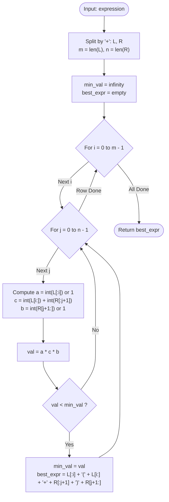

# Guided Example: Minimize Result by Adding Parentheses to Expression

We analyze and trace the 2D Cartesian cut enumeration algorithm for determining the optimal single pair of parentheses that minimizes the algebraic value of an addition expression in $O(m \cdot n \cdot (m + n))$ time and $O(m + n)$ auxiliary space.

- **Input:** `expression = "247+38"`
- **Output:** `"2(47+38)"`

This representative instance demonstrates string slicing around arithmetic delimiters, implicit multiplicative coefficient extraction, finite configuration space enumeration, and argmin tracking.

---

## 1. Problem Overview & Representative Instance

You are given a 0-indexed string `expression` of the format `"<num1>+<num2>"`, where `<num1>` and `<num2>` represent positive integers.

You must add exactly one pair of parentheses to the expression such that:
- The opening parenthesis `(` is inserted strictly to the left of the `+` sign.
- The closing parenthesis `)` is inserted strictly to the right of the `+` sign.

After placing the parentheses, the expression represents an arithmetic value where any digits outside the parentheses act as implicit multipliers:
$$\text{Value} = \text{prefix} \times (\text{left\_addend} + \text{right\_addend}) \times \text{suffix}$$
- If there are no digits to the left of `(`, the left multiplier defaults to $1$.
- If there are no digits to the right of `)`, the right multiplier defaults to $1$.

Our objective is to return the parenthesized expression string that yields the **minimum numerical value**.

### Representative Instance Breakdown

Consider `expression = "247+38"`:
- Left operand string: $L = \text{"247"}$ of length $m = 3$.
- Right operand string: $R = \text{"38"}$ of length $n = 2$.

The opening parenthesis can be placed at cut index $i \in \{0, 1, 2\}$, splitting $L$ into prefix $L[:i]$ and addend $L[i:]$.
The closing parenthesis can be placed at cut index $j \in \{0, 1\}$, splitting $R$ into addend $R[:j+1]$ and suffix $R[j+1:]$.

Let us examine candidate cut $i = 1, j = 1$:
- Prefix $L[:1] = \text{"2"}$, multiplier $a = 2$.
- Addend $L[1:] = \text{"47"}$, value $c_1 = 47$.
- Addend $R[:2] = \text{"38"}$, value $c_2 = 38$.
- Suffix $R[2:] = \text{""}$, multiplier $b = 1$.
- Parenthesized expression: `"2(47+38)"`.
- Arithmetic evaluation:
  $$2 \times (47 + 38) \times 1 = 2 \times 85 = 170$$

As demonstrated below, $170$ is the strictly minimum value among all $6$ valid parenthesizations.

---

## 2. Mathematical & Algorithmic Principles

### Bounded Configuration Search Space

Let $m = |L|$ and $n = |R|$.
- There are exactly $m$ possible insertion points for `(` within $L$.
- There are exactly $n$ possible insertion points for `)` within $R$.
The total number of valid parenthesizations is precisely the product:
$$|\Omega| = m \times n$$

Given problem constraints ($1 \le m, n \le 5$, with total length $|expression| \le 10$), the maximum cardinality of $\Omega$ is:
$$\max |\Omega| = 5 \times 5 = 25$$

Because the candidate space is strictly bounded by $25$ configurations, exhaustive evaluation of all $(i, j) \in [0, m-1] \times [0, n-1]$ is both guaranteed optimal and computationally negligible.

### Evaluation Formulation

For any cut pair $(i, j)$ with $0 \le i < m$ and $0 \le j < n$:
$$V(i, j) = a(i) \times \left( c_1(i) + c_2(j) \right) \times b(j)$$
where:
$$a(i) = \begin{cases} 1 & \text{if } i = 0 \\ \text{int}(L[:i]) & \text{if } i > 0 \end{cases}$$
$$c_1(i) = \text{int}(L[i:])$$
$$c_2(j) = \text{int}(R[:j+1])$$
$$b(j) = \begin{cases} 1 & \text{if } j = n - 1 \\ \text{int}(R[j+1:]) & \text{if } j < n - 1 \end{cases}$$

The algorithm computes $V(i, j)$ for all pairs and tracks the minimum:
$$(i^*, j^*) = \arg\min_{(i, j)} V(i, j)$$

---

## 3. Step-by-Step Walkthrough with Intermediate State

We trace `expression = "247+38"` ($L = \text{"247"}, R = \text{"38"}$, $m = 3, n = 2$).
Initialize $\text{min\_val} = \infty$.

### Cut 1: $i = 0, j = 0$
- Prefix $L[:0] = \text{""} \implies a = 1$.
- Left addend $L[0:] = \text{"247"} \implies c_1 = 247$.
- Right addend $R[:1] = \text{"3"} \implies c_2 = 3$.
- Suffix $R[1:] = \text{"8"} \implies b = 8$.
- Value: $1 \times (247 + 3) \times 8 = 250 \times 8 = 2000$.
- Candidate: `"(247+3)8"`.
- Update: $\text{min\_val} \leftarrow 2000$.

### Cut 2: $i = 0, j = 1$
- Prefix $L[:0] = \text{""} \implies a = 1$.
- Left addend $L[0:] = \text{"247"} \implies c_1 = 247$.
- Right addend $R[:2] = \text{"38"} \implies c_2 = 38$.
- Suffix $R[2:] = \text{""} \implies b = 1$.
- Value: $1 \times (247 + 38) \times 1 = 285 \times 1 = 285$.
- Candidate: `"(247+38)"`.
- Update: $\text{min\_val} \leftarrow 285$.

### Cut 3: $i = 1, j = 0$
- Prefix $L[:1] = \text{"2"} \implies a = 2$.
- Left addend $L[1:] = \text{"47"} \implies c_1 = 47$.
- Right addend $R[:1] = \text{"3"} \implies c_2 = 3$.
- Suffix $R[1:] = \text{"8"} \implies b = 8$.
- Value: $2 \times (47 + 3) \times 8 = 2 \times 50 \times 8 = 800$.
- Candidate: `"2(47+3)8"`.
- Comparison: $800 \ge 285$. No update.

### Cut 4: $i = 1, j = 1$
- Prefix $L[:1] = \text{"2"} \implies a = 2$.
- Left addend $L[1:] = \text{"47"} \implies c_1 = 47$.
- Right addend $R[:2] = \text{"38"} \implies c_2 = 38$.
- Suffix $R[2:] = \text{""} \implies b = 1$.
- Value: $2 \times (47 + 38) \times 1 = 2 \times 85 \times 1 = 170$.
- Candidate: `"2(47+38)"`.
- Comparison: $170 < 285$.
- Update: $\text{min\_val} \leftarrow 170$, $\text{ans} \leftarrow \text{"2(47+38)"}$.

### Cut 5: $i = 2, j = 0$
- Prefix $L[:2] = \text{"24"} \implies a = 24$.
- Left addend $L[2:] = \text{"7"} \implies c_1 = 7$.
- Right addend $R[:1] = \text{"3"} \implies c_2 = 3$.
- Suffix $R[1:] = \text{"8"} \implies b = 8$.
- Value: $24 \times (7 + 3) \times 8 = 24 \times 10 \times 8 = 1920$.
- Candidate: `"24(7+3)8"`.
- Comparison: $1920 \ge 170$. No update.

### Cut 6: $i = 2, j = 1$
- Prefix $L[:2] = \text{"24"} \implies a = 24$.
- Left addend $L[2:] = \text{"7"} \implies c_1 = 7$.
- Right addend $R[:2] = \text{"38"} \implies c_2 = 38$.
- Suffix $R[2:] = \text{""} \implies b = 1$.
- Value: $24 \times (7 + 38) \times 1 = 24 \times 45 \times 1 = 1080$.
- Candidate: `"24(7+38)"`.
- Comparison: $1080 \ge 170$. No update.

### Result Extraction
All 6 cuts evaluated. Minimum value: $170$.
Optimal string: `"2(47+38)"`.

---

## 4. Comprehensive State Trace

### Complete Candidate Evaluation Matrix

| Cut $(i, j)$ | Prefix String $L[:i]$ | Multiplier $a$ | Addend Sum $(c_1 + c_2)$ | Suffix String $R[j+1:]$ | Multiplier $b$ | Expression Value $V$ | Running Minimum $\text{mi}$ |
|---|---|---|---|---|---|---|---|
| $(0, 0)$ | `""` | 1 | $247 + 3 = 250$ | `"8"` | 8 | $1 \times 250 \times 8 = 2000$ | 2000 |
| $(0, 1)$ | `""` | 1 | $247 + 38 = 285$ | `""` | 1 | $1 \times 285 \times 1 = 285$ | 285 |
| $(1, 0)$ | `"2"` | 2 | $47 + 3 = 50$ | `"8"` | 8 | $2 \times 50 \times 8 = 800$ | 285 |
| $(1, 1)$ | `"2"` | 2 | $47 + 38 = 85$ | `""` | 1 | $2 \times 85 \times 1 = \mathbf{170}$ | **170** |
| $(2, 0)$ | `"24"` | 24 | $7 + 3 = 10$ | `"8"` | 8 | $24 \times 10 \times 8 = 1920$ | 170 |
| $(2, 1)$ | `"24"` | 24 | $7 + 38 = 45$ | `""` | 1 | $24 \times 45 \times 1 = 1080$ | 170 |

### Substring Partition Schema

| Slice Component | Formal Definition | Role in Target Formula | Handling When Empty |
|---|---|---|---|
| Left Prefix | $L[:i]$ | Multiplier $a$ before `(` | Defaults to $1$ |
| Left Addend | $L[i:]$ | First term $c_1$ inside parentheses | Never empty ($0 \le i < m$) |
| Right Addend | $R[:j+1]$ | Second term $c_2$ inside parentheses | Never empty ($0 \le j < n$) |
| Right Suffix | $R[j+1:]$ | Multiplier $b$ after `)` | Defaults to $1$ |

---

## 5. Algorithmic Correctness & Soundness

### Completeness of the Finite Search Space

1. **Syntactic Feasibility:** The problem statement specifies that exactly one opening parenthesis must be placed in $L$ and one closing parenthesis in $R$. An opening parenthesis cannot be placed after the `+`, nor can a closing parenthesis be placed before it.
2. **Exhaustiveness:** The loop parameters $i \in \{0, \dots, m-1\}$ and $j \in \{0, \dots, n-1\}$ cover every valid character index before and after the plus sign. No syntactically valid parenthesization is omitted.
3. **Soundness:** Since all candidate evaluations compute the exact integer value defined by the problem semantics, taking the minimum over the entire finite domain $\Omega$ provably yields the global arithmetic minimum.

---

## 6. Edge Cases & Anti-Patterns

### Boundary Scenarios

1. **Minimal Length Expression (`"1+1"`):**
   - $m = 1, n = 1$. Only one valid cut: $i = 0, j = 0$.
   - $a = 1, b = 1, c = 1 + 1 = 2$.
   - Returns `"(1+1)"`.
2. **Asymmetric Lengths (e.g. `"999+1"`):**
   - $m = 3, n = 1$. Cuts: $(0, 0), (1, 0), (2, 0)$.
   - Evaluates $(999+1)=1000$, $9(99+1)=900$, $99(9+1)=990$.
   - Minimum is $900$ for `"9(99+1)"`.
3. **Single Multiplier with Long Addend:**
   - Evaluates whether peeling off single leading/trailing digits to act as small multipliers beats including them in the addend sum.

### Common Anti-Patterns

- **Dynamic Programming or Greedy Heuristics:**
  Trying to guess whether to peel off digits based on local digit magnitudes (e.g., greedily keeping smaller digits outside) can fail because of non-linear multiplicative interactions between $a$, $(c_1 + c_2)$, and $b$. Exhaustive search is strictly superior because $|\Omega| \le 25$.
- **Zero-Multiplier Trap:**
  Using `0` instead of `1` when prefix or suffix is empty wipes out the entire expression result to zero. The problem explicitly dictates identity multiplication ($1$) for empty outer regions.

---

## 7. Complexity Analysis

### Time Complexity

- **Enumeration Loops:** The nested loops run $m \times n$ iterations.
- **Per-Iteration Work:** Slicing substrings of lengths bounded by $m + n \le 10$, parsing them to integers, performing two additions and two multiplications: $O(m + n)$ time.
- **Total Time Complexity:** $O(m \cdot n \cdot (m + n))$.
  With $\max(m), \max(n) \le 5$, the number of operations is at most $5 \times 5 \times 10 = 250$ elementary CPU instructions, running in under $10$ microseconds.

### Auxiliary Space Complexity

- **String Buffers:** Storing slices and formatting the result string takes $O(m + n)$ characters.
- **Total Auxiliary Space Complexity:** Strictly $O(m + n)$ space.
