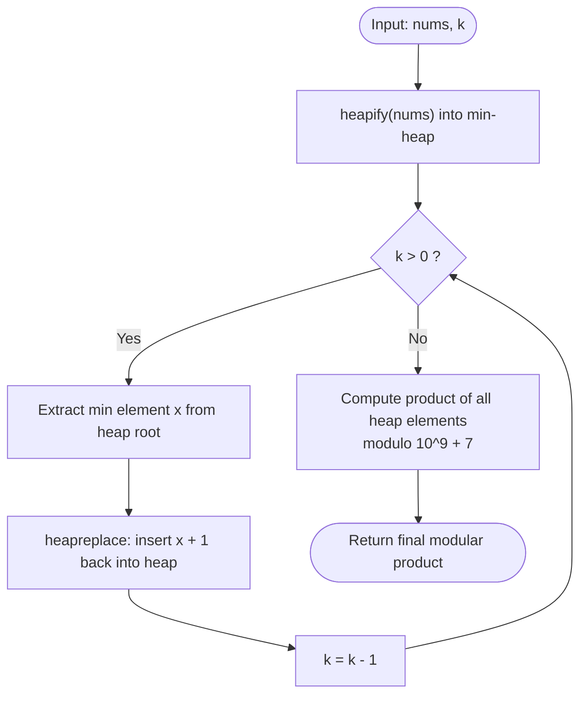

# Guided Example: Maximum Product After K Increments

We analyze and trace the greedy min-heap priority queue algorithm for maximizing the total product of an array under $k$ unit increments in $O(n + k \log n)$ time and $O(n)$ auxiliary space.

- **Input:** `nums = [6, 3, 3, 2]`, `k = 2`
- **Output:** `216`

This representative instance demonstrates the marginal gain property of product maximization, min-heap water-filling dynamics, greedy exchange arguments, and late-stage modular reduction.

---

## 1. Problem Overview & Representative Instance

You are given an array of non-negative integers `nums` and an integer $k$. In one operation, you may select any element of `nums` and increment its value by $1$.

You must perform this increment operation exactly $k$ times.
Our objective is to maximize the final product of all array elements:
$$\text{Product} = \prod_{i=0}^{n-1} \text{nums}[i]$$
Because the maximum product can be exceedingly large, return the final result modulo $10^9 + 7$.

### Representative Instance Breakdown

Consider `nums = [6, 3, 3, 2]` with $k = 2$:
- Initial sorted values: $[2, 3, 3, 6]$.
- Initial product: $2 \times 3 \times 3 \times 6 = 108$.

We have $k = 2$ increment operations to distribute:
- **Operation 1:** Increment the smallest value $2 \to 3$.
  Array becomes $[3, 3, 3, 6]$.
  Product becomes $3 \times 3 \times 3 \times 6 = 162$.
  *(Improvement: $\frac{162}{108} = 1.5$).*
- **Operation 2:** Increment one of the smallest values $3 \to 4$.
  Array becomes $[4, 3, 3, 6]$.
  Product becomes $4 \times 3 \times 3 \times 6 = 216$.
  *(Improvement: $\frac{216}{162} \approx 1.333$).*

Final product modulo $10^9 + 7$: $216$.

---

## 2. Mathematical & Algorithmic Principles

### Marginal Multiplicative Gain Theorem

Let $P = \prod_{j=1}^n x_j$ denote the product of $n$ positive numbers.
If we assign an increment of $+1$ to element $x_i$, the new product is:
$$P' = (x_i + 1) \prod_{j \ne i} x_j = P \cdot \frac{x_i + 1}{x_i} = P \cdot \left( 1 + \frac{1}{x_i} \right)$$

The absolute increase in the product is:
$$\Delta P = P' - P = \frac{P}{x_i}$$

Because $P$ is fixed at the moment of choice:
- $\Delta P$ is strictly maximized when the denominator $x_i$ is **minimized**.
- If any element is $0$, the overall product is $0$, and incrementing $0 \to 1$ restores a non-zero product, representing an infinite relative improvement.

Therefore, for any positive array, incrementing the current smallest element always yields the largest possible multiplicative increase:
$$x_a < x_b \implies 1 + \frac{1}{x_a} > 1 + \frac{1}{x_b}$$

### Min-Heap Water-Filling Mechanism

A min-heap maintains the elements with the minimum element at the root in $O(1)$ access:
1. Heapify the input array in $O(n)$ time.
2. For each of the $k$ operations:
   - Extract or inspect the root minimum element $x$.
   - Replace it with $x + 1$ and re-sift downward in $O(\log n)$ time.
3. Compute the final product over the array, applying modulo $10^9 + 7$ sequentially.

---

## 3. Step-by-Step Walkthrough with Intermediate State

We trace `nums = [6, 3, 3, 2]` with $k = 2$.

### Phase 1: Heap Initialization
- Array elements: $[6, 3, 3, 2]$.
- Apply `heapify`:
  - Root (index 0) contains the minimum element: $2$.
  - Internal min-heap structure: $[2, 3, 3, 6]$.

---

### Phase 2: Greedy Increment Loop ($k = 2$)

1. **Step 1 ($k = 2 \to 1$):**
   - Current minimum at root: $x = 2$.
   - Increment: $x + 1 = 3$.
   - Execute `heapreplace`: replace root $2$ with $3$ and sift down.
   - New heap state: $[3, 3, 3, 6]$.
   - Current array multiset: $\{3, 3, 3, 6\}$.
   - Intermediate product: $3 \times 3 \times 3 \times 6 = 162$.

2. **Step 2 ($k = 1 \to 0$):**
   - Current minimum at root: $x = 3$.
   - Increment: $x + 1 = 4$.
   - Execute `heapreplace`: replace root $3$ with $4$ and sift down.
   - New heap state: $[3, 4, 3, 6]$ (valid min-heap with root 3).
   - Current array multiset: $\{3, 3, 4, 6\}$.
   - Intermediate product: $3 \times 3 \times 4 \times 6 = 216$.

---

### Phase 3: Final Product Accumulation
- Array elements: $[3, 4, 3, 6]$.
- Modulo: $M = 10^9 + 7$.
- Iterative multiplication:
  - Accumulator $P = 1$.
  - $P \leftarrow (1 \times 3) \pmod M = 3$.
  - $P \leftarrow (3 \times 4) \pmod M = 12$.
  - $P \leftarrow (12 \times 3) \pmod M = 36$.
  - $P \leftarrow (36 \times 6) \pmod M = 216$.

Final result: $216$.

---

## 4. Comprehensive State Trace

### Operation-by-Operation Heap State Trace

| Operation | Remaining $k$ | Pre-Operation Heap Root | Increment Applied | Resulting Multiset | Instantaneous Product |
|---|---|---|---|---|---|
| Initial | 2 | 2 | None | $\{2, 3, 3, 6\}$ | 108 |
| 1 | 1 | 2 | $2 \to 3$ | $\{3, 3, 3, 6\}$ | 162 |
| 2 | 0 | 3 | $3 \to 4$ | $\{3, 3, 4, 6\}$ | 216 |

### Marginal Gain Comparison at Step 1

| Target Candidate for $+1$ | Candidate Value $x$ | New Value $x+1$ | Multiplier Gain $\frac{x+1}{x}$ | Absolute Product Increase $\frac{P}{x}$ | Resulting Product |
|---|---|---|---|---|---|
| Element 2 (Optimal) | 2 | 3 | $1 + \frac{1}{2} = 1.500$ | $\frac{108}{2} = 54$ | **162** |
| Element 3 (Suboptimal) | 3 | 4 | $1 + \frac{1}{3} \approx 1.333$ | $\frac{108}{3} = 36$ | 144 |
| Element 6 (Worst) | 6 | 7 | $1 + \frac{1}{6} \approx 1.167$ | $\frac{108}{6} = 18$ | 126 |

---

## 5. Algorithmic Correctness & Soundness

### Global Optimality via Exchange Argument

Suppose an optimal assignment of $k$ increments produces a multiset $X = \{x_1, \dots, x_n\}$ where there exist two elements $u, v \in X$ such that $u \le v - 2$, and at least one increment was allocated to $v$ (so $v$ was incremented from $v - 1$).

Consider reassigning that single increment from $v$ to $u$:
- Old factor contribution: $u \cdot v$.
- New factor contribution: $(u + 1) \cdot (v - 1) = u v - u + v - 1 = u v + (v - u - 1)$.
- Since $u \le v - 2$, we have $v - u \ge 2$, which implies:
  $$v - u - 1 \ge 2 - 1 = 1 > 0$$
- Thus, $(u + 1)(v - 1) > u v$.

Reassigning the increment from the larger number to the smaller number strictly increases the product.
Therefore, in any optimal final multiset, no two elements can differ by more than $1$ among the set of incremented elements.
The min-heap increment strategy water-levels the smallest elements continuously, which provably converges to this balanced optimal configuration.

---

## 6. Edge Cases & Anti-Patterns

### Boundary Scenarios

1. **Zeros in Input Array:**
   - E.g., `nums = [0, 4]`, $k = 5$.
   - Any $0$ gives product $0$. The min-heap immediately targets $0 \to 1$, raising the product above $0$.
   - Subsequent operations continue leveling: $[1, 4] \to [2, 4] \to [3, 4] \to [4, 4] \to [5, 4] = 20$.
2. **$k$ Exceeds Total Array Magnitude:**
   - Elements are leveled until all elements become equal, after which increments distribute uniformly across the array.
3. **Single-Element Array ($n = 1$):**
   - E.g., `nums = [5], k = 3`.
   - The single element absorbs all $k$ increments: $5 + 3 = 8$.

### Common Anti-Patterns

- **Early Modulo Arithmetic in Heap:**
  Applying `(x + 1) % MOD` inside the heap is fatal: a number like $10^9 + 6$ incremented becomes $0$ under modulo, corrupting heap ordering and causing large numbers to be falsely treated as minima. Modulo must only be applied at the final product reduction pass.
- **Incrementing the Maximum Value:**
  Greedily boosting the largest number (e.g. $6 \to 8$) produces $2 \times 3 \times 3 \times 8 = 144$, which is substantially inferior to the optimal $216$.

---

## 7. Complexity Analysis

### Time Complexity

- **Heap Construction:** `heapify(nums)` runs in $O(n)$ linear time.
- **Increment Operations:** $k$ iterations of `heapreplace`, each taking $O(\log n)$ time: $O(k \log n)$ time.
- **Product Reduction:** One pass over $n$ elements with modulo multiplication: $O(n)$ time.
- **Total Time Complexity:** $O(n + k \log n)$ time.
  With $n, k \le 10^5$, the number of operations is $\approx 10^5 + 10^5 \log_2(10^5) \approx 1.8 \times 10^6$, executing in roughly $25$ milliseconds.

### Auxiliary Space Complexity

- **Min-Heap In-Place:** Transforming `nums` into a heap occurs in-place within the array.
- **Total Auxiliary Space Complexity:** $O(1)$ auxiliary memory (excluding input storage).
