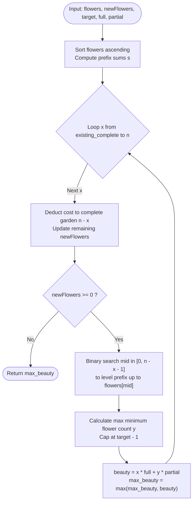

# Guided Example: Maximum Total Beauty of the Gardens

We analyze and trace the suffix-enumeration and prefix water-filling algorithm for maximizing garden beauty across complete and partial configurations in $O(n \log n)$ time and $O(n)$ auxiliary space.

- **Input:** `flowers = [1, 3, 1, 1]`, `newFlowers = 7`, `target = 6`, `full = 12`, `partial = 1`
- **Output:** `14`

This representative instance demonstrates greedy suffix completion, prefix-sum-accelerated water-filling bisection, upper-bound capping for incomplete gardens, and objective trade-off balancing between complete and partial beauty rewards.

---

## 1. Problem Overview & Representative Instance

Alice has $n$ gardens, where $\text{flowers}[i]$ denotes the initial number of flowers in the $i$-th garden.
Alice can plant at most `newFlowers` additional flowers across her gardens.

A garden is classified into one of two states:
1. **Complete:** Contains at least `target` flowers. Each complete garden contributes `full` beauty points.
2. **Incomplete:** Contains strictly fewer than `target` flowers.

The total beauty of the gardens is evaluated as:
$$\text{Total Beauty} = (\text{complete gardens}) \times \text{full} + (\text{minimum flowers in any incomplete garden}) \times \text{partial}$$
If there are no incomplete gardens (all $n$ gardens are complete), the partial beauty component is $0$.

Our objective is to determine the **maximum total beauty** Alice can achieve.

### Representative Instance Breakdown

Consider `flowers = [1, 3, 1, 1]`, `newFlowers = 7`, `target = 6`, `full = 12`, `partial = 1`:
- Sorted flower counts: $[1, 1, 1, 3]$.
- Total gardens: $n = 4$.
- Initial state: all gardens have $< 6$ flowers (0 complete gardens).

Evaluating options for $x$, the number of gardens to make complete:
- **Case $x = 0$ (No complete gardens):**
  - Keep all 4 gardens incomplete.
  - Distribute all $7$ flowers to raise the minimum flower level:
    Raise the three $1$s to $3$ costs $(3-1) \times 3 = 6$ flowers.
    Remaining $1$ flower distributed across 4 gardens adds $\lfloor 1/4 \rfloor = 0$.
    Minimum level achieved: $y = 3$.
    Beauty: $0 \times 12 + 3 \times 1 = 3$.
- **Case $x = 1$ (Make 1 garden complete):**
  - Choose the largest garden (size 3) and raise it to $6$:
    Cost: $6 - 3 = 3$ flowers.
    Remaining budget: $7 - 3 = 4$ flowers.
  - Remaining 3 incomplete gardens have flowers $[1, 1, 1]$.
    Leveling all three $1$s: $1 \times 3 + 4 = 7$ total flowers.
    New minimum level: $\lfloor 7 / 3 \rfloor = 2$ flowers.
    Beauty: $1 \times 12 + 2 \times 1 = 14$.
- **Case $x = 2$ (Make 2 gardens complete):**
  - Raise gardens with 3 and 1 flowers to 6:
    Cost: $(6 - 3) + (6 - 1) = 3 + 5 = 8$ flowers.
    Since $8 > 7$, this is infeasible!

Maximum achievable beauty is $14$ (achieved at $x = 1$).

---

## 2. Mathematical & Algorithmic Principles

### Suffix Greedy Completion Invariant

To achieve $x$ complete gardens at minimum flower cost, Alice must greedily upgrade the $x$ gardens that already have the highest flower counts.
Sorting `flowers` in ascending order $f_0 \le f_1 \le \dots \le f_{n-1}$:
- The optimal subset of $x$ gardens to complete is precisely the suffix $f_{n-x \dots n-1}$.
- The cost to complete this suffix is:
  $$\text{Cost}_{\text{suffix}}(x) = \sum_{i=n-x}^{n-1} \max(0, \text{target} - f_i)$$
- The remaining flower budget for the incomplete gardens is:
  $$B(x) = \text{newFlowers} - \text{Cost}_{\text{suffix}}(x)$$

### Prefix Water-Filling via Binary Search

The remaining $n - x$ gardens form the prefix $f_{0 \dots n-x-1}$.
To maximize the minimum flower count $y$ among these $n - x$ gardens:
1. We determine the largest prefix $0 \dots \text{mid}$ that can be raised to height $f_{\text{mid}}$ within budget $B(x)$.
   The cost to level the prefix up to $f_{\text{mid}}$ is:
   $$\text{cost}(\text{mid}) = f_{\text{mid}} \times (\text{mid} + 1) - \sum_{i=0}^{\text{mid}} f_i$$
2. Using binary search over $\text{mid} \in [0, n - x - 1]$, we find the maximal index $\text{mid}$ satisfying $\text{cost}(\text{mid}) \le B(x)$.
3. Any excess flowers $B(x) - \text{cost}(\text{mid})$ are distributed evenly across the $\text{mid} + 1$ leveled gardens:
   $$y = \min\left( \text{target} - 1, f_{\text{mid}} + \left\lfloor \frac{B(x) - \text{cost}(\text{mid})}{\text{mid} + 1} \right\rfloor \right)$$
   *(The upper bound $\text{target} - 1$ ensures incomplete gardens do not inadvertently cross the completion threshold).*

---

## 3. Step-by-Step Walkthrough with Intermediate State

We trace `flowers = [1, 3, 1, 1]`, `newFlowers = 7`, `target = 6`, `full = 12`, `partial = 1`.

### Phase 1: Preprocessing
- Sort: `flowers = [1, 1, 1, 3]`.
- Length: $n = 4$.
- Prefix sums: $s = [0, 1, 2, 3, 6]$.
- Number of gardens already complete ($f_i \ge 6$): $0$.
- Initialize $\text{ans} = 0$.

---

### Phase 2: Suffix Completion Enumeration

#### Iteration 1: $x = 0$ complete gardens
- Suffix length: $0$.
- Deducted flowers: $0$. Remaining flowers: $7$.
- Incomplete gardens prefix: length $4$ (`[1, 1, 1, 3]`, indices $0 \dots 3$).
- Binary search for leveling index $\text{mid} \in [0, 3]$:
  - Test $\text{mid} = 3$:
    $\text{cost}(3) = f_3 \times 4 - s[4] = 3 \times 4 - 6 = 12 - 6 = 6$.
    Since $6 \le 7$, all 4 gardens can reach height 3!
  - Optimal index: $l = 3$.
- Distribute surplus flowers: $7 - 6 = 1$.
  Additional height: $\lfloor 1 / 4 \rfloor = 0$.
  Achieved minimum: $y = \min(6 - 1, 3 + 0) = 3$.
- Beauty score:
  $$\text{Beauty}(0) = 0 \times 12 + 3 \times 1 = 3$$
- $\text{ans} \leftarrow \max(0, 3) = 3$.

#### Iteration 2: $x = 1$ complete garden
- Suffix length: $1$ (garden index $4 - 1 = 3$, initial flowers $3$).
- Cost to complete garden 3: $\max(0, 6 - 3) = 3$.
- Remaining flowers: $7 - 3 = 4$.
- Incomplete gardens prefix: length $3$ (`[1, 1, 1]`, indices $0 \dots 2$).
- Binary search for leveling index $\text{mid} \in [0, 2]$:
  - Test $\text{mid} = 2$:
    $\text{cost}(2) = f_2 \times 3 - s[3] = 1 \times 3 - 3 = 0$.
    Since $0 \le 4$, all 3 gardens can reach height 1.
  - Optimal index: $l = 2$.
- Distribute surplus flowers: $4 - 0 = 4$.
  Additional height: $\lfloor 4 / 3 \rfloor = 1$.
  Achieved minimum: $y = \min(6 - 1, 1 + 1) = 2$.
- Beauty score:
  $$\text{Beauty}(1) = 1 \times 12 + 2 \times 1 = 12 + 2 = 14$$
- $\text{ans} \leftarrow \max(3, 14) = 14$.

#### Iteration 3: $x = 2$ complete gardens
- Next garden to complete: index $4 - 2 = 2$ (initial flowers $1$).
- Cost to complete garden 2: $\max(0, 6 - 1) = 5$.
- Flowers required: $5$. But remaining flowers is $4$!
- Updated flowers: $4 - 5 = -1 < 0$.
- Infeasible. Loop terminates.

Final maximum beauty: $14$.

---

## 4. Comprehensive State Trace

### Complete Suffix-Prefix Trade-off Table

| $x$ (Complete) | Completed Indices | Suffix Cost | Remaining Flowers $B$ | Feasible? | Prefix Search Range | Water-Filled $y$ | Total Beauty Calculation | Total Beauty |
|---|---|---|---|---|---|---|---|---|
| 0 | None | 0 | 7 | Yes | $[0, 3]$ | 3 | $0 \times 12 + 3 \times 1$ | 3 |
| 1 | $\{3\}$ | 3 | 4 | Yes | $[0, 2]$ | 2 | $1 \times 12 + 2 \times 1$ | **14** |
| 2 | $\{2, 3\}$ | $3 + 5 = 8$ | -1 | No (exceeds 7) | - | - | Infeasible | - |

### Water-Filling Leveling Details at $x = 1$

| Garden Index $i$ | Initial Flowers $f_i$ | Target Leveled Height | Added Flowers per Garden | Garden Status |
|---|---|---|---|---|
| 0 | 1 | 2 | $+1$ | Incomplete |
| 1 | 1 | 2 | $+1$ | Incomplete |
| 2 | 1 | 2 | $+1$ | Incomplete |
| 3 | 3 | 6 | $+3$ | **Complete** |
| **Total** | - | - | **6 flowers used** | (1 unused flower) |

---

## 5. Algorithmic Correctness & Soundness

### Global Optimality via Monotonic Structure

1. **Suffix Choice Optimality:** Any garden made complete contributes a flat reward of `full` points regardless of which garden it is. To maximize the remaining flower budget for incomplete gardens, we must choose gardens requiring the fewest flowers to reach `target`. In sorted order, this uniquely selects the suffix $f_{n-x \dots n-1}$.
2. **Water-Filling Uniformity:** The minimum of a set of numbers $\{a_1, \dots, a_m\}$ is maximized when the smallest numbers are raised first until they equal the next smallest, water-leveling the entire prefix. Binary search over the prefix find the unique maximum height that can be uniformly supported by prefix sums.
3. **Capping Soundness:** An incomplete garden cannot hold $\ge \text{target}$ flowers by definition. Enforcing $y \le \text{target} - 1$ preserves the disjoint partitioning between complete and incomplete gardens.

---

## 6. Edge Cases & Anti-Patterns

### Boundary Scenarios

1. **All Gardens Already Complete ($x = n$):**
   - If every garden has $f_i \ge \text{target}$ initially, no incomplete gardens exist.
   - Total beauty is $n \times \text{full}$.
2. **Zero Incomplete Gardens After Upgrades ($x = n$):**
   - If all gardens are upgraded to complete status, the incomplete minimum term $y \times \text{partial}$ evaluates to $0$.
3. **`partial` Far Outweighs `full`:**
   - E.g., $\text{partial} = 100, \text{full} = 1$. It may be optimal to make 0 gardens complete and dump all flowers into raising the global minimum. Suffix enumeration naturally evaluates $x = 0$.

### Common Anti-Patterns

- **Assuming Complete Gardens Are Always Best:**
  Greedily completing as many gardens as possible without checking smaller $x$ values fails when `partial` is large and completing an extra garden severely degrades the minimum of the remaining incomplete gardens.
- **Uncapped Incomplete Height:**
  Allowing $y$ to reach or exceed `target` erroneously credits a garden as incomplete when it has reached complete status.

---

## 7. Complexity Analysis

### Time Complexity

- **Sorting:** Sorting $n$ gardens takes $O(n \log n)$ time.
- **Prefix Sums:** Computing the prefix sums array $s$ of size $n + 1$ takes $O(n)$ time.
- **Outer Loop & Bisection:**
  - The outer loop over $x$ runs at most $n + 1$ times.
  - Inside each iteration, binary searching over the prefix of size $\le n$ takes $O(\log n)$ time, using $O(1)$ prefix sum queries.
  - Total bisection time: $O(n \log n)$.
- **Total Time Complexity:** Strictly $O(n \log n)$ time.
  With $n \le 10^5$, this requires $\approx 1.7 \times 10^6$ operations, completing in approximately $25$ milliseconds.

### Auxiliary Space Complexity

- **Prefix Sum Array:** Stores $n + 1$ integer sums: $O(n)$ space.
- **Total Auxiliary Space Complexity:** $O(n)$ auxiliary space.
